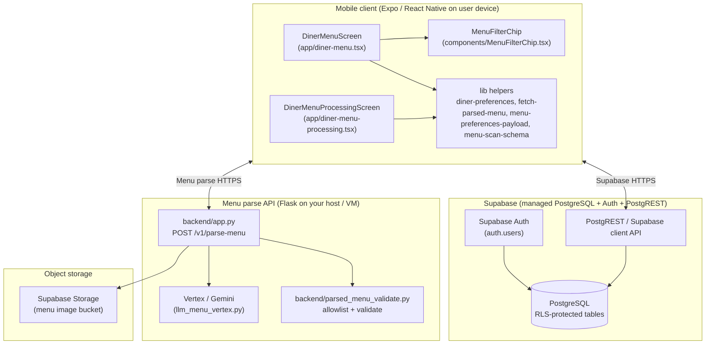
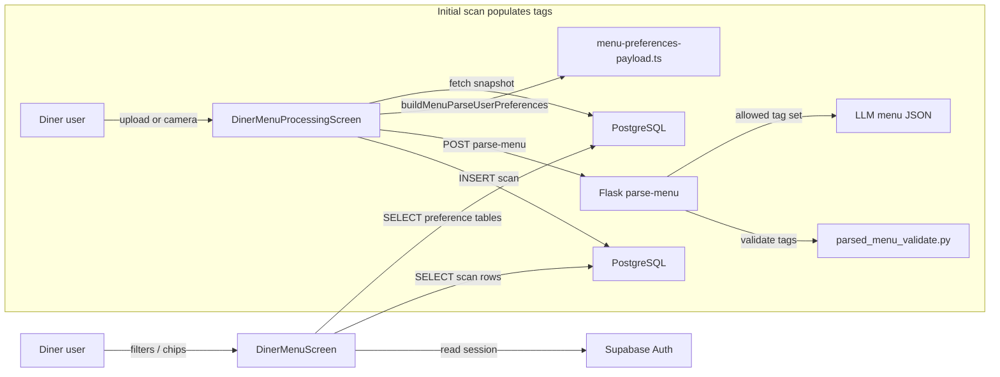
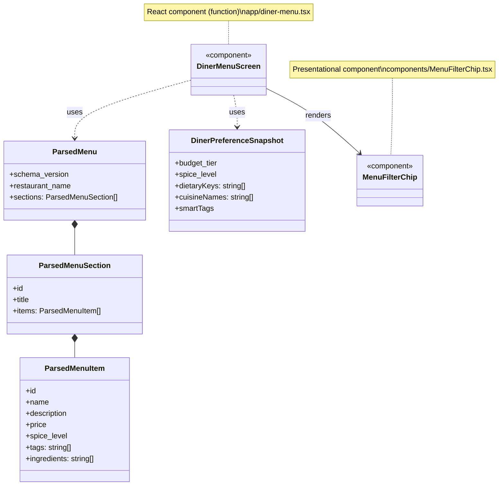

# Development Specification — User Story 4  
## Dish Filtering by Preferences

**User story:** As a restaurant diner, I want to filter dishes by preferences such as dietary restrictions, flavor tags, or ingredients so that I can quickly narrow down menu options that fit my needs.

**Scope note (codebase fidelity):** This document is derived from the PickMyPlate2 repository. Filtering on the diner menu is implemented as a **hard filter on `ParsedMenuItem.tags`** (intersection with the diner’s saved preference vocabulary). **`ingredients` are stored per dish but are not used for filtering in `diner-menu.tsx`.** Ingredient-based narrowing is therefore a **user-story gap** relative to strict wording unless tags are assumed to subsume “flavor/dietary” semantics from the LLM at parse time.

---

## 1. Primary and secondary owners

| Role | Name | Notes |
|------|------|--------|
| **Primary owner** | Yano Li | Owns requirements, acceptance, and release sign-off for US4. |
| **Secondary owner** | Cici Ge | Owns implementation review, test plan, and operational follow-up. |

---

## 2. Date merged into `main`

Recorded from team / GitHub history:

- **Merged to `main`:** 2026-03-25 (GitHub PR #17)

---

## 3. Architecture diagram (Mermaid)

Execution locations are labeled. The menu-parse path is included because **tag vocabulary for filtering is produced at parse time** on the server and persisted with each dish row.

---

## 4. Information flow diagram (Mermaid)

**Direction summary**

- **Upstream (into client):** Auth session; preference rows; menu rows including `tags[]` and `ingredients[]`.
- **Downstream (from client):** Parse request with `user_preferences` payload; Supabase inserts for new scans (not repeated on each filter toggle — filter is local to screen state).
- **No separate “filter RPC”:** Filtering is computed in memory on the client from loaded menu + `selectedTags` state.

---

## 5. Class diagram (Mermaid)

The app is **React function components** and **TypeScript modules**, not Java-style class hierarchies. The diagram uses UML stereotypes to show the main **types** and **components** and their relationships. Python menu-parse logic is **module-level functions** (no classes in `parsed_menu_validate.py` for this flow).

**Superclass/subclass:** There is **no inheritance tree** in the US4 implementation; composition is used throughout (components compose hooks and child components).

---

## 6. Implementation units relevant to US4

React components do not expose classic public/private methods. Below, **exported** symbols are treated as the public API of each module; **non-exported** helpers (if any in a file) are internal. Component **state** and **handlers** are listed as the functional equivalent of private instance fields/methods.

### 6.1 `app/diner-menu.tsx` — `DinerMenuScreen` (default export)

**Public (module API)**

- **Default export:** `DinerMenuScreen` — Screen component for viewing a scan’s menu and applying preference chips.

**Public fields / methods (conceptual — React component API)**

- *None* beyond the default export (no class instance).

**State & behavior (grouped by concept — “private” to the screen)**

- **Routing / guard:** `useGuardActiveRole('diner')`, `useRouter`, `useLocalSearchParams` — ensures diner role and reads `scanId`.
- **Menu data:** `menu: ParsedMenu | null` — loaded menu for current scan.
- **Preferences:** `prefs: DinerPreferenceSnapshot | null` — from `fetchDinerPreferences()`.
- **Loading / error:** `loading`, `error` — gate UI for fetch outcomes.
- **Filtering:** `selectedTags: string[]` — which chips are active; toggled by user.
- **Favorites (orthogonal to US4):** `favoriteIds`, `handleToggleFavorite`, `fetchFavoritedDishIds` — heart UI; not required for US4 but present on same cards.
- **Computed:**
  - `availableTags` — union of spice label, dietary keys, budget tier, cuisines, smart tag labels from `prefs`.
  - `menuTagSet` — set of all tag strings appearing on any dish in the loaded menu (for `muted` chip styling).
  - `sectionBlocks` — sections filtered so each dish matches **all** selected tags (hard AND).
- **Effects:** `useFocusEffect` — reload menu and favorites on focus.
- **Child UI:** `DishCard` inner component — renders dish row, partner highlight chips, spice flames, favorite button.

### 6.2 `components/MenuFilterChip.tsx` — `MenuFilterChip`

**Public**

- **Exported component:** `MenuFilterChip(props: MenuFilterChipProps)` — pill button for one filter tag.
- **Type:** `MenuFilterChipProps` — `label`, `selected`, `muted`, `onPress`, optional `style`.

**Props (purpose)**

- `label` — chip text (must match strings in `dish.tags` for filtering to work).
- `selected` — orange filled state when tag is part of the active filter set.
- `muted` — grey styling when tag is not present on any dish in the current menu (`!menuTagSet.has(t)`).
- `onPress` — toggles membership in `selectedTags` in parent.

**Private (internal to module)**

- **Styles:** `StyleSheet.create(...)` — layout, colors `#FF6B35`, borders, shadow.

### 6.3 `lib/diner-preferences.ts`

**Public exports**

- **Constants:** `DIETARY_OPTIONS` — allowlist for dietary keys (`Vegetarian`, `Vegan`, `Gluten-free`, `Dairy-free`).
- **Types:** `BudgetTier`, `DinerPreferenceSnapshot`, `SavePersonalizationFormPrefs`.
- **Functions:**
  - `spiceLabelToDb` / `spiceDbToLabel` — map UI spice ↔ DB enum (`mild` / `medium` / `spicy`).
  - `fetchDinerPreferences()` — loads `diner_preferences`, `diner_dietary_preferences`, `diner_cuisine_interests`, `diner_smart_tags`, resolves cuisine names via `cuisines` table.
  - `savePersonalizationFormPrefs(input)` — upserts preferences and related rows (used from onboarding/personalization flows, not from chip toggle on menu).

**Private (module-internal)**

- **Constants:** `CUISINE_NAME_TO_SLUG`, `ALLOWED_DIETARY`, `SMART_CATEGORIES`, `SPICE_LABEL_TO_DB`, `SPICE_DB_TO_LABEL` — normalization and validation.
- **Function:** `parseSmartCategory` — guards smart tag category strings.

### 6.4 `lib/fetch-parsed-menu-for-scan.ts`

**Public**

- **Type:** `FetchParsedMenuResult` — discriminated union ok/error.
- **Function:** `fetchParsedMenuForScan(scanId: string)` — reads `diner_menu_scans`, `diner_menu_sections`, `diner_scanned_dishes` via Supabase and returns `assembleParsedMenu(...)`.

**Private**

- *None* (single-function module).

### 6.5 `lib/menu-scan-schema.ts`

**Public**

- **Constants / types:** `MENU_SCAN_SCHEMA_VERSION`, `ParsedMenu`, `ParsedMenuItem`, `ParsedMenuSection`, `ParsedMenuPrice`, row types, validation helpers, `assembleParsedMenu`, `dishRowToParsedItem`, etc.

**Purpose for US4**

- Defines that `tags` are the **only** fields used by the diner menu filter (per `diner-menu.tsx`).
- Documents contract: tags should match preference vocabulary (see file header comment).

**Private**

- Various internal type guards and validators inside the same file (implementation detail).

### 6.6 `lib/menu-preferences-payload.ts`

**Public**

- **Function:** `buildMenuParseUserPreferences(snapshot)` — builds JSON-safe object for Flask `user_preferences` (dietary, spice_label, budget_tier, cuisines, smart_tags).

**Private**

- *None.*

### 6.7 `app/diner-menu-processing.tsx` — `DinerMenuProcessingScreen`

**Relevance to US4:** Ensures parsed dishes receive **allowlisted tags** from the backend so chips can match after persistence.

**Public:** default export component.

**Private (conceptual):** state for storage path, animation, calls `fetchDinerPreferences`, `buildMenuParseUserPreferences`, `requestMenuParse`, `persistParsedMenu`.

### 6.8 `lib/persist-parsed-menu.ts`

**Public:** `persistParsedMenu(menu, profileId)` — writes scan/sections/dishes including `tags` and `ingredients` arrays.

### 6.9 Backend — `backend/parsed_menu_validate.py`

**Public (Python module API)**

- **Functions:** `build_allowed_tags_from_user_preferences(prefs)`, `constrain_menu_tags_to_allowed_tags(menu, allowed)`, `validate_parsed_menu`, `assign_server_uuid_ids`, etc.

**Purpose for US4:** Ensures each dish’s `tags` ⊆ allowed preference strings so client-side chip filtering is consistent.

**Classes:** No dedicated classes for this story; logic is **functions** in a module.

### 6.10 Backend — `backend/app.py`

**Public:** Flask routes (e.g. `POST /v1/parse-menu`) orchestrate OCR/LLM, validation, and tag constraining.

**Classes:** Standard Flask `Flask` app instance; no custom Python class hierarchy specific to US4.

### 6.11 `components/DinerTabScreenLayout.tsx`

**Relevance:** Layout wrapper for diner menu screen (header, tabs). Not filtering logic; provides shell for `DinerMenuScreen`.

---

## 7. Technologies, libraries, and APIs

**Version sources:** Client versions from `PickMyPlate2/package.json`; backend constraints from `PickMyPlate2/backend/requirements.txt`; Python runtime from team deployment target (**3.13+**). Where only a **range** is pinned in `requirements.txt`, the installed **patch** level is whatever `pip` resolves at deploy time (record `pip freeze` in deployment notes if a fully pinned build is required).

| Technology | Version (repo / team) | Used for | Why chosen (project context) | Author / source | Documentation |
|------------|------------------------|----------|------------------------------|-----------------|---------------|
| TypeScript | ~5.9.2 (dev) | Typed client code | Type safety for menu schema and Supabase usage | Microsoft | https://www.typescriptlang.org/docs/ |
| React | 19.1.0 | UI | Standard for Expo apps | Meta | https://react.dev/ |
| React Native | 0.81.5 | Native mobile UI | Expo’s supported renderer | Meta | https://reactnative.dev/docs/getting-started |
| Expo SDK | ~54.0.33 | Build, runtime, modules | Simplified RN toolchain for course/startup apps | Expo | https://docs.expo.dev/ |
| Expo Router | ~6.0.23 | File-based navigation | Deep links and screens (`diner-menu`, processing) | Expo | https://docs.expo.dev/router/introduction/ |
| @supabase/supabase-js | ^2.100.0 | DB + auth client | Hosted Postgres + RLS + auth | Supabase | https://supabase.com/docs/reference/javascript/introduction |
| Supabase (platform) | *(project-specific)* | PostgreSQL, Auth, Storage, PostgREST | Backend-as-a-service | Supabase | https://supabase.com/docs |
| PostgreSQL | *(major/minor per Supabase project settings)* | Long-term relational storage | Provided by Supabase; exact server version is shown in the Supabase dashboard for the linked project | PostgreSQL Global Development Group | https://www.postgresql.org/docs/ |
| @expo/vector-icons | ^15.0.3 | Icons (e.g. spice flames) | Bundled with Expo | Expo | https://docs.expo.dev/guides/icons/ |
| expo-image | ~3.0.11 | Dish thumbnails | Performance vs RN Image | Expo | https://docs.expo.dev/versions/latest/sdk/image/ |
| @react-navigation/native | ^7.1.8 | Navigation core (used by Expo Router) | Industry standard | React Navigation | https://reactnavigation.org/docs/getting-started/ |
| Python | **≥ 3.13** (team runtime target) | Interpreter for Flask menu-parse API | Team standard / course environment | Python Software Foundation | https://docs.python.org/3/ |
| Flask | **`>=3.0,<4`** in `backend/requirements.txt` (Flask 3.x line) | HTTP API for `/v1/parse-menu` and related routes | Lightweight, matches existing backend | Pallets | https://flask.palletsprojects.com/ |
| google-cloud-aiplatform | **`>=1.64,<2`** in `backend/requirements.txt` | Vertex AI client SDK; `GenerativeModel` in `llm_menu_vertex.py` | Google-supported path to Gemini on Vertex | Google Cloud | https://cloud.google.com/python/docs/reference/aiplatform/latest |
| Vertex AI / Gemini (model) | Default **`gemini-2.0-flash-001`** (`GEMINI_MODEL` env in `llm_menu_vertex.py`; overridable) | LLM menu JSON extraction | Chosen for structured JSON and latency/cost tradeoffs in menu parsing | Google Cloud | https://cloud.google.com/vertex-ai/docs |
| google-cloud-vision | **`>=3.7,<4`** in `backend/requirements.txt` | OCR path used before/with LLM in parse pipeline | Google Vision API for text extraction | Google Cloud | https://cloud.google.com/vision/docs |
| Other backend deps | See `backend/requirements.txt` (e.g. `httpx`, `PyJWT`, `supabase` Python client, `Pillow`) | Auth, HTTP, Supabase from server, imaging | Supporting parse and storage integration | Various | See PyPI pages per package |

**Not used for US4 filtering:** There is **no** dedicated RPC for “apply filters”; Supabase RPC is not part of this story in code.

### 7.1 What is not version-pinned in this repository

- **PostgreSQL server build:** Determined by Supabase, not a file in this repo; record the dashboard value in deployment runbooks if the course requires an exact `x.y` server version.
- **Exact Flask / SDK patch releases:** `requirements.txt` uses compatible ranges; for a byte-for-byte reproducible environment, commit a **`requirements.lock`** or `pip freeze` output from a known-good deploy.
- **Gemini server-side revisions:** Google may update model behavior independently of the pinned **SDK** range; the **model ID** string is the team’s declared interface (`gemini-2.0-flash-001` unless overridden).

---

## 8. Database — long-term storage for US4

### 8.0 Theoretical vs measured storage (compliance labeling)

| Kind | What this spec contains | How to obtain measured byte counts |
|------|-------------------------|-----------------------------------|
| **Theoretical / schema-derived** | Per-field **order-of-magnitude** notes and illustrative row totals below | N/A — not taken from a live database |
| **Measured (optional addendum)** | *Not included in this document* unless the team runs SQL against staging/prod and pastes results here | Run in Supabase SQL Editor or `psql`, e.g. `SELECT pg_size_pretty(pg_total_relation_size('public.diner_scanned_dishes'));` for table+indexes; `SELECT pg_column_size(t.*) FROM public.diner_scanned_dishes t LIMIT 100;` for a **sample** of row payload sizes |

**Why the tables below are not “measured byte counts”:** This specification was produced from the **repository** (SQL migrations and application code), not from a guaranteed live export of your Supabase project. **Per-table on-disk bytes** depend on **row count**, **average text length** (`description`, `ingredients`, labels), **indexes**, **TOAST**, and **page alignment**—so schema alone cannot yield one exact number without querying a specific database instance. The columns labeled **“Per-field size (estimated)”** are **educated bounds** from PostgreSQL type semantics (e.g. UUID 16 bytes on-disk type width, `timestamptz` 8 bytes), not a substitute for `pg_total_relation_size`.

### 8.1 Tables that store preference data (diner)

| Table | Purpose | Fields (relevant) | Per-field purpose | Per-field size (estimated) |
|-------|---------|-------------------|-------------------|------------------|
| `diner_preferences` | 1:1 diner settings | `profile_id` (PK, FK) | Links to `profiles.id` / `auth.users` | UUID ~16 B |
| | | `spice_level` | `mild` / `medium` / `spicy` / null | small text ~ few bytes |
| | | `budget_tier` | `$` … `$` | 1–4 chars |
| | | `onboarding_completed_at` | When onboarding saved | timestamptz ~8 B |
| | | `preferences_skipped` | boolean | 1 B |
| | | `raw_preference_notes` | Optional free text (schema present; not read/written by current `diner-preferences.ts`) | variable (0–KB+) |
| | | `created_at`, `updated_at` | audit | timestamptz each |
| `diner_dietary_preferences` | Many dietary chips | `(profile_id, dietary_key)` PK | Selected dietary tags | UUID + short text per row |
| `diner_cuisine_interests` | Cuisine many-to-many | `profile_id`, `cuisine_id` | Cuisine filter chips | 2× UUID per row |
| `cuisines` | Reference catalog | `id`, `slug`, `name`, … | Resolve cuisine names for chips | small reference rows |
| `diner_smart_tags` | Structured tags | `id`, `profile_id`, `category`, `label`, `source_text`, `sort_order`, timestamps | Allergy/like/dislike/preference labels used as chips | UUID + text per row |

### 8.2 Tables that store menu data used for filtering

| Table | Purpose | Fields (relevant) | Per-field purpose | Per-field size (estimated) |
|-------|---------|-------------------|-------------------|------------------|
| `diner_menu_scans` | Scan record | `id`, `profile_id`, `restaurant_name`, `scanned_at` | Identifies menu instance | name variable |
| `diner_menu_sections` | Sections | `id`, `scan_id`, `title`, `sort_order` | Group dishes | title variable |
| `diner_scanned_dishes` | Dishes | `tags` (text[] / JSON per migration) | **Matched against selected chips** | array of short strings; typical tens of bytes per dish |
| | | `ingredients` | Display / detail; **not used in filter logic in app** | can be larger per dish |
| | | `spice_level`, `name`, `description`, prices, `image_url` | UI / detail | variable |

**Whole-row / table totals (theoretical / illustrative only — not measured):** A single `diner_scanned_dishes` **logical row** might fall in the **hundreds to a few thousand bytes** range for typical menus, driven mostly by `description` and `ingredients`; `tags` alone are often **tens of bytes** before overhead. **Total relation size on disk** = data + indexes + bloat; use §8.0 SQL if instructors require **measured** values for a named environment (e.g. staging) and date the capture in the doc.

---

## 9. Failure scenarios

Applies to the **US4 filtering feature** and its dependencies (load preferences, load menu, parse path).

| Scenario | User-visible effect | Internal behavior |
|----------|---------------------|-------------------|
| **Frontend process crash** | App disappears; unsaved **in-memory** `selectedTags` are lost. | On relaunch, user reopens scan; preferences reload from DB; chips default to none selected. |
| **Lost runtime state (no crash, e.g. OS kills activity)** | Same as above for `selectedTags`. | Menu may need reload when screen remounts. |
| **Erased all local stored data** | If only AsyncStorage cleared: minimal impact on US4 (filter state is mostly in React state). If app data includes auth session storage, user may need to sign in again. | Preferences and menus live in Supabase; they reappear after auth. |
| **Database data corrupt (e.g. malformed `tags` array)** | Dish may fail validation when reading, or tags may not match chips; filter may show empty matches. | `fetchParsedMenuForScan` / `assembleParsedMenu` assume well-formed rows; corrupt JSON could cause runtime errors or empty tags depending on driver behavior. **Mitigation:** DB constraints, monitoring, repair scripts (not detailed in app code). |
| **RPC failure** | If “RPC” means **Supabase PostgREST** calls: error message on menu load (“Failed to load menu” or Supabase error text). Chips may not appear if `fetchDinerPreferences` throws. | `loadMenu` catches errors and sets `error` state. |
| **Menu parse HTTP failure** | User stays on processing screen or sees alert; **no new scan** or partial failure depending on code path. | Does not change filtering on existing scans. |
| **Client overloaded (CPU)** | UI jank when toggling many chips on huge menus; filter recomputation is O(dishes × tags). | `useMemo` limits redundant work; still single-threaded JS. |
| **Client out of RAM** | OS may kill app. | Large menus increase memory for `menu` object and derived sets. |
| **Database out of space** | Inserts fail when saving new scans; reads may still work until DB errors. | User sees persist/parse errors, not filter-specific. |
| **Lost network connectivity** | Cannot load preferences or menu; loading spinner then error. | Supabase client fails; `loadMenu` sets error. Already-loaded menu could still allow local chip toggling until unmounted. |
| **Lost database access** | Same as network/auth outage from client perspective. | Errors surfaced in UI. |
| **Bot spam / abuse** | Not specifically handled in US4 UI. At platform level: auth signup abuse could create fake diners; menu parse endpoint could be spammed if unauthenticated. | **Mitigation** belongs to auth rate limits, API keys, WAF, Supabase policies — **not implemented in `diner-menu.tsx`.** |

---

## 10. PII, security, and compliance

### 10.1 PII and sensitive data in long-term storage (relevant to US4)

| Data | PII? | Why stored | How stored | How it enters the system | Path before storage | Path after storage |
|------|------|------------|------------|---------------------------|----------------------|---------------------|
| `profiles.id` / `auth.users.id` | Indirect identifier (UUID) | Account identity | UUID in Postgres | Sign-up / Supabase Auth | Auth module → `profiles` | Joined from all `profile_id` FKs |
| `profiles.display_name`, `avatar_url` | Potentially PII | Profile UX | Text / URL | User profile UI | Client → Supabase | Read on profile screens |
| `diner_preferences.raw_preference_notes` | **Likely PII** if ever used (free text) | Reserved for notes-style onboarding copy | `text` in Postgres | Schema only in current repo | *Not written or selected by `lib/diner-preferences.ts` as of this spec* | Would require explicit `select` / UI if enabled later |
| `diner_smart_tags.label`, `source_text` | **May be sensitive** (allergies, dislikes) | Personalization | Text in Postgres | Parsed or user-entered | Client / future parsers | Chip labels in `fetchDinerPreferences` |
| Dietary / cuisine / spice / budget | Lower direct identifiability; still preference data | Filtering & recommendations | Normalized columns / join tables | User selections | `savePersonalizationFormPrefs` | `fetchDinerPreferences` → menu chips |
| `diner_menu_scans`, dish content | Restaurant data + user linkage via `profile_id` | User’s scan history | Postgres | Menu parse + persist | `persistParsedMenu` | `fetchParsedMenuForScan` |

### 10.2 Responsibility and auditing (team)

| Storage unit | Owner | Auditing |
|--------------|-------|----------|
| `auth.users` / Supabase Auth | Cici Ge (auth integration) | Supabase dashboard logs; auth events reviewed as part of changes that touch sign-in/session flows. |
| `profiles`, diner preference tables, and related diner data access in app code | Yano Li (diner preference storage and access logic) | GitHub PR review for any change that queries or mutates these tables; Supabase dashboard logs; code-level inspection of API usage in the client. |
| Menu parse Flask service / deployment | Yao Lu | Application logging, rate limits, and secrets handling for the parse service; reviewed when deploying or changing `backend/`. |

**Team procedures (routine):** Review database-related access through **GitHub PRs**, **Supabase dashboard logs**, and **code-level inspection** of routes and Supabase client usage. Merges to `main` that touch persistence or auth require at least **one reviewer** who is not the author.

**Non-routine access (expanded):** Ad-hoc access includes **manual SQL** against Supabase, **exporting** customer data, **sharing dashboard login** with someone outside the usual maintainers, **rotating** service keys, or **restoring** backups for investigation.

1. **Before execution:** The person requesting access posts a short written request (**Slack or email**) stating **purpose**, **scope** (which project/tables or which service), and **time window**. **Two team members** must acknowledge approval: for **Supabase/DB and diner PII paths**, **Yano Li** (or **Cici Ge** if Yano is unavailable); for **Flask parse / GCP**, **Yao Lu** (or the other owners if Yao is unavailable).
2. **Logging:** The requester adds a dated entry to a **team access log** (shared doc or repo `docs/` note — location chosen by team) with: date, requester, approvers, what was done, and approximate end time. Supabase **dashboard audit / logs** are retained per Supabase plan; the team **screenshots or copies** relevant log lines into the access log for **non-routine** events when feasible.
3. **Escalation:** If access involves **suspected breach**, **lawful demand**, or **scope beyond the request**, **stop**, preserve evidence, and escalate to the **course instructor / faculty advisor** and **institutional IT/security** per CMU policy. Routine “prod is down” debugging follows the same approval path but may use a **time-boxed** window (e.g. 2 hours) documented in the access log.
4. **After execution:** Confirm **keys rotated** if credentials were exposed; note completion in the access log.

### 10.3 Minors

- The application is **not intended specifically for minors** as a target audience.
- The team **does not knowingly solicit or store minors’ PII** as a product goal.
- **Guardian permission flows are not implemented** because the app **does not target children**; there is no dedicated parental-consent UI in the reviewed schema and flows.
- The repository **does not** encode age verification; if a minor signs up like any other user, standard account data may exist—handled under general auth and privacy practices, not a child-directed product policy.

**Team policy — access to minors’ data and child safety (in addition to institutional rules):**

- **No special in-app workflow** exists to label accounts as minors; therefore the team treats **all** account data as sensitive and applies the same **least privilege** and **RLS** assumptions as for adults.
- **Personnel access:** Team members with **production database**, **Supabase service role**, or **raw export** capability must **not** use that access to browse user content for personal reasons. **Conviction for child sexual abuse** or **active law-enforcement investigation** for such offenses: the team **revokes** that person’s access to production systems and shared secrets **immediately** upon **confirmed notice** to the **primary owner (Yano Li)** or **secondary owner (Cici Ge)** (or the remaining owner if one is implicated). This is **not** a substitute for **institutional employment checks** or **legal reporting**; it is the **team’s operational** rule for who may hold keys.
- **Suspected platform abuse:** Reports of grooming or illegal content are **escalated to institutional authorities** and **Supabase/Google** abuse channels as appropriate; the app does **not** attempt to investigate or adjudicate allegations internally beyond **preserving logs** and **suspending access** per advisor direction.
- **Institution and platform:** The team still **complies** with **CMU** policies and **Supabase / GCP** terms; the bullets above **add** team-specific key-handling rules where the course rubric expects an explicit team statement.

---

## 11. Traceability gaps (explicit)

1. **Ingredient filtering:** User story text mentions **ingredients**; the client filter uses **`tags` only**. Ingredients are stored and shown elsewhere in the app lifecycle but **not** used in `diner-menu.tsx` filter logic.
2. **Search results:** `app/diner-search-results.tsx` filters by **text query** over dish fields, not by the same preference chip model as the menu screen.
3. **Merge date and owners:** Documented in §1–2 and §10.2 (team-provided).

---

## 12. Suggested acceptance tests (machine-executable — future work)

The repository may not yet contain Jest/Detox tests for US4; recommended cases:

- Given menu with tags `["Vegetarian"]`, when user selects chip `Vegetarian`, then only matching dishes appear.
- When user selects `Vegetarian` and `Vegan`, then dishes must include **both** tags (AND semantics).
- When no chip selected, all sections with dishes remain.
- When chips selected but no dish has all tags, show “No dishes match all selected filters.”
- When preference has tag not on any dish, chip renders **muted** (`MenuFilterChip` `muted` prop).

---

## 13. Residual unknowns (what is not determined from this repository alone)

- **Exact PostgreSQL server version string** for your Supabase project (e.g. `15.8`) — read from the Supabase dashboard, not from this git repo.
- **Exact pip-resolved patch versions** of Flask and Google SDKs at deploy time — only **compatible ranges** are in `requirements.txt` unless the team adds a lockfile or `pip freeze` artifact.
- **Measured table sizes** — require running §8.0 SQL against a **named** environment; not embedded here until captured and dated.

---

*Document generated from codebase paths under `PickMyPlate2/` and `PickMyPlate2/backend/`.* Owners, merge metadata, and team policies updated per team input (2026); §7–8, §10.2–10.3, and §13 revised for reviewer feedback (technology pins, storage labeling, audit detail, minors/child-safety policy).
