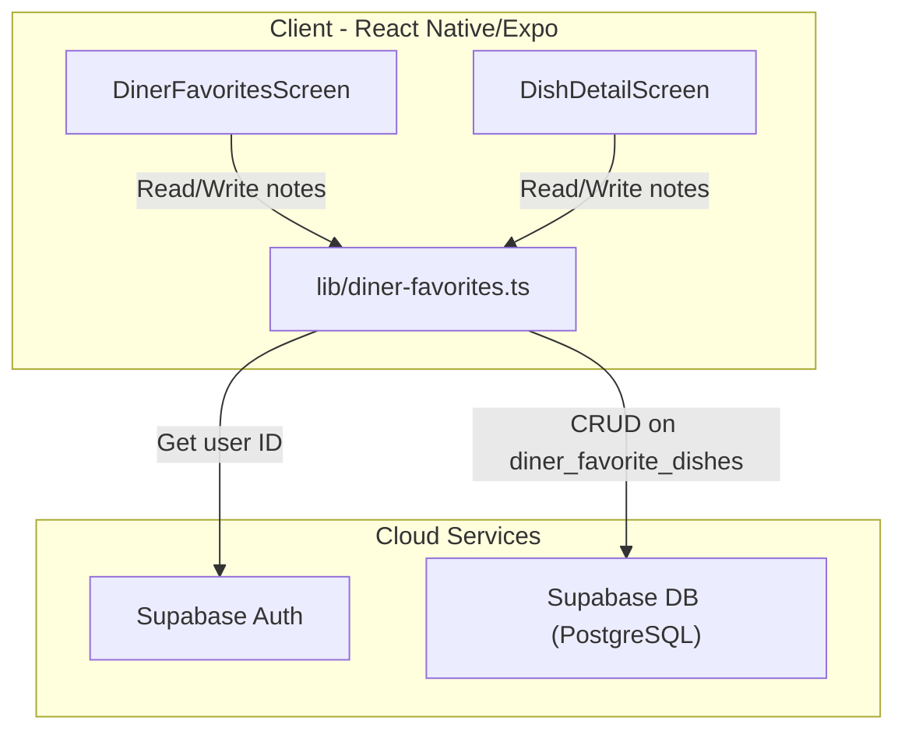
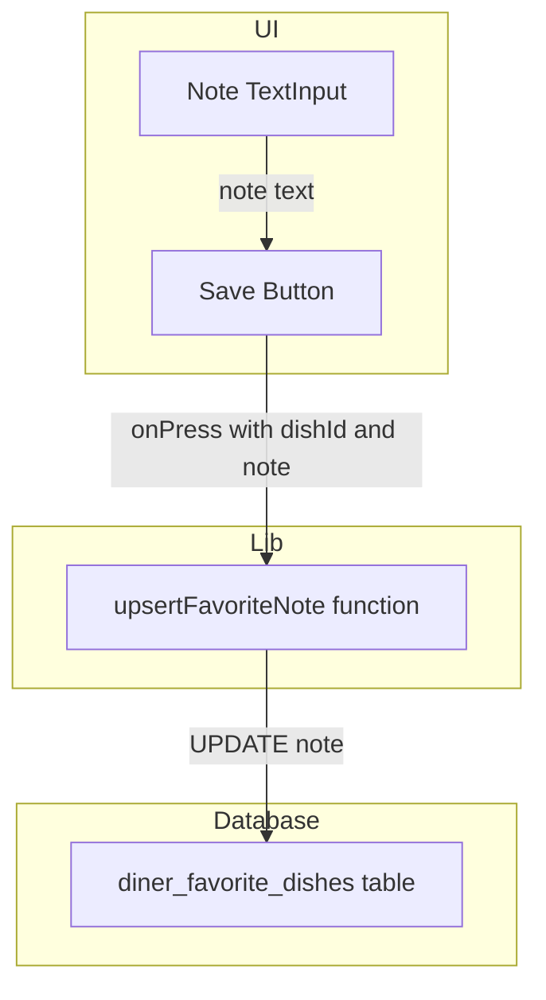
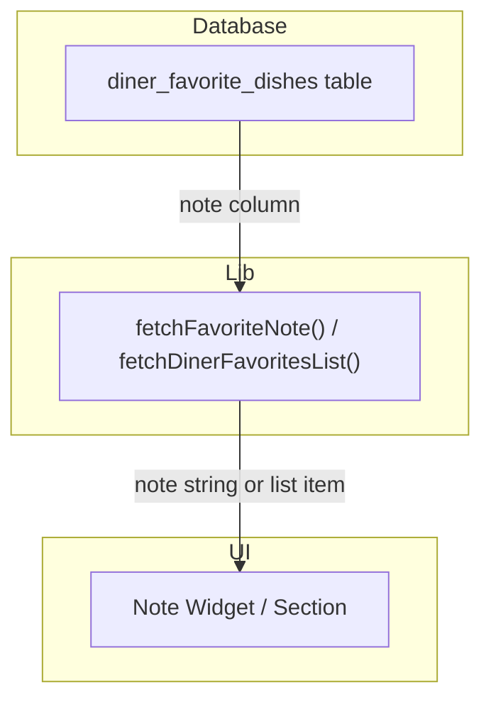
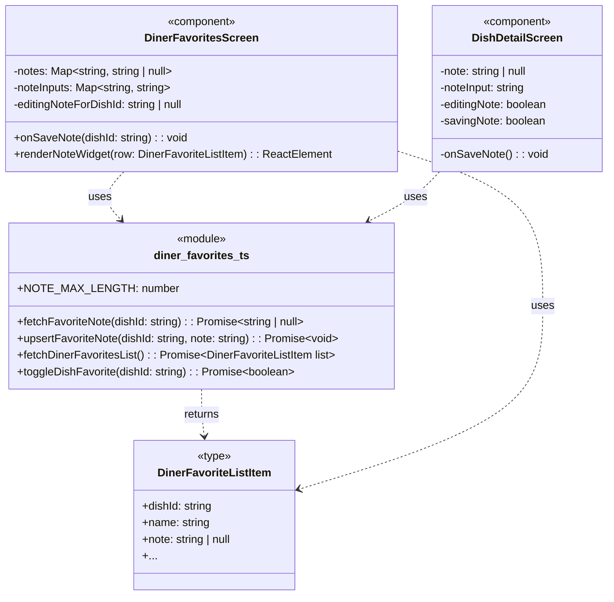

An excellent user story. Here is the development specification.

---

### 1. Primary and Secondary Owners

| Role | Name | Notes |
|------|------|-------|
| Primary owner | Yao Lu | Owns requirements and release sign-off |
| Secondary owner | Sofia Yu | Owns implementation review and test plan |

---

### 2. Date Merged into `main`

2026-04-16 (PR #87)

---

### 3. Architecture Diagram (Mermaid)

---

### 4. Information Flow Diagram (Mermaid)

#### 4a. Write path

#### 4b. Read path

---

### 5. Class Diagram (Mermaid)

---

### 6. Implementation Units

#### `app/diner-favorites.tsx`

-   **Purpose**: Renders the list of a diner's favorited dishes, grouped by restaurant. This screen now includes a widget for adding, viewing, and editing a private note for each dish.
-   **Public fields and methods**:
    -   `DinerFavoritesScreen()`: `React.FC` - The main screen component.
-   **Private fields and methods**:
    -   **State**:
        -   `notes: Map<string, string | null>`: Holds the saved notes for all favorited dishes, keyed by `dishId`.
        -   `noteInputs: Map<string, string>`: Holds the current text of a note being edited, keyed by `dishId`.
        -   `editingNoteForDishId: string | null`: The `dishId` of the dish whose note is currently being edited.
        -   `savingNote: boolean`: A flag to indicate when a note save operation is in progress.
    -   **Handlers**:
        -   `onSaveNote(dishId: string): Promise<void>`: Handles the logic for saving a note via `upsertFavoriteNote`, updating local state on success, and showing an alert on failure.
    -   **Renderers**:
        -   `renderNoteWidget(row: DinerFavoriteListItem): React.ReactElement`: Renders the appropriate note UI: an "Add note" button, the saved note text, or the text input editor.

#### `app/dish/[dishId].tsx`

-   **Purpose**: Displays the detailed view of a single dish. If the dish is favorited by the user, it now shows a "My Note" section to view, add, or edit a private note.
-   **Public fields and methods**:
    -   `DishDetailScreen()`: `React.FC` - The main screen component.
-   **Private fields and methods**:
    -   **State**:
        -   `note: string | null`: The saved note for the current dish.
        -   `noteInput: string`: The text of the note while it is being edited.
        -   `editingNote: boolean`: A flag to switch between displaying the note and editing it.
        -   `savingNote: boolean`: A flag to indicate when a note save operation is in progress.
    -   **Effects**:
        -   `useEffect()`: Fetches dish details, favorite status, and the associated note on component mount. If the dish is unfavorited, it clears the local note state.
    -   **Handlers**:
        -   Inline `onPress` handler for the "Save" button: Calls `upsertFavoriteNote`, updates local state (`note`, `editingNote`), and shows an alert on failure.

#### `lib/diner-favorites.ts`

-   **Purpose**: A client-side library module to abstract all Supabase interactions related to diner favorites. It now includes functions for handling notes.
-   **Public fields and methods**:
    -   **Types**:
        -   `DinerFavoriteListItem`: `type` - The shape of a favorite item, now including a `note: string | null` field.
    -   **Constants**:
        -   `NOTE_MAX_LENGTH: 300`: `number` - The maximum allowed character length for a note.
    -   **Functions**:
        -   `fetchFavoriteNote(dishId: string): Promise<string | null>`: Fetches the note for a single favorited dish. Returns `null` if not favorited or no note exists.
        -   `upsertFavoriteNote(dishId: string, note: string): Promise<void>`: Updates or inserts a note for a favorited dish. An empty string will clear the note (set to `null`). Throws an error if the note exceeds `NOTE_MAX_LENGTH`.
        -   `fetchDinerFavoritesList(): Promise<DinerFavoriteListItem[]>`: Fetches all favorited dishes for the user, now including the `note` field in the result.

#### `supabase/migrations/20260416052648_us10_favorite_dish_notes.sql`

-   **Purpose**: A SQL migration script that modifies the `diner_favorite_dishes` table schema.
-   **Changes**:
    -   Adds a `note` column of type `text` to the `diner_favorite_dishes` table.
    -   Adds a `CHECK` constraint (`diner_favorite_dishes_note_length_check`) to ensure the `note` column's length is 300 characters or less.

#### `supabase/migrations/20260416055019_us10_favorite_dish_notes_update_policy.sql`

-   **Purpose**: A SQL migration script that adds a Row-Level Security (RLS) policy to the `diner_favorite_dishes` table.
-   **Changes**:
    -   Creates a new policy named `diner_favorite_dishes_update_own`.
    -   This policy allows authenticated users with the 'diner' role to `UPDATE` rows in `diner_favorite_dishes` that they own (where `profile_id` matches their `auth.uid()`). This is necessary for saving notes.

---

### 7. Technologies, Libraries, and APIs

| Technology | Version | Used for | Why chosen over alternatives | Source / Docs URL |
|------------|---------|----------|------------------------------|-------------------|
| TypeScript | `~5.3.3` | Language for type safety in the mobile app. | Industry standard for large-scale JavaScript projects, providing static analysis and better developer experience. | https://www.typescriptlang.org/ |
| Node.js | `18.x` | JavaScript runtime for Expo CLI and development tooling. | Standard runtime for the React Native ecosystem. | https://nodejs.org/ |
| React | `18.2.0` | UI library for building components. | Core of React Native. | https://react.dev/ |
| React Native | `0.74.1` | Framework for building native mobile apps with React. | Project's core framework for cross-platform mobile development. | https://reactnative.dev/ |
| Expo SDK | `~51.0.8` | Toolchain and libraries for React Native development. | Simplifies development, building, and deployment of React Native apps. | https://docs.expo.dev/ |
| Expo Router | `~3.5.14` | File-based routing for React Native apps. | Project's chosen routing solution, integrated with Expo. | https://docs.expo.dev/router/ |
| Supabase JS Client | `~2.42.0` | Client library for interacting with Supabase services. | Official library for connecting the frontend to the Supabase backend. | https://supabase.com/docs/reference/javascript/ |
| Supabase Auth | Cloud Service | User authentication and session management. | Integrated auth solution provided by the Supabase platform. | https://supabase.com/docs/guides/auth |
| Supabase (PostgreSQL) | `15.1` | Relational database for long-term data storage. | Project's primary database, managed by Supabase. | https://supabase.com/docs/guides/database |
| MaterialCommunityIcons | `@expo/vector-icons` | Icon library. | Provides a wide range of icons (pencil, heart, etc.) used in the UI. | https://icons.expo.fyi/ |

---

### 8. Database — Long-Term Storage

-   **Table name**: `diner_favorite_dishes`
-   **Purpose**: Stores the many-to-many relationship between diners (`profiles`) and dishes (`diner_scanned_dishes`) that they have favorited. It now also stores a private, user-specific note for each favorite.

| Column | Type | Purpose | Estimated storage per row (bytes) |
|---|---|---|---|
| `profile_id` | `uuid` | Foreign key to `profiles.id`, identifying the user. | 16 |
| `dish_id` | `uuid` | Foreign key to `diner_scanned_dishes.id`, identifying the dish. | 16 |
| `created_at` | `timestamptz` | Timestamp of when the dish was favorited. | 8 |
| `note` | `text` | A private, user-written note about the dish. Nullable. Max 300 chars. | ~150 (assuming avg 150 chars) |

-   **Estimated total storage per user**:
    -   Assuming an average of 100 favorited dishes per user.
    -   (16 + 16 + 8 + 150) bytes/row * 100 rows/user = **19,000 bytes (19 KB)** per user.

---

### 9. Failure Scenarios

1.  **Frontend process crash**:
    -   **User-visible effect**: The app closes unexpectedly.
    -   **Internally-visible effect**: Any unsaved note text in the `TextInput` is lost. If the user had just tapped "Save", the API call might be interrupted. Saved notes are persisted in the database and will be present on app restart.

2.  **Loss of all runtime state**:
    -   **User-visible effect**: The app reloads as if from a fresh start. The user might be navigated back to the main favorites list.
    -   **Internally-visible effect**: All React state (`notes`, `noteInputs`, etc.) is lost. The `useFocusEffect` and `useEffect` hooks will re-trigger, fetching all favorite and note data from Supabase, restoring the UI to its last saved state.

3.  **All stored data erased**:
    -   **User-visible effect**: The "Favorites" screen shows the "No favorites yet" message. On dish detail pages, the heart icon is inactive and the "My Note" section is not visible. All previously saved notes are gone.
    -   **Internally-visible effect**: `fetchDinerFavoritesList` returns an empty array. `isDishFavorited` returns `false`. The `diner_favorite_dishes` table is empty.

4.  **Corrupt data detected in the database**:
    -   **User-visible effect**: A note might appear with strange characters. If a `note` somehow exceeds 300 characters (bypassing the DB constraint), it could cause text to overflow its container in the UI.
    -   **Internally-visible effect**: The `CHECK (char_length(note) <= 300)` constraint on the database makes server-side corruption of this field's length unlikely. The client-side `NOTE_MAX_LENGTH` check also prevents this.

5.  **Remote procedure call (API call) failed**:
    -   **User-visible effect**: An alert dialog appears with the title "Could not save note" or "Could not load favorites" and an error message. The UI remains in its pre-call state (e.g., the note editor stays open, the loading indicator stops).
    -   **Internally-visible effect**: A `catch` block in `onSaveNote` or `load` is executed. The `Alert.alert` function is called with the error from the Supabase client. State is not updated with the failed data.

6.  **Client overloaded**:
    -   **User-visible effect**: The app becomes sluggish or unresponsive. Tapping "Save" might have a delayed reaction.
    -   **Internally-visible effect**: The JavaScript thread is blocked. Event handlers are delayed. This feature is not computationally intensive, so it's unlikely to be the cause.

7.  **Client out of RAM**:
    -   **User-visible effect**: The app may be killed by the operating system and will need to be restarted.
    -   **Internally-visible effect**: Same as "Frontend process crash".

8.  **Database out of storage space**:
    -   **User-visible effect**: The user sees a "Could not save note" alert when trying to save a note.
    -   **Internally-visible effect**: The `upsertFavoriteNote` call to Supabase fails with a database error, which is caught and displayed in the alert.

9.  **Network connectivity lost**:
    -   **User-visible effect**: Loading favorites fails with an error alert. Saving a note fails with an error alert.
    -   **Internally-visible effect**: All Supabase client calls will time out or fail immediately, throwing an error that is caught by the application logic.

10. **Database access lost**:
    -   **User-visible effect**: Same as "Network connectivity lost". Any action requiring a database call will fail with an error alert.
    -   **Internally-visible effect**: Supabase client calls fail, likely with an authentication or connection error.

11. **Bot signs up and spams users**:
    -   **User-visible effect**: None for other users. The notes are private and only visible to the account that created them.
    -   **Internally-visible effect**: A bot account could create many entries in the `diner_favorite_dishes` table, filling the `note` column with spam content. This would consume database storage but would not be visible to or affect any other user's experience.

---

### 10. PII, Security, and Compliance

This feature introduces a free-text field (`note`) where a user could potentially enter Personally Identifying Information (PII).

-   **What it is and why it must be stored**:
    -   The `note` field is user-generated text content associated with a favorited dish. It is not explicitly PII, but a user can enter any text they wish, including PII (e.g., "Had this with Mom for her birthday," "allergic to peanuts - this is safe").
    -   It is stored to fulfill the user story requirement of allowing diners to remember their preferences and experiences.

-   **How it is stored**:
    -   Plaintext in the `note` column of the `diner_favorite_dishes` table in the Supabase PostgreSQL database.

-   **How it entered the system**:
    -   User types into a `<TextInput>` component in `DinerFavoritesScreen` or `DishDetailScreen`.
    -   The text is held in React state (`noteInputs` or `noteInput`).
    -   On save, the `upsertFavoriteNote` function in `lib/diner-favorites.ts` is called.
    -   The Supabase JS client sends an `UPDATE` request to the `diner_favorite_dishes` table.

-   **How it exits the system**:
    -   The `fetchDinerFavoritesList` or `fetchFavoriteNote` function in `lib/diner-favorites.ts` reads from the `diner_favorite_dishes` table.
    -   The Supabase JS client returns the data to the app.
    -   The `note` text is stored in React state (`notes` or `note`).
    -   The note is rendered into a `<Text>` component in `DinerFavoritesScreen` or `DishDetailScreen`.

-   **Who on the team is responsible for securing it**:
    -   Unknown — leave blank for human to fill in.

-   **Procedures for auditing routine and non-routine access**:
    -   Unknown — leave blank for human to fill in. (Supabase provides audit logs that could be used for this).

#### Minor users:

-   **Does this feature solicit or store PII of users under 18?**
    -   The feature does not *solicit* PII. However, as a free-text field, it allows any user, including one under 18, to *store* PII.
-   **If yes: does the app solicit guardian permission?**
    -   No mechanism for soliciting guardian permission is visible in the code for this feature.
-   **What is the team policy for ensuring minors' PII is not accessible by anyone convicted or suspected of child abuse?**
    -   The notes are private and secured by Supabase's Row-Level Security. Access is restricted to the authenticated user who created the note (`profile_id = auth.uid()`). This prevents other users from accessing the notes. Access by internal team members would be governed by general data access policies.