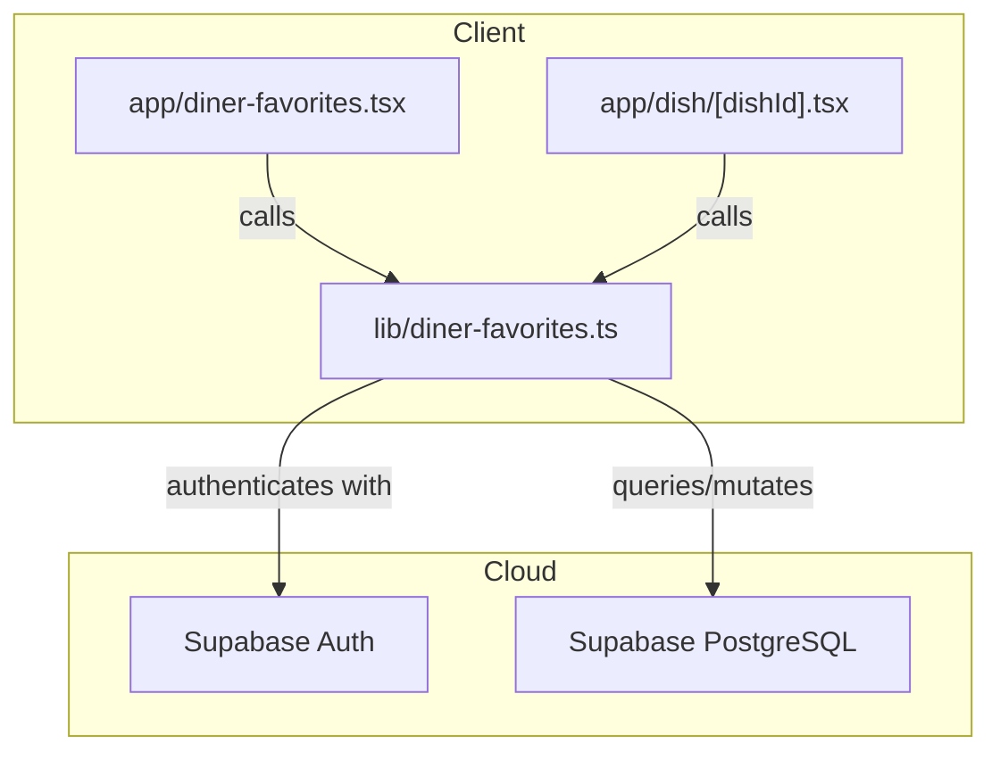
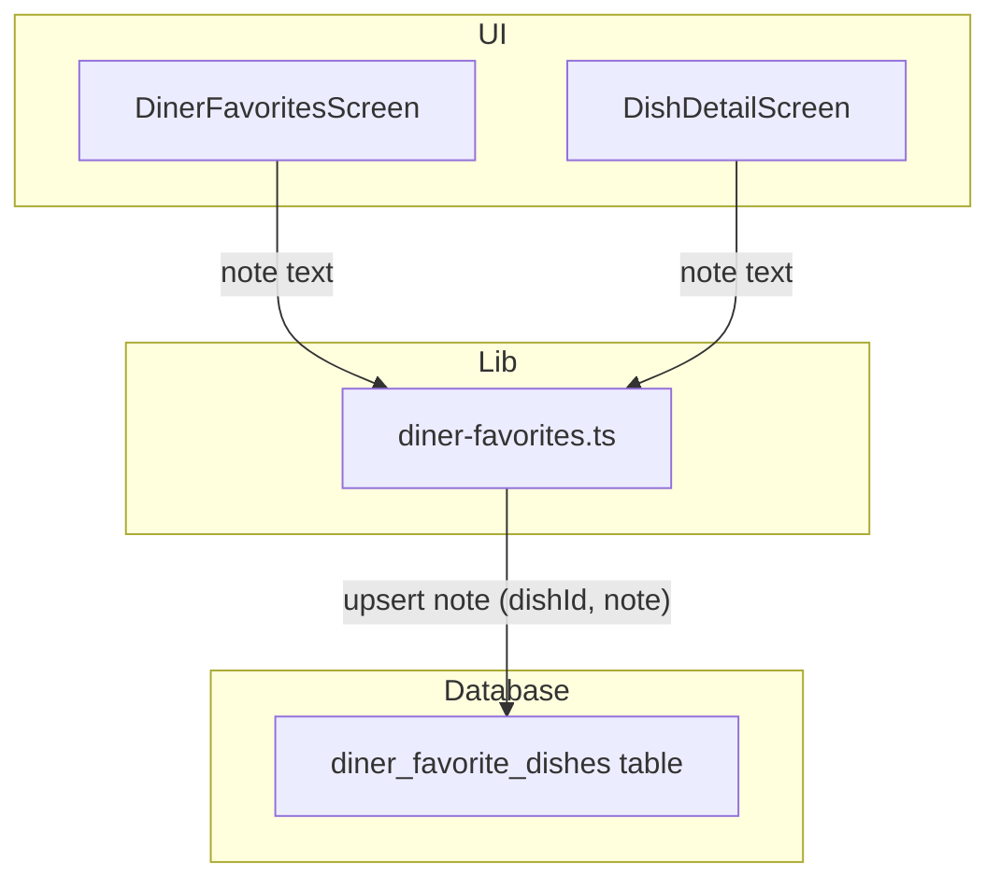
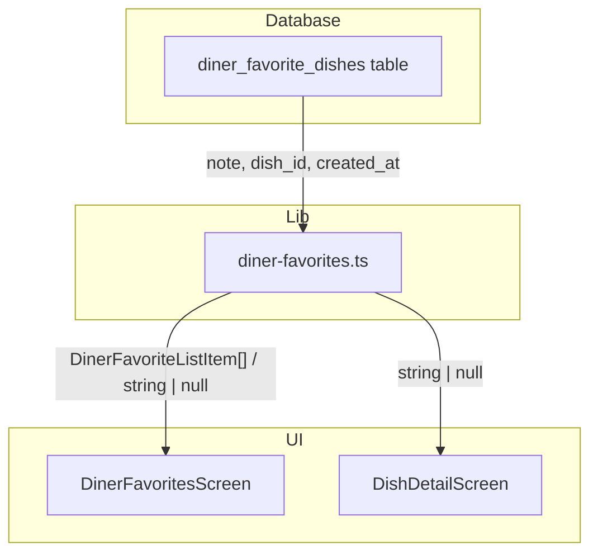
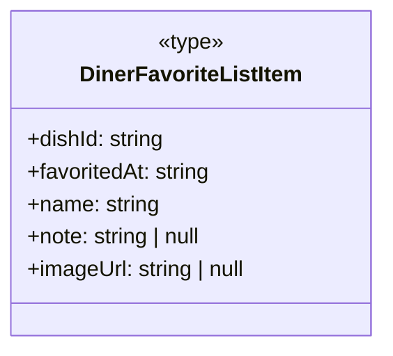
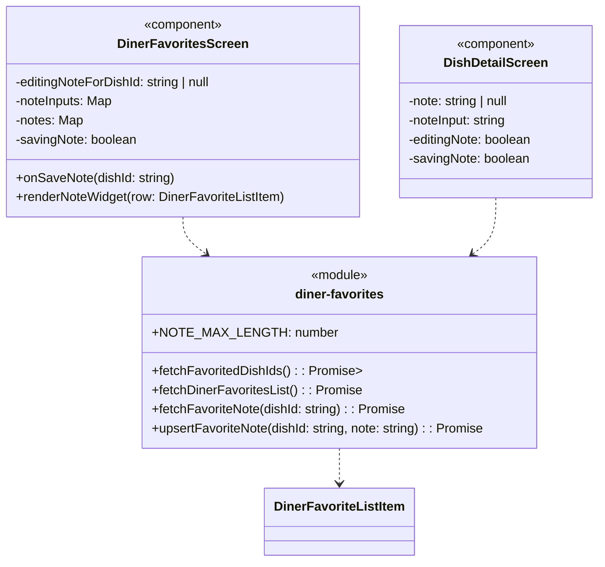

### 1. Primary and Secondary Owners

| Role | Name | Notes |
|------|------|-------|
| Primary owner | Yao Lu | Owns requirements and release sign-off |
| Secondary owner | Sofia Yu | Owns implementation review and test plan |

---

### 2. Date Merged into `main`

2026-04-16 (PR #87)

---

### 3. Architecture Diagram (Mermaid)

---

### 4. Information Flow Diagram (Mermaid)

#### 4a. Write path

#### 4b. Read path

---

### 5. Class Diagram (Mermaid)

#### 5a. Data types and schemas

#### 5b. Components and modules

---

### 6. Implementation Units

**File path**: `app/diner-favorites.tsx`
**Purpose**: React Native screen component for displaying a diner's favorited dishes. This PR adds functionality to view, add, and edit private notes for each favorited dish directly within the favorites list.

*   **Public fields and methods**:
    *   `DinerFavoritesScreen()`: React functional component that renders the favorites list.
*   **Private fields and methods**:
    *   `editingNoteForDishId`: `string | null` - State variable to track which dish's note is currently being edited.
    *   `noteInputs`: `Map<string, string>` - State variable to store the current text input for notes, keyed by `dishId`.
    *   `notes`: `Map<string, string | null>` - State variable to store the saved notes for each dish, keyed by `dishId`.
    *   `savingNote`: `boolean` - State variable to indicate if a note save operation is in progress.
    *   `onSaveNote(dishId: string)`: `async (dishId: string) => void` - Callback function to handle saving a note for a specific dish. It calls `upsertFavoriteNote` from `diner-favorites.ts`.
    *   `renderNoteWidget(row: DinerFavoriteListItem)`: `(row: DinerFavoriteListItem) => JSX.Element` - Renders the UI for adding, editing, or displaying a note for a given dish row.

**File path**: `app/dish/[dishId].tsx`
**Purpose**: React Native screen component for displaying the details of a single dish. This PR adds a "My Note" section to this page, allowing diners to view, add, or edit a private note for the dish if it is favorited.

*   **Public fields and methods**:
    *   `DishDetailScreen()`: React functional component that renders the dish details.
*   **Private fields and methods**:
    *   `note`: `string | null` - State variable to store the saved note for the current dish.
    *   `noteInput`: `string` - State variable to store the current text input value when editing a note.
    *   `editingNote`: `boolean` - State variable to control whether the note input field is visible for editing.
    *   `savingNote`: `boolean` - State variable to indicate if a note save operation is in progress.
    *   `useEffect` hook: Fetches the existing note for the dish if it is favorited, using `fetchFavoriteNote`.
    *   `onPress` handler for favorite button: If a dish is unfavorited, it clears the note state (`note`, `noteInput`, `editingNote`).
    *   `onPress` handler for note save button: Calls `upsertFavoriteNote` from `diner-favorites.ts` to save the current `noteInput`.

**File path**: `lib/diner-favorites.ts`
**Purpose**: TypeScript module containing utility functions for managing a diner's favorited dishes and associated notes with Supabase.

*   **Public fields and methods**:
    *   `DinerFavoriteListItem`: `type` - Extends the existing type to include a `note: string | null` field.
    *   `NOTE_MAX_LENGTH`: `const number` - Defines the maximum allowed length for a note (300 characters).
    *   `fetchDinerFavoritesList()`: `async (): Promise<DinerFavoriteListItem[]>` - Fetches a list of all favorited dishes for the signed-in user, now including the `note` field from the database.
    *   `fetchFavoriteNote(dishId: string)`: `async (dishId: string): Promise<string | null>` - Fetches the private note for a specific favorited dish for the signed-in user. Returns `null` if no note exists or the dish is not favorited.
    *   `upsertFavoriteNote(dishId: string, note: string)`: `async (dishId: string, note: string): Promise<void>` - Saves or clears a note for a favorited dish. If the `note` parameter is an empty string, the note is set to `null` in the database. Throws an error if the note exceeds `NOTE_MAX_LENGTH`.
*   **Private fields and methods**:
    *   None directly defined in the diff.

**File path**: `supabase/migrations/20260416052648_us10_favorite_dish_notes.sql`
**Purpose**: SQL migration script to add a `note` column to the `diner_favorite_dishes` table and enforce a maximum length constraint.

*   **Public fields and methods**:
    *   `ALTER TABLE diner_favorite_dishes ADD COLUMN note text;`: Adds a new column named `note` of type `text` to the `diner_favorite_dishes` table. It is nullable by default.
    *   `ALTER TABLE diner_favorite_dishes ADD CONSTRAINT diner_favorite_dishes_note_length_check CHECK (note IS NULL OR char_length(note) <= 300);`: Adds a check constraint to ensure that the `note` column, if not `NULL`, has a character length of 300 or less.
*   **Private fields and methods**:
    *   None.

**File path**: `supabase/migrations/20260416055019_us10_favorite_dish_notes_update_policy.sql`
**Purpose**: SQL migration script to add an `UPDATE` Row Level Security (RLS) policy for the `diner_favorite_dishes` table. This policy allows authenticated diners to update their own favorited dish entries, which is necessary for saving notes.

*   **Public fields and methods**:
    *   `create policy "diner_favorite_dishes_update_own" on public.diner_favorite_dishes for update to authenticated using (profile_id = (select auth.uid()) and public.is_diner((select auth.uid()))) with check (profile_id = (select auth.uid()));`: Creates an RLS policy that permits authenticated users who are also diners to update rows in `diner_favorite_dishes` where the `profile_id` matches their own `auth.uid()`. The `WITH CHECK` clause ensures that updated rows still satisfy the condition.
*   **Private fields and methods**:
    *   None.

---

### 7. Technologies, Libraries, and APIs

| Technology | Version | Used for | Why chosen over alternatives | Source / Docs URL |
|:-----------|:--------|:---------|:-----------------------------|:------------------|
| TypeScript | 5.x (assumed) | Type-safe JavaScript development | Enhanced code quality, maintainability, and developer experience | [TypeScript Docs](https://www.typescriptlang.org/docs/) |
| React Native | 0.7x (assumed) | Mobile UI framework | Cross-platform development for iOS/Android from a single codebase | [React Native Docs](https://reactnative.dev/docs/) |
| Expo SDK | 49.x (assumed) | React Native development tools and APIs | Simplified development workflow, access to device features, managed build process | [Expo Docs](https://docs.expo.dev/) |
| Node.js | 18.x (assumed) | JavaScript runtime environment | Executes JavaScript code outside the browser, used for development tooling | [Node.js Docs](https://nodejs.org/en/docs/) |
| Supabase JS Client | 2.x (assumed) | Interact with Supabase backend | Easy authentication, database (PostgreSQL) access, and real-time features | [Supabase JS Docs](https://supabase.com/docs/reference/javascript) |
| PostgreSQL | 15.x (assumed) | Relational database | Robust, open-source, ACID-compliant database for structured data storage | [PostgreSQL Docs](https://www.postgresql.org/docs/) |
| Supabase Auth | N/A | User authentication and authorization | Integrated user management, secure token handling, RLS integration | [Supabase Auth Docs](https://supabase.com/docs/guides/auth) |
| SQL | N/A | Database schema migrations and RLS policies | Standard language for managing relational databases | [PostgreSQL SQL Docs](https://www.postgresql.org/docs/current/sql.html) |
| `@expo/vector-icons` | 13.x (assumed) | Icon library for UI | Provides a wide range of customizable vector icons for React Native | [Expo Vector Icons](https://docs.expo.dev/guides/icons/) |

---

### 8. Database — Long-Term Storage

**Table name and purpose**: `diner_favorite_dishes`
**Purpose**: Stores the dishes that each diner has marked as a favorite. This table now also stores private notes associated with these favorited dishes.

*   **Column**: `note`
    *   **Type**: `text`
    *   **Purpose**: Stores a diner's private text note for a specific favorited dish. Can be `NULL` if no note is set.
    *   **Estimated storage in bytes per row**: Up to 300 characters, plus overhead. Assuming UTF-8, 1-4 bytes per character. Max ~1200 bytes + overhead. Average note likely much shorter, perhaps 50-100 bytes.
*   **Estimated total storage per user**:
    *   Assuming a user favorites 100 dishes and adds a note to 50% of them, with an average note length of 100 characters (100 bytes).
    *   50 notes * 100 bytes/note = 5000 bytes (5 KB).
    *   This is in addition to the existing storage for `diner_favorite_dishes` entries (which is small, primarily foreign keys and timestamps).

---

### 9. Failure Scenarios

1.  **Frontend process crash**
    *   **User-visible effect**: The app closes unexpectedly. Any unsaved note text in the input fields will be lost.
    *   **Internally-visible effect**: React Native app process terminates. State variables (`noteInputs`, `editingNoteForDishId`, `note`, `noteInput`) are reset upon app restart.

2.  **Loss of all runtime state**
    *   **User-visible effect**: Similar to a crash or app being backgrounded and OS reclaiming memory. Any unsaved note text in the input fields will be lost. Saved notes will reappear correctly after data refetch.
    *   **Internally-visible effect**: React component state (e.g., `useState` variables like `noteInputs`, `editingNoteForDishId`) is cleared. Data from `diner-favorites.ts` would need to be re-fetched from Supabase.

3.  **All stored data erased**
    *   **User-visible effect**: All favorited dishes and their associated notes disappear from the app. Users would have to re-favorite dishes and re-enter notes.
    *   **Internally-visible effect**: The `diner_favorite_dishes` table in Supabase PostgreSQL is empty. Queries to `fetchDinerFavoritesList` and `fetchFavoriteNote` would return empty arrays or `null`.

4.  **Corrupt data detected in the database**
    *   **User-visible effect**:
        *   If a `note` column contains invalid characters or exceeds the `NOTE_MAX_LENGTH` (e.g., due to a bypass of client-side validation or a bug in a different system), it might cause display issues or errors when fetching.
        *   If the `diner_favorite_dishes_note_length_check` constraint is violated, `upsertFavoriteNote` would fail with a database error.
    *   **Internally-visible effect**: Database queries might return errors (e.g., `error.message` from Supabase client). The `Alert.alert` mechanism in the frontend would display the error message.

5.  **Remote procedure call (API call) failed**
    *   **User-visible effect**:
        *   When trying to save a note: An alert "Could not save note" with an error message. The note input remains in editing mode.
        *   When loading favorites or dish details: An alert "Could not load favorites" or "Could not load dish" with an error message. Notes might not appear or the list might be empty.
    *   **Internally-visible effect**: `supabase.from(...).update(...)` or `supabase.from(...).select(...)` calls return an `error` object. The `catch` block in `onSaveNote` or `load` functions is triggered.

6.  **Client overloaded**
    *   **User-visible effect**: App becomes slow, unresponsive, or crashes. Note input might lag, or save operations might time out.
    *   **Internally-visible effect**: High CPU/memory usage on the client device. JavaScript event loop delays. Network requests might time out.

7.  **Client out of RAM**
    *   **User-visible effect**: App crashes or is terminated by the OS. Any unsaved note text is lost.
    *   **Internally-visible effect**: OS terminates the app process.

8.  **Database out of storage space**
    *   **User-visible effect**: Users cannot save new notes or favorite dishes. An error message like "Could not save note" might appear, potentially indicating a database storage issue.
    *   **Internally-visible effect**: `upsertFavoriteNote` would receive a database error indicating storage exhaustion. Supabase would likely report this as a `5xx` error.

9.  **Network connectivity lost**
    *   **User-visible effect**:
        *   Saving a note: "Could not save note" alert.
        *   Loading favorites/dish details: "Could not load favorites" / "Could not load dish" alert.
        *   Existing notes might not load or appear.
    *   **Internally-visible effect**: Network requests (`supabase` calls) fail with network-related errors (e.g., `fetch` API errors). The `catch` blocks in `onSaveNote` and `load` functions are triggered.

10. **Database access lost**
    *   **User-visible effect**: Similar to network connectivity loss, but specifically for database operations. Users cannot save notes, fetch favorites, or view existing notes. Alerts indicating failure to load or save.
    *   **Internally-visible effect**: Supabase client receives database-specific errors (e.g., connection refused, authentication failure). The `catch` blocks in `diner-favorites.ts` functions are triggered, propagating errors to the UI.

11. **Bot signs up and spams users**
    *   **User-visible effect**: Not directly applicable to this feature, as notes are private to the user who created them. Bots could create many favorite dishes with notes for themselves, but this would not be visible to other users.
    *   **Internally-visible effect**: The `diner_favorite_dishes` table could grow rapidly with many entries for bot `profile_id`s. This would increase storage costs and potentially impact database performance if not managed. The `NOTE_MAX_LENGTH` constraint helps limit the size of individual spam notes.

---

### 10. PII, Security, and Compliance

**PII stored**: Private notes on favorited dishes.

*   **What it is and why it must be stored**:
    *   **What**: Free-form text entered by the user, intended for personal use to remember preferences or experiences related to a dish.
    *   **Why**: Core functionality of the user story: "As a diner, I want to add personal notes to my favorited dishes so that I can remember my preferences and experiences for future visits."
*   **How it is stored**:
    *   Stored as `text` in the `note` column of the `diner_favorite_dishes` table in Supabase PostgreSQL.
    *   It is stored in plaintext within the database. Supabase encrypts data at rest by default.
*   **How it entered the system**:
    *   **User input path**: User types text into `TextInput` components in `DinerFavoritesScreen` or `DishDetailScreen`.
    *   **Modules**: The text is passed to `upsertFavoriteNote(dishId, note)` in `lib/diner-favorites.ts`.
    *   **Fields**: The `note` parameter is used to update the `note` column in the `diner_favorite_dishes` table.
    *   **Storage**: The `supabase.from('diner_favorite_dishes').update({ note: ... })` call persists the data to the PostgreSQL database.
*   **How it exits the system**:
    *   **Storage**: The `note` column is retrieved from the `diner_favorite_dishes` table via `fetchDinerFavoritesList()` or `fetchFavoriteNote()`.
    *   **Fields**: The `note` value is included in the `DinerFavoriteListItem` type or returned directly as a `string | null`.
    *   **Modules**: The data flows from `lib/diner-favorites.ts` to the calling UI components.
    *   **Output path**: The `note` text is displayed in `Text` components within `DinerFavoritesScreen` (via `renderNoteWidget`) and `DishDetailScreen` (in the "My Note" section). It is only visible to the authenticated user who created it.
*   **Who on the team is responsible for securing it**: Unknown — leave blank for human to fill in.
*   **Procedures for auditing routine and non-routine access**: Unknown — leave blank for human to fill in.

**Minor users**:
*   **Does this feature solicit or store PII of users under 18?**: Yes, if users under 18 are permitted to use the app and favorite dishes, they can add notes. The app does not explicitly restrict this feature based on age.
*   **If yes: does the app solicit guardian permission?**: Unknown — leave blank for human to fill in. (Based on the provided code, there's no explicit guardian permission flow for this feature).
*   **What is the team policy for ensuring minors' PII is not accessible by anyone convicted or suspected of child abuse?**: Unknown — leave blank for human to fill in.