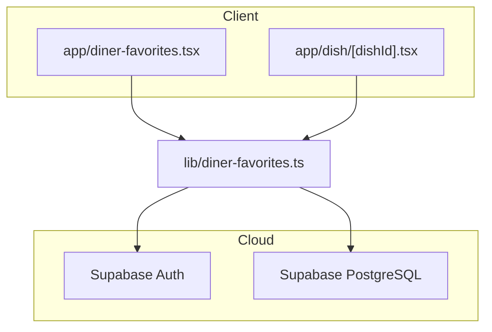
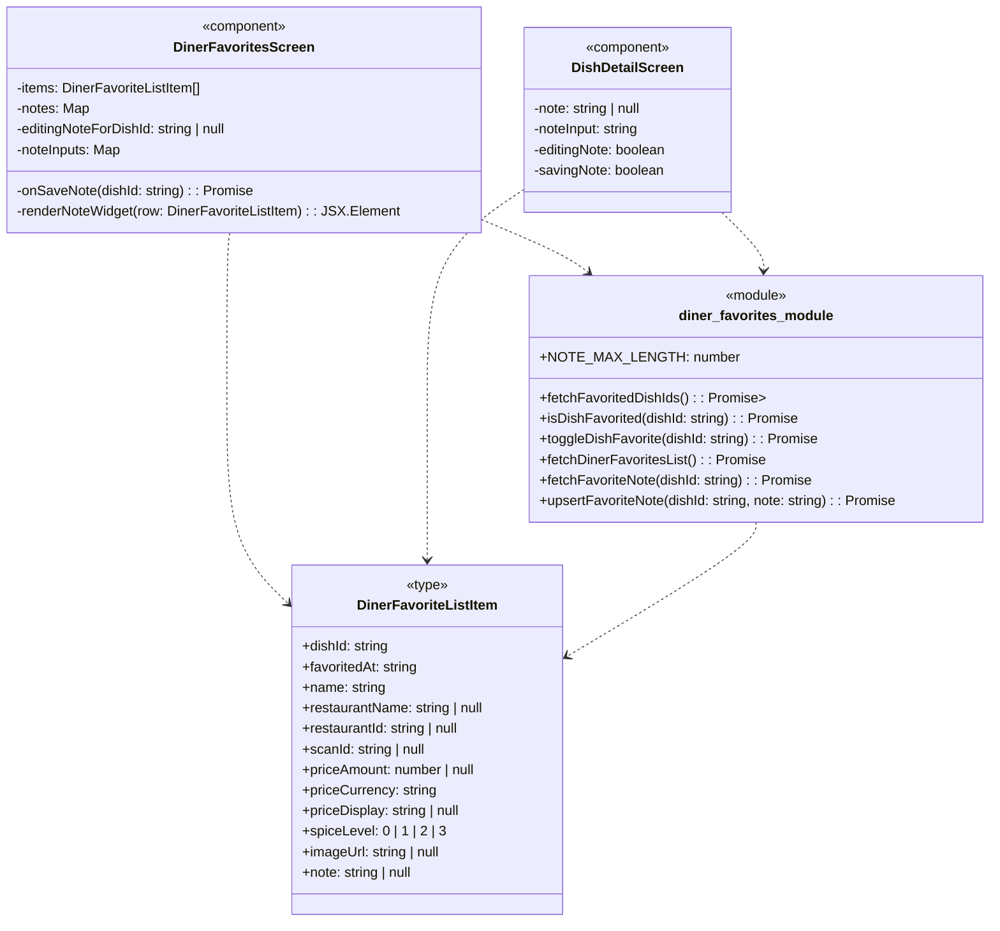

## 1. Primary and Secondary Owners

| Role | Name | Notes |
|------|------|-------|
| Primary owner | Yao Lu | Owns requirements and release sign-off |
| Secondary owner | Sofia Yu | Owns implementation review and test plan |

---

### 2. Date Merged into `main`

2026-04-16 (PR #87)

---

### 3. Architecture Diagram (Mermaid)



---

### 4. Information Flow Diagram (Mermaid)

#### 4a. Write path

```mermaid
flowchart TB
    subgraph UI
        DinerFavoritesScreen_UI[DinerFavoritesScreen]
        DishDetailScreen_UI[DishDetailScreen]
    end

    subgraph Lib
        upsertFavoriteNote[upsertFavoriteNote()]
    end

    subgraph Database
        diner_favorite_dishes_db[diner_favorite_dishes table]
    end

    DinerFavoritesScreen_UI -- "note text, dishId" --> upsertFavoriteNote
    DishDetailScreen_UI -- "note text, dishId" --> upsertFavoriteNote
    upsertFavoriteNote -- "UPDATE note, profile_id, dish_id" --> diner_favorite_dishes_db
```

#### 4b. Read path

```mermaid
flowchart TB
    subgraph Database
        diner_favorite_dishes_db[diner_favorite_dishes table]
    end

    subgraph Lib
        fetchDinerFavoritesList[fetchDinerFavoritesList()]
        fetchFavoriteNote[fetchFavoriteNote()]
    end

    subgraph UI
        DinerFavoritesScreen_UI[DinerFavoritesScreen]
        DishDetailScreen_UI[DishDetailScreen]
    end

    diner_favorite_dishes_db -- "note, dish_id, created_at" --> fetchDinerFavoritesList
    diner_favorite_dishes_db -- "note" --> fetchFavoriteNote
    fetchDinerFavoritesList -- "DinerFavoriteListItem[] (with note)" --> DinerFavoritesScreen_UI
    fetchFavoriteNote -- "string | null (note)" --> DishDetailScreen_UI
```

---

### 5. Class Diagram (Mermaid)



---

### 6. Implementation Units

**File: `app/diner-favorites.tsx`**
*   **Purpose**: Displays a list of favorited dishes, grouped by restaurant. Allows users to search, unfavorite, and now add/edit/delete private notes for each favorited dish directly within the list.
*   **Public fields and methods**:
    *   `DinerFavoritesScreen()`: React functional component. Renders the favorites list UI.
*   **Private fields and methods**:
    *   `items`: `DinerFavoriteListItem[]`. State for the list of favorited dishes.
    *   `loading`: `boolean`. State for initial data loading.
    *   `refreshing`: `boolean`. State for pull-to-refresh.
    *   `searchQuery`: `string`. State for the search input.
    *   `collapsedRestaurants`: `Set<string>`. State for collapsed restaurant sections.
    *   `editingNoteForDishId`: `string | null`. State to track which dish's note is currently being edited.
    *   `noteInputs`: `Map<string, string>`. State to store temporary input text for notes being edited.
    *   `notes`: `Map<string, string | null>`. State to store the saved notes for each dish.
    *   `savingNote`: `boolean`. State to indicate if a note save operation is in progress.
    *   `filteredItems`: `DinerFavoriteListItem[]`. Memoized filtered list based on `searchQuery`.
    *   `groupedByRestaurant`: `[string, DinerFavoriteListItem[]][]`. Memoized list of dishes grouped by restaurant.
    *   `toggleRestaurantSection(groupKey: string)`: Callback to collapse/expand restaurant sections.
    *   `load()`: `Promise<void>`. Fetches the list of favorited dishes and their notes from the backend.
    *   `onRefresh()`: Callback for pull-to-refresh.
    *   `openDish(row: DinerFavoriteListItem)`: Callback to navigate to the Dish Detail screen.
    *   `onUnfavorite(row: DinerFavoriteListItem)`: `Promise<void>`. Removes a dish from favorites.
    *   `onSaveNote(dishId: string)`: `Promise<void>`. Saves or clears a note for a specific dish.
    *   `renderNoteWidget(row: DinerFavoriteListItem)`: Renders the UI for adding, editing, or displaying a note for a dish.
    *   `renderFlames(level: 0 | 1 | 2 | 3)`: Renders spice level icons.
    *   `renderDishRow(row: DinerFavoriteListItem)`: Renders a single dish item in the list.

**File: `app/dish/[dishId].tsx`**
*   **Purpose**: Displays detailed information about a single dish. Now includes a "My Note" section where diners can add, edit, or delete a private note for the dish if it is favorited.
*   **Public fields and methods**:
    *   `DishDetailScreen()`: React functional component. Renders the dish detail UI.
*   **Private fields and methods**:
    *   `dishId`: `string | undefined`. Extracted from URL params.
    *   `scanId`: `string | undefined`. Extracted from URL params.
    *   `restaurantParam`: `string | undefined`. Extracted from URL params.
    *   `detail`: `DishDetail | null`. State for the detailed dish information.
    *   `prefs`: `DinerPreferenceSnapshot | null`. State for diner preferences.
    *   `loading`: `boolean`. State for initial data loading.
    *   `error`: `string | null`. State for error messages.
    *   `favorite`: `boolean`. State indicating if the dish is favorited.
    *   `imageLoading`: `boolean`. State for AI image generation status.
    *   `imageError`: `string | null`. State for AI image generation errors.
    *   `note`: `string | null`. State for the saved note for the current dish.
    *   `noteInput`: `string`. State for the temporary input text when editing a note.
    *   `editingNote`: `boolean`. State to indicate if the note is currently being edited.
    *   `savingNote`: `boolean`. State to indicate if a note save operation is in progress.
    *   `reasons`: `string[]`. Memoized list of reasons why the dish matches user preferences.
    *   `onGenerateImage()`: `Promise<void>`. Initiates AI image generation.

**File: `lib/diner-favorites.ts`**
*   **Purpose**: Provides functions for managing diner's favorited dishes, including adding/removing favorites, fetching lists, and now fetching/upserting private notes.
*   **Public fields and methods**:
    *   `DinerFavoriteListItem`: `type`. Represents a single item in the diner's favorites list, now including a `note` field.
    *   `NOTE_MAX_LENGTH`: `number`. Constant defining the maximum length for a note (300 characters).
    *   `fetchFavoritedDishIds()`: `Promise<Set<string>>`. Fetches all favorited dish IDs for the current user.
    *   `isDishFavorited(dishId: string)`: `Promise<boolean>`. Checks if a specific dish is favorited by the current user.
    *   `toggleDishFavorite(dishId: string)`: `Promise<boolean>`. Toggles the favorite status of a dish.
    *   `fetchDinerFavoritesList()`: `Promise<DinerFavoriteListItem[]>`. Fetches a detailed list of all favorited dishes, now including their notes.
    *   `fetchFavoriteNote(dishId: string)`: `Promise<string | null>`. Fetches the note for a single favorited dish.
    *   `upsertFavoriteNote(dishId: string, note: string)`: `Promise<void>`. Saves or clears a note for a favorited dish. Throws an error if the note exceeds `NOTE_MAX_LENGTH`.
*   **Private fields and methods**: None directly defined in this module.

**File: `supabase/migrations/20260416052648_us10_favorite_dish_notes.sql`**
*   **Purpose**: Database migration script to add a `note` column to the `diner_favorite_dishes` table and enforce its maximum length.
*   **Public fields and methods**: None (SQL script).
*   **Private fields and methods**: None (SQL script).

**File: `supabase/migrations/20260416055019_us10_favorite_dish_notes_update_policy.sql`**
*   **Purpose**: Database migration script to add an `UPDATE` Row Level Security (RLS) policy for the `diner_favorite_dishes` table, allowing authenticated diners to update their own favorite dish entries. This is crucial for saving notes.
*   **Public fields and methods**: None (SQL script).
*   **Private fields and methods**: None (SQL script).

---

### 7. Technologies, Libraries, and APIs

| Technology | Version | Used for | Why chosen over alternatives | Source / Docs URL |
|:-----------|:--------|:---------|:-----------------------------|:------------------|
| TypeScript | Unknown | Language | Type safety, better developer experience | https://www.typescriptlang.org/ |
| React Native | Unknown | Mobile UI | Cross-platform mobile app development | https://reactnative.dev/ |
| Expo SDK | Unknown | Mobile App Development | Simplified React Native development, build tools, device APIs | https://docs.expo.dev/ |
| Node.js | Unknown | JavaScript Runtime | Executes JavaScript outside the browser (for development/build) | https://nodejs.org/ |
| Supabase JS Client | Unknown | Database/Auth interaction | Client-side interaction with Supabase services | https://supabase.com/docs/reference/javascript |
| Supabase Auth | Unknown | User Authentication | User sign-up, sign-in, session management | https://supabase.com/docs/guides/auth |
| Supabase PostgreSQL | Unknown | Database | Persistent storage for application data | https://supabase.com/docs/guides/database |
| MaterialCommunityIcons | Unknown | Icons | Provides a wide range of vector icons for UI | https://icons.expo.fyi/ |
| expo-image | Unknown | Image loading/display | Optimized image component for Expo | https://docs.expo.dev/versions/latest/sdk/image/ |
| expo-linear-gradient | Unknown | UI Gradients | Provides linear gradient backgrounds | https://docs.expo.dev/versions/latest/sdk/linear-gradient/ |
| expo-router | Unknown | Navigation | File-system based routing for Expo/React Native | https://expo.github.io/router/ |
| react-native | Unknown | Core UI components | Provides fundamental UI building blocks for React Native | https://reactnative.dev/docs/components-and-apis |

---

### 8. Database — Long-Term Storage

*   **Table name and purpose**: `diner_favorite_dishes`. Stores a diner's favorited dishes.
*   **Each column**:
    *   `profile_id`: `uuid`. Purpose: Foreign key to the `profiles` table, identifying the diner. Estimated storage: 16 bytes.
    *   `dish_id`: `uuid`. Purpose: Foreign key to the `diner_scanned_dishes` table, identifying the favorited dish. Estimated storage: 16 bytes.
    *   `created_at`: `timestamp with time zone`. Purpose: Timestamp when the dish was favorited, used for ordering. Estimated storage: 8 bytes.
    *   `note`: `text`. Purpose: Stores a private note from the diner about the favorited dish. Estimated storage: Up to 300 characters (approx. 300 bytes, plus overhead for `text` type).
*   **Estimated total storage per user**: Assuming an average of 50 favorited dishes per user, with each note using its maximum length: 50 dishes * (16 + 16 + 8 + 300) bytes/dish = 50 * 340 bytes = 17,000 bytes (17 KB).

---

### 9. Failure Scenarios

1.  **Frontend process crash**
    *   **User-visible effect**: The app crashes or freezes. Any unsaved note edits (text typed into input fields) are lost.
    *   **Internally-visible effect**: The React Native app process terminates. Crash logs are generated (e.g., via Sentry or Expo diagnostics).
2.  **Loss of all runtime state**
    *   **User-visible effect**: If the app is backgrounded and then foregrounded, or if the component unmounts and remounts, any unsaved note edits will be lost. Saved notes will reload from the backend upon component re-initialization.
    *   **Internally-visible effect**: React component state (`editingNoteForDishId`, `noteInputs`, `noteInput`, `editingNote`, `savingNote`) is reset. `useEffect` hooks will re-run to fetch data from the backend.
3.  **All stored data erased**
    *   **User-visible effect**: All favorited dishes and their associated notes disappear from the app. Users would have to re-favorite dishes and re-enter notes.
    *   **Internally-visible effect**: The `diner_favorite_dishes` table in Supabase PostgreSQL is empty or deleted. `fetchDinerFavoritesList` and `fetchFavoriteNote` functions return empty results or errors.
4.  **Corrupt data detected in the database**
    *   **User-visible effect**: If the `note` column data is corrupt, notes might display garbled text, or in extreme cases, cause the app to crash if the data type is unexpected. If `dish_id` or `profile_id` are corrupt, favorited dishes might not appear or appear incorrectly linked.
    *   **Internally-visible effect**: Database queries might return errors (e.g., type mismatch, constraint violation). Application code might throw errors when attempting to process unexpected data types or formats from the `note` field.
5.  **Remote procedure call (API call) failed**
    *   **User-visible effect**:
        *   When loading favorites or dish details: An "Could not load favorites/dish details" alert is displayed. Notes might not appear.
        *   When saving a note: An "Could not save note" alert is displayed. The note will not be persisted.
        *   When unfavoriting: An "Could not update favorite" alert is displayed. The dish might remain in favorites.
    *   **Internally-visible effect**: `supabase.from(...).select/update/delete` calls return an `error` object. The `catch` blocks in `load`, `onSaveNote`, `onUnfavorite` (in `diner-favorites.tsx`) and the `useEffect` / `onPress` handlers (in `dish/[dishId].tsx`) are triggered, displaying an `Alert`.
6.  **Client overloaded**
    *   **User-visible effect**: The app becomes slow, unresponsive, or freezes. UI interactions such as typing notes, scrolling, or pressing buttons are delayed.
    *   **Internally-visible effect**: High CPU usage, excessive memory consumption on the client device. The JavaScript event loop is blocked, leading to UI unresponsiveness.
7.  **Client out of RAM**
    *   **User-visible effect**: The app crashes or is terminated by the operating system. Any unsaved note edits are lost.
    *   **Internally-visible effect**: The operating system sends low memory warnings, eventually terminating the app process.
8.  **Database out of storage space**
    *   **User-visible effect**: Users cannot save new notes, update existing ones, or favorite new dishes. Error messages like "Could not save note" or "Could not update favorite" might appear.
    *   **Internally-visible effect**: Supabase PostgreSQL returns storage-related errors on `INSERT` or `UPDATE` operations to the `diner_favorite_dishes` table.
9.  **Network connectivity lost**
    *   **User-visible effect**:
        *   When loading favorites or dish details: An "Could not load favorites/dish details" alert is displayed. Notes might not appear.
        *   When saving a note: An "Could not save note" alert is displayed. The note will not be persisted.
        *   When unfavoriting: An "Could not update favorite" alert is displayed. The dish might remain in favorites.
        *   The app might appear to be stuck in a loading state.
    *   **Internally-visible effect**: Supabase client network requests fail with network-related errors (e.g., `Network request failed`). The `catch` blocks in API calls are triggered.
10. **Database access lost**
    *   **User-visible effect**: Similar to network connectivity loss, but specifically for database operations. Users cannot load, save, or update notes/favorites.
    *   **Internally-visible effect**: The Supabase client receives errors indicating database connection issues or authentication failures when attempting to query or modify `diner_favorite_dishes`.
11. **Bot signs up and spams users**
    *   **User-visible effect**: This feature's notes are private to the user who created them. A bot could sign up and create many favorited dishes with notes for *itself*, but these notes would not be visible to other users. Therefore, there is no direct user-visible spamming of *other* users.
    *   **Internally-visible effect**: The `diner_favorite_dishes` table would grow with many entries linked to bot `profile_id`s. This could lead to increased storage costs and potentially impact database performance if not managed. The RLS policy ensures privacy, but not against self-spamming.

---

### 10. PII, Security, and Compliance

*   **PII stored**: `note` (text field in `diner_favorite_dishes` table).
    *   **What it is and why it must be stored**: The `note` field allows diners to store personal thoughts, preferences, or experiences related to a specific favorited dish. This is a core feature of the user story, enhancing the diner's ability to remember and manage their food choices.
    *   **How it is stored**: Plaintext in the `note` column of the `diner_favorite_dishes` table in Supabase PostgreSQL.
    *   **How it entered the system**: User input in `TextInput` components in `DinerFavoritesScreen` or `DishDetailScreen` -> `upsertFavoriteNote` function in `lib/diner-favorites.ts` -> `note` column in `diner_favorite_dishes` table.
    *   **How it exits the system**: `note` column in `diner_favorite_dishes` table -> `fetchDinerFavoritesList` or `fetchFavoriteNote` functions in `lib/diner-favorites.ts` -> displayed in `Text` components in `DinerFavoritesScreen` or `DishDetailScreen`.
    *   **Who on the team is responsible for securing it**: Unknown — leave blank for human to fill in.
    *   **Procedures for auditing routine and non-routine access**: Unknown — leave blank for human to fill in.

*   **Minor users**:
    *   **Does this feature solicit or store PII of users under 18?**: Yes, if a user under 18 signs up and uses the feature, their notes would be stored. The app does not explicitly prevent users under 18 from signing up or using this feature.
    *   **If yes: does the app solicit guardian permission?**: No, there is no explicit mechanism in the provided code to solicit guardian permission.
    *   **What is the team policy for ensuring minors' PII is not accessible by anyone convicted or suspected of child abuse?**: Unknown — leave blank for human to fill in.