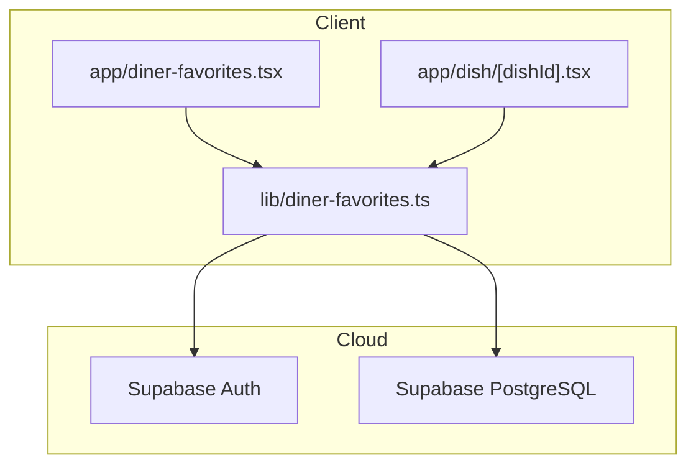
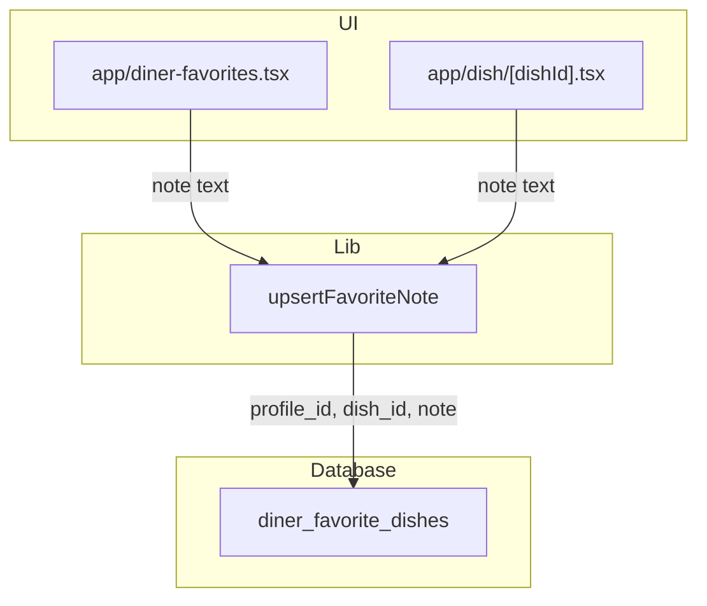
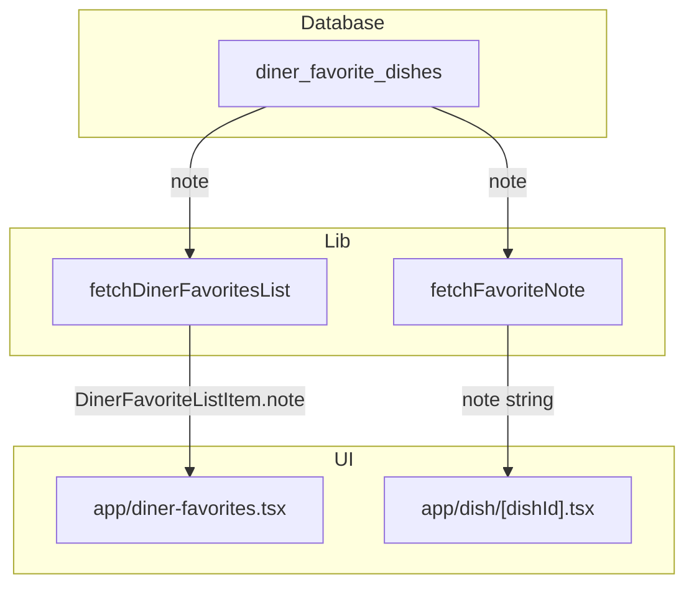
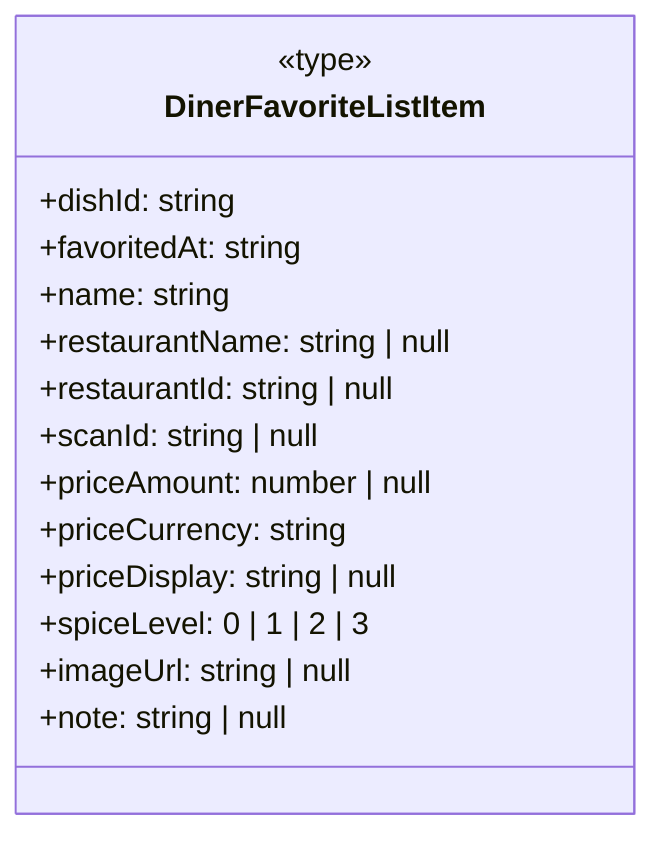
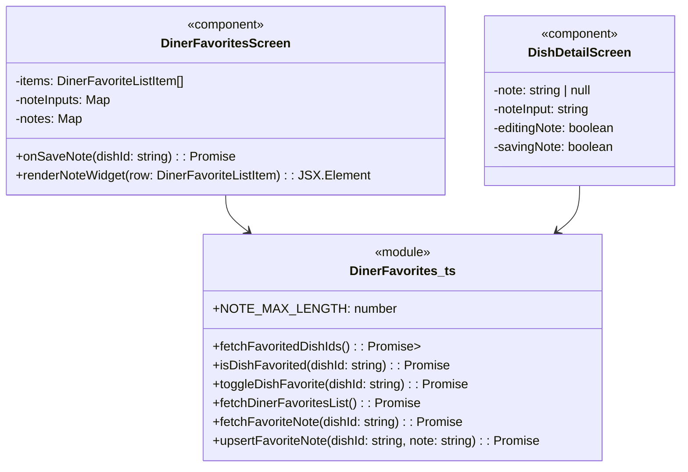

### 1. Primary and Secondary Owners

| Role | Name | Notes |
|------|------|-------|
| Primary owner | Yao Lu | Owns requirements and release sign-off |
| Secondary owner | Sofia Yu | Owns implementation review and test plan |

---

### 2. Date Merged into `main`

2026-04-16 (PR #87)

---

### 3. Architecture Diagram (Mermaid)

---

### 4. Information Flow Diagram (Mermaid)

#### 4a. Write path

#### 4b. Read path

---

### 5. Class Diagram (Mermaid)

#### 5a. Data types and schemas

#### 5b. Components and modules

---

### 6. Implementation Units

- File path: `app/diner-favorites.tsx`
  - Purpose: React Native screen component displaying a diner's favorited dishes, now including inline note editing and display.
  - **Public fields and methods**:
    - `DinerFavoritesScreen`: React functional component, default export.
  - **Private fields and methods**:
    - `items`: `DinerFavoriteListItem[]` - State for the list of favorited dishes.
    - `loading`: `boolean` - State for initial data loading.
    - `refreshing`: `boolean` - State for pull-to-refresh.
    - `searchQuery`: `string` - State for the search input.
    - `collapsedRestaurants`: `Set<string>` - State for collapsed restaurant sections.
    - `editingNoteForDishId`: `string | null` - State tracking which dish's note is currently being edited.
    - `noteInputs`: `Map<string, string>` - State storing current text input values for notes being edited.
    - `notes`: `Map<string, string | null>` - State storing the saved notes for each dish.
    - `savingNote`: `boolean` - State indicating if a note save operation is in progress.
    - `filteredItems`: `DinerFavoriteListItem[]` - Memoized filtered list of items based on `searchQuery`.
    - `groupedByRestaurant`: `[string, DinerFavoriteListItem[]][]` - Memoized list of dishes grouped by restaurant.
    - `toggleRestaurantSection`: `(groupKey: string) => void` - Callback to collapse/expand restaurant sections.
    - `load`: `() => Promise<void>` - Callback to fetch favorite dishes and their notes.
    - `onRefresh`: `() => void` - Callback for pull-to-refresh.
    - `openDish`: `(row: DinerFavoriteListItem) => void` - Callback to navigate to dish detail screen.
    - `onUnfavorite`: `(row: DinerFavoriteListItem) => Promise<void>` - Callback to remove a dish from favorites.
    - `onSaveNote`: `(dishId: string) => Promise<void>` - Callback to save or clear a note for a specific dish.
    - `renderNoteWidget`: `(row: DinerFavoriteListItem) => JSX.Element` - Helper function to render the note UI (display, add, or edit) for a dish.
    - `renderFlames`: `(level: 0 | 1 | 2 | 3) => JSX.Element | null` - Helper function to render spice level flames.
    - `renderDishRow`: `(row: DinerFavoriteListItem) => JSX.Element` - Helper function to render a single dish row, including the note widget.

- File path: `app/dish/[dishId].tsx`
  - Purpose: React Native screen component displaying details for a single dish, now including a dedicated "My Note" section for favorited dishes.
  - **Public fields and methods**:
    - `DishDetailScreen`: React functional component, default export.
  - **Private fields and methods**:
    - `detail`: `DishDetail | null` - State for the detailed dish information.
    - `prefs`: `DinerPreferenceSnapshot | null` - State for diner preferences.
    - `loading`: `boolean` - State for initial data loading.
    - `error`: `string | null` - State for error messages.
    - `favorite`: `boolean` - State indicating if the dish is favorited.
    - `imageLoading`: `boolean` - State for AI image generation loading.
    - `imageError`: `string | null` - State for AI image generation errors.
    - `note`: `string | null` - State storing the saved note for the current dish.
    - `noteInput`: `string` - State for the text input value of the note being edited.
    - `editingNote`: `boolean` - State indicating if the note is currently being edited.
    - `savingNote`: `boolean` - State indicating if a note save operation is in progress.
    - `reasons`: `string[]` - Memoized list of reasons why the dish matches user preferences.
    - `onGenerateImage`: `() => Promise<void>` - Callback to trigger AI image generation.

- File path: `lib/diner-favorites.ts`
  - Purpose: TypeScript module providing functions for managing diner's favorited dishes and their associated notes with Supabase.
  - **Public fields and methods**:
    - `DinerFavoriteListItem`: `type` - Interface defining the structure of a favorited dish item, now including `note: string | null`.
    - `NOTE_MAX_LENGTH`: `const number` - Maximum allowed length for a note (300 characters).
    - `fetchFavoritedDishIds`: `() => Promise<Set<string>>` - Fetches a set of all favorited dish IDs for the current user.
    - `isDishFavorited`: `(dishId: string) => Promise<boolean>` - Checks if a specific dish is favorited by the current user.
    - `toggleDishFavorite`: `(dishId: string) => Promise<boolean>` - Toggles the favorite status of a dish.
    - `fetchDinerFavoritesList`: `() => Promise<DinerFavoriteListItem[]>` - Fetches a list of all favorited dishes for the current user, including their notes.
    - `fetchFavoriteNote`: `(dishId: string) => Promise<string | null>` - Fetches the note for a single favorited dish.
    - `upsertFavoriteNote`: `(dishId: string, note: string) => Promise<void>` - Saves or clears a note for a favorited dish. Throws an error if the note exceeds `NOTE_MAX_LENGTH`.
  - **Private fields and methods**: None.

- File path: `supabase/migrations/20260416052648_us10_favorite_dish_notes.sql`
  - Purpose: SQL migration script to add a `note` column to the `diner_favorite_dishes` table and enforce its maximum length.
  - **Public fields and methods**: None.
  - **Private fields and methods**: None.
  - **SQL statements**:
    - `ALTER TABLE diner_favorite_dishes ADD COLUMN note text;` - Adds a new column named `note` of type `text`.
    - `ALTER TABLE diner_favorite_dishes ADD CONSTRAINT diner_favorite_dishes_note_length_check CHECK (note IS NULL OR char_length(note) <= 300);` - Adds a check constraint to ensure the `note` column is either `NULL` or its character length is 300 or less.

- File path: `supabase/migrations/20260416055019_us10_favorite_dish_notes_update_policy.sql`
  - Purpose: SQL migration script to add an `UPDATE` Row Level Security (RLS) policy for the `diner_favorite_dishes` table, allowing authenticated diners to update their own favorite dish entries.
  - **Public fields and methods**: None.
  - **Private fields and methods**: None.
  - **SQL statements**:
    - `create policy "diner_favorite_dishes_update_own" on public.diner_favorite_dishes for update to authenticated using (profile_id = (select auth.uid()) and public.is_diner((select auth.uid()))) with check (profile_id = (select auth.uid()));` - Creates an RLS policy that permits authenticated users who are diners to update rows in `diner_favorite_dishes` where the `profile_id` matches their own `auth.uid()`.

---

### 7. Technologies, Libraries, and APIs

| Technology | Version | Used for | Why chosen over alternatives | Source / Docs URL |
|------------|---------|----------|------------------------------|-------------------|
| React Native | Unknown | Mobile app UI development | Cross-platform mobile development | https://reactnative.dev/ |
| Expo | Unknown | React Native development environment and tooling | Simplified development, build, and deployment for React Native | https://expo.dev/ |
| TypeScript | Unknown | Type-safe JavaScript development | Improved code quality, maintainability, and developer experience | https://www.typescriptlang.org/ |
| Node.js | Unknown | JavaScript runtime for development and build processes | Standard runtime for JavaScript ecosystem | https://nodejs.org/ |
| Supabase JS client | Unknown | Interacting with Supabase backend services (Auth, PostgreSQL) | Official client library for Supabase, simplifies API calls | https://supabase.com/docs/reference/javascript |
| PostgreSQL | Unknown | Relational database for persistent data storage | Robust, open-source, and scalable database, integrated with Supabase | https://www.postgresql.org/ |
| Supabase Auth | Unknown | User authentication and authorization | Integrated authentication service with Supabase, handles user sessions | https://supabase.com/docs/guides/auth |
| Supabase RLS | Unknown | Row Level Security for database access control | Fine-grained access control to database rows based on user identity | https://supabase.com/docs/guides/auth/row-level-security |
| `MaterialCommunityIcons` | Unknown | Icon display in React Native | Extensive icon set, commonly used in React Native projects | https://icons.expo.fyi/ |
| `expo-router` | Unknown | File-system based routing for Expo/React Native | Simplifies navigation and routing within the Expo app | https://expo.github.io/router/ |

---

### 8. Database — Long-Term Storage

- Table name and purpose: `diner_favorite_dishes` - Stores a diner's favorited dishes.
  - `profile_id`: `uuid` - Foreign key to the `profiles` table, identifying the diner who favorited the dish.
    - Purpose: Links the favorite entry to a specific user.
    - Estimated storage in bytes per row: 16 bytes (UUID)
  - `dish_id`: `uuid` - Foreign key to the `diner_scanned_dishes` table, identifying the favorited dish.
    - Purpose: Links the favorite entry to a specific dish.
    - Estimated storage in bytes per row: 16 bytes (UUID)
  - `created_at`: `timestamp with time zone` - Timestamp when the dish was favorited.
    - Purpose: Records when the favorite was added, used for ordering.
    - Estimated storage in bytes per row: 8 bytes
  - `note`: `text` - **New column**. A private text note added by the diner for the favorited dish. Can be `NULL`.
    - Purpose: Allows diners to store personal notes about their favorited dishes.
    - Estimated storage in bytes per row: 0 bytes (if NULL) to ~300 bytes (for max 300 characters, plus overhead). Average ~100 bytes.
- Estimated total storage per user:
  - Assuming an average of 50 favorited dishes per user, with an average note length of 100 characters:
  - (16 bytes for `profile_id` + 16 bytes for `dish_id` + 8 bytes for `created_at` + 100 bytes for `note`) * 50 dishes = 140 bytes * 50 = 7000 bytes (7 KB).

---

### 9. Failure Scenarios

1.  **Frontend process crash**
    *   User-visible effect: The app freezes or closes unexpectedly. Any unsaved note text in the input fields will be lost.
    *   Internally-visible effect: React Native app process terminates. No backend or database impact.

2.  **Loss of all runtime state**
    *   User-visible effect: If the app is backgrounded and then brought back, or if the component unmounts and remounts, any unsaved note text in the input fields will be lost. The app will reload data from the backend, displaying saved notes correctly.
    *   Internally-visible effect: React component states (`editingNoteForDishId`, `noteInputs`, `notes`, `savingNote`) are reset. Data will be re-fetched via `fetchDinerFavoritesList` or `fetchFavoriteNote`.

3.  **All stored data erased**
    *   User-visible effect: All favorited dishes and their associated notes will disappear from the "Favorites" list and "Dish Detail" pages. Users will see empty lists or no notes.
    *   Internally-visible effect: The `diner_favorite_dishes` table in Supabase PostgreSQL is empty. `fetchDinerFavoritesList` and `fetchFavoriteNote` will return empty results or `null`.

4.  **Corrupt data detected in the database**
    *   User-visible effect: If a `note` column contains invalid characters or exceeds the `NOTE_MAX_LENGTH` (which should be prevented by the `CHECK` constraint), it might cause display issues or errors when fetching. If the `note` column itself is corrupted (e.g., non-text data), `fetchDinerFavoritesList` or `fetchFavoriteNote` might throw an error, preventing the display of notes or even the entire favorites list.
    *   Internally-visible effect: Database queries might fail or return unexpected data. The `supabase-js` client would likely throw an error upon data deserialization or the `fetch` functions would catch and re-throw the error. The `NOTE_MAX_LENGTH` check constraint on the `diner_favorite_dishes` table would prevent notes longer than 300 characters from being inserted or updated.

5.  **Remote procedure call (API call) failed**
    *   User-visible effect:
        *   When saving a note: An `Alert` dialog will appear with "Could not save note" and an error message. The note input will remain in its current state.
        *   When loading favorites/notes: An `Alert` dialog might appear with "Could not load favorites" or notes might simply not appear.
    *   Internally-visible effect: The `supabase.from(...).update()` or `supabase.from(...).select()` calls will return an `error` object. This error is caught and an `Alert` is shown to the user. `savingNote` state will revert to `false`.

6.  **Client overloaded**
    *   User-visible effect: The app becomes unresponsive, slow, or crashes. Inputting notes might be laggy, and saving might take a long time or fail.
    *   Internally-visible effect: High CPU/memory usage on the client device. JavaScript event loop is blocked. No specific error handling for this scenario beyond general app unresponsiveness.

7.  **Client out of RAM**
    *   User-visible effect: The app crashes or is terminated by the operating system. Any unsaved note text will be lost.
    *   Internally-visible effect: Operating system terminates the app process. No specific error handling.

8.  **Database out of storage space**
    *   User-visible effect: Users will be unable to save new notes or update existing ones. An `Alert` dialog will appear with "Could not save note" and a database-related error message.
    *   Internally-visible effect: Supabase PostgreSQL will return an error indicating storage exhaustion. The `upsertFavoriteNote` function will catch this error and propagate it.

9.  **Network connectivity lost**
    *   User-visible effect:
        *   When saving a note: The save operation will hang and eventually fail, resulting in an `Alert` dialog "Could not save note" with a network error message.
        *   When loading favorites/notes: The app will show loading indicators indefinitely or fail to load data, potentially showing an `Alert` dialog "Could not load favorites".
    *   Internally-visible effect: Supabase API calls will fail with network-related errors (e.g., `fetch` errors). These errors are caught and handled by showing an `Alert`.

10. **Database access lost**
    *   User-visible effect: Similar to "Remote procedure call failed" or "Network connectivity lost". Users will be unable to save or load notes, receiving error alerts.
    *   Internally-visible effect: Supabase client will report database connection errors. The `upsertFavoriteNote`, `fetchDinerFavoritesList`, and `fetchFavoriteNote` functions will catch these errors.

11. **Bot signs up and spams users**
    *   User-visible effect: Not directly applicable to this feature, as notes are private to the user who created them. A bot could create many notes for its own favorited dishes, but these would not be visible to other users.
    *   Internally-visible effect: Increased storage usage in the `diner_favorite_dishes` table. The `NOTE_MAX_LENGTH` constraint limits the size of each individual note, mitigating extreme storage abuse per note. Supabase RLS ensures privacy.

---

### 10. PII, Security, and Compliance

- **`note` field in `diner_favorite_dishes` table**
  - What it is and why it must be stored: User-generated text (max 300 characters) associated with a favorited dish. It must be stored to allow diners to keep personal records of their preferences and experiences.
  - How it is stored: Plaintext in the `note` column of the `diner_favorite_dishes` table in Supabase PostgreSQL.
  - How it entered the system: User input in `app/diner-favorites.tsx` or `app/dish/[dishId].tsx` (TextInput component) → `upsertFavoriteNote` function in `lib/diner-favorites.ts` → `diner_favorite_dishes` table.
  - How it exits the system: `diner_favorite_dishes` table → `fetchDinerFavoritesList` or `fetchFavoriteNote` functions in `lib/diner-favorites.ts` → displayed in `app/diner-favorites.tsx` or `app/dish/[dishId].tsx` UI.
  - Who on the team is responsible for securing it: Unknown — leave blank for human to fill in.
  - Procedures for auditing routine and non-routine access: Unknown — leave blank for human to fill in.

**Minor users:**
- Does this feature solicit or store PII of users under 18?
  - Yes, as the `note` field is free-form text, a user under 18 could input PII.
- If yes: does the app solicit guardian permission?
  - Unknown — leave blank for human to fill in.
- What is the team policy for ensuring minors' PII is not accessible by anyone convicted or suspected of child abuse?
  - Unknown — leave blank for human to fill in.