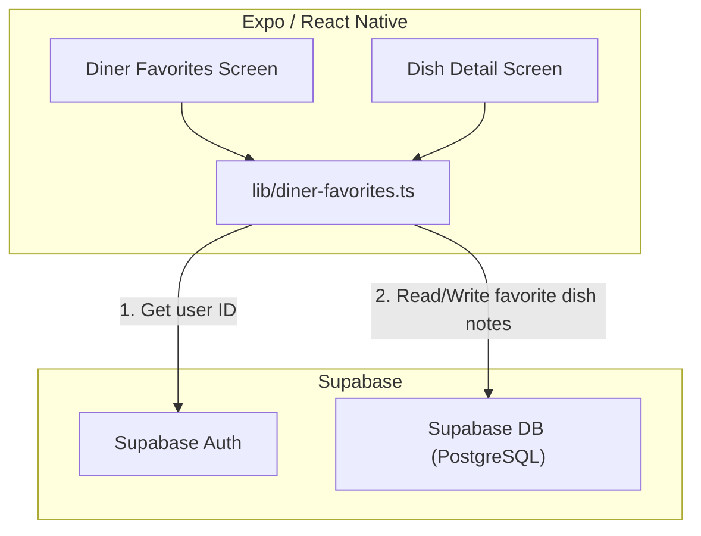
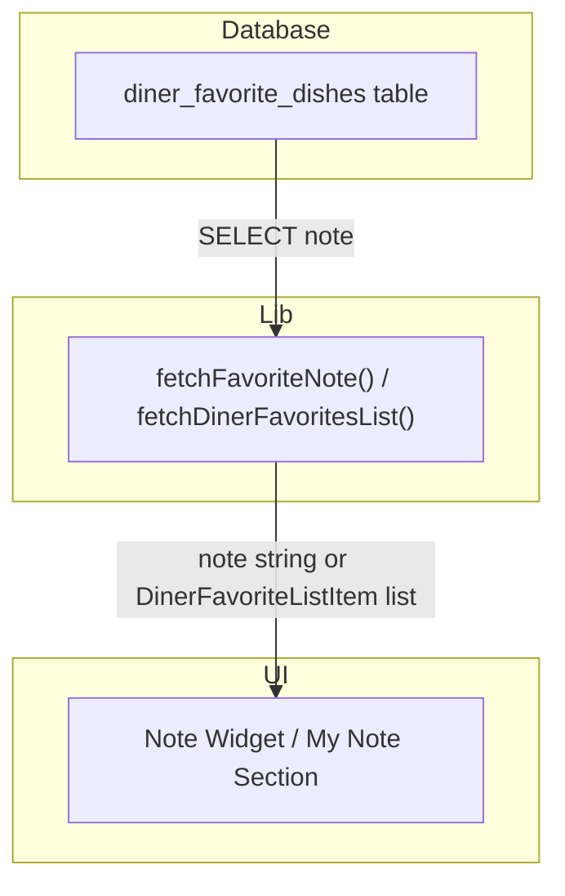
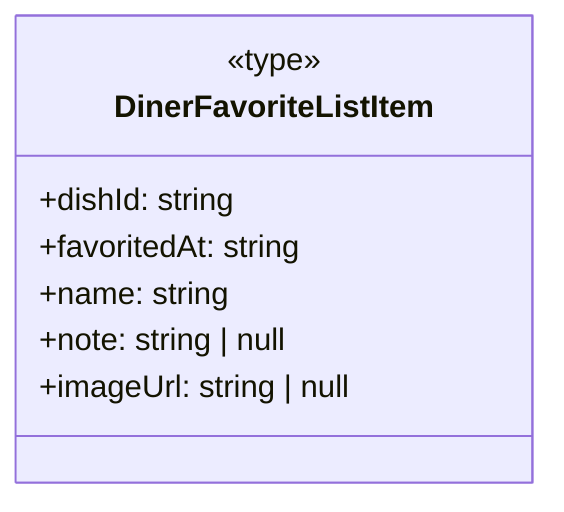
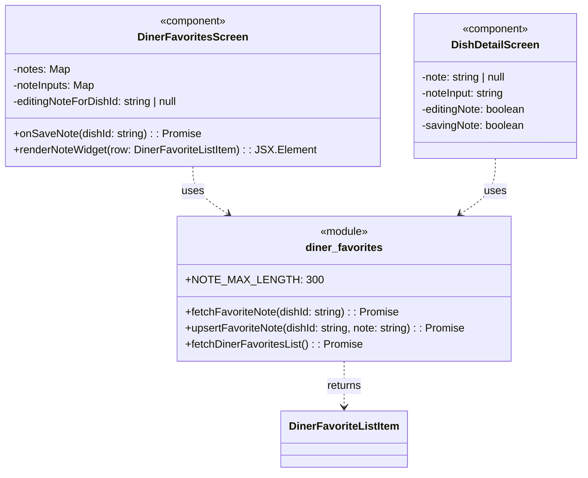

### 1. Primary and Secondary Owners

| Role | Name | Notes |
|------|------|-------|
| Primary owner | Yao Lu | Owns requirements and release sign-off |
| Secondary owner | Sofia Yu | Owns implementation review and test plan |

---

### 2. Date Merged into `main`

2026-04-16 (PR #87)

---

### 3. Architecture Diagram (Mermaid)



---

### 4. Information Flow Diagram (Mermaid)

#### 4a. Write path

This diagram shows how a user's note is saved to the database.

```mermaid
flowchart TB
  subgraph UI
    note_input["Note TextInput"]
    save_button["Save Button"]
  end

  subgraph Lib
    upsert_note_func["upsertFavoriteNote()"]
  end

  subgraph Database
    fav_dishes_table["diner_favorite_dishes table"]
  end

  note_input -->|note text| save_button
  save_button -->|onPress(dishId, note)| upsert_note_func
  upsert_note_func -->|"UPDATE ... SET note = ..."| fav_dishes_table
```

#### 4b. Read path

This diagram shows how a saved note is fetched from the database and displayed in the UI.



---

### 5. Class Diagram (Mermaid)

#### 5a. Data types and schemas



#### 5b. Components and modules



---

### 6. Implementation Units

#### `app/diner-favorites.tsx`

-   **Purpose**: This screen displays a list of the user's favorited dishes, grouped by restaurant. It now includes functionality to add, view, edit, and delete a private note for each favorited dish directly within the list.
-   **Public fields and methods**:
    -   `DinerFavoritesScreen()`: `React.FC` - The main component for the screen.
-   **Private fields and methods**:
    -   **State**:
        -   `editingNoteForDishId: string | null`: Tracks which dish's note is currently being edited.
        -   `noteInputs: Map<string, string>`: Stores the text of notes currently being edited, keyed by `dishId`.
        -   `notes: Map<string, string | null>`: Stores the saved notes for all favorited dishes, keyed by `dishId`.
        -   `savingNote: boolean`: A flag to indicate when a note save operation is in progress.
    -   **Event Handlers**:
        -   `onSaveNote(dishId: string): Promise<void>`: Handles the logic for saving a note via `upsertFavoriteNote`, updating local state, and handling errors.
    -   **Render Helpers**:
        -   `renderNoteWidget(row: DinerFavoriteListItem): JSX.Element`: Renders the appropriate UI for a dish's note: an "Add" button, the saved note text, or the editing interface.

#### `app/dish/[dishId].tsx`

-   **Purpose**: This screen shows the detailed view of a single dish. If the dish is favorited by the user, it now displays a "My Note" section allowing the user to add, view, edit, or delete their private note for that dish.
-   **Public fields and methods**:
    -   `DishDetailScreen()`: `React.FC` - The main component for the screen.
-   **Private fields and methods**:
    -   **State**:
        -   `note: string | null`: Stores the saved note for the current dish.
        -   `noteInput: string`: Stores the text of the note while it is being edited.
        -   `editingNote: boolean`: A flag to toggle the note editing UI.
        -   `savingNote: boolean`: A flag to indicate when a note save operation is in progress.
    -   **Effects**:
        -   `useEffect()`: Fetches dish details, favorite status, and the associated note when the component mounts or `dishId` changes.

#### `lib/diner-favorites.ts`

-   **Purpose**: This module centralizes all client-side logic for interacting with the `diner_favorite_dishes` table in Supabase. It has been updated to handle the new `note` field.
-   **Public fields and methods**:
    -   **Constants**:
        -   `NOTE_MAX_LENGTH: 300`: A constant defining the maximum character length for a note.
    -   **Types**:
        -   `DinerFavoriteListItem`: The type definition for a favorited dish, now including a `note: string | null` field.
    -   **Functions**:
        -   `fetchDinerFavoritesList(): Promise<DinerFavoriteListItem[]>`: Fetches all favorited dishes for the current user, now including the `note` for each.
        -   `fetchFavoriteNote(dishId: string): Promise<string | null>`: Fetches the note for a single favorited dish. Returns `null` if the dish is not favorited or has no note.
        -   `upsertFavoriteNote(dishId: string, note: string): Promise<void>`: Creates or updates the note for a specific favorited dish. An empty string will clear the note (set it to `null`).

#### `supabase/migrations/20260416052648_us10_favorite_dish_notes.sql`

-   **Purpose**: A database migration script that modifies the `diner_favorite_dishes` table.
-   **Changes**:
    -   Adds a new `note` column of type `text`.
    -   Adds a `CHECK` constraint (`diner_favorite_dishes_note_length_check`) to ensure the `note` column's length does not exceed 300 characters.

#### `supabase/migrations/20260416055019_us10_favorite_dish_notes_update_policy.sql`

-   **Purpose**: A database migration script that adds a Row-Level Security (RLS) policy to the `diner_favorite_dishes` table.
-   **Changes**:
    -   Creates a new policy named `diner_favorite_dishes_update_own`.
    -   This policy allows an authenticated user with the 'diner' role to `UPDATE` rows in `diner_favorite_dishes` that they own (i.e., where `profile_id` matches their `auth.uid()`). This is necessary for saving notes.

---

### 7. Technologies, Libraries, and APIs

| Technology | Version | Used for | Why chosen over alternatives | Source / Docs URL |
|------------|---------|----------|------------------------------|-------------------|
| React Native | Unknown | Mobile application framework | Core framework for building the cross-platform mobile app. | https://reactnative.dev/ |
| Expo SDK | Unknown | Toolchain for React Native development | Simplifies development, building, and deployment of the app. | https://docs.expo.dev/ |
| TypeScript | Unknown | Statically typed language for JavaScript | Provides type safety, improving code quality and maintainability. | https://www.typescriptlang.org/ |
| React | Unknown | UI library | Core library for building user interfaces with components. | https://react.dev/ |
| Supabase JS Client | Unknown | Interacting with Supabase services | Official client library for querying the database and handling auth. | https://supabase.com/docs/reference/javascript/ |
| Supabase (PostgreSQL) | Unknown | Database | The primary relational database for storing application data. | https://supabase.com/docs/guides/database |
| Supabase (Auth) | Unknown | User authentication | Manages user sign-up, sign-in, and session management. | https://supabase.com/docs/guides/auth |
| Expo Router | Unknown | File-based routing for React Native | Handles navigation and deep linking within the app. | https://docs.expo.dev/router/introduction/ |
| `@expo/vector-icons` | Unknown | Displaying icons | Provides a comprehensive set of icons (MaterialCommunityIcons). | https://docs.expo.dev/guides/icons/ |
| SQL | Unknown | Database schema migration and policy definition | Defines changes to the database structure and access rules. | https://www.postgresql.org/docs/ |

---

### 8. Database — Long-Term Storage

-   **Table name**: `diner_favorite_dishes`
-   **Purpose**: This table links a diner (`profile_id`) to a dish (`dish_id`) they have favorited. It now also stores a private, user-written note about that dish.

| Column | Type | Purpose | Estimated storage in bytes per row |
|---|---|---|---|
| `profile_id` | `uuid` | Foreign key to `profiles.id`, identifying the user. | 16 |
| `dish_id` | `uuid` | Foreign key to `diner_scanned_dishes.id`, identifying the dish. | 16 |
| `created_at` | `timestamptz` | Timestamp of when the dish was favorited. | 8 |
| `note` | `text` | A nullable, user-provided private note about the dish. | Variable, up to ~305 bytes (300 chars + overhead) |

-   **Estimated total storage per user**: `N * ~345 bytes`, where `N` is the number of dishes the user has favorited.

---

### 9. Failure Scenarios

1.  **Frontend process crash**:
    -   *User-visible effect*: The app closes unexpectedly. Any note text being typed but not yet saved is lost.
    -   *Internally-visible effect*: The Expo process terminates. No data is corrupted.
2.  **Loss of all runtime state**:
    -   *User-visible effect*: Same as a crash. The app effectively restarts. Unsaved note text is lost. The user will see the last saved version of their notes upon reloading the screen.
    -   *Internally-visible effect*: All React component state (e.g., `noteInputs`, `editingNote`) is reset to its initial value.
3.  **All stored data erased**:
    -   *User-visible effect*: The user's "Favorites" screen will be empty. All their previously saved dishes and notes will be gone.
    -   *Internally-visible effect*: The `diner_favorite_dishes` table is empty. API calls to fetch favorites will return an empty array.
4.  **Corrupt data detected in the database**:
    -   *User-visible effect*: If a note in the DB exceeds the 300-character limit (e.g., if the `CHECK` constraint were removed), the UI would still display it, but the input field would show an error state and prevent re-saving until the text is shortened.
    -   *Internally-visible effect*: The `fetch` functions would return the corrupt data. The `upsert` function's client-side validation would prevent writing new corrupt data.
5.  **Remote procedure call (API call) failed**:
    -   *User-visible effect*: An alert dialog appears with an error message like "Could not save note" or "Could not load favorites". The UI state remains unchanged (e.g., the note editor stays open, the list doesn't load).
    -   *Internally-visible effect*: A `catch` block in an async function (e.g., `onSaveNote`) is triggered, which calls `Alert.alert()`. The promise returned by the Supabase client rejects.
6.  **Client overloaded**:
    -   *User-visible effect*: The app becomes slow and unresponsive. Typing in the note `TextInput` may lag. Animations may stutter.
    -   *Internally-visible effect*: The JavaScript thread is blocked, leading to delayed event handling and re-renders.
7.  **Client out of RAM**:
    -   *User-visible effect*: The operating system may terminate the app to free up memory, resulting in a crash.
    -   *Internally-visible effect*: The app process is killed by the OS.
8.  **Database out of storage space**:
    -   *User-visible effect*: Saving a new note or favoriting a new dish fails, and an error alert is shown.
    -   *Internally-visible effect*: The `UPDATE` or `INSERT` query to `diner_favorite_dishes` fails at the database level. Supabase client returns an error.
9.  **Network connectivity lost**:
    -   *User-visible effect*: Any action requiring a database call (loading favorites, saving a note) fails, and an error alert is shown.
    -   *Internally-visible effect*: The `fetch` call to the Supabase API times out or fails immediately, causing the promise to reject.
10. **Database access lost**:
    -   *User-visible effect*: All data operations fail, likely with a "permission denied" or "authorization" error shown in an alert. This was the state before the `UPDATE` RLS policy was added, which caused silent failures.
    -   *Internally-visible effect*: Supabase API returns a 401 or 403 error. The RLS policy check fails.
11. **Bot signs up and spams users**:
    -   *User-visible effect*: None for other users. The bot's actions (favoriting dishes, adding notes) are confined to its own account due to RLS policies scoping all queries by `profile_id`.
    -   *Internally-visible effect*: The `diner_favorite_dishes` table may grow with entries from the bot's `profile_id`, consuming database storage.

---

### 10. PII, Security, and Compliance

-   **What it is and why it must be stored**:
    -   The `note` field on the `diner_favorite_dishes` table stores user-generated text. While not explicitly solicited, this free-form text field could potentially contain Personally Identifying Information (PII) if a user chooses to enter it (e.g., "Dinner with Jane Doe", "My allergy to peanuts"). It is stored to fulfill the user story of allowing diners to save private notes on dishes.
-   **How it is stored**:
    -   Plaintext in the `note` column (`text` type) of the `diner_favorite_dishes` table in the Supabase PostgreSQL database.
-   **How it entered the system**:
    -   User types into a `<TextInput>` component in `app/diner-favorites.tsx` or `app/dish/[dishId].tsx`.
    -   The text is passed to the `upsertFavoriteNote` function in `lib/diner-favorites.ts`.
    -   The Supabase client sends an `UPDATE` request to the `diner_favorite_dishes` table, setting the `note` column value.
-   **How it exits the system**:
    -   The `fetchDinerFavoritesList` or `fetchFavoriteNote` function in `lib/diner-favorites.ts` reads from the `diner_favorite_dishes` table.
    -   The note text is returned to the client and stored in React state (`notes` or `note`).
    -   The note is rendered into a `<Text>` component in `app/diner-favorites.tsx` or `app/dish/[dishId].tsx`.
-   **Who on the team is responsible for securing it**:
    -   Unknown — leave blank for human to fill in.
-   **Procedures for auditing routine and non-routine access**:
    -   Unknown — leave blank for human to fill in.

**Minor users:**
-   **Does this feature solicit or store PII of users under 18?**
    -   Unknown. The application does not appear to perform age verification, so it's possible for users under 18 to use the feature and store information in the `note` field.
-   **If yes: does the app solicit guardian permission?**
    -   No evidence of guardian permission mechanisms in the provided code.
-   **What is the team policy for ensuring minors' PII is not accessible by anyone convicted or suspected of child abuse?**
    -   Unknown — leave blank for human to fill in. The data is private to the user account via RLS, but there is no information on policies regarding internal access to the database.