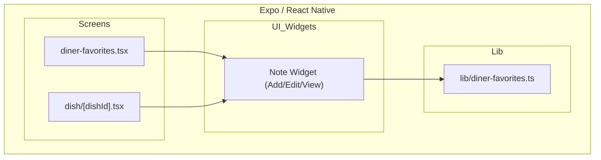
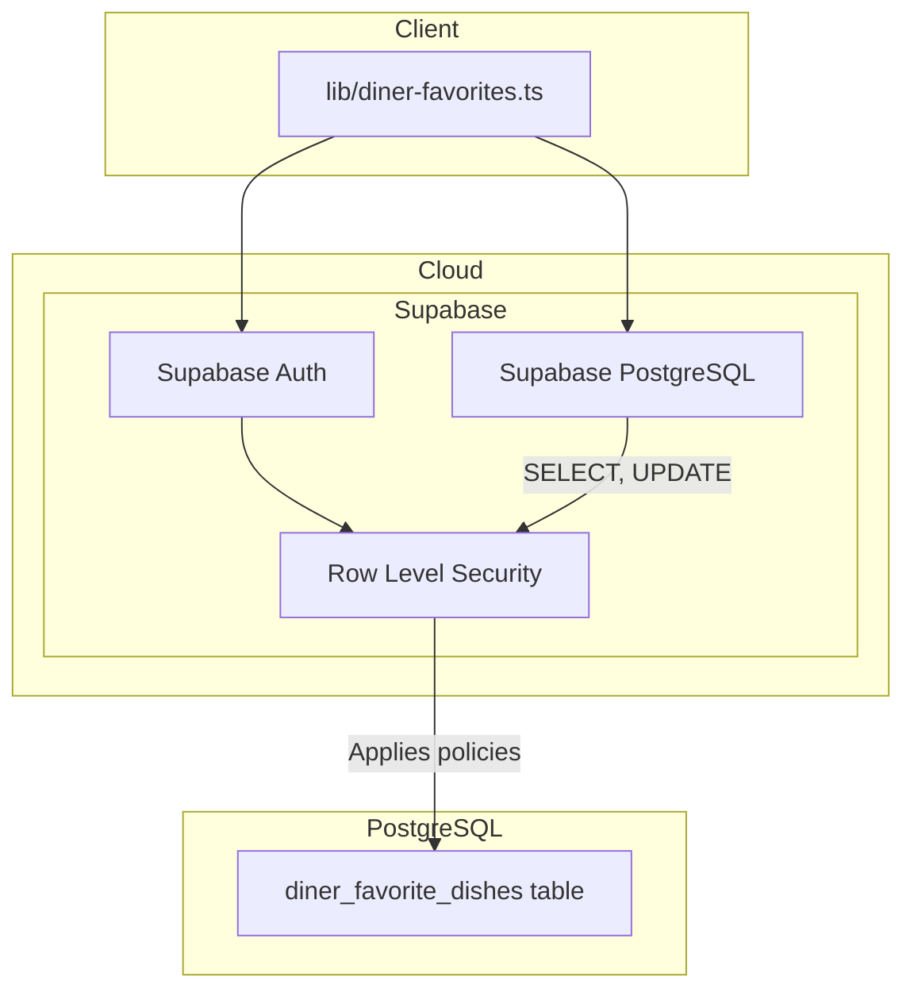
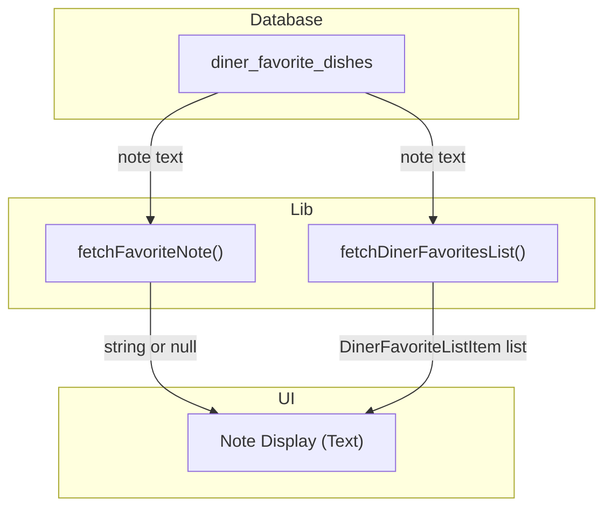
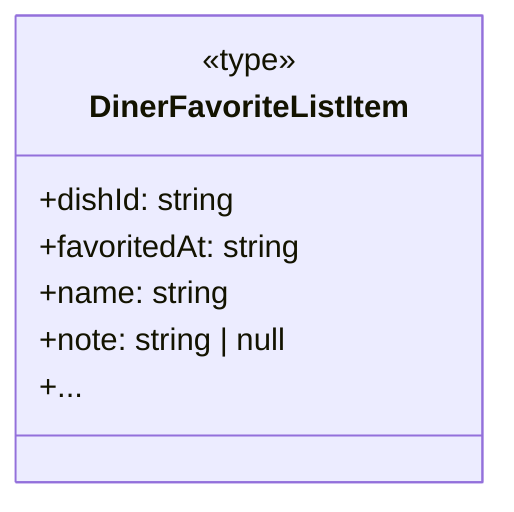
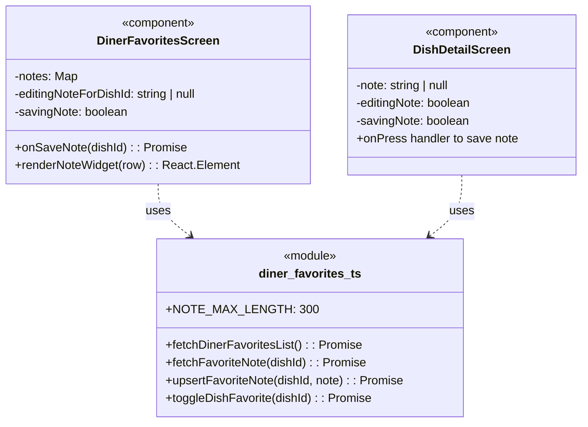

An excellent user story. Here is the development specification.

### 1. Primary and Secondary Owners

| Role | Name | Notes |
|------|------|-------|
| Primary owner | Yao Lu | Owns requirements and release sign-off |
| Secondary owner | Sofia Yu | Owns implementation review and test plan |

---

### 2. Date Merged into `main`

2026-04-16 (PR #87)

---

### 3. Architecture Diagram (Mermaid)

#### 3a. Client-side architecture



#### 3b. Backend and cloud architecture



---

### 4. Information Flow Diagram (Mermaid)

#### 4a. Write path

```mermaid
flowchart TB
  subgraph UI
    note_input["TextInput (Note)"]
    save_button["Save Button"]
  end

  subgraph Lib
    upsert_note_fn["upsertFavoriteNote()"]
  end

  subgraph Database
    fav_dishes_table["diner_favorite_dishes"]
  end

  note_input -->|note text| save_button
  save_button -->|dishId, note text| upsert_note_fn
  upsert_note_fn -->|UPDATE {note: text}| fav_dishes_table
```

#### 4b. Read path



---

### 5. Class Diagram (Mermaid)

#### 5a. Data types and schemas



#### 5b. Components and modules



---

### 6. Implementation Units

#### `app/diner-favorites.tsx`

-   **Purpose**: Displays the list of all dishes favorited by the diner, grouped by restaurant. Allows users to add, view, and edit a private note for each favorited dish.
-   **Public fields and methods**:
    -   `DinerFavoritesScreen()`: `React.FC` - The main screen component.
-   **Private fields and methods**:
    -   State:
        -   `notes: Map<string, string | null>`: Holds the saved notes for all favorited dishes, keyed by `dishId`.
        -   `editingNoteForDishId: string | null`: Tracks which dish's note is currently being edited.
        -   `noteInputs: Map<string, string>`: Holds the current text input value for notes being edited.
        -   `savingNote: boolean`: A flag to indicate when a note save operation is in progress.
    -   Handlers:
        -   `load()`: `() => Promise<void>` - Fetches the list of favorite dishes and their notes, populating the `items` and `notes` state.
        -   `onSaveNote(dishId: string)`: `(dishId: string) => Promise<void>` - Calls `upsertFavoriteNote` to save the note for a given dish, then updates local state.
    -   Renderers:
        -   `renderNoteWidget(row: DinerFavoriteListItem)`: `(row) => React.Element` - Renders the UI for adding, displaying, or editing a note based on the current state.

#### `app/dish/[dishId].tsx`

-   **Purpose**: Displays detailed information for a single dish. If the dish is favorited, it allows the user to add, view, and edit a private note.
-   **Public fields and methods**:
    -   `DishDetailScreen()`: `React.FC` - The main screen component.
-   **Private fields and methods**:
    -   State:
        -   `favorite: boolean`: Tracks if the current dish is favorited by the user.
        -   `note: string | null`: Holds the saved note for the current dish.
        -   `noteInput: string`: Holds the text input value while editing the note.
        -   `editingNote: boolean`: A flag to switch between note display and edit mode.
        -   `savingNote: boolean`: A flag to indicate when a note save operation is in progress.
    -   Effects:
        -   `useEffect()`: On mount and `dishId` change, fetches dish details, favorite status, and the associated note if favorited.
    -   Handlers:
        -   Inline `onPress` handler for the "Save" button: Calls `upsertFavoriteNote` with the `noteInput` value, then updates local state on success.

#### `lib/diner-favorites.ts`

-   **Purpose**: A data access module for all operations related to a diner's favorited dishes and their associated notes.
-   **Public fields and methods**:
    -   Types:
        -   `DinerFavoriteListItem`: `type` - The shape of a single item in the favorites list, now including a `note` field.
    -   Constants:
        -   `NOTE_MAX_LENGTH`: `number` - The maximum allowed character length for a note (300).
    -   Functions:
        -   `fetchDinerFavoritesList()`: `() => Promise<DinerFavoriteListItem[]>` - Fetches all favorited dishes for the current user, including their notes.
        -   `fetchFavoriteNote(dishId: string)`: `(dishId) => Promise<string | null>` - Fetches the note for a single favorited dish.
        -   `upsertFavoriteNote(dishId: string, note: string)`: `(dishId, note) => Promise<void>` - Creates or updates the note for a specific favorited dish. It performs validation for length and trims the input. An empty string clears the note.

#### `supabase/migrations/20260416052648_us10_favorite_dish_notes.sql`

-   **Purpose**: A database migration script to add the `note` column to the `diner_favorite_dishes` table.
-   **Public fields and methods**:
    -   `ALTER TABLE diner_favorite_dishes ADD COLUMN note text;`: Adds a nullable text column to store notes.
    -   `ALTER TABLE diner_favorite_dishes ADD CONSTRAINT ...`: Adds a `CHECK` constraint to ensure the note length is 300 characters or less.

#### `supabase/migrations/20260416055019_us10_favorite_dish_notes_update_policy.sql`

-   **Purpose**: A database migration script to add a Row Level Security (RLS) policy allowing authenticated diners to update their own entries in `diner_favorite_dishes`. This is necessary for saving notes.
-   **Public fields and methods**:
    -   `create policy "diner_favorite_dishes_update_own" ...`: Defines an RLS policy that grants `UPDATE` permission on `diner_favorite_dishes` rows where the `profile_id` matches the authenticated user's ID.

---

### 7. Technologies, Libraries, and APIs

| Technology | Version | Used for | Why chosen over alternatives | Source / Docs URL |
|------------|---------|----------|------------------------------|-------------------|
| TypeScript | `~5.3.3` | Language for type safety in frontend code. | Provides static typing to prevent common errors in a large codebase. | https://www.typescriptlang.org/ |
| Node.js | `~18.18.2` | JavaScript runtime for Expo development environment. | Standard for React Native / Expo development. | https://nodejs.org/ |
| React | `18.2.0` | UI library for building components. | Core of React Native. | https://react.dev/ |
| React Native | `0.73.6` | Framework for building native mobile apps with React. | Project's core framework for cross-platform mobile development. | https://reactnative.dev/ |
| Expo SDK | `~50.0.17` | Toolchain and services built around React Native. | Simplifies development, building, and deployment of the mobile app. | https://docs.expo.dev/ |
| Supabase JS Client | `~2.43.4` | Client library for interacting with Supabase services. | Official library for connecting the frontend to Supabase Auth and Database. | https://supabase.com/docs/reference/javascript/ |
| Supabase (PostgreSQL) | `15.1` | Database for storing application data. | Provides a managed PostgreSQL database with integrated RLS. | https://supabase.com/docs/guides/database |
| Supabase (Auth) | `2.0` | User authentication and management. | Handles user sign-up, sign-in, and session management, providing user IDs for data scoping. | https://supabase.com/docs/guides/auth |
| SQL | N/A | Language for database migrations. | Standard for defining and altering relational database schemas. | https://www.postgresql.org/docs/current/sql.html |

---

### 8. Database — Long-Term Storage

-   **Table**: `diner_favorite_dishes`
-   **Purpose**: Stores the many-to-many relationship between diners (`profiles`) and dishes (`diner_scanned_dishes`), indicating which dishes a diner has favorited. It now also stores a personal note for each favorite.

| Column | Type | Purpose | Estimated storage in bytes per row |
|---|---|---|---|
| `profile_id` | `uuid` | Foreign key to `profiles.id`, identifying the user. | 16 |
| `dish_id` | `uuid` | Foreign key to `diner_scanned_dishes.id`, identifying the dish. | 16 |
| `created_at` | `timestamptz` | Timestamp when the favorite was created. | 8 |
| `note` | `text` | A private, user-provided note about the dish. Nullable. Max 300 chars. | ~305 (300 chars + overhead) |

-   **Estimated total storage per user**: Assuming a user favorites 200 dishes and adds a note to half of them (100 notes), with each note averaging 150 characters:
    -   Base row size (no note): `(16 + 16 + 8) * 200 = 8000 bytes`
    -   Note storage: `100 notes * (150 chars + 5 bytes overhead) = 15500 bytes`
    -   **Total per user**: `~23.5 KB`

---

### 9. Failure Scenarios

1.  **Frontend process crash**:
    -   **User-visible**: The app closes unexpectedly. Any unsaved note text is lost.
    -   **Internally-visible**: The React Native process terminates. No state is persisted.
2.  **Loss of all runtime state**:
    -   **User-visible**: Same as a crash. If the user re-opens the app, they will see the last saved state of their notes, not any in-progress edits.
    -   **Internally-visible**: All React `useState` variables are reset to their initial values. The app will re-fetch data from Supabase on the next load.
3.  **All stored data erased**:
    -   **User-visible**: All favorited dishes and all personal notes disappear from the app. The "Favorites" screen becomes empty.
    -   **Internally-visible**: The `diner_favorite_dishes` table is truncated or dropped. All subsequent `SELECT` queries return no rows.
4.  **Corrupt data detected in the database**:
    -   **User-visible**: A note might appear as garbled text or cause a specific dish row to fail to render. The app might show a generic "Could not load favorites" error if parsing fails.
    -   **Internally-visible**: A `SELECT` query returns data that doesn't match the expected `DinerFavoriteListItem` type, potentially causing a runtime error during data mapping.
5.  **Remote procedure call (API call) failed**:
    -   **User-visible**: An `Alert` dialog appears with a message like "Could not save note" or "Could not load favorites". The UI remains in its pre-call state (e.g., the note editor stays open, the loading indicator stops).
    -   **Internally-visible**: A call to a `supabase-js` function (e.g., `.update()`, `.select()`) throws an error, which is caught in a `try/catch` block, triggering `Alert.alert()`.
6.  **Client overloaded**:
    -   **User-visible**: The app becomes sluggish and unresponsive. Typing in the note `TextInput` lags. Tapping "Save" may have a delayed reaction.
    -   **Internally-visible**: The JS thread is blocked, leading to dropped frames and delayed event handling.
7.  **Client out of RAM**:
    -   **User-visible**: The app may crash, especially on older devices. The OS may terminate the app process in the background.
    -   **Internally-visible**: The operating system sends a signal to terminate the app process to reclaim memory.
8.  **Database out of storage space**:
    -   **User-visible**: Saving a new note fails, showing a "Could not save note" error. Favoriting a new dish would also fail.
    -   **Internally-visible**: The `UPDATE` or `INSERT` operation on `diner_favorite_dishes` fails with a database-level error, which propagates to the client as a generic API error.
9.  **Network connectivity lost**:
    -   **User-visible**: Tapping "Save" on a note results in a "Could not save note" error after a timeout. The loading indicator for the favorites list spins indefinitely or fails with an error.
    -   **Internally-visible**: All Supabase API calls fail with a network error.
10. **Database access lost**:
    -   **User-visible**: The app is unusable. The user sees loading indicators or error messages like "Could not load favorites". They cannot save notes.
    -   **Internally-visible**: All Supabase API calls fail, likely with an authentication or connection error.
11. **Bot signs up and spams users**:
    -   **User-visible**: Not applicable for this feature. Notes are private and only visible to the user who wrote them. There is no mechanism for one user to see another user's notes.
    -   **Internally-visible**: A bot could create an account and fill the `diner_favorite_dishes` table with many entries, each with a 300-character note, consuming database storage. This would not affect other users' experiences directly.

---

### 10. PII, Security, and Compliance

The `note` field is user-generated free text and could potentially contain Personally Identifying Information (PII) if a user chooses to enter it.

-   **What it is and why it must be stored**:
    -   **What**: A user's private text note associated with a favorited dish.
    -   **Why**: To allow users to remember their preferences and experiences, which is the core requirement of the user story.
-   **How it is stored**:
    -   Plaintext in the `note` column of the `diner_favorite_dishes` table in the Supabase PostgreSQL database.
-   **How it entered the system**:
    -   User types into a `<TextInput>` component in `diner-favorites.tsx` or `dish/[dishId].tsx`.
    -   The text is stored in React state (`noteInputs` or `noteInput`).
    -   On save, the `upsertFavoriteNote` function in `lib/diner-favorites.ts` is called.
    -   The Supabase client sends an `UPDATE` request to the `diner_favorite_dishes` table.
-   **How it exits the system**:
    -   The `fetchDinerFavoritesList` or `fetchFavoriteNote` function in `lib/diner-favorites.ts` reads from the `diner_favorite_dishes` table.
    -   The note text is passed to the frontend and stored in React state (`notes` or `note`).
    -   The note is rendered inside a `<Text>` component on the Favorites or Dish Detail screen.
-   **Who on the team is responsible for securing it**:
    -   Unknown — leave blank for human to fill in.
-   **Procedures for auditing routine and non-routine access**:
    -   Unknown — leave blank for human to fill in. Supabase provides audit logs that could be configured for this purpose.

**Minor users:**
-   **Does this feature solicit or store PII of users under 18?**
    -   The feature does not explicitly solicit PII, but as a free-text field, a user of any age could enter PII into it.
-   **If yes: does the app solicit guardian permission?**
    -   Unknown from the provided context.
-   **What is the team policy for ensuring minors' PII is not accessible by anyone convicted or suspected of child abuse?**
    -   Unknown from the provided context. The data is private to the user account, secured by Supabase Auth and RLS. Access would be limited to the account holder and authorized database administrators.