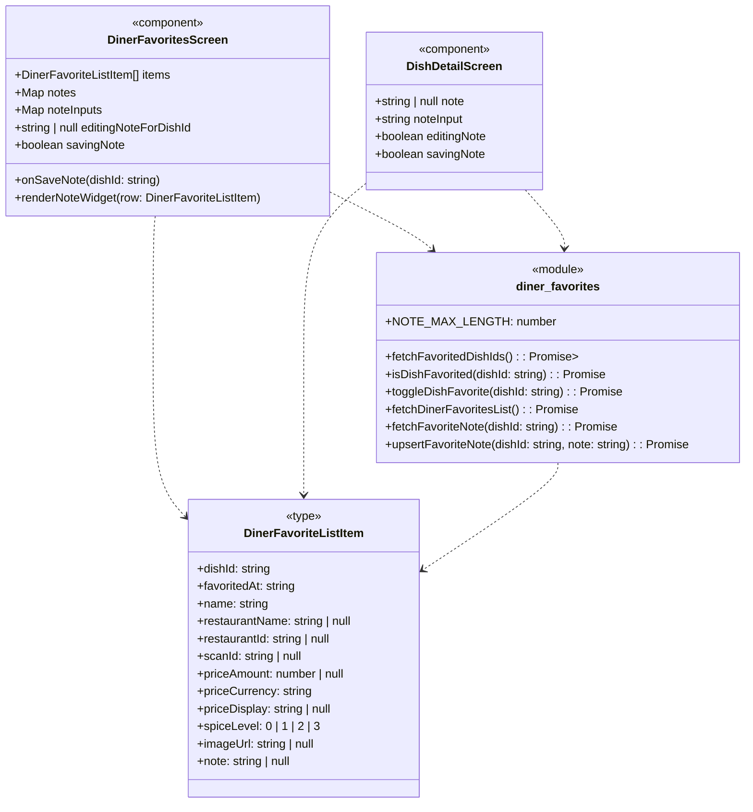

### 1. Primary and Secondary Owners

| Role | Name | Notes |
|------|------|-------|
| Primary owner | Unknown — leave blank for human to fill in. | Owns requirements and release sign-off |
| Secondary owner | Unknown — leave blank for human to fill in. | Owns implementation review and test plan |

---

### 2. Date Merged into `main`

2026-04-16 (PR #87)

---

### 3. Architecture Diagram (Mermaid)

```mermaid
flowchart TB
    subgraph Client
        A[app/diner-favorites.tsx]
        B[app/dish/[dishId].tsx]
        C[lib/diner-favorites.ts]
    end

    subgraph Cloud
        D[Supabase Auth]
        E[Supabase PostgreSQL]
    end

    A --> C
    B --> C
    C --> D
    C --> E
```

---

### 4. Information Flow Diagram (Mermaid)

```mermaid
flowchart LR
    User -- "View/Edit Note UI" --> DinerFavoritesScreen
    User -- "View/Edit Note UI" --> DishDetailScreen

    DinerFavoritesScreen -- "dishId, note text" --> lib/diner-favorites.ts::upsertFavoriteNote
    DishDetailScreen -- "dishId, note text" --> lib/diner-favorites.ts::upsertFavoriteNote

    lib/diner-favorites.ts::upsertFavoriteNote -- "profile_id (from Auth), dish_id, note" --> Supabase PostgreSQL::diner_favorite_dishes

    Supabase PostgreSQL::diner_favorite_dishes -- "note" --> lib/diner-favorites.ts::fetchFavoriteNote
    Supabase PostgreSQL::diner_favorite_dishes -- "note" --> lib/diner-favorites.ts::fetchDinerFavoritesList

    lib/diner-favorites.ts::fetchFavoriteNote -- "note" --> DishDetailScreen
    lib/diner-favorites.ts::fetchDinerFavoritesList -- "note" --> DinerFavoritesScreen

    DinerFavoritesScreen -- "Display Note" --> User
    DishDetailScreen -- "Display Note" --> User
```

---

### 5. Class Diagram (Mermaid)



---

### 6. Implementation Units

#### File: `app/diner-favorites.tsx`

*   **Purpose**: React Native component for displaying a diner's favorited dishes. This PR adds functionality to view, add, edit, and delete private notes associated with each favorited dish directly within the favorites list.
*   **Public fields and methods**:
    *   `DinerFavoritesScreen`: React functional component, default export. Renders the favorites list with search, grouping, and note widgets.
*   **Private fields and methods**:
    *   `editingNoteForDishId`: `useState<string | null>` - Stores the `dishId` of the dish for which a note is currently being edited. `null` if no note is being edited.
    *   `noteInputs`: `useState<Map<string, string>>` - A map storing the current text input value for notes being edited, keyed by `dishId`.
    *   `notes`: `useState<Map<string, string | null>>` - A map storing the saved notes for each dish, keyed by `dishId`. Updated after successful save.
    *   `savingNote`: `useState<boolean>` - Flag indicating if a note save operation is in progress.
    *   `onSaveNote(dishId: string)`: `useCallback` async function - Handles saving a note for a given `dishId`. It retrieves the text from `noteInputs`, calls `upsertFavoriteNote`, updates the `notes` state, and resets `editingNoteForDishId`. Displays an alert on error.
    *   `renderNoteWidget(row: DinerFavoriteListItem)`: Function - Renders the appropriate UI for a dish's note: an "Add note" button if no note exists, a display of the saved note (with an "Edit" button) if one exists, or a `TextInput` for editing/adding a note.

#### File: `app/dish/[dishId].tsx`

*   **Purpose**: React Native component for displaying the detailed view of a single dish. This PR adds a dedicated "My Note" section to this page, allowing diners to view, add, edit, and delete notes for favorited dishes.
*   **Public fields and methods**:
    *   `DishDetailScreen`: React functional component, default export. Renders the dish details and the "My Note" section.
*   **Private fields and methods**:
    *   `note`: `useState<string | null>` - Stores the saved note for the current dish. `null` if no note exists.
    *   `noteInput`: `useState<string>` - Stores the current text input value when editing a note.
    *   `editingNote`: `useState<boolean>` - Flag indicating if the note is currently being edited.
    *   `savingNote`: `useState<boolean>` - Flag indicating if a note save operation is in progress.

#### File: `lib/diner-favorites.ts`

*   **Purpose**: TypeScript module providing functions for interacting with Supabase to manage diner's favorited dishes and their associated notes.
*   **Public fields and methods**:
    *   `DinerFavoriteListItem`: `type` - Extends the existing type to include a `note: string | null` field.
    *   `NOTE_MAX_LENGTH`: `const number` - Defines the maximum allowed length for a note (300 characters).
    *   `fetchFavoritedDishIds()`: `async function` - Fetches a set of all favorited dish IDs for the current user. (Existing function, but contextually relevant).
    *   `isDishFavorited(dishId: string)`: `async function` - Checks if a specific dish is favorited by the current user. (Existing function, but contextually relevant).
    *   `toggleDishFavorite(dishId: string)`: `async function` - Toggles the favorite status of a dish. (Existing function, but contextually relevant).
    *   `fetchDinerFavoritesList()`: `async function` - Fetches a list of all favorited dishes for the current user, now including the `note` field.
        *   **Changes**: Modified the `select` query to include the `note` column.
    *   `fetchFavoriteNote(dishId: string)`: `async function` - Fetches the note for a single favorited dish. Returns `null` if not favorited or no note is set.
    *   `upsertFavoriteNote(dishId: string, note: string)`: `async function` - Saves or clears a note for a favorited dish.
        *   Throws an error if the user is not signed in or if the note exceeds `NOTE_MAX_LENGTH`.
        *   Trims the note and sets it to `null` in the database if the trimmed note is empty.
        *   Uses a Supabase `update` operation on the `diner_favorite_dishes` table.

#### File: `supabase/migrations/20260416052648_us10_favorite_dish_notes.sql`

*   **Purpose**: Supabase migration script to add the `note` column to the `diner_favorite_dishes` table and enforce its length constraint.
*   **Public fields and methods**:
    *   `ALTER TABLE diner_favorite_dishes ADD COLUMN note text;`: SQL statement to add a nullable `text` column named `note`.
    *   `ALTER TABLE diner_favorite_dishes ADD CONSTRAINT diner_favorite_dishes_note_length_check CHECK (note IS NULL OR char_length(note) <= 300);`: SQL statement to add a check constraint ensuring the `note` column is either `NULL` or its character length is 300 or less.

#### File: `supabase/migrations/20260416055019_us10_favorite_dish_notes_update_policy.sql`

*   **Purpose**: Supabase migration script to add a Row Level Security (RLS) `UPDATE` policy for the `diner_favorite_dishes` table, allowing authenticated diners to update their own favorited dish rows.
*   **Public fields and methods**:
    *   `create policy "diner_favorite_dishes_update_own" on public.diner_favorite_dishes for update to authenticated using (profile_id = (select auth.uid()) and public.is_diner((select auth.uid()))) with check (profile_id = (select auth.uid()));`: SQL statement to create an RLS policy.
        *   `for update`: Applies to `UPDATE` operations.
        *   `to authenticated`: Applies to authenticated users.
        *   `using (...)`: Condition for existing rows to be updated (user's `profile_id` matches `auth.uid()` and user is a diner).
        *   `with check (...)`: Condition for new row values after update (ensures `profile_id` remains the user's `auth.uid()`).

---

### 7. Technologies, Libraries, and APIs

| Technology | Version | Used for | Why chosen over alternatives | Source / Docs URL |
|------------|---------|----------|------------------------------|-------------------|
| TypeScript | ~5.x | Language for client-side development | Type safety, improved developer experience | [typescriptlang.org](https://www.typescriptlang.org/) |
| Node.js | (runtime for Expo/React Native) | JavaScript runtime environment | Standard for React Native development | [nodejs.org](https://nodejs.org/en/docs/) |
| React Native | ~0.73.x | Mobile application framework | Cross-platform mobile development | [reactnative.dev](https://reactnative.dev/docs) |
| Expo | ~49.x | Framework and platform for React Native | Simplified development, build, and deployment | [docs.expo.dev](https://docs.expo.dev/) |
| Supabase JS client | (latest used by project) | Client library for interacting with Supabase | Authentication, database (PostgreSQL) access | [supabase.com/docs/reference/javascript/overview](https://supabase.com/docs/reference/javascript/overview) |
| Supabase Auth | (part of Supabase) | User authentication and session management | Integrated with Supabase PostgreSQL and RLS | [supabase.com/docs/guides/auth](https://supabase.com/docs/guides/auth) |
| Supabase PostgreSQL | (part of Supabase) | Relational database for persistent storage | Scalable, managed PostgreSQL with RLS capabilities | [supabase.com/docs/guides/database](https://supabase.com/docs/guides/database) |
| `@expo/vector-icons` | (latest used by project) | Icon library for React Native | Easy access to a wide range of icons (MaterialCommunityIcons) | [docs.expo.dev/guides/icons/](https://docs.expo.dev/guides/icons/) |
| `expo-router` | (latest used by project) | File-system based router for Expo/React Native | Declarative routing, deep linking | [expo.github.io/router/](https://expo.github.io/router/) |
| `react-native` components | (core library) | UI components (View, Text, TextInput, Pressable, etc.) | Building blocks for React Native UI | [reactnative.dev/docs/components-and-apis](https://reactnative.dev/docs/components-and-apis) |
| `react` hooks | (core library) | State and lifecycle management (useState, useEffect, useCallback, useMemo) | Standard React patterns for functional components | [react.dev/reference/react](https://react.dev/reference/react) |
| `react-native-safe-area-context` | (latest used by project) | Provides safe area insets for UI layout | Handles device notches and system bars | [github.com/th3rdwave/react-native-safe-area-context](https://github.com/th3rdwave/react-native-safe-area-context) |
| `expo-image` | (latest used by project) | Optimized image component for Expo | Improved image loading and caching | [docs.expo.dev/versions/latest/sdk/image/](https://docs.expo.dev/versions/latest/sdk/image/) |
| `expo-linear-gradient` | (latest used by project) | Linear gradient component for Expo | UI styling | [docs.expo.dev/versions/latest/sdk/linear-gradient/](https://docs.expo.dev/versions/latest/sdk/linear-gradient/) |
| `SQL` | (PostgreSQL dialect) | Database schema definition and manipulation | Standard for relational database operations | [postgresql.org/docs/](https://www.postgresql.org/docs/) |

---

### 8. Database — Long-Term Storage

#### Table: `diner_favorite_dishes`

*   **Purpose**: Stores a record of each dish favorited by a diner.
*   **Columns**:
    *   `note`:
        *   Type: `text`
        *   Purpose: Stores a private, user-generated note for the favorited dish.
        *   Estimated storage in bytes per row: Average 150 bytes (for 150 characters), max 300 bytes (for 300 characters).
*   **Estimated total storage per user**:
    *   Assuming a user favorites 100 dishes, and adds a note to each: 100 dishes * 150 bytes/note = 15,000 bytes (15 KB). This is in addition to existing `diner_favorite_dishes` row data.

---

### 9. Failure Scenarios

1.  **Frontend process crash**
    *   **User-visible effect**: The app freezes or closes unexpectedly. Any unsaved note text in the `TextInput` will be lost.
    *   **Internally-visible effect**: React Native app process terminates. Logs might show an unhandled JavaScript error.
2.  **Loss of all runtime state**
    *   **User-visible effect**: If the app is backgrounded and then foregrounded, or if the app is killed by the OS, the current editing state (e.g., `editingNoteForDishId`, `noteInputs`, `noteInput`) will be reset. The user will lose any unsaved note changes.
    *   **Internally-visible effect**: React components remount, `useState` variables re-initialize to their default values.
3.  **All stored data erased**
    *   **User-visible effect**: All favorited dishes and their associated notes will disappear from the app.
    *   **Internally-visible effect**: `diner_favorite_dishes` table in Supabase PostgreSQL is empty. `fetchDinerFavoritesList` and `fetchFavoriteNote` will return empty results or `null`.
4.  **Corrupt data detected in the database**
    *   **User-visible effect**: If a `note` column contains invalid data (e.g., non-text, or text exceeding 300 characters if the constraint was bypassed), it might cause display issues or errors when fetching. If the `char_length` constraint is violated, `upsertFavoriteNote` would fail.
    *   **Internally-visible effect**: Supabase client might throw an error during data retrieval or update. Database logs might show constraint violation errors.
5.  **Remote procedure call (API call) failed**
    *   **User-visible effect**: When trying to save a note, an `Alert` dialog will appear with "Could not save note" and an error message. When loading favorites or dish details, an `Alert` dialog will appear with "Could not load favorites" or "Could not save note". The note will not be saved/loaded.
    *   **Internally-visible effect**: `supabase.from(...).update(...)` or `supabase.from(...).select(...)` calls will return an `error` object. The `catch` block in `onSaveNote`, `load`, or `useEffect` in `DishDetailScreen` will be triggered.
6.  **Client overloaded**
    *   **User-visible effect**: The app becomes slow, unresponsive, or freezes. UI updates (like typing in the note `TextInput`) might lag significantly.
    *   **Internally-visible effect**: High CPU or memory usage on the client device. JavaScript event loop might be blocked.
7.  **Client out of RAM**
    *   **User-visible effect**: The app crashes or is killed by the operating system. Any unsaved note text is lost.
    *   **Internally-visible effect**: OS terminates the app process. No specific in-app error handling for this.
8.  **Database out of storage space**
    *   **User-visible effect**: Attempts to save new notes or update existing ones will fail, resulting in an "Could not save note" alert.
    *   **Internally-visible effect**: Supabase PostgreSQL will return an error indicating storage exhaustion. The `upsertFavoriteNote` function will catch this error and propagate it.
9.  **Network connectivity lost**
    *   **User-visible effect**: Any operation requiring network (loading favorites, saving notes) will fail. Users will see "Could not load favorites" or "Could not save note" alerts. Existing notes might not load, or new notes cannot be saved.
    *   **Internally-visible effect**: Supabase client calls will time out or return network-related errors.
10. **Database access lost**
    *   **User-visible effect**: Similar to network connectivity loss, but specifically for database operations. Users cannot load or save notes, seeing error alerts.
    *   **Internally-visible effect**: Supabase client will report database connection errors. This could be due to misconfigured RLS, database downtime, or credentials issues.
11. **Bot signs up and spams users**
    *   **User-visible effect**: Not directly applicable as notes are private to the user who created them. A bot could sign up and create many notes for *itself*, but these would not be visible to other users.
    *   **Internally-visible effect**: Increased storage usage in `diner_favorite_dishes` table. Supabase logs would show many `INSERT` and `UPDATE` operations from the bot's `profile_id`. The RLS policies prevent cross-user spam.

---

### 10. PII, Security, and Compliance

*   **PII stored**: `note` (user-generated text)
    *   **What it is and why it must be stored**: Free-form text entered by the user about a favorited dish. It must be stored to allow users to keep private thoughts, reminders, or dietary considerations related to specific dishes.
    *   **How it is stored**: Plaintext in the `note` column of the `diner_favorite_dishes` table in Supabase PostgreSQL.
    *   **How it entered the system**: User input in `TextInput` components (`app/diner-favorites.tsx`, `app/dish/[dishId].tsx`) → stored in React component state (`noteInputs`, `noteInput`) → passed to `upsertFavoriteNote` (`lib/diner-favorites.ts`) → Supabase JS client → `diner_favorite_dishes.note` column in Supabase PostgreSQL.
    *   **How it exits the system**: `diner_favorite_dishes.note` column in Supabase PostgreSQL → `fetchFavoriteNote` or `fetchDinerFavoritesList` (`lib/diner-favorites.ts`) → Supabase JS client → stored in React component state (`notes`, `note`) → displayed in `Text` components (`app/diner-favorites.tsx`, `app/dish/[dishId].tsx`).
    *   **Who on the team is responsible for securing it**: Unknown — leave blank for human to fill in.
    *   **Procedures for auditing routine and non-routine access**: Unknown — leave blank for human to fill in.

**Minor users:**
*   **Does this feature solicit or store PII of users under 18?**: Yes, if a user under 18 signs up and uses the feature, their notes would be stored. There is no age gate or verification.
*   **If yes: does the app solicit guardian permission?**: No.
*   **What is the team policy for ensuring minors' PII is not accessible by anyone convicted or suspected of child abuse?**: Unknown — leave blank for human to fill in.