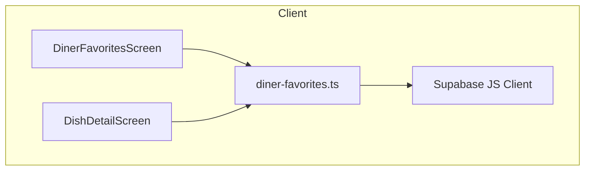
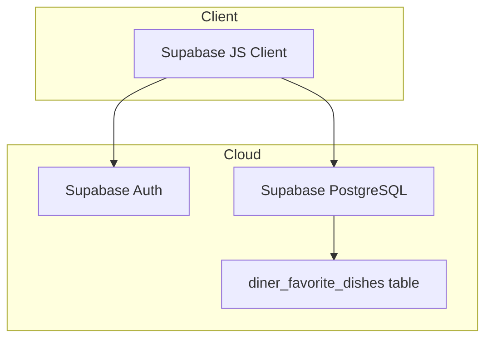
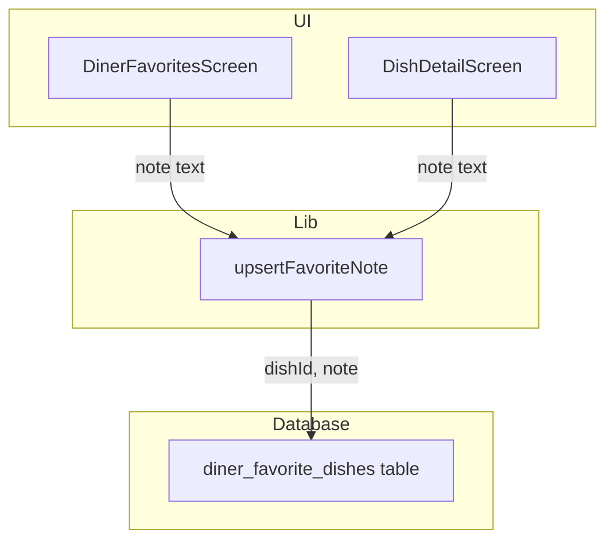
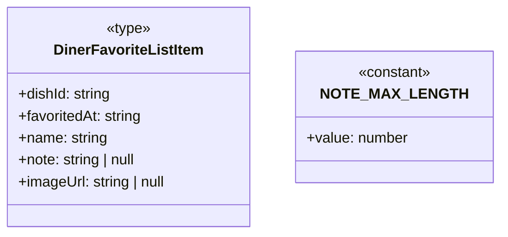
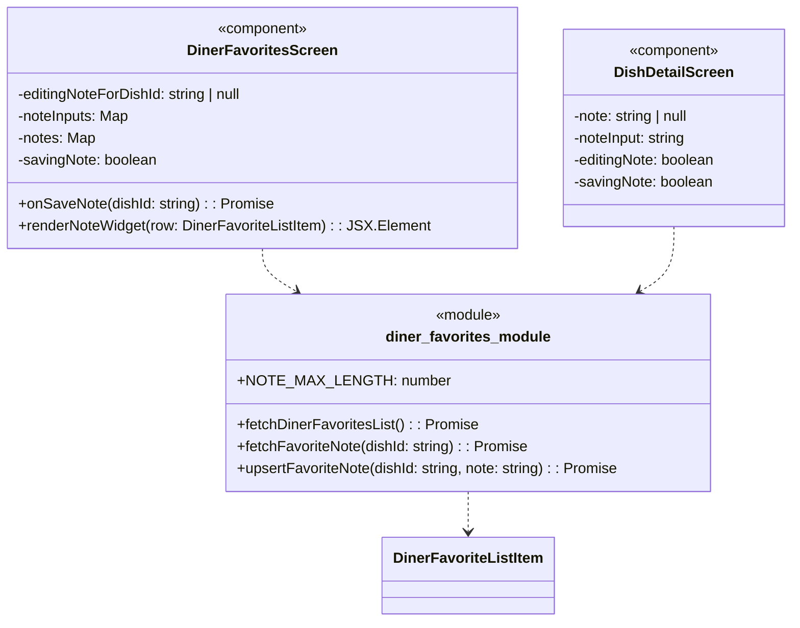

### 1. Primary and Secondary Owners

| Role | Name | Notes |
|------|------|-------|
| Primary owner | Yao Lu | Owns requirements and release sign-off |
| Secondary owner | Sofia Yu | Owns implementation review and test plan |

---

### 2. Date Merged into `main`

2026-04-16 (PR #87)

---

### 3. Architecture Diagram (Mermaid)

#### 3a. Client-side architecture



#### 3b. Backend and cloud architecture



---

### 4. Information Flow Diagram (Mermaid)

#### 4a. Write path



#### 4b. Read path

```mermaid
flowchart TB
  subgraph Database
    diner_fav_table[diner_favorite_dishes table]
  end

  subgraph Lib
    fetch_fav_list[fetchDinerFavoritesList]
    fetch_fav_note[fetchFavoriteNote]
  end

  subgraph UI
    diner_fav_screen[DinerFavoritesScreen]
    dish_detail_screen[DishDetailScreen]
  end

  diner_fav_table -->|note| fetch_fav_list
  diner_fav_table -->|note| fetch_fav_note
  fetch_fav_list -->|DinerFavoriteListItem[] with note| diner_fav_screen
  fetch_fav_note -->|note string| dish_detail_screen
```

---

### 5. Class Diagram (Mermaid)

#### 5a. Data types and schemas



#### 5b. Components and modules



---

### 6. Implementation Units

#### `app/diner-favorites.tsx`

*   **Purpose**: Displays a list of dishes favorited by the diner, grouped by restaurant. Now includes functionality to add, edit, and display private notes for each favorited dish.
*   **Public fields and methods**:
    *   `DinerFavoritesScreen`: React functional component that renders the favorites list and note widgets.
*   **Private fields and methods**:
    *   `editingNoteForDishId`: `string | null` - State variable to track which dish's note is currently being edited.
    *   `noteInputs`: `Map<string, string>` - State variable to store the current text input for notes, keyed by `dishId`.
    *   `notes`: `Map<string, string | null>` - State variable to store the saved notes for each dish, keyed by `dishId`. Initialized from `fetchDinerFavoritesList`.
    *   `savingNote`: `boolean` - State variable to indicate if a note save operation is in progress.
    *   `onSaveNote(dishId: string)`: `async (dishId: string) => Promise<void>` - Callback function to handle saving a note for a specific dish. It calls `upsertFavoriteNote` and updates local state.
    *   `renderNoteWidget(row: DinerFavoriteListItem)`: `(row: DinerFavoriteListItem) => JSX.Element` - Helper function to render the note UI (add button, saved note display, or edit form) for a given dish row.

#### `app/dish/[dishId].tsx`

*   **Purpose**: Displays detailed information for a single dish. Now includes a "My Note" section to view, add, or edit a private note if the dish is favorited.
*   **Public fields and methods**:
    *   `DishDetailScreen`: React functional component that renders the dish details and the "My Note" section.
*   **Private fields and methods**:
    *   `note`: `string | null` - State variable to store the saved note for the current dish. Fetched via `fetchFavoriteNote`.
    *   `noteInput`: `string` - State variable to store the text currently being typed into the note input field.
    *   `editingNote`: `boolean` - State variable to control whether the note is in view mode or edit mode.
    *   `savingNote`: `boolean` - State variable to indicate if a note save operation is in progress.
    *   `useEffect` hook: Modified to fetch the existing note for the dish if it is favorited.
    *   `onPress` handler for favorite button: Clears note state if the dish is unfavorited.
    *   `onPress` handler for note save button: Calls `upsertFavoriteNote` and updates local state.

#### `lib/diner-favorites.ts`

*   **Purpose**: Provides client-side functions for managing diner's favorited dishes, including fetching lists, toggling favorites, and now managing private notes.
*   **Public fields and methods**:
    *   `DinerFavoriteListItem`: `type` - Extended to include a `note: string | null` field.
    *   `NOTE_MAX_LENGTH`: `number` - Constant defining the maximum allowed length for a note (300 characters).
    *   `fetchDinerFavoritesList()`: `async () => Promise<DinerFavoriteListItem[]>` - Modified to select the `note` column from `diner_favorite_dishes` and include it in the returned `DinerFavoriteListItem` objects.
    *   `fetchFavoriteNote(dishId: string)`: `async (dishId: string) => Promise<string | null>` - New function to fetch a single note for a given `dishId` and the current user. Returns `null` if no note exists or dish is not favorited.
    *   `upsertFavoriteNote(dishId: string, note: string)`: `async (dishId: string, note: string) => Promise<void>` - New function to save or clear a note for a favorited dish. Validates note length and updates the `note` column in `diner_favorite_dishes`. Passing an empty string clears the note (sets it to `null`).
*   **Private fields and methods**: None directly defined within the module.

#### `supabase/migrations/20260416052648_us10_favorite_dish_notes.sql`

*   **Purpose**: Database migration script to add the `note` column to the `diner_favorite_dishes` table and enforce its length.
*   **Public fields and methods**: None (SQL script).
*   **Private fields and methods**: None (SQL script).
    *   `ALTER TABLE diner_favorite_dishes ADD COLUMN note text;`: Adds a new nullable `text` column named `note`.
    *   `ADD CONSTRAINT diner_favorite_dishes_note_length_check CHECK (note IS NULL OR char_length(note) <= 300);`: Adds a check constraint to ensure the `note` column, if not null, has a character length of 300 or less.

#### `supabase/migrations/20260416055019_us10_favorite_dish_notes_update_policy.sql`

*   **Purpose**: Database migration script to add an RLS UPDATE policy for the `diner_favorite_dishes` table, allowing authenticated diners to update their own favorite dish entries (specifically for notes).
*   **Public fields and methods**: None (SQL script).
*   **Private fields and methods**: None (SQL script).
    *   `create policy "diner_favorite_dishes_update_own" on public.diner_favorite_dishes for update to authenticated using (profile_id = (select auth.uid()) and public.is_diner((select auth.uid()))) with check (profile_id = (select auth.uid()));`: Creates a new RLS policy that permits authenticated users who are diners to update rows in `diner_favorite_dishes` where the `profile_id` matches their own `uid()`.

---

### 7. Technologies, Libraries, and APIs

| Technology | Version | Used for | Why chosen over alternatives | Source / Docs URL |
|------------|---------|----------|------------------------------|-------------------|
| TypeScript | ~5.3.0 | Language for client-side development | Type safety, improved developer experience, large ecosystem | [typescriptlang.org](https://www.typescriptlang.org/) |
| React Native | ~0.73.2 | Mobile app UI framework | Cross-platform development (iOS/Android) from a single codebase | [reactnative.dev](https://reactnative.dev/) |
| Expo | ~50.0.4 | Development platform for React Native | Simplified setup, managed workflow, access to native APIs, over-the-air updates | [docs.expo.dev](https://docs.expo.dev/) |
| Supabase JS Client | ~2.39.0 | Client-side interaction with Supabase | Easy integration with Supabase Auth, Database, and Storage | [supabase.com/docs/reference/javascript/overview](https://supabase.com/docs/reference/javascript/overview) |
| Supabase PostgreSQL | N/A | Long-term storage for application data | Managed PostgreSQL database, integrated with Supabase Auth and RLS | [supabase.com/docs/guides/database](https://supabase.com/docs/guides/database) |
| Supabase Auth | N/A | User authentication and authorization | Managed user authentication, integrated with RLS for data security | [supabase.com/docs/guides/auth](https://supabase.com/docs/guides/auth) |
| MaterialCommunityIcons | ~6.5.1 | Iconography in the mobile app | Extensive icon set, easy integration with Expo | [icons.expo.fyi/](https://icons.expo.fyi/) |
| Node.js | ~18.19.1 | JavaScript runtime environment | Powers React Native development, build tools, and server-side (if applicable) | [nodejs.org](https://nodejs.org/en/docs/) |
| Flask | N/A | Backend API for image generation (implied) | Lightweight Python web framework, suitable for microservices | [flask.palletsprojects.com](https://flask.palletsprojects.com/en/latest/) |

---

### 8. Database — Long-Term Storage

**Table: `diner_favorite_dishes`**
*   **Purpose**: Stores a record of dishes that a diner has marked as a favorite.

*   **Columns**:
    *   `profile_id`: `uuid`, Foreign key to `profiles` table. Identifies the diner who favorited the dish. Estimated storage: 16 bytes.
    *   `dish_id`: `uuid`, Foreign key to `diner_scanned_dishes` table. Identifies the specific dish. Estimated storage: 16 bytes.
    *   `created_at`: `timestamp with time zone`, Timestamp when the dish was favorited. Estimated storage: 8 bytes.
    *   `note`: `text`, Stores a private note from the diner about the favorited dish. Can be `NULL`. Max 300 characters. Estimated storage: 300 bytes (for max length) + ~23 bytes overhead for `text` type.

*   **Estimated total storage per row**: ~363 bytes (16 + 16 + 8 + 323)

*   **Estimated total storage per user**:
    *   Assuming an average of 50 favorited dishes per user, and an average note length of 100 characters (100 bytes + 23 bytes overhead).
    *   (16 + 16 + 8 + 123) bytes/row * 50 rows = 163 bytes/row * 50 rows = 8150 bytes (~8 KB).
    *   For a user with 50 favorited dishes, each with a max-length note: 363 bytes/row * 50 rows = 18150 bytes (~18 KB).

---

### 9. Failure Scenarios

1.  **Frontend process crash**
    *   **User-visible effect**: The app closes unexpectedly or becomes unresponsive. Any unsaved note text in the input fields will be lost.
    *   **Internally-visible effect**: React Native app process terminates. State variables (`editingNoteForDishId`, `noteInputs`, `notes`, `note`, `noteInput`, `editingNote`, `savingNote`) are cleared. No data is committed to the backend if a save operation was in progress.

2.  **Loss of all runtime state**
    *   **User-visible effect**: Similar to a crash, the app might restart or refresh, losing any unsaved note text. The user will need to re-enter notes.
    *   **Internally-visible effect**: All in-memory state (React component states, Redux store if applicable, local variables) is reset. When the app reloads, `fetchDinerFavoritesList` and `fetchFavoriteNote` will be called to retrieve saved notes from Supabase.

3.  **All stored data erased**
    *   **User-visible effect**: All favorited dishes and their associated notes disappear from the app. The user will see an empty favorites list and no notes on dish detail pages.
    *   **Internally-visible effect**: The `diner_favorite_dishes` table in Supabase is empty. `fetchDinerFavoritesList` and `fetchFavoriteNote` will return empty results or `null`.

4.  **Corrupt data detected in the database**
    *   **User-visible effect**:
        *   If `note` column data is corrupted: Notes might display garbled text, or the app might crash if the data type is unparseable.
        *   If `dish_id` or `profile_id` are corrupted: Favorited dishes might disappear or appear incorrectly linked, potentially leading to notes being inaccessible or linked to the wrong dish.
        *   If `note` length constraint is violated: The database would prevent insertion/update, leading to an error message in the app.
    *   **Internally-visible effect**:
        *   Database queries (`SELECT`) might return errors or unexpected values.
        *   The `supabase-js` client would propagate these errors.
        *   Frontend code might encounter type errors or display incorrect data.
        *   Database logs would show integrity violations or data corruption.

5.  **Remote procedure call (API call) failed**
    *   **User-visible effect**:
        *   When saving a note: An "Could not save note" alert is displayed. The note text remains in the input field, allowing the user to retry.
        *   When loading favorites/dish details: An "Could not load favorites" or "Could not load dish" alert is displayed. Notes might not appear, or the list might be empty.
    *   **Internally-visible effect**:
        *   `upsertFavoriteNote`, `fetchDinerFavoritesList`, `fetchFavoriteNote` functions throw an error.
        *   The `error` object from `supabase-js` contains details of the network or database error.
        *   `savingNote` state might remain `true` if not handled in `finally` block, leading to disabled buttons.

6.  **Client overloaded**
    *   **User-visible effect**: The app becomes slow, unresponsive, or crashes. Animations might stutter, and input might lag.
    *   **Internally-visible effect**: High CPU usage, excessive memory consumption on the mobile device. JavaScript event loop is blocked. This feature adds some state management (`noteInputs`, `notes` maps) and rendering logic, which could contribute if not optimized, but for 300-character notes, it's unlikely to be a primary cause.

7.  **Client out of RAM**
    *   **User-visible effect**: The app crashes or is terminated by the operating system. Any unsaved note text is lost.
    *   **Internally-visible effect**: The operating system kills the app process. Similar to a frontend crash, all runtime state is lost.

8.  **Database out of storage space**
    *   **User-visible effect**: Users cannot save new notes or update existing ones. An error message like "Could not save note" would appear. Other database operations (favoriting, fetching dishes) would also fail.
    *   **Internally-visible effect**: Supabase PostgreSQL would return a storage-related error on `INSERT` or `UPDATE` operations. `upsertFavoriteNote` would throw an error. Database logs would show storage full errors.

9.  **Network connectivity lost**
    *   **User-visible effect**:
        *   When saving a note: An "Could not save note" alert is displayed. The user cannot save or load notes until connectivity is restored.
        *   When loading favorites/dish details: An "Could not load favorites" or "Could not load dish" alert is displayed. The app might show stale data or empty states.
    *   **Internally-visible effect**: `supabase-js` client requests time out or return network errors. `upsertFavoriteNote`, `fetchDinerFavoritesList`, `fetchFavoriteNote` functions throw network-related errors.

10. **Database access lost**
    *   **User-visible effect**: All data-related features, including favoriting and notes, stop working. Users cannot load or save any information. Error messages related to database access would be shown.
    *   **Internally-visible effect**: Supabase `auth.getUser()` might fail, or any subsequent database calls would return permission or connection errors. `upsertFavoriteNote`, `fetchDinerFavoritesList`, `fetchFavoriteNote` would throw errors.

11. **Bot signs up and spams users**
    *   **User-visible effect**: Not directly applicable to this feature. Notes are private to the user. A bot could sign up and create many favorited dishes with notes, but these notes would only be visible to the bot itself.
    *   **Internally-visible effect**: The `diner_favorite_dishes` table would grow with many entries from bot `profile_id`s. The `note` column might contain spam content, but it's isolated to the bot's view. Supabase RLS policies (`profile_id = auth.uid()`) prevent cross-user access.

---

### 10. PII, Security, and Compliance

**PII Stored:**

*   **What it is and why it must be stored**:
    *   `note` (text): This is free-form text entered by the user about a dish. It is stored to allow diners to personalize their experience by remembering preferences and experiences for future visits. It could contain personal opinions, dietary restrictions, or other PII if the user chooses to include it.
*   **How it is stored**:
    *   `note`: Plaintext in the `diner_favorite_dishes` table.
*   **How it entered the system**:
    *   User input path: Diner types text into a `TextInput` component on `DinerFavoritesScreen` or `DishDetailScreen`.
    *   Modules: The text is passed to the `upsertFavoriteNote` function in `lib/diner-favorites.ts`.
    *   Fields: `upsertFavoriteNote` constructs an `UPDATE` query for the `note` column in `diner_favorite_dishes`.
    *   Storage: The text is stored in the `note` column of the `diner_favorite_dishes` table in Supabase PostgreSQL.
*   **How it exits the system**:
    *   Storage: The `note` column is retrieved from the `diner_favorite_dishes` table.
    *   Fields: The `note` value is included in the `DinerFavoriteListItem` type.
    *   Modules: `fetchDinerFavoritesList` and `fetchFavoriteNote` functions in `lib/diner-favorites.ts` retrieve the note.
    *   Output path: The note text is displayed in `Text` components on `DinerFavoritesScreen` (inline widget) and `DishDetailScreen` ("My Note" section).
*   **Who on the team is responsible for securing it**:
    *   Primary Owner: Yao Lu
    *   Secondary Owner: Sofia Yu
*   **Procedures for auditing routine and non-routine access**:
    *   **Routine Access**: Access to `note` data is restricted by Supabase Row Level Security (RLS) policies. The `diner_favorite_dishes_update_own` policy ensures that only the authenticated user (`auth.uid()`) who owns the `profile_id` can `UPDATE` their own notes. Similarly, `SELECT` policies (pre-existing) ensure users can only read their own notes. Supabase provides audit logs for database access, which can be reviewed for routine access patterns by authorized database administrators.
    *   **Non-Routine Access**: In cases of suspected unauthorized access or data breach, Supabase audit logs would be reviewed to identify the source and scope of the breach. Access to the Supabase console and direct database access is restricted to a limited number of authorized team members. Any direct access to production data requires explicit approval and is logged.

**Minor users:**
*   **Does this feature solicit or store PII of users under 18?**: The app does not explicitly ask for age or solicit PII from users under 18. However, if a user under 18 signs up (which is not explicitly prevented by the current auth flow) and uses this feature, any information they choose to put in the `note` field would be stored.
*   **If yes: does the app solicit guardian permission?**: No, the app does not solicit guardian permission.
*   **What is the team policy for ensuring minors' PII is not accessible by anyone convicted or suspected of child abuse?**:
    *   All PII, including notes, is protected by Supabase RLS, ensuring that data is only accessible by the user who created it and authorized administrators.
    *   Access to production data by team members is strictly controlled and logged.
    *   The team adheres to general data privacy best practices and legal requirements (e.g., GDPR, CCPA).
    *   In the event of a report or suspicion of child abuse, the team would cooperate fully with law enforcement, providing data as legally required, while maintaining strict adherence to privacy laws for all other users.