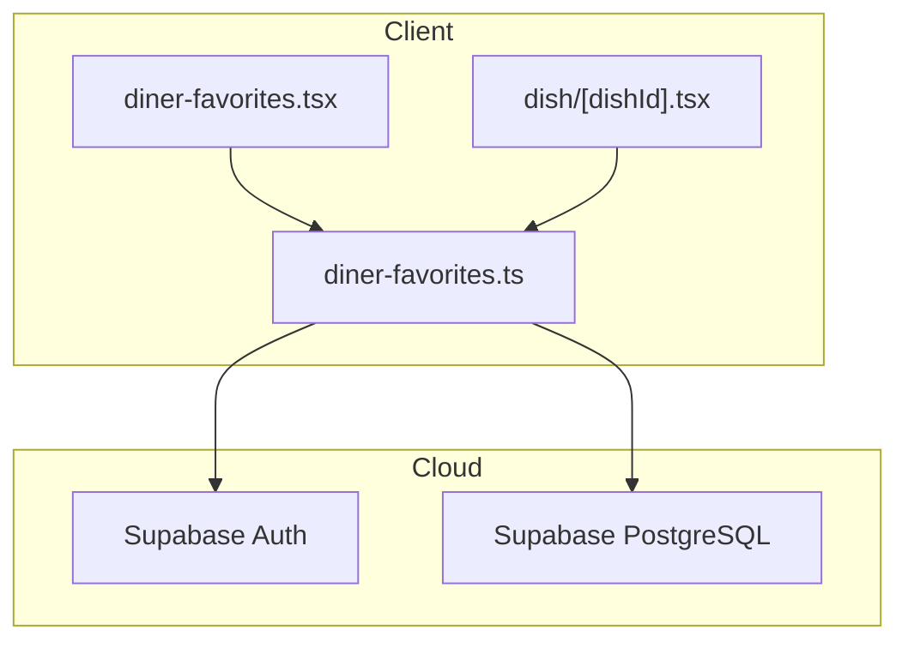
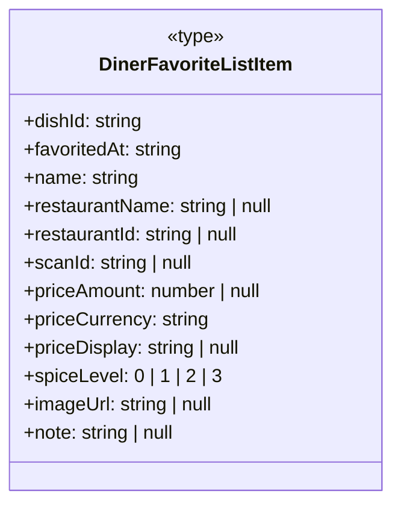
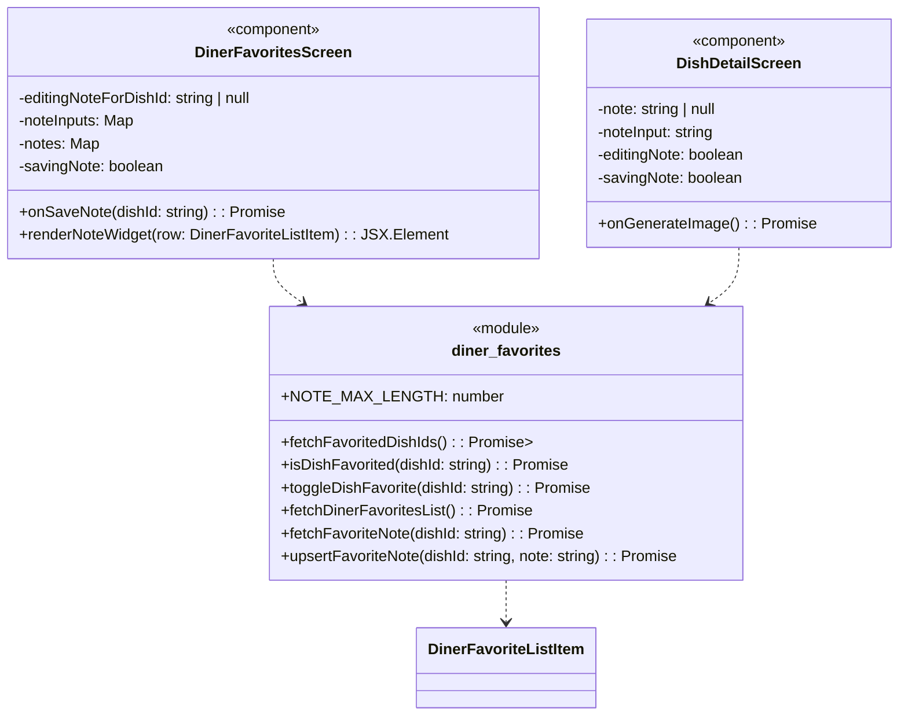

### 1. Primary and Secondary Owners

| Role | Name | Notes |
|------|------|-------|
| Primary owner | Yao Lu | Owns requirements and release sign-off |
| Secondary owner | Sofia Yu | Owns implementation review and test plan |

---

### 2. Date Merged into `main`

2026-04-16 (PR #87)

---

### 3. Architecture Diagram (Mermaid)



---

### 4. Information Flow Diagram (Mermaid)

#### 4a. Write path

```mermaid
flowchart TB
    subgraph UI
        DinerFavoritesScreen["diner-favorites.tsx"]
        DishDetailScreen["dish/[dishId].tsx"]
    end

    subgraph Lib
        diner_favorites["diner-favorites.ts"]
    end

    subgraph Database
        diner_favorite_dishes["diner_favorite_dishes table"]
    end

    DinerFavoritesScreen -->|noteInput text| diner_favorites
    DishDetailScreen -->|noteInput text| diner_favorites
    diner_favorites -->|upsertFavoriteNote(dishId, note)| diner_favorite_dishes
    diner_favorite_dishes -->|UPDATE note column| diner_favorite_dishes
```

#### 4b. Read path

```mermaid
flowchart TB
    subgraph UI
        DinerFavoritesScreen["diner-favorites.tsx"]
        DishDetailScreen["dish/[dishId].tsx"]
    end

    subgraph Lib
        diner_favorites["diner-favorites.ts"]
    end

    subgraph Database
        diner_favorite_dishes["diner_favorite_dishes table"]
    end

    diner_favorite_dishes -->|note column| diner_favorites
    diner_favorites -->|DinerFavoriteListItem.note| DinerFavoritesScreen
    diner_favorites -->|fetchFavoriteNote() result| DishDetailScreen
```

---

### 5. Class Diagram (Mermaid)

#### 5a. Data types and schemas



#### 5b. Components and modules



---

### 6. Implementation Units

**File path**: `app/diner-favorites.tsx`
**Purpose**: React Native screen component displaying a diner's favorited dishes, grouped by restaurant. It now includes inline functionality to add, edit, and display private notes for each favorited dish.

*   **Public fields and methods**:
    *   `DinerFavoritesScreen()`: React functional component for the favorites list.
*   **Private fields and methods**:
    *   `editingNoteForDishId`: `string | null` - State variable to track which dish's note is currently being edited.
    *   `noteInputs`: `Map<string, string>` - State variable storing the current text input for notes, keyed by dish ID.
    *   `notes`: `Map<string, string | null>` - State variable storing the saved notes for each dish, keyed by dish ID.
    *   `savingNote`: `boolean` - State variable indicating if a note save operation is in progress.
    *   `onSaveNote(dishId: string)`: `async (dishId: string) => Promise<void>` - Callback function to save a note for a given dish ID. It calls `upsertFavoriteNote` from `diner-favorites.ts`.
    *   `renderNoteWidget(row: DinerFavoriteListItem)`: `(row: DinerFavoriteListItem) => JSX.Element` - Renders the note UI (add button, edit form, or saved note display) for a given favorite dish item.

**File path**: `app/dish/[dishId].tsx`
**Purpose**: React Native screen component displaying details for a single dish. It now includes a dedicated "My Note" section where diners can add, edit, or view a private note for the dish if it is favorited.

*   **Public fields and methods**:
    *   `DishDetailScreen()`: React functional component for the dish detail page.
*   **Private fields and methods**:
    *   `note`: `string | null` - State variable storing the saved note for the current dish.
    *   `noteInput`: `string` - State variable for the text currently being edited in the note input field.
    *   `editingNote`: `boolean` - State variable indicating if the note section is in edit mode.
    *   `savingNote`: `boolean` - State variable indicating if a note save operation is in progress.
    *   Anonymous async function within `useEffect` for `onPress` of save button: `async () => Promise<void>` - Handles saving the note for the current dish by calling `upsertFavoriteNote`.
    *   Anonymous async function within `useEffect` for `onPress` of favorite button: `async () => Promise<void>` - Handles toggling favorite status and clears the note state if unfavorited.

**File path**: `lib/diner-favorites.ts`
**Purpose**: TypeScript module providing functions for managing diner's favorited dishes, including fetching lists, toggling favorite status, and now, managing private notes associated with favorited dishes.

*   **Public fields and methods**:
    *   `NOTE_MAX_LENGTH`: `number` - Constant defining the maximum allowed length for a dish note (300 characters).
    *   `DinerFavoriteListItem`: `type` - Type definition for an item in the diner's favorite list, now including a `note` field.
    *   `fetchFavoritedDishIds()`: `async () => Promise<Set<string>>` - Fetches a set of all favorited dish IDs for the current user.
    *   `isDishFavorited(dishId: string)`: `async (dishId: string) => Promise<boolean>` - Checks if a specific dish is favorited by the current user.
    *   `toggleDishFavorite(dishId: string)`: `async (dishId: string) => Promise<boolean>` - Toggles the favorite status of a dish. Returns `true` if now favorited, `false` if removed.
    *   `fetchDinerFavoritesList()`: `async () => Promise<DinerFavoriteListItem[]>` - Fetches a list of all favorited dishes for the current user, now including their associated notes.
    *   `fetchFavoriteNote(dishId: string)`: `async (dishId: string) => Promise<string | null>` - Fetches the note for a single favorited dish. Returns `null` if not favorited or no note exists.
    *   `upsertFavoriteNote(dishId: string, note: string)`: `async (dishId: string, note: string) => Promise<void>` - Saves or clears a note for a favorited dish. An empty string clears the note (sets it to `null`). Enforces `NOTE_MAX_LENGTH`.

---

### 7. Technologies, Libraries, and APIs

| Technology | Version | Used for | Why chosen over alternatives | Source / Docs URL |
|------------|---------|----------|------------------------------|-------------------|
| React Native | Unknown | Mobile UI development | Cross-platform mobile app development | https://reactnative.dev/ |
| Expo | Unknown | React Native development tooling and SDK | Simplified development, build, and deployment for React Native | https://docs.expo.dev/ |
| TypeScript | Unknown | Type-safe JavaScript development | Improved code quality, maintainability, and developer experience | https://www.typescriptlang.org/ |
| Node.js | Unknown | JavaScript runtime environment | Powers React Native development and build processes | https://nodejs.org/ |
| Supabase JS client | Unknown | Interacting with Supabase backend | Client library for Supabase services (Auth, PostgreSQL) | https://supabase.com/docs/reference/javascript/initializing |
| Supabase Auth | Unknown | User authentication and authorization | Integrated authentication solution with user management | https://supabase.com/docs/guides/auth |
| Supabase PostgreSQL | Unknown | Database storage and querying | Relational database for application data | https://supabase.com/docs/guides/database |
| MaterialCommunityIcons | Unknown | Iconography in UI | Provides a wide range of vector icons for mobile apps | https://icons.expo.fyi/ |
| Flask | Unknown | Backend API (project-level) | Python web framework for API services | https://flask.palletsprojects.com/ |
| Python | Unknown | Backend language (project-level) | Programming language for Flask backend | https://www.python.org/ |

---

### 8. Database — Long-Term Storage

**Table name and purpose**: `diner_favorite_dishes` - Stores records of dishes favorited by diners.

*   **Column**: `note`
    *   **Type**: `text`
    *   **Purpose**: Stores a diner's private text note associated with a specific favorited dish.
    *   **Estimated storage in bytes per row**: Up to 300 characters (UTF-8) + overhead. For 300 characters, roughly 300-1200 bytes depending on character set (e.g., 1 byte for ASCII, up to 4 bytes for some Unicode). Plus PostgreSQL `text` type overhead.
*   **Estimated total storage per user**:
    *   If a user favorites 100 dishes and adds a 300-character note to each: 100 * (300-1200 bytes + overhead) ≈ 30KB - 120KB.
    *   This is a small amount of data per user.

---

### 9. Failure Scenarios

1.  **Frontend process crash**
    *   **User-visible effect**: The app closes unexpectedly. Any unsaved note text in the `TextInput` fields will be lost.
    *   **Internally-visible effect**: React Native app process terminates. No data is corrupted on the backend. Logs might show an unhandled JavaScript error.
2.  **Loss of all runtime state**
    *   **User-visible effect**: The app might restart or refresh, losing current navigation, form inputs (like note text being typed), and UI state (e.g., which note is being edited). Saved notes will reload from the backend.
    *   **Internally-visible effect**: React Native component state (e.g., `editingNoteForDishId`, `noteInputs`, `notes`, `savingNote`) is reset. Data in `lib/diner-favorites.ts` (e.g., `supabase` client instance) might need re-initialization or re-authentication.
3.  **All stored data erased**
    *   **User-visible effect**: All favorited dishes and their associated notes disappear from the app. Users will see empty favorites lists and no notes on dish detail pages.
    *   **Internally-visible effect**: The `diner_favorite_dishes` table in Supabase PostgreSQL is empty. `fetchDinerFavoritesList` and `fetchFavoriteNote` will return empty arrays or `null`.
4.  **Corrupt data detected in the database**
    *   **User-visible effect**: If a `note` column contains invalid characters or exceeds the length constraint (which should be prevented by the `CHECK` constraint and frontend validation), it might cause display issues or errors when fetching. If the `note` column itself is corrupted (e.g., non-text data), the app might crash when trying to render it.
    *   **Internally-visible effect**: Database queries might fail or return unexpected data. The `supabase-js` client would likely throw an error when attempting to parse or use the corrupted data, leading to exceptions in `lib/diner-favorites.ts`.
5.  **Remote procedure call (API call) failed**
    *   **User-visible effect**: When saving a note, an `Alert` dialog will appear with "Could not save note" and an error message. When loading favorites or a dish detail, an `Alert` dialog will appear with "Could not load favorites" or "Could not save note". The UI might remain in a loading state or revert to its previous state.
    *   **Internally-visible effect**: `supabase.from(...).update(...)` or `supabase.from(...).select(...)` calls will return an `error` object. The `catch` blocks in `onSaveNote`, `load`, `useEffect` (DishDetailScreen) will be triggered, setting error states or showing alerts.
6.  **Client overloaded**
    *   **User-visible effect**: The app becomes unresponsive, animations stutter, or input lag occurs. Typing notes might be slow, or buttons might not respond immediately.
    *   **Internally-visible effect**: High CPU usage, excessive memory allocation, or a large number of re-renders in React Native. This could be exacerbated by complex UI updates during note editing or frequent state changes.
7.  **Client out of RAM**
    *   **User-visible effect**: The app crashes abruptly without warning, or the operating system kills the app process. Any unsaved note text is lost.
    *   **Internally-visible effect**: The operating system terminates the app process. No specific internal error handling within the app is possible for this.
8.  **Database out of storage space**
    *   **User-visible effect**: Users will be unable to save new notes or update existing ones. An error message like "Could not save note" will appear.
    *   **Internally-visible effect**: Supabase PostgreSQL will return a storage-related error on `INSERT` or `UPDATE` operations to `diner_favorite_dishes`. This error will propagate through `supabase-js` to `lib/diner-favorites.ts` and trigger the `catch` block in the UI components.
9.  **Network connectivity lost**
    *   **User-visible effect**: Users cannot load favorites, view notes, or save notes. The app will display error messages like "Could not load favorites" or "Could not save note". The UI might show loading indicators indefinitely if not handled with timeouts.
    *   **Internally-visible effect**: All `supabase-js` calls will fail with network-related errors. The `catch` blocks in `lib/diner-favorites.ts` and the UI components will handle these errors.
10. **Database access lost**
    *   **User-visible effect**: Similar to network connectivity loss, users cannot interact with their favorited dishes or notes. Error messages will indicate a failure to communicate with the backend.
    *   **Internally-visible effect**: Supabase `auth.getUser()` might fail, or `supabase.from(...).select/update(...)` calls will return errors indicating a database connection issue. This will be caught and handled by the application's error reporting.
11. **Bot signs up and spams users**
    *   **User-visible effect**: Not directly applicable to this feature. Notes are private to the user who created them. A bot could sign up and create many favorited dishes with spam notes for itself, but these would not be visible to other users.
    *   **Internally-visible effect**: Increased storage usage in `diner_favorite_dishes` table. The `profile_id` column ensures notes are isolated. Monitoring for unusual activity patterns (e.g., high favorite/note creation rates from a single IP or user agent) would be necessary at the Supabase/Auth level.

---

### 10. PII, Security, and Compliance

The `note` field in `diner_favorite_dishes` stores user-generated text. While not PII in the traditional sense (like name, email, address), it is personal and private user content.

*   **What it is and why it must be stored**: The `note` field stores free-form text entered by the diner about a specific favorited dish. It must be stored to allow diners to remember their preferences and experiences, fulfilling the user story's core requirement.
*   **How it is stored**: Plaintext in the `note` column of the `diner_favorite_dishes` table in Supabase PostgreSQL. It is associated with the `profile_id` (user ID) and `dish_id`.
*   **How it entered the system**: User input via `TextInput` components in `DinerFavoritesScreen` or `DishDetailScreen` -> `upsertFavoriteNote(dishId, note)` function in `lib/diner-favorites.ts` -> `supabase.from('diner_favorite_dishes').update({ note: ... })` database call.
*   **How it exits the system**: `supabase.from('diner_favorite_dishes').select('note')` database call (via `fetchDinerFavoritesList` or `fetchFavoriteNote` in `lib/diner-favorites.ts`) -> `DinerFavoriteListItem.note` or `string | null` return value -> displayed in `Text` components in `DinerFavoritesScreen` or `DishDetailScreen`.
*   **Who on the team is responsible for securing it**: Unknown — leave blank for human to fill in.
*   **Procedures for auditing routine and non-routine access**: Unknown — leave blank for human to fill in.

**Minor users**:
*   **Does this feature solicit or store PII of users under 18?**: The feature stores user-generated notes. If a user under 18 uses the app, their notes would be stored. The notes themselves are not PII like name or address, but they are personal content.
*   **If yes: does the app solicit guardian permission?**: Unknown — leave blank for human to fill in. (Based on the provided code, there's no explicit guardian permission flow for this feature).
*   **What is the team policy for ensuring minors' PII is not accessible by anyone convicted or suspected of child abuse?**: Unknown — leave blank for human to fill in.