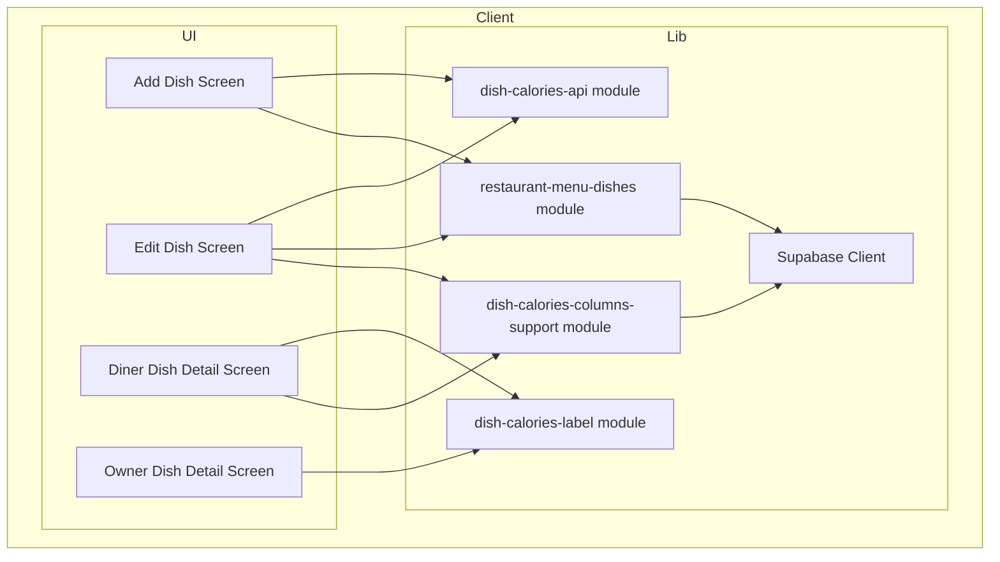
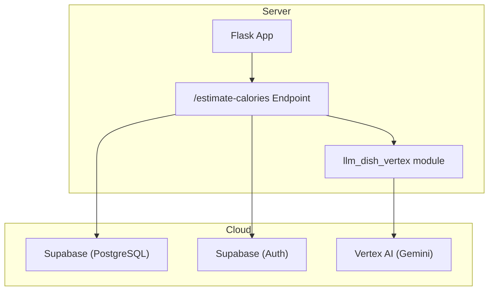
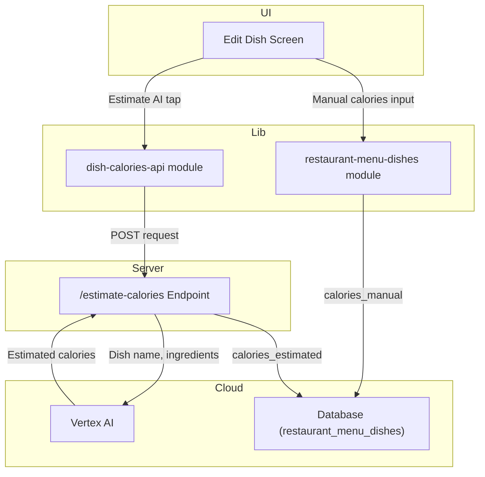
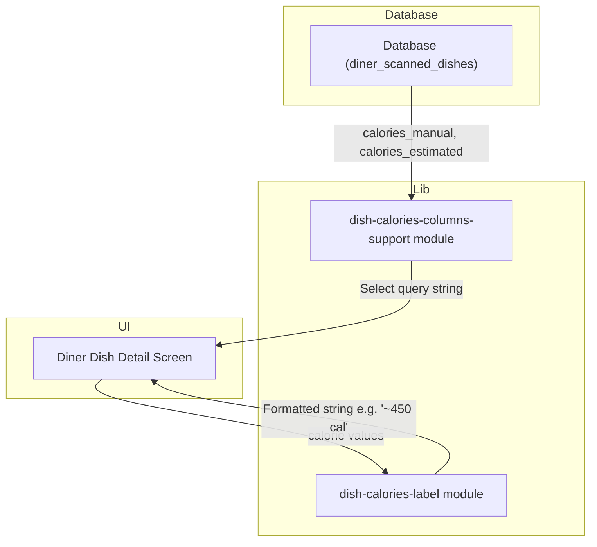
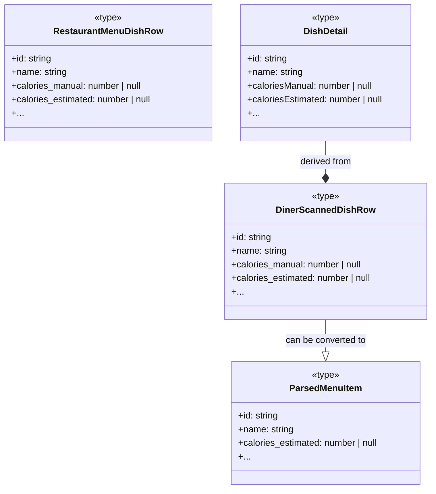
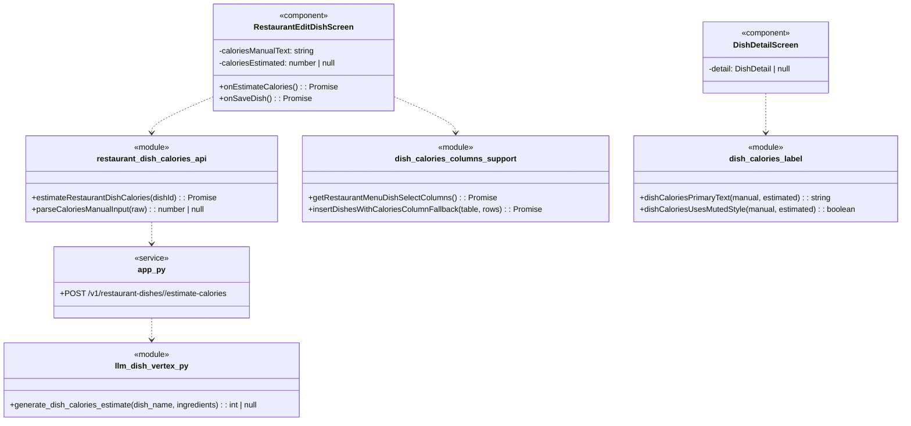

## 1. Primary and Secondary Owners

| Role | Name | Notes |
|------|------|-------|
| Primary owner | Unknown — leave blank for human to fill in. | Owns requirements and release sign-off |
| Secondary owner | Unknown — leave blank for human to fill in. | Owns implementation review and test plan |

---

## 2. Date Merged into `main`

2026-04-17 (PR #86)

---

## 3. Architecture Diagram (Mermaid)

### 3a. Client-side architecture

### 3b. Backend and cloud architecture

---

## 4. Information Flow Diagram (Mermaid)

### 4a. Write path

### 4b. Read path

---

## 5. Class Diagram (Mermaid)

### 5a. Data types and schemas

### 5b. Components and modules

---

## 6. Implementation Units

### `app/dish/[dishId].tsx`

-   **File path:** `app/dish/[dishId].tsx`
-   **Purpose:** Diner-facing screen that displays the full details of a single dish from a scanned menu.
-   **Public fields and methods:**
    -   `DishDetailScreen()`: `React.FC` — The main component for the screen.
-   **Private fields and methods:**
    -   `useEffect()`: Fetches dish details from `diner_scanned_dishes` table, including `calories_manual` and `calories_estimated`, using a dynamic select string from `getDinerScannedDishSelectColumns`.
    -   `detail`: `useState<DishDetail | null>` — Holds the fetched and processed dish data for rendering.
    -   Renders the calorie information using `dishCaloriesPrimaryText` and `dishCaloriesUsesMutedStyle` from `lib/dish-calories-label`.

### `app/restaurant-add-dish.tsx` & `app/restaurant-edit-dish/[dishId].tsx`

-   **File path:** `app/restaurant-add-dish.tsx`, `app/restaurant-edit-dish/[dishId].tsx`
-   **Purpose:** Restaurant owner screens for adding or editing a dish. They allow manual entry of calories and triggering an AI estimation.
-   **Public fields and methods:**
    -   `RestaurantAddDishScreen()` / `RestaurantEditDishScreen()`: `React.FC` — The main component for the screen.
-   **Private fields and methods:**
    -   `caloriesManualText`: `useState<string>` — State for the manual calories text input.
    -   `caloriesEstimated`: `useState<number | null>` — State to hold the AI-estimated calorie value returned from the backend.
    -   `onEstimateCalories()`: `useCallback<() => Promise<void>>` — Handler that first saves the current dish state, then calls `estimateRestaurantDishCalories` from the API library, and updates the `caloriesEstimated` state. It provides user feedback via `Alert` and `Haptics`.
    -   `onSaveDish()`: `useCallback<() => Promise<void>>` — Handler that saves all dish fields, including `caloriesManual` (parsed from `caloriesManualText`), to the `restaurant_menu_dishes` table.

### `app/restaurant-dish/[dishId].tsx` & `app/restaurant-owner-dish/[dishId].tsx`

-   **File path:** `app/restaurant-dish/[dishId].tsx`, `app/restaurant-owner-dish/[dishId].tsx`
-   **Purpose:** Read-only detail screens for a restaurant's published dish, for public and owner views respectively.
-   **Public fields and methods:**
    -   `RestaurantDishDetailScreen()` / `RestaurantOwnerDishDetailScreen()`: `React.FC` — The main component for the screen.
-   **Private fields and methods:**
    -   `useEffect()`: Fetches dish details from `restaurant_menu_dishes`, including calorie columns.
    -   Renders the calorie information using `dishCaloriesPrimaryText` and `dishCaloriesUsesMutedStyle`.

### `backend/app.py`

-   **File path:** `backend/app.py`
-   **Purpose:** The main Flask application file. It defines API endpoints.
-   **Public fields and methods:**
    -   `estimate_restaurant_dish_calories(dish_id)`: `def` — Flask route handler for `POST /v1/restaurant-dishes/<dish_id>/estimate-calories`. It authenticates the user, checks ownership, enforces a rate limit, fetches dish data, calls `generate_dish_calories_estimate`, and updates the `calories_estimated` column in `restaurant_menu_dishes`.
-   **Private fields and methods:**
    -   `_calorie_estimate_retry_after_seconds(subject, dish_id)`: `def` — An in-memory rate-limiting function to prevent abuse of the AI estimation endpoint. Uses a dictionary to track request timestamps per subject and dish.
    -   `ProxyFix`: `werkzeug.middleware.proxy_fix` — Middleware configured to trust `X-Forwarded-For` headers, allowing the rate limiter to use the real client IP for unauthenticated requests.

### `backend/llm_dish_vertex.py`

-   **File path:** `backend/llm_dish_vertex.py`
-   **Purpose:** Module for interacting with Google Vertex AI (Gemini) for dish-related tasks.
-   **Public fields and methods:**
    -   `generate_dish_calories_estimate(dish_name, ingredients, ...)`: `def` — Sends the dish name and ingredients to Gemini with a specific system prompt to get a JSON object containing an estimated calorie count.
-   **Private fields and methods:**
    -   `CALORIES_SYSTEM_INSTRUCTION`: `str` — The system prompt instructing the LLM to return a single JSON object `{ "calories": number | null }`.

### `backend/parsed_menu_validate.py`

-   **File path:** `backend/parsed_menu_validate.py`
-   **Purpose:** Validates and sanitizes the JSON output from the menu-parsing LLM.
-   **Public fields and methods:**
    -   `_parse_item(raw)`: `def` — Parses a single dish item from the LLM output, now including a call to `_parse_optional_calories_estimated`.
-   **Private fields and methods:**
    -   `_parse_optional_calories_estimated(raw)`: `def` — A new function to safely parse the `calories_estimated` field, handling nulls, non-numbers, and out-of-range values.

### `lib/dish-calories-columns-support.ts`

-   **File path:** `lib/dish-calories-columns-support.ts`
-   **Purpose:** Provides resilience for when the app is running against a database schema that has not yet been migrated to include the new calorie columns.
-   **Public fields and methods:**
    -   `getDinerScannedDishSelectColumns()`: `async () => Promise<string>` — Returns a `select` string for `diner_scanned_dishes`, dynamically including calorie columns only if they exist.
    -   `getRestaurantMenuDishSelectColumns()`: `async () => Promise<string>` — Same as above, but for `restaurant_menu_dishes`.
    -   `insertDishesWithCaloriesColumnFallback(table, rows)`: `async (...) => Promise<{ error }>` — Attempts to insert rows with calorie data. If it fails with a "column does not exist" error, it strips the calorie fields and retries the insert.
    -   `isMissingDishCaloriesColumnsError(error)`: `(error) => boolean` — Checks if a Supabase Postgrest error indicates the calorie columns are missing.

### `lib/dish-calories-label.ts`

-   **File path:** `lib/dish-calories-label.ts`
-   **Purpose:** Contains shared logic for formatting calorie data for display in the UI.
-   **Public fields and methods:**
    -   `dishCaloriesPrimaryText(caloriesManual, caloriesEstimated)`: `(num | null, num | null) => string` — Returns the display string. Prefers `caloriesManual` ("{n} cal"), falls back to `caloriesEstimated` ("~{n} cal (estimated)"), and finally to "Calories unavailable".
    -   `dishCaloriesUsesMutedStyle(caloriesManual, caloriesEstimated)`: `(...) => boolean` — Returns `true` if neither manual nor estimated calories are available, so the UI can apply a muted style.

### `lib/restaurant-dish-calories-api.ts`

-   **File path:** `lib/restaurant-dish-calories-api.ts`
-   **Purpose:** Client-side API wrapper for the new backend calorie estimation endpoint.
-   **Public fields and methods:**
    -   `estimateRestaurantDishCalories(dishId)`: `async (string) => Promise<{ok, ...}>` — Makes a `POST` request to `/v1/restaurant-dishes/<dish_id>/estimate-calories` with the user's auth token.
    -   `parseCaloriesManualInput(raw)`: `(string) => number | null` — Sanitizes user input from the calories text field, returning a number or null.

### `lib/partner-menu-access.ts` & `lib/persist-parsed-menu.ts`

-   **File path:** `lib/partner-menu-access.ts`, `lib/persist-parsed-menu.ts`
-   **Purpose:** These modules handle creating a diner's copy of a menu, either from a partner QR code or from an OCR scan.
-   **Public fields and methods:**
    -   `resolvePartnerTokenToDinerScan(...)`: Now copies `calories_manual` and `calories_estimated` when creating a diner's version of a partner dish. Uses `insertDishesWithCaloriesColumnFallback` for resilience.
    -   `persistParsedMenu(...)`: Now persists `calories_estimated` from the LLM-parsed menu into the `diner_scanned_dishes` table. Uses `insertDishesWithCaloriesColumnFallback` for resilience.

---

## 7. Technologies, Libraries, and APIs

| Technology | Version | Used for | Why chosen over alternatives | Source / Docs URL |
|------------|---------|----------|------------------------------|-------------------|
| React Native | Unknown | Mobile application framework | Cross-platform (iOS/Android) development with a single codebase. | https://reactnative.dev/ |
| Expo SDK | Unknown | Toolchain for React Native | Simplifies development, building, and deployment of the mobile app. | https://docs.expo.dev/ |
| TypeScript | Unknown | Programming language for the frontend | Provides static typing for JavaScript, improving code quality and maintainability. | https://www.typescriptlang.org/ |
| Flask | Unknown | Backend web framework | Lightweight and flexible Python framework for building the menu parsing and AI-related APIs. | https://flask.palletsprojects.com/ |
| Python | Unknown | Programming language for the backend | Chosen for its strong data science and AI/ML ecosystem, used here for the Flask server and LLM integration. | https://www.python.org/ |
| Supabase | Unknown | Backend-as-a-Service platform | Provides PostgreSQL database, authentication, and storage, simplifying backend infrastructure management. | https://supabase.com/docs |
| PostgreSQL | Unknown | Relational database | The underlying database for Supabase, used for storing all application data like dishes and menus. | https://www.postgresql.org/docs/ |
| Supabase JS Client | Unknown | JS library for Supabase | Official client library for interacting with Supabase services (DB, Auth) from the Expo app. | https://supabase.com/docs/reference/javascript/ |
| Vertex AI (Gemini) | Unknown | Google Cloud AI Platform | Used for generative AI tasks: estimating dish calories from its name and ingredients. | https://cloud.google.com/vertex-ai |
| Pytest | >=8.0,<10 | Testing framework for Python | Used for writing and running unit tests for the Flask backend, as seen in `test_estimate_calories.py`. | https://docs.pytest.org/ |
| Werkzeug | Unknown | WSGI utility library for Python | Used via `ProxyFix` to correctly handle `X-Forwarded-For` headers for rate limiting behind a reverse proxy. | https://werkzeug.palletsprojects.com/ |

---

## 8. Database — Long-Term Storage

### `restaurant_menu_dishes`

-   **Purpose:** Stores the canonical dish information for a restaurant, managed by the restaurant owner.
-   **Columns:**
    -   `calories_manual`: `integer` (nullable) — Calorie count manually entered by the restaurant owner. Takes precedence in UI. (4 bytes)
    -   `calories_estimated`: `integer` (nullable) — Calorie count estimated by the AI service. Used as a fallback. (4 bytes)
-   **Estimated total storage per user:** Negligible. Storage is per restaurant, not per user. Each dish with calorie data adds ~8 bytes.

### `diner_scanned_dishes`

-   **Purpose:** Stores a diner's personal copy of a dish from a scanned or partner menu.
-   **Columns:**
    -   `calories_manual`: `integer` (nullable) — Copied from `restaurant_menu_dishes` if from a partner menu; otherwise null. (4 bytes)
    -   `calories_estimated`: `integer` (nullable) — Copied from `restaurant_menu_dishes` (partner menu) or populated by the OCR parsing LLM. (4 bytes)
-   **Estimated total storage per user:** A user with 10 scanned menus of 50 dishes each would use approximately `10 * 50 * 8 bytes = 4 KB` for calorie data.

---

## 9. Failure Scenarios

1.  **Frontend process crash:** The app closes unexpectedly. No data is lost beyond unsaved changes in the "Add/Edit Dish" form.
2.  **Loss of all runtime state:** Same as a crash. The user will need to re-navigate to the dish they were viewing or editing. Unsaved form state is lost.
3.  **All stored data erased:** The user's local data (e.g., auth session) is lost. They must log in again. All remote dish and menu data in Supabase would be gone, rendering the app mostly non-functional.
4.  **Corrupt data in the database:** If `calories_manual` or `calories_estimated` contains non-numeric or invalid data, the frontend normalization functions (`normalizeCalories`) will treat it as `null`. The user will see "Calories unavailable" for that dish, but the rest of the dish details will render correctly.
5.  **Remote procedure call (API call) failed:** When the owner taps "Estimate (AI)", if the call to the Flask backend fails (e.g., network error, server 5xx), an `Alert` dialog is shown to the user with the error message (e.g., "Estimate calories failed: ..."). The UI state reverts, and no estimated calories are saved.
6.  **Client overloaded:** The UI may become slow or unresponsive. The calorie estimation flow, being an async network call, should not block the UI thread, but general sluggishness could be observed.
7.  **Client out of RAM:** The OS will likely terminate the app process, leading to the "Frontend process crash" scenario.
8.  **Database out of storage space:** Writes to `restaurant_menu_dishes` or `diner_scanned_dishes` (e.g., saving a dish or an AI estimate) will fail. The user will see an error alert from the Supabase client, such as "Save failed".
9.  **Network connectivity lost:** The user cannot fetch dish details. Screens will show a loading indicator or an error message. Attempts to save a dish or estimate calories will fail immediately with a network error, shown in an `Alert`.
10. **Database access lost:**
    -   **Reads:** Screens will fail to load dish data, showing an error.
    -   **Writes:** The `dish-calories-columns-support.ts` module provides resilience. If the DB is accessible but the schema is old (pre-US11 migration), `select` calls will omit calorie columns, and `insert` calls will be retried without calorie fields. The user sees no calorie info, but other features work. If the entire DB is inaccessible, it's the same as "Network connectivity lost".
11. **Bot signs up and spams users:** This feature does not involve user-to-user communication. A bot could repeatedly call the calorie estimation endpoint. This is mitigated by the server-side rate limiter (`_calorie_estimate_retry_after_seconds`), which blocks frequent requests from the same user ID or IP address for the same dish, returning a `429 Too Many Requests` error.

---

## 10. PII, Security, and Compliance

This feature does not store any new user-specific PII in the database. However, it processes one piece of transient PII on the backend for security purposes.

-   **What it is and why it must be stored:**
    -   **Client IP Address:** The Flask backend's rate-limiting mechanism for the calorie estimation endpoint (`/v1/restaurant-dishes/<dish_id>/estimate-calories`) uses the client's IP address as a subject identifier for unauthenticated or anonymous requests to prevent abuse.
-   **How it is stored:**
    -   **In-memory, transient:** The IP address is used as part of a key in a Python dictionary (`_calorie_estimate_last_requested_at`) on the Flask server. It is stored in plaintext in the server's RAM only for the duration of the rate-limit window (e.g., 30 seconds). It is **not** written to any long-term storage like the database or logs (based on visible code).
-   **How it entered the system:**
    -   The IP address is extracted from the incoming HTTP request object (`request.remote_addr`) within the `estimate_restaurant_dish_calories` function in `backend/app.py`. The `ProxyFix` middleware is used to ensure the correct client IP is read from `X-Forwarded-For` headers when behind a reverse proxy.
-   **How it exits the system:**
    -   The in-memory dictionary `_calorie_estimate_last_requested_at` is periodically pruned of stale entries, at which point the IP address is garbage-collected from memory. It does not exit the system via any API response or other output path.
-   **Who on the team is responsible for securing it:**
    -   Unknown — leave blank for human to fill in. (Typically the backend engineering lead).
-   **Procedures for auditing routine and non-routine access:**
    -   Access is programmatic within the Flask process only. There is no routine human access. Non-routine access would require debugging the live server process, which should be governed by general infrastructure security policies.

**Minor users:**

-   **Does this feature solicit or store PII of users under 18?**
    -   No.
-   **If yes: does the app solicit guardian permission?**
    -   N/A.
-   **What is the team policy for ensuring minors' PII is not accessible by anyone convicted or suspected of child abuse?**
    -   N/A.