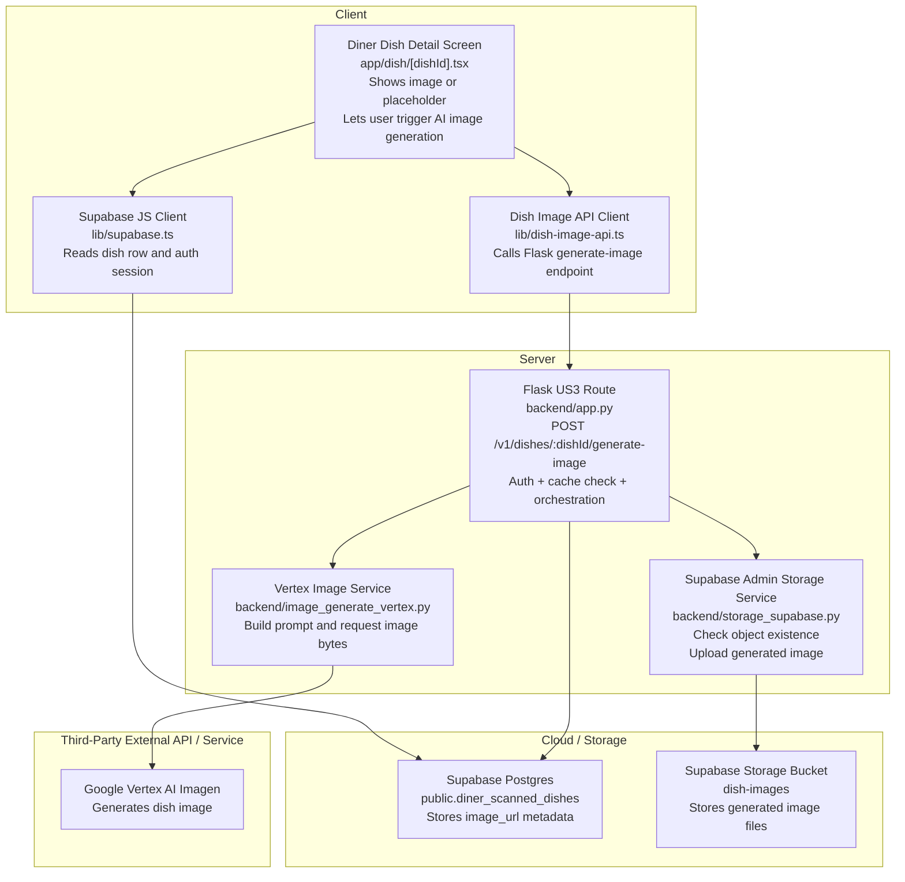
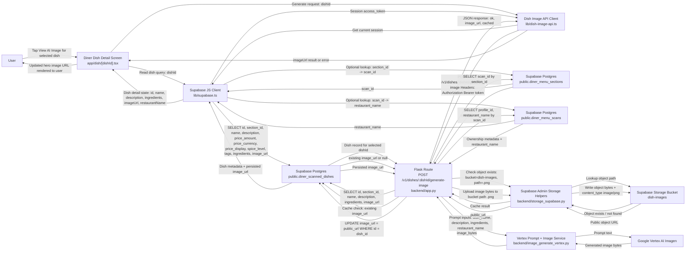
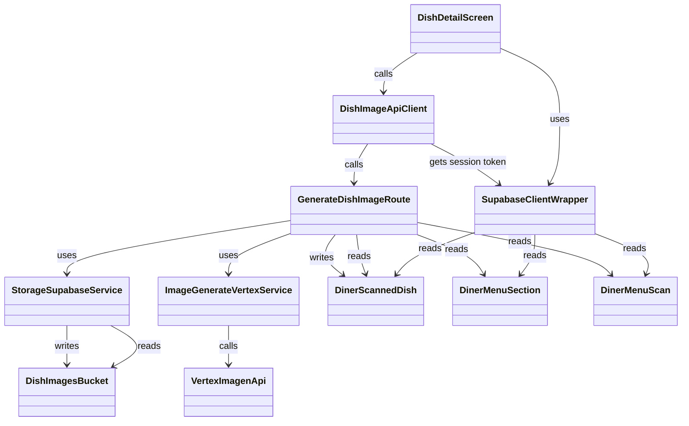

# US3: AI Generated Dish Image

## Owners

- Primary owner: Sofia
- Secondary owner: Yano

## Merge Date

- Merged into `main`: Mar 25, 2026

## Architecture Diagram in Mermaid

## Information Flow Diagram

This diagram focuses on the diner-side US3 data path for generating an AI dish image. It shows the user information and application data that move between the real repository components involved in image lookup, prompt construction, generation, storage, and UI update.

- User information in this flow is limited to the authenticated session bearer token and ownership linkage through `diner_menu_scans.profile_id`; the feature does not send diner preference data into the image generation request.
- Application data flowing through US3 includes `dishId`, `section_id`, `scan_id`, `name`, `description`, `ingredients`, `restaurant_name`, cached `image_url`, storage path `<dish_id>.png`, generated image bytes, returned public URL, and the final `{ ok, image_url, cached }` response.
- The backend has two cache checks before generation: first the persisted `diner_scanned_dishes.image_url`, then the presence of the object in the Supabase `dish-images` bucket at `<dish_id>.png`.
- The frontend only receives the public `image_url` or an error outcome; raw image bytes never return to the client from the Flask API.

Assumptions / Notes
- The Flask backend includes an optional REQUIRE_AUTH flag. If enabled, the route verifies the Supabase JWT bearer token before processing the request.
- The client always attempts to send the session access token when available.

## Class Diagram in Mermaid

This is a module-oriented diagram. The classes represent implementation components, services, and data models used in US3 rather than strict object-oriented classes.

## Classes Relevant to US3

This codebase is largely module-oriented rather than class-oriented. For this section, each exported screen, service module, data model, and directly used infrastructure component in US3 is treated as a “class.”

### 1. DishDetailScreen

**File:** [app/dish/[dishId].tsx](/app/dish/[dishId].tsx)

**Public fields and methods**

- **UI entry point**
  - `DishDetailScreen()`: Default exported React screen component for the diner dish detail page. It loads dish data, displays the current `imageUrl` if present, and lets the diner trigger AI image generation when no image exists.

**Private fields and methods**

- **Screen-local state**
  - `detail`: Holds the normalized dish detail object shown in the UI, including `id`, `restaurantName`, `name`, `priceAmount`, `priceCurrency`, `priceDisplay`, `imageUrl`, `spiceLevel`, `flavorTags`, `dietaryIndicators`, `ingredients`, `summary`, and `description`.
  - `prefs`: Stores the current diner preference snapshot used to compute “why this matches you” content. It is not sent to the image-generation backend for US3.
  - `loading`: Tracks whether the dish detail screen is still loading the initial dish record.
  - `error`: Stores the current dish-load error message shown to the user when the detail query fails.
  - `favorite`: Stores whether the dish is currently favorited. This is adjacent UI state, not part of the image-generation backend flow.
  - `imageLoading`: Tracks whether the AI image generation request is in progress.
  - `imageError`: Stores the user-visible image-generation failure message.

- **Route and navigation state**
  - `router`: Expo Router navigation object used to go back from the detail screen.
  - `insets`: Safe-area inset values used to size the screen layout.
  - `params`: Raw route parameters object from Expo Router.
  - `dishId`: Normalized dish identifier used for both loading the dish and generating the image.
  - `scanId`: Optional normalized scan identifier used to avoid an extra lookup when present.
  - `restaurantParam`: Optional normalized restaurant name route parameter.

- **Rendering and transformation helpers**
  - `titleize(label)`: Normalizes tags into display-ready title case.
  - `deriveFlavorTags(tags, spiceLevel, description)`: Builds user-facing flavor tags from stored tag strings and description text.
  - `deriveDietaryIndicators(tags)`: Filters and normalizes dietary tags for the detail UI.
  - `formatPrice(amount, currency, display)`: Formats the displayed price string for the dish header.
  - `inferBudgetTier(amount)`: Maps numeric price to the app’s budget tier abstraction.
  - `buildFallbackSummary(input)`: Builds a summary string when the stored dish description is missing.
  - `buildWhyThisMatchesYou(detail, prefs)`: Derives match-reason copy from diner preferences and dish metadata.
  - `reasons`: Memoized list of “why this matches you” reasons derived from `detail` and `prefs`.
  - `paddedTop`: Computed top padding used by the screen header.

- **Image-generation behavior**
  - `onGenerateImage()`: Private event handler that guards against duplicate generation, clears the old image error, calls `generateDishImage(detail.id)`, and updates `detail.imageUrl` with the backend-returned public URL on success.

- **Styling/constants**
  - `FIG`: Screen-specific visual constants used to style the dish detail page.
  - `DIETARY_TAGS`: Allowlist of dietary tag strings used to separate dietary indicators from flavor tags.
  - `PRICE_SYMBOL`: Currency symbol mapping used for dish-price rendering.

### 2. DishImageApiClient

**File:** [lib/dish-image-api.ts](/lib/dish-image-api.ts)

**Public fields and methods**

- **Backend API surface**
  - `generateDishImage(dishId)`: Exported client API used by the dish detail screen. It resolves the Flask base URL, gets the current Supabase auth session, sends `POST /v1/dishes/:dishId/generate-image`, parses the JSON response, and returns either `{ ok: true, imageUrl }` or `{ ok: false, error }`.

**Private fields and methods**

- **Configuration**
  - `MENU_API_KEY`: Private environment-variable key constant for `EXPO_PUBLIC_MENU_API_URL`.
  - `getMenuApiBaseUrl()`: Internal helper that reads and trims the configured Flask backend base URL from Expo config or environment variables.

### 3. SupabaseClientWrapper

**File:** [lib/supabase.ts](/lib/supabase.ts)

**Public fields and methods**

- **Shared data-access surface**
  - `supabase`: Exported Supabase JavaScript client instance used by the dish detail screen to read `diner_scanned_dishes`, `diner_menu_sections`, and `diner_menu_scans`, and used by `DishImageApiClient` to obtain the current auth session token.

**Private fields and methods**

- **Configuration fields**
  - `supabaseUrl`: Environment-sourced Supabase project URL used to construct the client.
  - `supabaseAnonKey`: Environment-sourced Supabase anonymous key used to construct the client.
  - `isServer`: Internal boolean used to switch auth storage behavior between server and client environments.
  - `noopStorage`: Minimal no-op storage adapter used when the code is running server-side and AsyncStorage is unavailable.

### 4. GenerateDishImageRoute

**File:** [backend/app.py](/backend/app.py)

**Public fields and methods**

- **HTTP route**
  - `generate_dish_image(dish_id)`: Flask route handler for `POST /v1/dishes/<dish_id>/generate-image`. It authenticates the caller when auth is enabled, loads the dish/section/scan records, validates ownership, checks both DB and storage cache states, generates the image if necessary, uploads it to storage, writes `image_url` back to `diner_scanned_dishes`, and returns `{ ok, image_url, cached }`.

**Private fields and methods**

- **Configuration fields**
  - `DISH_IMAGES_BUCKET`: Bucket name used for generated dish-image storage. Defaults to `dish-images`.

- **Route-local orchestration fields**
  - `payload`: Decoded JWT payload when auth is enabled; used to compare `payload.sub` to `diner_menu_scans.profile_id`.
  - `client`: Service-role Supabase admin client used for DB and storage operations inside the route.
  - `dish`: Loaded `diner_scanned_dishes` record for the target dish.
  - `section`: Loaded `diner_menu_sections` record for the dish’s parent section.
  - `scan`: Loaded `diner_menu_scans` record for ownership and restaurant-name context.
  - `existing_url`: Current trimmed `image_url` from the dish row, used as the first cache check.
  - `storage_path`: Canonical storage object path for generated images, computed as `<dish_id>.png`.
  - `public_url`: Public Supabase Storage URL for the generated or cached object.
  - `ingredients`: Normalized list of ingredient strings used for prompt construction.
  - `prompt`: Prompt text built from dish metadata before calling Vertex Imagen.
  - `image_bytes`: Binary PNG bytes returned by the image-generation service before upload.

### 5. StorageSupabaseService

**File:** [backend/storage_supabase.py](/backend/storage_supabase.py)

**Public fields and methods**

- **Admin client access**
  - `get_supabase_admin()`: Returns a cached service-role Supabase client for server-side DB and storage access.

- **Storage reads**
  - `download_storage_object(bucket, path)`: Downloads a storage object as raw bytes and normalizes the return type to `bytes`.
  - `storage_object_exists(bucket, path)`: Returns `true` when a storage object exists and `false` when the helper determines the object is missing.

- **Storage writes**
  - `upload_storage_object(bucket, path, data, content_type, upsert=True)`: Uploads object bytes to Supabase Storage and returns the resulting public URL.

**Private fields and methods**

- **Connection/cache fields**
  - `_supabase`: Module-level cached service-role Supabase client reused across requests.

- **Error classification helpers**
  - `_looks_like_storage_not_found(exc)`: Detects whether an exception is effectively a storage “not found” result.
  - `_exception_detail(exc)`: Builds an expanded error-detail string for logging and propagated runtime errors.

### 6. ImageGenerateVertexService

**File:** [backend/image_generate_vertex.py](/backend/image_generate_vertex.py)

**Public fields and methods**

- **Prompt construction**
  - `build_dish_image_prompt(dish_name, description, ingredients, restaurant_name)`: Creates the prompt text sent to Vertex AI Imagen using stored dish metadata.

- **Image generation**
  - `generate_dish_image_bytes(prompt)`: Calls the Vertex Imagen model, requests a single 1:1 image, and returns the generated image bytes.

**Private fields and methods**

- **Initialization/cache fields**
  - `_vertex_initialized`: Module-level boolean that avoids repeated Vertex AI initialization.

- **Configuration helpers**
  - `_ensure_vertex()`: Initializes the Vertex AI SDK with `GCP_PROJECT` and `VERTEX_LOCATION` if it has not already been initialized.
  - `_image_model_name()`: Reads the configured image model name, defaulting to `imagen-3.0-fast-generate-001`.

### 7. DinerScannedDish

**Files:** [lib/menu-scan-schema.ts](/lib/menu-scan-schema.ts), [supabase/migrations/20260327120000_diner_menu_sections_and_dishes.sql](/supabase/migrations/20260327120000_diner_menu_sections_and_dishes.sql)

**Public fields and methods**

- **Persisted data fields**
  - `id`: Stable UUID for the dish. This is the primary identifier used by the detail screen and the generate-image route.
  - `section_id`: Foreign key to the parent `diner_menu_sections` row.
  - `sort_order`: Position of the dish within its section.
  - `name`: Dish name used for UI display and image prompt construction.
  - `description`: Optional dish description shown in the UI and passed into prompt construction when available.
  - `price_amount`: Numeric price value used by the detail UI.
  - `price_currency`: ISO currency code used for price formatting.
  - `price_display`: Original price string shown when available.
  - `spice_level`: Normalized spice indicator used by the UI.
  - `tags`: Stored tag strings used for dish-detail presentation.
  - `ingredients`: Stored list of ingredient strings used by the UI and by the image prompt.
  - `image_url`: Persisted public image URL for the generated dish image. This is the primary durable cache field for US3.

**Private fields and methods**

- **None in the TypeScript row type**
  - `DinerScannedDishRow` is a data-shape type, not an executable class, so it has no private methods. Its behavior is provided by the modules that read and write it.

### 8. DinerMenuSection

**Files:** [lib/menu-scan-schema.ts](/lib/menu-scan-schema.ts), [supabase/migrations/20260327120000_diner_menu_sections_and_dishes.sql](/supabase/migrations/20260327120000_diner_menu_sections_and_dishes.sql)

**Public fields and methods**

- **Persisted data fields**
  - `id`: Stable UUID for the menu section.
  - `scan_id`: Foreign key to the parent `diner_menu_scans` row. The generate-image route uses this to locate the owning scan.
  - `title`: Section title text.
  - `sort_order`: Position of the section within the scan.

**Private fields and methods**

- **None in the TypeScript row type**
  - `DinerMenuSectionRow` is a data-shape type only. It has no private methods in the implementation.

### 9. DinerMenuScan

**Files:** [backend/app.py](/backend/app.py), [supabase/migrations/20260327120000_diner_menu_sections_and_dishes.sql](/supabase/migrations/20260327120000_diner_menu_sections_and_dishes.sql)

**Public fields and methods**

- **Persisted data fields used by US3**
  - `id`: Stable UUID for the scanned menu.
  - `profile_id`: Owner profile identifier used by the generate-image route to enforce that the requesting diner owns the scan.
  - `restaurant_name`: Restaurant name used to provide prompt context to the image-generation service and shown on the detail screen.

**Private fields and methods**

- **Needs manual verification**
  - There is no dedicated TypeScript `DinerMenuScanRow` type exported in the current repo slice used for US3. The route and screen read these fields directly from Supabase query results.

### 10. DishImagesBucket

**Files:** [supabase/migrations/20260329120000_storage_dish_images.sql](/supabase/migrations/20260329120000_storage_dish_images.sql), [backend/storage_supabase.py](/backend/storage_supabase.py)

**Public fields and methods**

- **Storage fields**
  - `bucket id`: The bucket identifier `dish-images`.
  - `public`: Bucket visibility flag. The bucket is configured as public so the stored object can be referenced by public URL.
  - `file_size_limit`: Configured maximum object size for stored images.
  - `allowed_mime_types`: Allowed image MIME types for the bucket.

- **Storage operations used by US3**
  - `download(path)`: Read operation used indirectly by `storage_object_exists`.
  - `upload(path, data, options)`: Write operation used to persist the generated image object.
  - `get_public_url(path)`: URL-resolution operation used to populate `diner_scanned_dishes.image_url`.

**Private fields and methods**

- **None in repo-owned code**
  - The bucket is infrastructure rather than an application-defined class, so its internal/private implementation is managed by Supabase rather than this repository.

### 11. VertexImagenApi

**Files:** [backend/image_generate_vertex.py](/backend/image_generate_vertex.py)

**Public fields and methods**

- **External API surface used by US3**
  - `ImageGenerationModel.from_pretrained(model_name)`: Loads the configured Imagen model.
  - `generate_images(prompt, number_of_images, aspect_ratio, safety_filter_level, person_generation)`: Generates the requested image artifact for the provided prompt.

**Private fields and methods**

- **Needs manual verification**
  - Vertex AI Imagen is an external SDK/service. Its internal fields and private methods are not defined in this repository and are therefore not inspectable here.

## Technologies, Libraries, and APIs

This section lists the external technologies used to implement US3: AI Generated Dish Image. It is scoped to the diner-side image-generation feature path that loads a dish, calls the backend, generates an image, stores it in Supabase, and returns the public URL to the client.

### TypeScript (5.9.2)

**Used For:**
- Defining the frontend implementation for US3, including the dish detail screen, typed API client responses, and row/data shapes such as `DinerScannedDishRow`.
- Catching type mismatches in fields such as `image_url`, `ingredients`, `price_amount`, and `spice_level` before runtime.

**Why This Was Chosen:**
- TypeScript was chosen over plain JavaScript because US3 depends on multiple data boundaries: route params, Supabase query results, backend JSON responses, and normalized screen state.
- Strong typing reduces mistakes around nullable fields like `image_url` and makes feature documentation and maintenance easier.

**Source / Documentation:**
- Official documentation: [https://www.typescriptlang.org/docs/](https://www.typescriptlang.org/docs/)
- Maintained by: Microsoft

### React (19.1.0)

**Used For:**
- Powering the `DishDetailScreen` component and its stateful UI behavior for loading, image generation, error handling, and conditional rendering.

**Why This Was Chosen:**
- React was chosen over lower-level UI state management approaches because the app is already structured around declarative component rendering.
- US3 relies on local state transitions such as `loading`, `imageLoading`, `imageError`, and `detail.imageUrl`, which fit React’s model well.

**Source / Documentation:**
- Official documentation: [https://react.dev/](https://react.dev/)
- Maintained by: Meta

### React Native (0.81.5)

**Used For:**
- Rendering the mobile UI for US3, including `View`, `Text`, `Pressable`, `ScrollView`, `ActivityIndicator`, and styling for the dish detail page.

**Why This Was Chosen:**
- React Native was chosen over separate native iOS and Android implementations because the project ships a shared cross-platform app.
- US3 needed standard mobile UI primitives, loading states, and press interactions without duplicating platform-specific code.

**Source / Documentation:**
- Official documentation: [https://reactnative.dev/docs/getting-started](https://reactnative.dev/docs/getting-started)
- Maintained by: Meta

### Expo (54.0.33)

**Used For:**
- Providing the application runtime, bundling, environment integration, and managed React Native development environment used by the US3 frontend.

**Why This Was Chosen:**
- Expo was chosen over a fully bare React Native setup because it simplifies mobile app setup, configuration, and consistent access to Expo libraries already used elsewhere in the project.
- For US3, Expo makes it straightforward to combine routing, config access, image display, and mobile app packaging in one environment.

**Source / Documentation:**
- Official documentation: [https://docs.expo.dev/](https://docs.expo.dev/)
- Maintained by: Expo

### Expo Router (6.0.23)

**Used For:**
- Routing into `app/dish/[dishId].tsx` and resolving route parameters such as `dishId`, `scanId`, and `restaurantName` for the dish detail page.

**Why This Was Chosen:**
- Expo Router was chosen over a manually wired navigation tree because the project uses file-based routes.
- US3 benefits from this because the dish detail page can be modeled directly as `/dish/[dishId]`, which keeps the feature discoverable and consistent with the rest of the app.

**Source / Documentation:**
- Official documentation: [https://docs.expo.dev/router/introduction/](https://docs.expo.dev/router/introduction/)
- Maintained by: Expo

### Expo Image (3.0.11)

**Used For:**
- Rendering the generated dish image from the returned public `image_url` in the dish detail screen and other related image-display surfaces.

**Why This Was Chosen:**
- `expo-image` was chosen over the base React Native image component because it provides a modern Expo-supported image pipeline with good performance and straightforward remote URI rendering.
- US3 specifically needs efficient display of a remotely stored image artifact after generation.

**Source / Documentation:**
- Official documentation: [https://docs.expo.dev/versions/latest/sdk/image/](https://docs.expo.dev/versions/latest/sdk/image/)
- Maintained by: Expo

### Expo Constants (18.0.13)

**Used For:**
- Reading app configuration needed by `lib/dish-image-api.ts`, specifically the backend base URL fallback from Expo config.

**Why This Was Chosen:**
- Expo Constants was chosen over a custom runtime-config layer because the app already uses Expo-managed configuration.
- For US3 it gives a reliable fallback source for `menuApiUrl` when resolving the Flask backend address.

**Source / Documentation:**
- Official documentation: [https://docs.expo.dev/versions/latest/sdk/constants/](https://docs.expo.dev/versions/latest/sdk/constants/)
- Maintained by: Expo

### React Navigation (7.1.8 for `@react-navigation/native`; 7.4.0 for bottom tabs)

**Used For:**
- Supporting the app’s navigation infrastructure that Expo Router builds on, including screen lifecycle and focus behavior around the diner experience that leads into the US3 dish detail screen.

**Why This Was Chosen:**
- React Navigation was chosen over a custom navigation solution because it is the standard navigation foundation in the React Native ecosystem and integrates directly with Expo Router.
- US3 depends on this navigation stack even though the feature code itself uses Expo Router APIs directly.

**Source / Documentation:**
- Official documentation: [https://reactnavigation.org/docs/getting-started](https://reactnavigation.org/docs/getting-started)
- Maintained by: React Navigation maintainers

### Supabase JavaScript Client (`@supabase/supabase-js` 2.100.0)

**Used For:**
- Reading `diner_scanned_dishes`, `diner_menu_sections`, and `diner_menu_scans` from the mobile app.
- Retrieving the current authenticated session and access token before calling the Flask image-generation endpoint.

**Why This Was Chosen:**
- Supabase JS was chosen over writing raw REST or GraphQL calls to the database because the project already uses Supabase as its backend platform.
- It provides typed, direct access to Postgres-backed tables and integrates naturally with Supabase Auth, which US3 uses for token forwarding.

**Source / Documentation:**
- Official documentation: [https://supabase.com/docs/reference/javascript/introduction](https://supabase.com/docs/reference/javascript/introduction)
- Maintained by: Supabase

### AsyncStorage (`@react-native-async-storage/async-storage` 2.2.0)

**Used For:**
- Persisting the client-side Supabase auth session on device so the access token can be reused when the diner requests an AI image.

**Why This Was Chosen:**
- AsyncStorage was chosen over custom device persistence because it is the standard lightweight storage backend used by Supabase Auth in React Native.
- US3 depends on it indirectly so the session survives app restarts and the authorization header can still be attached.

**Source / Documentation:**
- Official documentation: [https://react-native-async-storage.github.io/async-storage/docs/install/](https://react-native-async-storage.github.io/async-storage/docs/install/)
- Maintained by: React Native Async Storage maintainers

### React Native URL Polyfill (`react-native-url-polyfill` 3.0.0)

**Used For:**
- Providing URL and related web-standard behavior needed by the Supabase client in the React Native environment.

**Why This Was Chosen:**
- This was chosen over maintaining custom shims because Supabase JS expects modern URL behavior that is not consistently available in React Native by default.
- US3 relies on the Supabase client, so this dependency is part of the feature’s working runtime stack.

**Source / Documentation:**
- Official documentation: [https://github.com/charpeni/react-native-url-polyfill](https://github.com/charpeni/react-native-url-polyfill)
- Maintained by: Nicolas Charpentier and contributors

### Fetch API (platform API; version based on project environment)

**Used For:**
- Sending the frontend `POST /v1/dishes/:dishId/generate-image` request from the mobile client to the Flask backend.

**Why This Was Chosen:**
- The built-in Fetch API was chosen over adding Axios or another HTTP client because US3 only needs a simple authenticated POST request and JSON parsing flow.
- This keeps the client implementation smaller and avoids another dependency layer.

**Source / Documentation:**
- Official documentation: [https://developer.mozilla.org/en-US/docs/Web/API/Fetch_API](https://developer.mozilla.org/en-US/docs/Web/API/Fetch_API)
- Maintained by: Web platform standard; documented by MDN / browser platform vendors

### Python (version based on project environment)

**Used For:**
- Implementing the backend image-generation route, storage helpers, auth checks, and Vertex AI integration in `backend/app.py`, `backend/storage_supabase.py`, and `backend/image_generate_vertex.py`.

**Why This Was Chosen:**
- Python was chosen over Node or Go for this backend because the repository’s AI/OCR backend stack is already built in Python.
- US3 benefits from the mature Google Cloud AI SDK ecosystem and straightforward backend orchestration code in Python.

**Source / Documentation:**
- Official documentation: [https://docs.python.org/3/](https://docs.python.org/3/)
- Maintained by: Python Software Foundation

### Flask (`flask>=3.0,<4`)

**Used For:**
- Defining the backend HTTP API endpoint `POST /v1/dishes/<dish_id>/generate-image` that orchestrates cache checks, image generation, upload, and DB persistence.

**Why This Was Chosen:**
- Flask was chosen over larger frameworks such as Django or FastAPI because the backend is relatively lightweight and organized around a small number of explicit endpoints.
- US3 only needs a thin request/response layer around Supabase and Vertex calls, which Flask supports with low overhead.

**Source / Documentation:**
- Official documentation: [https://flask.palletsprojects.com/](https://flask.palletsprojects.com/)
- Maintained by: Pallets

### Flask-CORS (`flask-cors>=4.0`)

**Used For:**
- Enabling cross-origin requests from the mobile/web client to the Flask API under `/v1/*`, including the US3 generate-image endpoint.

**Why This Was Chosen:**
- Flask-CORS was chosen over implementing manual CORS header logic because it handles route-level CORS behavior cleanly within Flask.
- US3 needs this so the frontend can call the backend API from development and deployment origins.

**Source / Documentation:**
- Official documentation: [https://flask-cors.readthedocs.io/en/latest/](https://flask-cors.readthedocs.io/en/latest/)
- Maintained by: Cory Dolphin and contributors

### python-dotenv (`python-dotenv>=1.0`)

**Used For:**
- Loading backend environment variables such as `GCP_PROJECT`, `VERTEX_LOCATION`, `DISH_IMAGES_BUCKET`, `SUPABASE_URL`, and `SUPABASE_SERVICE_ROLE_KEY`.

**Why This Was Chosen:**
- `python-dotenv` was chosen over hand-rolled environment-file parsing because it is a standard lightweight solution for local Flask configuration.
- US3 depends on several configuration variables and would be error-prone to initialize manually.

**Source / Documentation:**
- Official documentation: [https://saurabh-kumar.com/python-dotenv/](https://saurabh-kumar.com/python-dotenv/)
- Maintained by: Saurabh Kumar and contributors

### PyJWT (`PyJWT>=2.8`)

**Used For:**
- Optionally verifying the Supabase bearer JWT in the Flask backend when `REQUIRE_AUTH=1` is enabled.

**Why This Was Chosen:**
- PyJWT was chosen over implementing JWT parsing manually because token validation is security-sensitive and should use a maintained library.
- US3 uses this to ensure the diner requesting image generation owns the associated scan when auth enforcement is enabled.

**Source / Documentation:**
- Official documentation: [https://pyjwt.readthedocs.io/en/stable/](https://pyjwt.readthedocs.io/en/stable/)
- Maintained by: PyJWT maintainers

### Supabase Python Client (`supabase>=2.10`)

**Used For:**
- Creating the backend service-role client used to query `diner_scanned_dishes`, `diner_menu_sections`, and `diner_menu_scans`, and to upload/read objects in Supabase Storage.

**Why This Was Chosen:**
- The Supabase Python client was chosen over direct SQL and raw Storage REST calls because it provides one consistent interface for both the database and storage parts of US3.
- This reduces integration code and keeps the backend aligned with the rest of the Supabase-based system.

**Source / Documentation:**
- Official documentation: [https://supabase.com/docs/reference/python/introduction](https://supabase.com/docs/reference/python/introduction)
- Maintained by: Supabase

### Supabase Platform: PostgreSQL Database (platform version managed by Supabase)

**Used For:**
- Persisting the `diner_scanned_dishes.image_url` field and storing the dish, section, and scan records that the backend and frontend read during US3.

**Why This Was Chosen:**
- Supabase Postgres was chosen over Firebase-style document storage because the application already models menus, sections, and dishes as relational data.
- US3 benefits from straightforward SQL-style joins through foreign keys like `dish -> section -> scan`, which is more natural in Postgres than in a document store.

**Source / Documentation:**
- Official documentation: [https://supabase.com/docs/guides/database/overview](https://supabase.com/docs/guides/database/overview)
- Maintained by: Supabase (managed Postgres platform)

### Supabase Platform: Storage (`dish-images` bucket; platform version managed by Supabase)

**Used For:**
- Persisting the generated image artifact itself in the public `dish-images` bucket at paths such as `<dish_id>.png`.
- Returning a public object URL that is saved back to `diner_scanned_dishes.image_url`.

**Why This Was Chosen:**
- Supabase Storage was chosen over storing binary image data directly inside Postgres because object storage is the right abstraction for user-visible media assets.
- It also fits the existing Supabase platform already used by the app, so there is no need to add a separate S3-like media store for US3.

**Source / Documentation:**
- Official documentation: [https://supabase.com/docs/guides/storage](https://supabase.com/docs/guides/storage)
- Maintained by: Supabase

### Google Cloud Platform (platform version managed by Google Cloud)

**Used For:**
- Hosting the Vertex AI service environment that US3 uses for dish image generation.

**Why This Was Chosen:**
- GCP was chosen because the backend already integrates with Google AI services elsewhere in the project, and Vertex AI is the image-generation provider selected for this feature.
- Keeping US3 on the same cloud AI platform avoids splitting credentials and operational setup across multiple AI vendors.

**Source / Documentation:**
- Official documentation: [https://cloud.google.com/docs](https://cloud.google.com/docs)
- Maintained by: Google Cloud

### Vertex AI (service version managed by Google Cloud)

**Used For:**
- Providing the managed AI image-generation service invoked by the backend after prompt construction.

**Why This Was Chosen:**
- Vertex AI was chosen over standalone hosted image APIs because the team already uses Google’s AI stack in the backend and can share project-level credentials and region configuration.
- US3 needs a server-side image-generation service with manageable SDK support, safety settings, and cloud-hosted inference, all of which Vertex AI provides.

**Source / Documentation:**
- Official documentation: [https://cloud.google.com/vertex-ai/docs](https://cloud.google.com/vertex-ai/docs)
- Maintained by: Google Cloud

### Imagen Model via Vertex AI (`imagen-3.0-fast-generate-001`)

**Used For:**
- Generating the actual dish preview image from prompt inputs derived from `name`, `description`, `ingredients`, and `restaurant_name`.

**Why This Was Chosen:**
- The Imagen model was chosen over non-image models because US3 needs a realistic food image artifact, not text completion.
- The configured fast-generate variant appears to be chosen to balance quality and latency for an on-demand mobile UX.

**Source / Documentation:**
- Official documentation: [https://cloud.google.com/vertex-ai/generative-ai/docs/image/overview](https://cloud.google.com/vertex-ai/generative-ai/docs/image/overview)
- Maintained by: Google Cloud

### Google Cloud AI Platform Python SDK (`google-cloud-aiplatform>=1.64,<2`)

**Used For:**
- Giving the backend Python code access to Vertex AI model initialization and image-generation calls through the Vertex SDK.

**Why This Was Chosen:**
- This SDK was chosen over raw HTTP requests to Vertex endpoints because it provides a supported Python interface for model loading and generation requests.
- US3 uses it directly in `image_generate_vertex.py` to initialize Vertex and call `ImageGenerationModel`.

**Source / Documentation:**
- Official documentation: [https://cloud.google.com/python/docs/reference/aiplatform/latest](https://cloud.google.com/python/docs/reference/aiplatform/latest)
- Maintained by: Google Cloud

### Pillow (`Pillow>=10,<12`)

**Used For:**
- Supporting image byte handling in the backend runtime; US3’s Vertex integration includes a fallback path that converts the returned image object to bytes via the SDK’s PIL-backed helper.

**Why This Was Chosen:**
- Pillow was chosen over lower-level imaging libraries because it is the standard Python imaging dependency and integrates cleanly with SDKs that expose PIL-backed image objects.
- Even though US3 does not manipulate the image heavily, it benefits from a reliable image-conversion fallback.

**Source / Documentation:**
- Official documentation: [https://pillow.readthedocs.io/en/stable/](https://pillow.readthedocs.io/en/stable/)
- Maintained by: Pillow Team

## Long-Term Stored Data Types

US3 stores durable metadata in Supabase Postgres and the generated image asset itself in Supabase Storage. The entries below include only long-term stored data directly relevant to the AI Generated Dish Image feature: the dish record that receives `image_url`, the section and scan records used to resolve ownership and prompt context, and the generated image object stored in the `dish-images` bucket.

### 1. Diner Scanned Dish Record

**Storage Location:**
- Supabase Postgres table: `public.diner_scanned_dishes`

**Purpose:**
- Stores the canonical dish row shown on the diner dish detail screen.
- US3 reads this record to obtain the metadata used in image generation and writes back the generated public `image_url`.
- This is also the primary metadata cache for whether a generated image already exists.

**Fields:**

| Field | Logical Type | Purpose | Estimated Size (bytes) | Notes |
|---|---|---|---:|---|
| `id` | UUID | Stable dish identifier used by the detail route and backend generate-image endpoint | 16 | PostgreSQL UUID values are typically 16 bytes internally |
| `section_id` | UUID | Links the dish to its parent section so US3 can resolve the scan and owner | 16 | Same UUID estimate |
| `name` | text | Dish name used in the UI and passed into prompt construction | 48 | Assumes about 40 ASCII characters plus variable-length text overhead |
| `description` | text, nullable | Optional prompt input and user-visible detail text | 96 | Assumes about 88 ASCII characters plus text overhead |
| `ingredients` | text[] | Ingredient strings used directly by prompt construction | 96 | Assumes 4 ingredients averaging 16 bytes each plus array overhead |
| `image_url` | text, nullable | Persisted public URL of the generated image object | 120 | Assumes a Supabase public URL of roughly 100 to 110 characters plus text overhead |

**Estimated Total Size Per Record/Object:**
- Approximately **392 bytes** for the US3-relevant subset of one `diner_scanned_dishes` row.

**Assumptions:**
- The table contains additional fields such as `sort_order`, price fields, `spice_level`, `tags`, and timestamps; those are not counted here because they are not the primary long-term storage outputs or dependencies of US3.
- If `image_url` is null because no image has been generated yet, the row will be smaller by roughly the URL text size.
- PostgreSQL row headers, alignment, and TOAST behavior can change the actual on-disk size.

### 2. Diner Menu Section Record

**Storage Location:**
- Supabase Postgres table: `public.diner_menu_sections`

**Purpose:**
- Stores the menu section that owns the dish.
- US3 uses this record to resolve `scan_id` from `section_id`, which allows the backend to find the scan owner and restaurant context.

**Fields:**

| Field | Logical Type | Purpose | Estimated Size (bytes) | Notes |
|---|---|---|---:|---|
| `id` | UUID | Stable section identifier referenced by `diner_scanned_dishes.section_id` | 16 | Standard UUID estimate |
| `scan_id` | UUID | Parent menu scan identifier used by US3 to resolve ownership and restaurant context | 16 | Standard UUID estimate |
| `title` | text | Human-readable section title stored with the section record | 40 | Assumes about 32 ASCII characters plus text overhead |

**Estimated Total Size Per Record/Object:**
- Approximately **72 bytes** for the US3-relevant subset of one `diner_menu_sections` row.

**Assumptions:**
- `title` is included because it is part of the persisted section record, even though the current US3 prompt does not use it.
- `sort_order` and `created_at` are omitted because they are not materially involved in the AI image generation feature path.

### 3. Diner Menu Scan Record

**Storage Location:**
- Supabase Postgres table: `public.diner_menu_scans`

**Purpose:**
- Stores the parent diner menu scan record.
- US3 uses this row to confirm the requesting diner owns the dish via `profile_id` and to retrieve `restaurant_name` for prompt context.

**Fields:**

| Field | Logical Type | Purpose | Estimated Size (bytes) | Notes |
|---|---|---|---:|---|
| `id` | UUID | Stable scan identifier referenced by `diner_menu_sections.scan_id` | 16 | Standard UUID estimate |
| `profile_id` | UUID | Diner owner identifier used by the backend to enforce authorization | 16 | Standard UUID estimate |
| `restaurant_name` | text, nullable | Restaurant context added to the Vertex image prompt and shown in the UI | 48 | Assumes about 40 ASCII characters plus text overhead |

**Estimated Total Size Per Record/Object:**
- Approximately **80 bytes** for the US3-relevant subset of one `diner_menu_scans` row.

**Assumptions:**
- The original `diner_menu_scans` migration created a `parsed_menu jsonb` column, but a later migration in the repo removes that legacy column. It is therefore excluded from the current storage estimate.
- `scanned_at`, `created_at`, and `updated_at` are not counted because they are not directly required by US3.

### 4. Generated Dish Image Object

**Storage Location:**
- Supabase Storage bucket: `dish-images`
- Object path pattern used by US3: `<dish_id>.png`

**Purpose:**
- Stores the actual generated dish image bytes returned by Vertex AI Imagen.
- This is the durable media asset rendered back to the diner after generation.
- It also acts as an object-level cache: if the object already exists at `<dish_id>.png`, the backend can restore `image_url` without regenerating the image.

**Fields:**

| Field | Logical Type | Purpose | Estimated Size (bytes) | Notes |
|---|---|---|---:|---|
| `object path` | storage key string | Unique object key used to store and retrieve the generated image | 40 | Assumes a 36-character UUID plus the 4-character `.png` suffix |
| `content_type` | MIME type string | Upload metadata indicating the object is stored as `image/png` | 9 | Literal ASCII length of `image/png`; provider metadata overhead not included |
| `image bytes` | binary PNG image | The generated visual asset itself | 262144 | Assumes roughly 256 KB for a 1:1 generated PNG food image; actual output can vary widely |

**Estimated Total Size Per Record/Object:**
- Approximately **262,193 bytes** total, or about **256 KB** plus minimal object key and content-type metadata.

**Assumptions:**
- The actual binary size is not fixed by the repository and depends on Vertex output characteristics and PNG compression.
- The bucket configuration permits files up to 5,242,880 bytes (5 MB), so real generated images may be larger than this estimate.
- Supabase Storage maintains additional provider-managed metadata that is not directly exposed in this repository and is not counted here.

### 5. Persisted Public Image URL Value

**Storage Location:**
- Stored in `public.diner_scanned_dishes.image_url`
- Derived from the public object stored in the Supabase Storage `dish-images` bucket

**Purpose:**
- Provides the durable public pointer that the frontend can render directly with `expo-image`.
- This value is the long-term linkage between the relational dish record and the binary object in storage.

**Fields:**

| Field | Logical Type | Purpose | Estimated Size (bytes) | Notes |
|---|---|---|---:|---|
| `image_url` | URL string | Public URI for the generated image object | 120 | Assumes roughly 100 to 110 characters plus text overhead for a Supabase public URL |

**Estimated Total Size Per Record/Object:**
- Approximately **120 bytes**.

**Assumptions:**
- This value is already included inside the `Diner Scanned Dish Record` estimate above.
- It is broken out separately here because it is the main US3-specific metadata artifact produced by the feature and consumed by the client.

## Failure Mode Analysis

This section analyzes how the current US3 implementation behaves when parts of the dish-image generation path fail. It focuses on the diner dish detail screen, the `generateDishImage` client call, the Flask `POST /v1/dishes/<dish_id>/generate-image` route, Supabase Postgres and Storage, and Vertex AI image generation.

### 1. Frontend Application Crashed Its Process

**User-Visible Effects**
- If the app crashes before the request is sent, the diner is returned to the OS/app launcher and no image is generated.
- If the app crashes while `imageLoading` is active, the diner sees the screen disappear and loses the in-progress spinner state.
- After reopening the app and returning to the dish detail screen, the diner may still see the generated image if the backend already completed and persisted `diner_scanned_dishes.image_url`.
- If the backend did not finish before the crash, the dish detail page reopens with the placeholder and the diner must tap `View AI Image` again.

**Internally-Visible Effects**
- Client runtime state in `detail`, `imageLoading`, and `imageError` is lost immediately.
- No long-term frontend data is corrupted by the crash because US3 does not persist image-generation UI state locally.
- If the backend completed generation before the crash, Postgres may already contain the new `image_url` and the `dish-images` bucket may already contain `<dish_id>.png`.
- If the request was in flight, engineers may observe a completed backend request with no corresponding client-side success handling.

### 2. Frontend Application Lost All Its Runtime State

**User-Visible Effects**
- The dish detail screen resets to its initial loading behavior and reloads the dish from Supabase.
- The diner loses transient UI state such as `imageLoading`, `imageError`, and any in-memory `detail.imageUrl` update that had not yet been re-fetched.
- If the image had already been persisted to `diner_scanned_dishes.image_url`, the next load shows the image normally.
- If generation had not yet completed, the diner sees the placeholder again and may retry.

**Internally-Visible Effects**
- This is effectively a soft reset of React state, not a long-term storage failure.
- The backend and storage state remain authoritative, so any completed `image_url` write survives.
- Duplicate generation requests are possible if the UI resets before it sees a successful response and the diner taps again.

### 3. Frontend Application Erased All Stored Data

**User-Visible Effects**
- The diner may be signed out if the Supabase auth session stored through AsyncStorage is erased.
- If signed out, the `generateDishImage` client may stop sending a bearer token; depending on backend `REQUIRE_AUTH` configuration, the request may fail with unauthorized or still proceed if auth enforcement is disabled.
- The screen itself can still re-fetch public data only if the surrounding app auth and RLS conditions allow it; otherwise the diner may be blocked from reaching the feature path.

**Internally-Visible Effects**
- The most relevant erased frontend-stored data for US3 is the persisted auth session token, not the generated image itself.
- Postgres rows and the `dish-images` bucket are unaffected because they are server-side long-term storage.
- This scenario does not directly delete `diner_scanned_dishes.image_url` or the generated object path.

### 4. Frontend Application Noticed That Some Data in the Database Appeared Corrupt

**User-Visible Effects**
- If `diner_scanned_dishes.image_url` is malformed or points to a missing object, the diner may see a broken or missing hero image even though the record claims an image exists.
- If `name`, `description`, or `ingredients` are corrupt, the generated image may look unrelated to the real dish because prompt construction uses bad metadata.
- If `section_id` or scan linkage data are corrupt, the backend may fail with errors such as `dish section not found`, `scan not found`, or `unauthorized`.
- The current frontend does not have a specialized corruption-recovery UI; it will generally fall back to generic error text such as `Unable to generate AI image right now.`

**Internally-Visible Effects**
- The backend route will surface data-integrity failures through 404/401/502 JSON responses depending on which lookup fails.
- A stale `image_url` combined with a missing object can produce a persistent mismatch between Postgres metadata and Storage state.
- If the DB field is blank but the object still exists in Storage, the backend partially mitigates corruption by restoring `image_url` from `dish-images/<dish_id>.png`.
- There is no explicit schema-level corruption detector in the US3 frontend beyond failed reads or failed image rendering.

### 5. Remote Procedure Call Failed

**User-Visible Effects**
- If the `generateDishImage` fetch call fails, the diner remains on the dish detail page with the placeholder image.
- `imageLoading` stops and `imageError` is set to a user-facing failure message, so the diner sees that AI image generation did not complete.
- The diner can retry by pressing `View AI Image` again.

**Internally-Visible Effects**
- The failure can occur between the mobile client and Flask, or between Flask and Vertex/Supabase services.
- The client maps network/JSON/HTTP failures into `{ ok: false, error }`, but the screen currently collapses these into a generic message rather than exposing backend detail.
- No new long-term data is written if the route fails before `image_url` persistence.
- If the backend generated and uploaded the image but failed before returning the response, the diner may see failure even though `image_url` and the storage object were actually written.

### 6. Client Overloaded

**User-Visible Effects**
- The dish detail screen may feel slow to respond, and the `View AI Image` tap may lag before the loading spinner appears.
- Rendering of the generated image or placeholder may stutter.
- The diner may tap multiple times if the UI appears frozen, potentially causing repeated requests once the event queue catches up.

**Internally-Visible Effects**
- `imageLoading` is intended to prevent duplicate generation requests, but an overloaded client can still create a poor UX before that state visibly updates.
- The backend cache checks reduce the impact of duplicate requests: once `image_url` exists or `<dish_id>.png` already exists, later requests resolve as cached instead of regenerating.
- No direct long-term data corruption is implied, but repeated requests can produce unnecessary backend load.

### 7. Client Out of RAM

**User-Visible Effects**
- The app may terminate, restart, or fail to render the detail screen correctly.
- The diner may lose the current loading state and need to reopen the dish detail page.
- If the generated image is large, image display may become unstable on lower-memory devices.

**Internally-Visible Effects**
- This resembles a process crash from the perspective of US3 state: `detail`, `imageLoading`, and `imageError` are lost.
- Long-term storage remains intact unless the backend request was interrupted before completion.
- If the backend completed independently, the next dish reload should still show the persisted `image_url`.

### 8. Database Out of Space

**User-Visible Effects**
- The diner may be able to trigger generation, but the image may never appear on refresh if the backend cannot persist `diner_scanned_dishes.image_url`.
- The frontend may repeatedly show the placeholder and generic generation failure message.
- In a partial-failure case, the diner may get inconsistent behavior: generation appears to fail even though an image object exists in Storage.

**Internally-Visible Effects**
- The Flask route can still potentially generate the image and upload it to the `dish-images` bucket before the `UPDATE diner_scanned_dishes SET image_url = public_url` fails.
- That would create an orphaned or semi-orphaned storage object: `<dish_id>.png` exists, but the DB metadata write failed.
- The implementation partially mitigates this on future retries because `storage_object_exists` can detect the object and attempt to restore the missing `image_url`.
- Operators would see DB write failures on the update step rather than generation failures.

### 9. Lost Its Network Connectivity

**User-Visible Effects**
- The diner cannot call the backend from the dish detail screen, so the image generation request fails quickly or times out.
- The placeholder remains, `imageLoading` ends, and the diner sees the generic image-generation failure message.
- If the image had already been persisted previously, a fresh page load may still show the image if the existing `image_url` was already available before connectivity dropped and the resource remains cached locally by platform/image stack behavior; otherwise the image may not load.

**Internally-Visible Effects**
- The client-side `fetch` in `generateDishImage` returns a network error and no backend work starts.
- No Postgres rows or storage objects are changed if the request never reaches Flask.
- If connectivity is lost after the request reaches the server, backend work may still complete, producing a mismatch where the user saw failure but `image_url` was persisted.

### 10. Lost Access to Its Database

**User-Visible Effects**
- The dish detail page may fail to load entirely because the frontend cannot fetch `diner_scanned_dishes`.
- Even if the backend route is reachable, image generation fails because the route cannot load the dish, section, or scan records required for prompt construction and authorization.
- The diner will see either the dish-load error state or the generic AI image failure message, depending on where the failure occurs.

**Internally-Visible Effects**
- The Flask route depends on Postgres reads for `diner_scanned_dishes`, `diner_menu_sections`, and `diner_menu_scans`; loss of DB access prevents normal route execution.
- If DB access fails before cache or prompt construction, no new object is uploaded to Storage.
- If DB access fails after upload but before `image_url` update, a storage object may exist without a matching persisted URL.
- Operators would observe Supabase client query/update failures rather than Vertex generation failures.

### 11. Bot Signs Up and Spams Users

**User-Visible Effects**
- US3 is not a user-to-user messaging feature, so there is no direct “spam other users with generated images” path in the current implementation.
- The more realistic user-visible impact is service degradation: image generation becomes slower, more failure-prone, or unavailable if bots repeatedly trigger `View AI Image` across many dishes.
- Legitimate diners may see more loading time, more generic failures, or delayed image availability.

**Internally-Visible Effects**
- The current US3 implementation does not show explicit rate limiting, abuse detection, CAPTCHA, or per-user generation quotas in the documented route.
- A bot could drive up repeated backend calls to `/v1/dishes/<dish_id>/generate-image`, increasing Vertex usage and backend/storage load.
- The cache design limits repeated cost per dish after the first successful generation because existing `image_url` or an existing `<dish_id>.png` object causes cached responses.
- However, bots can still create load by generating images for many unique dishes or by forcing repeated requests before initial completion.
