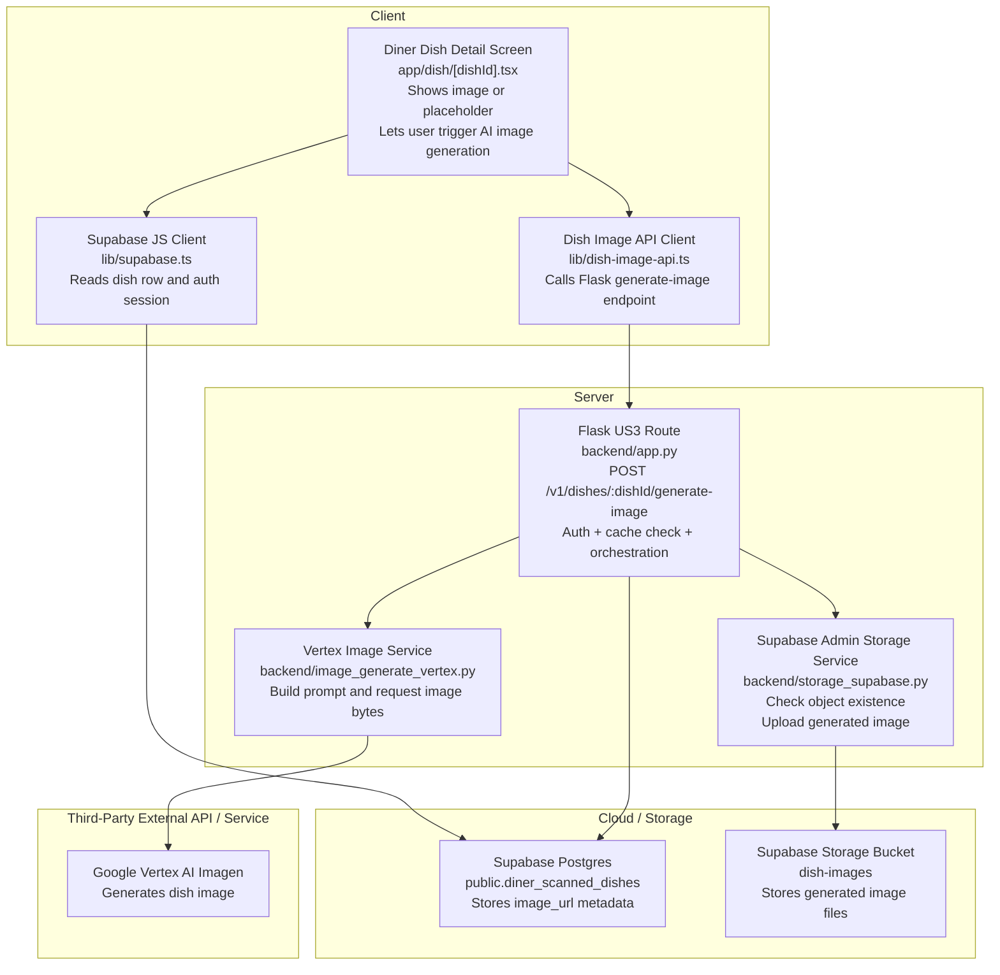
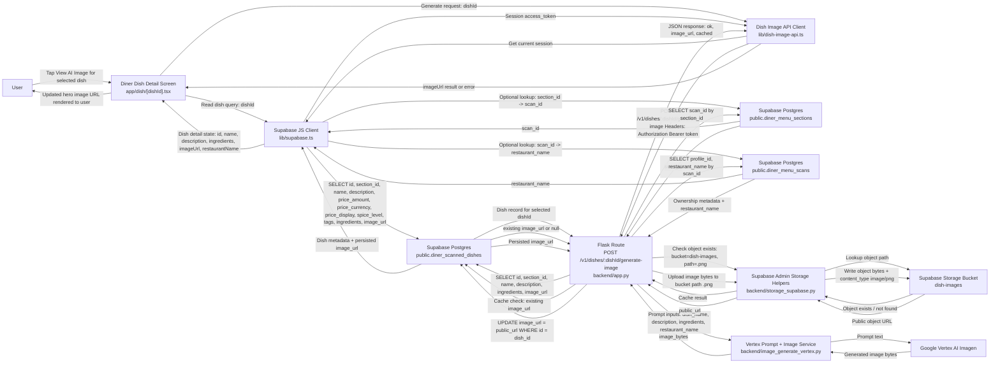

# US3: AI Generated Dish Image

## Owners

- Primary owner: Sofia
- Secondary owner: Yano

## Merge Date

- Merged into `main`: Mar 25, 2026

## Architecture Diagram in Mermaid

## Information Flow Diagram

This diagram focuses on the diner-side US3 data path for generating an AI dish image. It shows the user information and application data that move between the real repository components involved in image lookup, prompt construction, generation, storage, and UI update.

- User information in this flow is limited to the authenticated session bearer token and ownership linkage through `diner_menu_scans.profile_id`; the feature does not send diner preference data into the image generation request.
- Application data flowing through US3 includes `dishId`, `section_id`, `scan_id`, `name`, `description`, `ingredients`, `restaurant_name`, cached `image_url`, storage path `<dish_id>.png`, generated image bytes, returned public URL, and the final `{ ok, image_url, cached }` response.
- The backend has two cache checks before generation: first the persisted `diner_scanned_dishes.image_url`, then the presence of the object in the Supabase `dish-images` bucket at `<dish_id>.png`.
- The frontend only receives the public `image_url` or an error outcome; raw image bytes never return to the client from the Flask API.

Needs Manual Verification:
- `REQUIRE_AUTH` is optional in the Flask app, so bearer-token verification is conditional on deployment configuration. The client still sends the session token when available.
