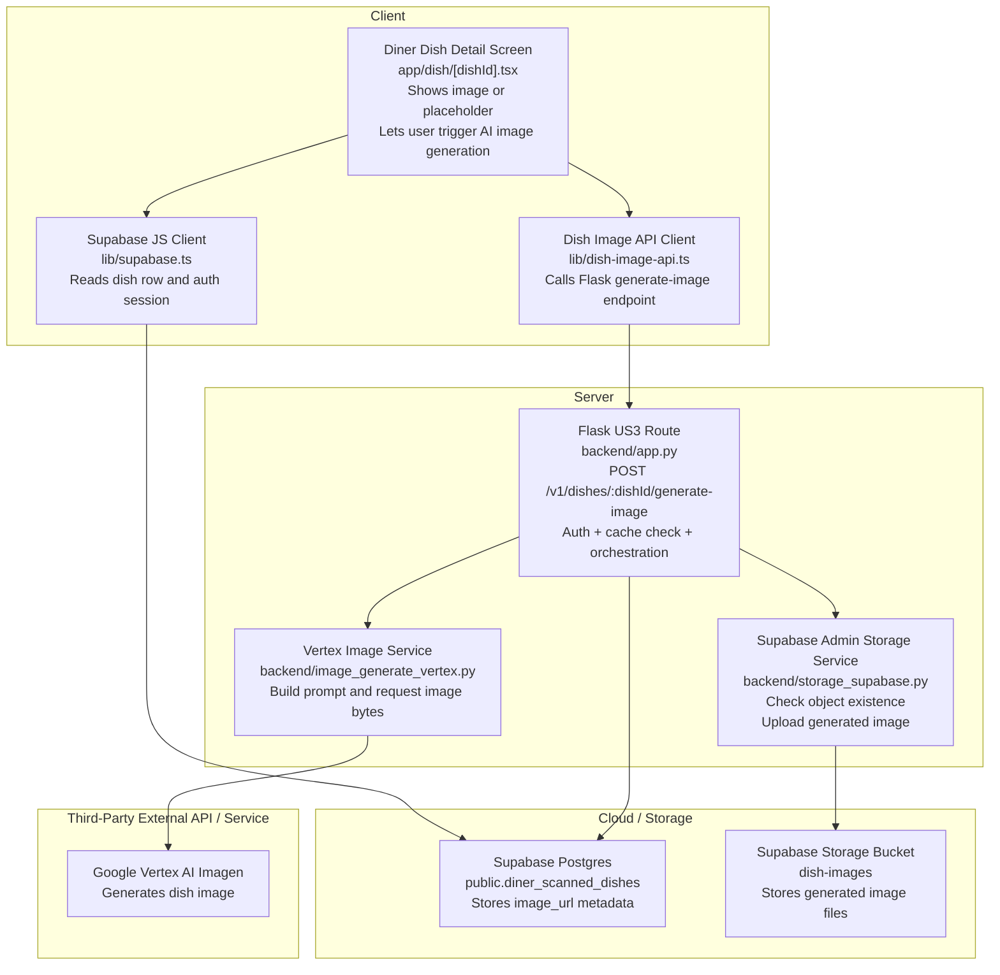

# US3: AI Generated Dish Image

## Owners

- Primary owner: Sofia
- Secondary owner: Yano

## Merge Date

- Merged into `main`: Mar 25, 2026

## Architecture Diagram in Mermaid

```mermaid
flowchart TB
  subgraph Client["Client"]
    DishDetail["Diner Dish Detail Screen\napp/dish/[dishId].tsx\nShows image or placeholder\nLets user trigger AI image generation"]
    DishImageApi["Dish Image API Client\nlib/dish-image-api.ts\nCalls Flask generate-image endpoint"]
    SupabaseClient["Supabase JS Client\nlib/supabase.ts\nReads dish row and auth session"]
  end

  subgraph Server["Server"]
    FlaskRoute["Flask US3 Route\nbackend/app.py\nPOST /v1/dishes/:dishId/generate-image\nAuth + cache check + orchestration"]
    StorageService["Supabase Admin Storage Service\nbackend/storage_supabase.py\nCheck object existence\nUpload generated image"]
    VertexService["Vertex Image Service\nbackend/image_generate_vertex.py\nBuild prompt and request image bytes"]
  end

  subgraph Cloud["Cloud / Storage"]
    DishTable["Supabase Postgres\npublic.diner_scanned_dishes\nStores image_url metadata"]
    DishBucket["Supabase Storage Bucket\ndish-images\nStores generated image files"]
  end

  subgraph External["Third-Party External API / Service"]
    VertexImagen["Google Vertex AI Imagen\nGenerates dish image"]
  end

  DishDetail --> DishImageApi
  DishDetail --> SupabaseClient
  DishImageApi --> FlaskRoute
  SupabaseClient --> DishTable

  FlaskRoute --> DishTable
  FlaskRoute --> StorageService
  FlaskRoute --> VertexService

  StorageService --> DishBucket
  VertexService --> VertexImagen
```
