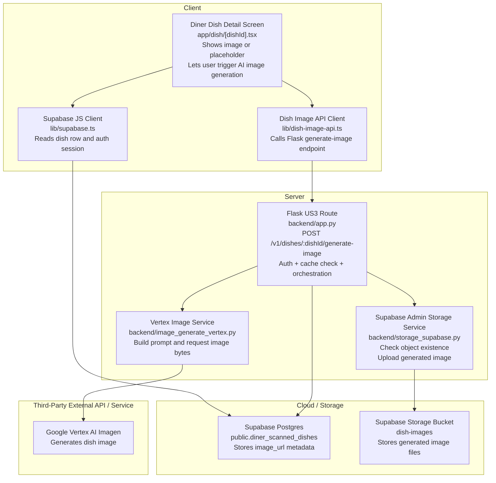
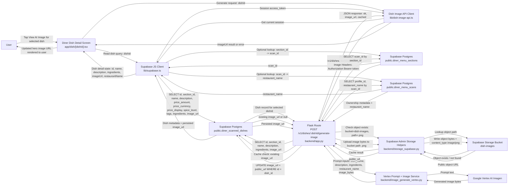
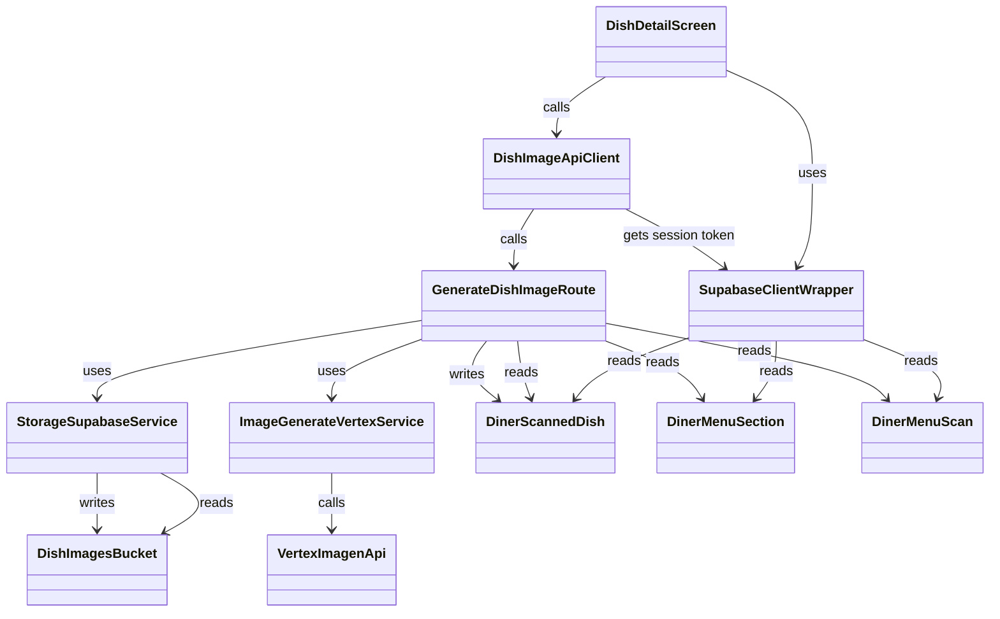

# US3: AI Generated Dish Image

## Owners

- Primary owner: Sofia
- Secondary owner: Yano

## Merge Date

- Merged into `main`: Mar 25, 2026

## Architecture Diagram in Mermaid

## Information Flow Diagram

This diagram focuses on the diner-side US3 data path for generating an AI dish image. It shows the user information and application data that move between the real repository components involved in image lookup, prompt construction, generation, storage, and UI update.

- User information in this flow is limited to the authenticated session bearer token and ownership linkage through `diner_menu_scans.profile_id`; the feature does not send diner preference data into the image generation request.
- Application data flowing through US3 includes `dishId`, `section_id`, `scan_id`, `name`, `description`, `ingredients`, `restaurant_name`, cached `image_url`, storage path `<dish_id>.png`, generated image bytes, returned public URL, and the final `{ ok, image_url, cached }` response.
- The backend has two cache checks before generation: first the persisted `diner_scanned_dishes.image_url`, then the presence of the object in the Supabase `dish-images` bucket at `<dish_id>.png`.
- The frontend only receives the public `image_url` or an error outcome; raw image bytes never return to the client from the Flask API.

Assumptions / Notes
- The Flask backend includes an optional REQUIRE_AUTH flag. If enabled, the route verifies the Supabase JWT bearer token before processing the request.
- The client always attempts to send the session access token when available.

## Class Diagram in Mermaid

This is a module-oriented diagram. The classes represent implementation components, services, and data models used in US3 rather than strict object-oriented classes.

## Classes Relevant to US3

This codebase is largely module-oriented rather than class-oriented. For this section, each exported screen, service module, data model, and directly used infrastructure component in US3 is treated as a “class.”

### 1. DishDetailScreen

**File:** [app/dish/[dishId].tsx](/Users/sofiayu/Desktop/2025-2026/17356/PickMyPlate2/app/dish/[dishId].tsx)

**Public fields and methods**

- **UI entry point**
  - `DishDetailScreen()`: Default exported React screen component for the diner dish detail page. It loads dish data, displays the current `imageUrl` if present, and lets the diner trigger AI image generation when no image exists.

**Private fields and methods**

- **Screen-local state**
  - `detail`: Holds the normalized dish detail object shown in the UI, including `id`, `restaurantName`, `name`, `priceAmount`, `priceCurrency`, `priceDisplay`, `imageUrl`, `spiceLevel`, `flavorTags`, `dietaryIndicators`, `ingredients`, `summary`, and `description`.
  - `prefs`: Stores the current diner preference snapshot used to compute “why this matches you” content. It is not sent to the image-generation backend for US3.
  - `loading`: Tracks whether the dish detail screen is still loading the initial dish record.
  - `error`: Stores the current dish-load error message shown to the user when the detail query fails.
  - `favorite`: Stores whether the dish is currently favorited. This is adjacent UI state, not part of the image-generation backend flow.
  - `imageLoading`: Tracks whether the AI image generation request is in progress.
  - `imageError`: Stores the user-visible image-generation failure message.

- **Route and navigation state**
  - `router`: Expo Router navigation object used to go back from the detail screen.
  - `insets`: Safe-area inset values used to size the screen layout.
  - `params`: Raw route parameters object from Expo Router.
  - `dishId`: Normalized dish identifier used for both loading the dish and generating the image.
  - `scanId`: Optional normalized scan identifier used to avoid an extra lookup when present.
  - `restaurantParam`: Optional normalized restaurant name route parameter.

- **Rendering and transformation helpers**
  - `titleize(label)`: Normalizes tags into display-ready title case.
  - `deriveFlavorTags(tags, spiceLevel, description)`: Builds user-facing flavor tags from stored tag strings and description text.
  - `deriveDietaryIndicators(tags)`: Filters and normalizes dietary tags for the detail UI.
  - `formatPrice(amount, currency, display)`: Formats the displayed price string for the dish header.
  - `inferBudgetTier(amount)`: Maps numeric price to the app’s budget tier abstraction.
  - `buildFallbackSummary(input)`: Builds a summary string when the stored dish description is missing.
  - `buildWhyThisMatchesYou(detail, prefs)`: Derives match-reason copy from diner preferences and dish metadata.
  - `reasons`: Memoized list of “why this matches you” reasons derived from `detail` and `prefs`.
  - `paddedTop`: Computed top padding used by the screen header.

- **Image-generation behavior**
  - `onGenerateImage()`: Private event handler that guards against duplicate generation, clears the old image error, calls `generateDishImage(detail.id)`, and updates `detail.imageUrl` with the backend-returned public URL on success.

- **Styling/constants**
  - `FIG`: Screen-specific visual constants used to style the dish detail page.
  - `DIETARY_TAGS`: Allowlist of dietary tag strings used to separate dietary indicators from flavor tags.
  - `PRICE_SYMBOL`: Currency symbol mapping used for dish-price rendering.

### 2. DishImageApiClient

**File:** [lib/dish-image-api.ts](/Users/sofiayu/Desktop/2025-2026/17356/PickMyPlate2/lib/dish-image-api.ts)

**Public fields and methods**

- **Backend API surface**
  - `generateDishImage(dishId)`: Exported client API used by the dish detail screen. It resolves the Flask base URL, gets the current Supabase auth session, sends `POST /v1/dishes/:dishId/generate-image`, parses the JSON response, and returns either `{ ok: true, imageUrl }` or `{ ok: false, error }`.

**Private fields and methods**

- **Configuration**
  - `MENU_API_KEY`: Private environment-variable key constant for `EXPO_PUBLIC_MENU_API_URL`.
  - `getMenuApiBaseUrl()`: Internal helper that reads and trims the configured Flask backend base URL from Expo config or environment variables.

### 3. SupabaseClientWrapper

**File:** [lib/supabase.ts](/Users/sofiayu/Desktop/2025-2026/17356/PickMyPlate2/lib/supabase.ts)

**Public fields and methods**

- **Shared data-access surface**
  - `supabase`: Exported Supabase JavaScript client instance used by the dish detail screen to read `diner_scanned_dishes`, `diner_menu_sections`, and `diner_menu_scans`, and used by `DishImageApiClient` to obtain the current auth session token.

**Private fields and methods**

- **Configuration fields**
  - `supabaseUrl`: Environment-sourced Supabase project URL used to construct the client.
  - `supabaseAnonKey`: Environment-sourced Supabase anonymous key used to construct the client.
  - `isServer`: Internal boolean used to switch auth storage behavior between server and client environments.
  - `noopStorage`: Minimal no-op storage adapter used when the code is running server-side and AsyncStorage is unavailable.

### 4. GenerateDishImageRoute

**File:** [backend/app.py](/Users/sofiayu/Desktop/2025-2026/17356/PickMyPlate2/backend/app.py)

**Public fields and methods**

- **HTTP route**
  - `generate_dish_image(dish_id)`: Flask route handler for `POST /v1/dishes/<dish_id>/generate-image`. It authenticates the caller when auth is enabled, loads the dish/section/scan records, validates ownership, checks both DB and storage cache states, generates the image if necessary, uploads it to storage, writes `image_url` back to `diner_scanned_dishes`, and returns `{ ok, image_url, cached }`.

**Private fields and methods**

- **Configuration fields**
  - `DISH_IMAGES_BUCKET`: Bucket name used for generated dish-image storage. Defaults to `dish-images`.

- **Route-local orchestration fields**
  - `payload`: Decoded JWT payload when auth is enabled; used to compare `payload.sub` to `diner_menu_scans.profile_id`.
  - `client`: Service-role Supabase admin client used for DB and storage operations inside the route.
  - `dish`: Loaded `diner_scanned_dishes` record for the target dish.
  - `section`: Loaded `diner_menu_sections` record for the dish’s parent section.
  - `scan`: Loaded `diner_menu_scans` record for ownership and restaurant-name context.
  - `existing_url`: Current trimmed `image_url` from the dish row, used as the first cache check.
  - `storage_path`: Canonical storage object path for generated images, computed as `<dish_id>.png`.
  - `public_url`: Public Supabase Storage URL for the generated or cached object.
  - `ingredients`: Normalized list of ingredient strings used for prompt construction.
  - `prompt`: Prompt text built from dish metadata before calling Vertex Imagen.
  - `image_bytes`: Binary PNG bytes returned by the image-generation service before upload.

### 5. StorageSupabaseService

**File:** [backend/storage_supabase.py](/Users/sofiayu/Desktop/2025-2026/17356/PickMyPlate2/backend/storage_supabase.py)

**Public fields and methods**

- **Admin client access**
  - `get_supabase_admin()`: Returns a cached service-role Supabase client for server-side DB and storage access.

- **Storage reads**
  - `download_storage_object(bucket, path)`: Downloads a storage object as raw bytes and normalizes the return type to `bytes`.
  - `storage_object_exists(bucket, path)`: Returns `true` when a storage object exists and `false` when the helper determines the object is missing.

- **Storage writes**
  - `upload_storage_object(bucket, path, data, content_type, upsert=True)`: Uploads object bytes to Supabase Storage and returns the resulting public URL.

**Private fields and methods**

- **Connection/cache fields**
  - `_supabase`: Module-level cached service-role Supabase client reused across requests.

- **Error classification helpers**
  - `_looks_like_storage_not_found(exc)`: Detects whether an exception is effectively a storage “not found” result.
  - `_exception_detail(exc)`: Builds an expanded error-detail string for logging and propagated runtime errors.

### 6. ImageGenerateVertexService

**File:** [backend/image_generate_vertex.py](/Users/sofiayu/Desktop/2025-2026/17356/PickMyPlate2/backend/image_generate_vertex.py)

**Public fields and methods**

- **Prompt construction**
  - `build_dish_image_prompt(dish_name, description, ingredients, restaurant_name)`: Creates the prompt text sent to Vertex AI Imagen using stored dish metadata.

- **Image generation**
  - `generate_dish_image_bytes(prompt)`: Calls the Vertex Imagen model, requests a single 1:1 image, and returns the generated image bytes.

**Private fields and methods**

- **Initialization/cache fields**
  - `_vertex_initialized`: Module-level boolean that avoids repeated Vertex AI initialization.

- **Configuration helpers**
  - `_ensure_vertex()`: Initializes the Vertex AI SDK with `GCP_PROJECT` and `VERTEX_LOCATION` if it has not already been initialized.
  - `_image_model_name()`: Reads the configured image model name, defaulting to `imagen-3.0-fast-generate-001`.

### 7. DinerScannedDish

**Files:** [lib/menu-scan-schema.ts](/Users/sofiayu/Desktop/2025-2026/17356/PickMyPlate2/lib/menu-scan-schema.ts), [supabase/migrations/20260327120000_diner_menu_sections_and_dishes.sql](/Users/sofiayu/Desktop/2025-2026/17356/PickMyPlate2/supabase/migrations/20260327120000_diner_menu_sections_and_dishes.sql)

**Public fields and methods**

- **Persisted data fields**
  - `id`: Stable UUID for the dish. This is the primary identifier used by the detail screen and the generate-image route.
  - `section_id`: Foreign key to the parent `diner_menu_sections` row.
  - `sort_order`: Position of the dish within its section.
  - `name`: Dish name used for UI display and image prompt construction.
  - `description`: Optional dish description shown in the UI and passed into prompt construction when available.
  - `price_amount`: Numeric price value used by the detail UI.
  - `price_currency`: ISO currency code used for price formatting.
  - `price_display`: Original price string shown when available.
  - `spice_level`: Normalized spice indicator used by the UI.
  - `tags`: Stored tag strings used for dish-detail presentation.
  - `ingredients`: Stored list of ingredient strings used by the UI and by the image prompt.
  - `image_url`: Persisted public image URL for the generated dish image. This is the primary durable cache field for US3.

**Private fields and methods**

- **None in the TypeScript row type**
  - `DinerScannedDishRow` is a data-shape type, not an executable class, so it has no private methods. Its behavior is provided by the modules that read and write it.

### 8. DinerMenuSection

**Files:** [lib/menu-scan-schema.ts](/Users/sofiayu/Desktop/2025-2026/17356/PickMyPlate2/lib/menu-scan-schema.ts), [supabase/migrations/20260327120000_diner_menu_sections_and_dishes.sql](/Users/sofiayu/Desktop/2025-2026/17356/PickMyPlate2/supabase/migrations/20260327120000_diner_menu_sections_and_dishes.sql)

**Public fields and methods**

- **Persisted data fields**
  - `id`: Stable UUID for the menu section.
  - `scan_id`: Foreign key to the parent `diner_menu_scans` row. The generate-image route uses this to locate the owning scan.
  - `title`: Section title text.
  - `sort_order`: Position of the section within the scan.

**Private fields and methods**

- **None in the TypeScript row type**
  - `DinerMenuSectionRow` is a data-shape type only. It has no private methods in the implementation.

### 9. DinerMenuScan

**Files:** [backend/app.py](/Users/sofiayu/Desktop/2025-2026/17356/PickMyPlate2/backend/app.py), [supabase/migrations/20260327120000_diner_menu_sections_and_dishes.sql](/Users/sofiayu/Desktop/2025-2026/17356/PickMyPlate2/supabase/migrations/20260327120000_diner_menu_sections_and_dishes.sql)

**Public fields and methods**

- **Persisted data fields used by US3**
  - `id`: Stable UUID for the scanned menu.
  - `profile_id`: Owner profile identifier used by the generate-image route to enforce that the requesting diner owns the scan.
  - `restaurant_name`: Restaurant name used to provide prompt context to the image-generation service and shown on the detail screen.

**Private fields and methods**

- **Needs manual verification**
  - There is no dedicated TypeScript `DinerMenuScanRow` type exported in the current repo slice used for US3. The route and screen read these fields directly from Supabase query results.

### 10. DishImagesBucket

**Files:** [supabase/migrations/20260329120000_storage_dish_images.sql](/Users/sofiayu/Desktop/2025-2026/17356/PickMyPlate2/supabase/migrations/20260329120000_storage_dish_images.sql), [backend/storage_supabase.py](/Users/sofiayu/Desktop/2025-2026/17356/PickMyPlate2/backend/storage_supabase.py)

**Public fields and methods**

- **Storage fields**
  - `bucket id`: The bucket identifier `dish-images`.
  - `public`: Bucket visibility flag. The bucket is configured as public so the stored object can be referenced by public URL.
  - `file_size_limit`: Configured maximum object size for stored images.
  - `allowed_mime_types`: Allowed image MIME types for the bucket.

- **Storage operations used by US3**
  - `download(path)`: Read operation used indirectly by `storage_object_exists`.
  - `upload(path, data, options)`: Write operation used to persist the generated image object.
  - `get_public_url(path)`: URL-resolution operation used to populate `diner_scanned_dishes.image_url`.

**Private fields and methods**

- **None in repo-owned code**
  - The bucket is infrastructure rather than an application-defined class, so its internal/private implementation is managed by Supabase rather than this repository.

### 11. VertexImagenApi

**Files:** [backend/image_generate_vertex.py](/Users/sofiayu/Desktop/2025-2026/17356/PickMyPlate2/backend/image_generate_vertex.py)

**Public fields and methods**

- **External API surface used by US3**
  - `ImageGenerationModel.from_pretrained(model_name)`: Loads the configured Imagen model.
  - `generate_images(prompt, number_of_images, aspect_ratio, safety_filter_level, person_generation)`: Generates the requested image artifact for the provided prompt.

**Private fields and methods**

- **Needs manual verification**
  - Vertex AI Imagen is an external SDK/service. Its internal fields and private methods are not defined in this repository and are therefore not inspectable here.
