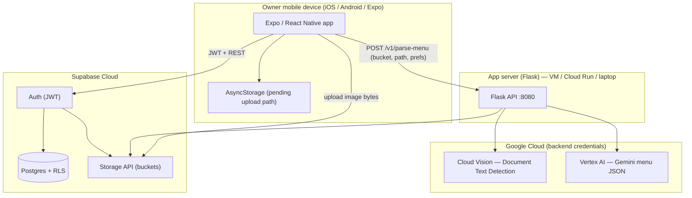
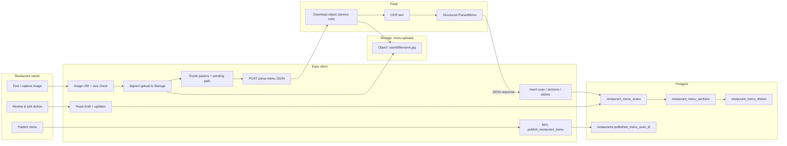

# US6: Restaurant Menu Upload

## User story summary

As a restaurant owner, I want to upload my menu to the platform so that customers can access a digital version without printed updates. The implementation uses **camera or photo-library images**, **Supabase Storage** (`menu-uploads`), **Google Cloud Vision** for document text detection (OCR), **Vertex AI (Gemini)** to structure text into `ParsedMenu` JSON, and **Supabase Postgres** for draft sections/dishes, owner review/edit, and publish. **PDF upload is not implemented in the current MVP** (images only).

## Owners

- **Primary owner:** Yao Lu
- **Secondary owner:** Sofia Yu

## Merge Date

- Merged into `main` on Mar 26, 2026 ([PR link](https://github.com/qianxuege/PickMyPlate2/pull/29)).

---

## Architecture (execution boundaries)

Components are grouped by **where they run**. Arrows show primary dependencies, not every RPC.

---

## Information flow

**Data moved (direction):**

| Data                                                         | From → to                                  |
| ------------------------------------------------------------ | ------------------------------------------ |
| Menu image bytes                                             | Device → Supabase Storage (`menu-uploads`) |
| `storage_bucket`, `storage_path`, `user_preferences`         | Client → Flask                             |
| Supabase access token (optional/required per `REQUIRE_AUTH`) | Client → Flask `Authorization`             |
| Image bytes                                                  | Storage → Flask (service role download)    |
| OCR string                                                   | Vision → Flask (in memory)                 |
| `ParsedMenu` JSON                                            | Flask → Client                             |
| Scan/section/dish rows                                       | Client → Postgres (via Supabase client)    |
| Draft reads / edits                                          | Postgres → Client                          |
| Publish intent (`target_scan_id`)                            | Client → Postgres RPC                      |

---

## Class diagram (inheritance, types, composition)

**Language note:** The app is mostly **function components** and **modules**; the only `class` in the TypeScript menu-upload path is `MenuUploadError`. Types below are **interfaces / type aliases** shown as UML classes with the `«interface»` stereotype. **`Error` is the ECMAScript built-in superclass.**

```mermaid
classDiagram
  class Error {
    <<JavaScript built-in>>
    +message: string
  }

  class MenuUploadError {
    +name: string
    +constructor(message: string)
  }
  Error <|-- MenuUploadError

  class ParsedMenuPrice <<interface>> {
    +amount: number | null
    +currency: string
    +display: string | null
  }

  class ParsedMenuItem <<interface>> {
    +id: string
    +name: string
    +description: string | null
    +price: ParsedMenuPrice
    +spice_level: 0|1|2|3
    +tags: string[]
    +ingredients: string[]
    +image_url?: string | null
  }

  class ParsedMenuSection <<interface>> {
    +id: string
    +title: string
    +items: ParsedMenuItem[]
  }

  class ParsedMenu <<interface>> {
    +schema_version: 1
    +restaurant_name: string | null
    +sections: ParsedMenuSection[]
  }

  ParsedMenu *-- ParsedMenuSection : sections
  ParsedMenuSection *-- ParsedMenuItem : items
  ParsedMenuItem *-- ParsedMenuPrice : price

  class ParsedMenuValidationResult <<interface>>
  class ParseMenuApiSuccess <<interface>>
  class ParseMenuApiFailure <<interface>>
  class ParseMenuApiResult <<interface>>

  class RestaurantMenuScanListRow <<interface>>
  class RestaurantMenuSectionRow <<interface>>
  class RestaurantMenuDishRow <<interface>>
  class FetchRestaurantMenuForScanResult <<interface>>

  class PersistRestaurantMenuDraftResult <<interface>>
  class CreateBlankMenuResult <<interface>>
  class PendingRestaurantMenuScan <<interface>>

  class CreateRestaurantDishDraftInput <<interface>>
  class CreateRestaurantDishDraftResult <<interface>>
  class SaveRestaurantDishInput <<interface>>
  class RestaurantMenuDishNeedsReviewInput <<interface>>

  class RenameMenuScanResult <<interface>>
  class PublishRestaurantMenuResult <<interface>>

  class PickUploadRestaurantDishPhotoResult <<interface>>

  class RestaurantMenuProcessingIllustrationProps <<interface>> {
    +width?: number
    +height?: number
  }

  class DinerMenuSectionRow <<interface>>
  class DinerScannedDishRow <<interface>>

  note for ParsedMenuValidationResult "ok true value | ok false error"
  note for ParseMenuApiResult "ParseMenuApiSuccess | ParseMenuApiFailure"
  note for FetchRestaurantMenuForScanResult "ok scan sections dishes | ok false error"
  note for PersistRestaurantMenuDraftResult "ok scanId | ok false error"
  note for CreateBlankMenuResult "ok scanId sectionId | ok false error"
  note for CreateRestaurantDishDraftResult "ok dishId | ok false error"
  note for RenameMenuScanResult "ok true | ok false error"
  note for PublishRestaurantMenuResult "ok true | ok false error"
  note for PickUploadRestaurantDishPhotoResult "ok publicUrl | cancelled | error"
```

---

## Implementation inventory: classes, types, and modules

### `MenuUploadError` (`lib/upload-menu-image.ts`) — **class**

**Public (concept: construction / identity)**

- **`constructor(message: string)`** — Builds an error with `name === 'MenuUploadError'` so callers can distinguish upload failures from generic `Error`.

**Private**

- _None_ (subclass relies on `Error` for message stack behavior).

---

### `RestaurantHomeScreen` (`app/restaurant-home.tsx`) — default export **function component**

**Public (concept: UI / navigation)**

- **Default component** — Renders owner home: take photo, upload from library, create blank menu, recent uploads list.
- **State-driven handlers** — `startScan`, `createBlank`, `loadRecent` (invoked from JSX; not exported).

**Private (concept: local state & helpers)**

- **`busy`** — Blocks double-tap while upload/create runs.
- **`scansLoading` / `recentScans`** — Recent menu scan list from Supabase.
- **`resolveFileSize`** — Gets byte size from `expo-file-system` or picker metadata for the 20 MB guard.
- **`startScan(source)`** — Permissions → picker → `uploadMenuImageFromUri` → `writePendingRestaurantMenuScan` → navigate to `restaurant-menu-processing`.
- **`createBlank`** — `createBlankRestaurantMenu` → navigate to review.
- **`loadRecent`** — `fetchRestaurantRecentUploads`.
- **`cardShadow`** — Platform-specific shadow styles.

---

### `RestaurantMenuProcessingScreen` (`app/restaurant-menu-processing.tsx`)

**Public**

- **Default component** — Full-screen processing UI; runs parse → persist pipeline when `storagePath` resolves.

**Private**

- **`params` / `storagePathFromParams` / `resolvedPath`** — Route param vs `AsyncStorage` fallback for upload path.
- **`statusIndex` / `progressAnim` / `STATUS_MESSAGES`** — Rotating copy + animated progress bar.
- **`failAndHome`** — `Alert` then `router.replace('/restaurant-home')`.
- **`runPipeline`** — `fetchRestaurantIdForOwner` → `buildRestaurantMenuParseUserPreferences` → `requestMenuParse` → validate → `persistRestaurantMenuDraft` → `clearPendingRestaurantMenuScan` → navigate to review.
- **`runPipelineRef`** — Ref pattern so `useEffect` always calls latest `runPipeline`.

---

### `RestaurantReviewMenuScreen` (`app/restaurant-review-menu.tsx`)

**Public**

- **Default component** — Lists extracted dishes, rename menu modal, publish, navigation to add/edit dish.

**Private**

- **`load`** — `fetchRestaurantMenuForScan`.
- **`runPublish` / `onPublish`** — `publishRestaurantMenu` with optional confirm when `needs_review` remains.
- **`onAddMissingItem` / `onEditDish`** — Router pushes to add/edit screens.
- **`openRenameMenu` / `onConfirmRenameMenu`** — `updateRestaurantMenuScanName`.
- **`titleize` / `tagChip` / `buildNeedsReviewCounts` / `spiceLevelLabel`** — Pure helpers for UI.
- **Modal state** — `renameModalVisible`, `renameInput`, `renameSaving`.

---

### `RestaurantMenuScreen` (`app/restaurant-menu.tsx`) — related shell for published menu & QR

**Public**

- **Default component** — Owner “My Menus” tab: lists uploads, shows selected scan dishes, partner QR.

**Private**

- Upload list loading, `selectedScanId`, partner token helpers, styles (see file for full state).

---

### `RestaurantAddDishScreen` / `RestaurantEditDishScreen` (`app/restaurant-add-dish.tsx`, `app/restaurant-edit-dish/[dishId].tsx`)

**Public**

- **Default components** — Forms to add or correct dishes after OCR; call `saveRestaurantDish`, optional `pickAndUploadRestaurantDishPhoto`.

**Private**

- Local form state, validation alerts, navigation back to review (per file).

---

### `RestaurantMenuProcessingIllustration` (`components/RestaurantMenuProcessingIllustration.tsx`)

**Public**

- **`RestaurantMenuProcessingIllustrationProps`** — Optional `width`, `height` (default 216×286).
- **`RestaurantMenuProcessingIllustration`** — Renders inline SVG via `react-native-svg` `SvgXml`.

**Private**

- **`MENU_PROCESSING_ILLUSTRATION_XML`** — SVG string constant.

---

### `useGuardActiveRole` (`hooks/use-guard-active-role.ts`)

**Public**

- **`useGuardActiveRole(expected)`** — Redirects unauthenticated or wrong-role users away from owner routes.

**Private**

- _None_ (effect-only hook; uses `useActiveRole` context).

---

### `upload-menu-image.ts`

**Public**

- **`MENU_UPLOAD_BUCKET`** — `'menu-uploads'`.
- **`uploadMenuImageFromUri(params)`** — JPEG re-encode, size check, `supabase.storage.upload`, returns `{ bucket, path }`.

**Private**

- **`MAX_BYTES`** — 20 MiB limit.
- **`uriToJpegForUpload`** — `expo-image-manipulator` JPEG conversion for Vision compatibility.

---

### `pending-restaurant-menu-scan.ts`

**Public**

- **`PendingRestaurantMenuScan`** — `{ bucket, path, ts }`.
- **`writePendingRestaurantMenuScan` / `readPendingRestaurantMenuScan` / `clearPendingRestaurantMenuScan`** — AsyncStorage bridge if Expo drops route params.

**Private**

- **`STORAGE_KEY`** — `@pickmyplate/pending_restaurant_menu_scan_v1`.

---

### `menu-parse-api.ts`

**Public**

- **`ParseMenuApiSuccess` / `ParseMenuApiFailure` / `ParseMenuApiResult`** — Discriminated union for HTTP result.
- **`requestMenuParse(params)`** — POST `${EXPO_PUBLIC_MENU_API_URL}/v1/parse-menu` with optional `Authorization: Bearer <access_token>`.

**Private**

- **`getMenuApiBaseUrl`** — Reads `EXPO_PUBLIC_MENU_API_URL` / `expo.extra.menuApiUrl`.

---

### `menu-scan-schema.ts`

**Public**

- **`MENU_SCAN_SCHEMA_VERSION`**, **`ParsedMenuPrice`**, **`ParsedMenuItem`**, **`ParsedMenuSection`**, **`ParsedMenu`**, **`ParsedMenuValidationResult`**, **`DinerMenuSectionRow`**, **`DinerScannedDishRow`** — Shared contract for diner + restaurant pipelines.
- **`validateParsedMenu`**, **`parsedMenuHasItems`**, **`dishRowToParsedItem`**, **`assembleParsedMenu`** — Validation and DB↔API mapping helpers.

**Private**

- **`isNonEmptyString`**, **`isSpiceLevel`**, **`parsePrice`**, **`parseIngredients`**, **`parseItem`**, **`parseSection`**, **`normalizeSpiceLevel`** — Parsing helpers for unknown JSON.

---

### `restaurant-menu-parse-preferences.ts`

**Public**

- **`buildRestaurantMenuParseUserPreferences()`** — Returns allowlist payload (`dietary`, `spice_label`, etc.) for tag filtering on the server.

**Private**

- _None._

---

### `restaurant-setup.ts` (subset used by US6)

**Public**

- **`fetchRestaurantIdForOwner()`** — Resolves `restaurants.id` for `owner_id = auth.uid()`.

**Private**

- _Other exports exist for registration; not listed here._

---

### `restaurant-persist-menu.ts`

**Public**

- **`PersistRestaurantMenuDraftResult`** — `{ ok, scanId? } | { ok: false, error }`.
- **`persistRestaurantMenuDraft(menu, restaurantId)`** — Inserts scan → sections → dishes; rolls back scan on failure.

**Private**

- **`coerceSpiceLevel`** — Maps unknown numbers to 0–3.

---

### `restaurant-menu-scans.ts`

**Public**

- **`RestaurantMenuScanListRow`** — List row shape.
- **`fetchRestaurantRecentUploads` / `fetchRestaurantAllUploads`** — Owner-scoped scan list ordered by `last_activity_at`.

**Private**

- **`fetchOwnerRestaurantId`** — Loads restaurant id for current user.

---

### `restaurant-fetch-menu-for-scan.ts`

**Public**

- **`RestaurantMenuSectionRow`**, **`RestaurantMenuDishRow`**, **`FetchRestaurantMenuForScanResult`**.
- **`fetchRestaurantMenuForScan(scanId)`** — Joins scan, sections, dishes for review UI.

**Private**

- **`coerceSpiceLevel`** — Normalizes spice from DB.

---

### `restaurant-publish-menu.ts`

**Public**

- **`PublishRestaurantMenuResult`**, **`publishRestaurantMenu(scanId)`** — Calls `publish_restaurant_menu` RPC.

**Private**

- _None._

---

### `restaurant-rename-menu-scan.ts`

**Public**

- **`RenameMenuScanResult`**, **`updateRestaurantMenuScanName(scanId, rawName)`** — Validates length, updates `restaurant_menu_scans.restaurant_name`.

**Private**

- **`MAX_LEN`** — 120.

---

### `restaurant-create-blank-menu.ts`

**Public**

- **`CreateBlankMenuResult`**, **`createBlankRestaurantMenu()`** — Insert scan + default “Menu” section without OCR.

**Private**

- **`defaultMenuName()`** — Date-based label.

---

### `restaurant-menu-dishes.ts`

**Public**

- **`CreateRestaurantDishDraftInput`**, **`CreateRestaurantDishDraftResult`**, **`getRestaurantSectionNextDishSortOrder`**, **`createRestaurantDishDraft`**, **`SaveRestaurantDishInput`**, **`touchRestaurantMenuScan`**, **`saveRestaurantDish`**, **`updateRestaurantDishHighlightFlags`**.

**Private**

- _None._

---

### `restaurant-menu-dish-utils.ts`

**Public**

- **`RestaurantMenuDishNeedsReviewInput`**, **`restaurantMenuDishNeedsReview`** — Heuristic: empty name, missing price, or empty ingredients ⇒ `needs_review`.

**Private**

- _None._

---

### `restaurant-dish-photo-upload.ts`

**Public**

- **`RESTAURANT_DISH_IMAGES_BUCKET`**, **`restaurantDishImageStoragePath`**, **`uploadRestaurantDishPhotoFromUri`**, **`PickUploadRestaurantDishPhotoResult`**, **`pickAndUploadRestaurantDishPhoto`**.

**Private**

- **`MAX_BYTES`**, **`uriToJpegForUpload`** — Same pattern as menu image upload (5 MB cap for dish photos).

---

### Flask application (`backend/app.py`) — **factory + functions**

**Public**

- **`create_app() -> Flask`** — Registers routes, CORS, `/health`, `/v1/parse-menu`, dish image routes.
- **Route handlers** — `parse_menu`, `health`, etc. (inner functions; not separate classes).

**Private**

- **`_is_flask_debug`**, **`_log_supabase_object_ref`**, **`_log_ocr_text`**, **`_log_final_menu_after_tag_allowlist`**, **`_log_backend_supabase_project_hint`** — Debug logging helpers.

---

### `backend/ocr_vision.py` — **functions**

**Public**

- **`extract_document_text(image_bytes) -> str`** — Vision document text detection.
- **`validate_image_bytes_for_vision`** — Format guard before Vision.

**Private**

- **`_prepare_image_bytes_for_vision`**, **`_detect_image_kind`** — Pillow resize/orientation and magic-byte sniffing.

---

### `backend/llm_menu_vertex.py` — **functions**

**Public**

- **`parse_menu_with_vertex(...)`** — Gemini calls (strategies per `MENU_LLM_STRATEGY` env).
- **`SYSTEM_INSTRUCTION`**, **`_ensure_vertex`**, **`_model_name`**, **`_strategy`** — Configuration and prompts.

**Private**

- **`_json_from_model_text`**, **`_user_message`**, **`_log_llm_attempt`**, etc.

---

### `backend/parsed_menu_validate.py` — **functions + constants**

**Public**

- **`MENU_SCAN_SCHEMA_VERSION`**, **`normalize_llm_menu_shape`**, **`normalize_llm_scalar_coercions`**, **`assign_server_uuid_ids`**, **`validate_parsed_menu`**, **`parsed_menu_has_items`**, **`validate_parsed_menu_db_ids`**, **`build_allowed_tags_from_user_preferences`**, **`constrain_menu_tags_to_allowed_tags`**.

**Private**

- **`_parse_price`**, **`_parse_item`**, **`_parse_section`**, **`_is_uuid_str`**, etc.

---

### `backend/storage_supabase.py` — **functions**

**Public**

- **`get_supabase_admin`**, **`download_storage_object`**, **`storage_object_exists`**, **`upload_storage_object`**.

**Private**

- **`_supabase`**, **`_looks_like_storage_not_found`**, **`_exception_detail`**.

---

### `backend/auth_supabase.py` — **functions**

**Public**

- **`verify_bearer_token`**, **`auth_error_response`**, module flags **`REQUIRE_AUTH`**, **`JWT_SECRET`**.

**Private**

- _None._

---

## Third-party technologies (not authored by this team)

| Technology                                    | Version (pinned / range in repo) | Used for                                   | Why this choice                                       | Source & docs                                                                                |
| --------------------------------------------- | -------------------------------- | ------------------------------------------ | ----------------------------------------------------- | -------------------------------------------------------------------------------------------- |
| **TypeScript**                                | `~5.9.2` (dev)                   | Static typing for app and shared schema    | Catches contract drift with backend early             | Author: Microsoft — https://www.typescriptlang.org/docs/                                     |
| **React**                                     | `19.1.0`                         | UI rendering                               | Ecosystem standard for Expo                           | Author: Meta — https://react.dev                                                             |
| **React Native**                              | `0.81.5`                         | Native mobile UI                           | Required by Expo SDK 54                               | Author: Meta — https://reactnative.dev/docs/getting-started                                  |
| **Expo SDK**                                  | `~54.0.33`                       | Managed workflow, native modules, builds   | Faster iteration than bare RN for class project scope | Author: Expo — https://docs.expo.dev                                                         |
| **expo-router**                               | `~6.0.23`                        | File-based navigation                      | Deep links + typed routes                             | Author: Expo — https://docs.expo.dev/router/introduction/                                    |
| **expo-image-picker**                         | `~17.0.10`                       | Camera / library for menu photos           | Cross-platform picker API                             | Author: Expo — https://docs.expo.dev/versions/latest/sdk/imagepicker/                        |
| **expo-image-manipulator**                    | `~14.0.8`                        | HEIC→JPEG re-encode before Vision          | Vision rejects many iPhone HEIC payloads              | Author: Expo — https://docs.expo.dev/versions/latest/sdk/imagemanipulator/                   |
| **expo-file-system**                          | `~18.0.12`                       | Local file size probing                    | Validates 20 MB limit                                 | Author: Expo — https://docs.expo.dev/versions/latest/sdk/filesystem/                         |
| **@supabase/supabase-js**                     | `^2.100.0`                       | Auth, Postgres, Storage from the app       | Hosted BaaS with RLS fits course-scale backend        | Author: Supabase — https://supabase.com/docs/reference/javascript/introduction               |
| **@react-native-async-storage/async-storage** | `2.2.0`                          | Pending upload path recovery               | Lightweight key-value on device                       | Author: React Native community — https://react-native-async-storage.github.io/async-storage/ |
| **react-native-svg**                          | `15.12.1`                        | SVG illustration on processing screen      | Vector asset without bitmap weight                    | Author: Software Mansion / community — https://github.com/software-mansion/react-native-svg  |
| **@expo/vector-icons**                        | `^15.0.3`                        | Icons in UI                                | Bundled with Expo                                     | Author: Expo — https://docs.expo.dev/guides/icons/                                           |
| **ESLint** + **eslint-config-expo**           | `^9.25.0`, `~10.0.0`             | Linting                                    | Expo-maintained rule set                              | OpenJS / Expo — https://eslint.org/docs/latest/                                              |
| **Supabase CLI** (`supabase` npm)             | `^2.83.0` (dev)                  | Migrations, local tooling                  | Same vendor as cloud project                          | Author: Supabase — https://supabase.com/docs/guides/cli                                      |
| **Python**                                    | 3.13+ (local `.venv`)            | Flask API runtime                          | Team familiarity + fast scripting                     | Author: PSF — https://docs.python.org/3/                                                     |
| **Flask**                                     | `>=3.0,<4`                       | HTTP API for OCR/LLM                       | Minimal framework for single service                  | Author: Pallets — https://flask.palletsprojects.com/en/stable/                               |
| **flask-cors**                                | `>=4.0`                          | Browser / Expo web CORS                    | Preflight for dev clients                             | Author: Cory Dolphin — https://github.com/corydolphin/flask-cors                             |
| **python-dotenv**                             | `>=1.0`                          | `.env` loading                             | Keeps secrets out of code                             | Author: Saurabh Kumar — https://github.com/theskumar/python-dotenv                           |
| **httpx**                                     | `>=0.27`                         | HTTP client (transitively via supabase-py) | Modern async-capable client                           | Author: Encode — https://www.python-httpx.org/                                               |
| **PyJWT**                                     | `>=2.8`                          | JWT verification optional on API           | Matches Supabase HS256 tokens                         | Author: José Padilla — https://pyjwt.readthedocs.io/en/stable/                               |
| **cryptography**                              | `>=42.0`                         | Crypto primitives for JWT stack            | Dependency of PyJWT / TLS stacks                      | Author: Python Cryptographic Authority — https://cryptography.io/en/latest/                  |
| **supabase-py**                               | `>=2.10`                         | Server-side Storage + admin DB             | Service role access from Flask                        | Author: Supabase — https://supabase.com/docs/reference/python/introduction                   |
| **google-cloud-vision**                       | `>=3.7,<4`                       | Document Text Detection (OCR)              | Managed Vision API vs self-hosting Tesseract          | Author: Google — https://cloud.google.com/python/docs/reference/vision/latest                |
| **Pillow**                                    | `>=10,<12`                       | Decode/resize images pre-Vision            | Fixes orientation / huge images                       | Author: Jeffrey A. Clark (Alex) et al. — https://pillow.readthedocs.io/en/stable/            |
| **google-cloud-aiplatform**                   | `>=1.64,<2`                      | Vertex AI Gemini calls                     | Structured menu extraction quality vs rules-only      | Author: Google — https://cloud.google.com/python/docs/reference/aiplatform/latest            |

---

## Long-term storage: database & object types

**Byte notes:** Postgres uses **varlena** headers for variable types (~1–4 bytes) plus payload. Below uses **logical** sizes: fixed-width types per PostgreSQL docs; `text` / `numeric` / arrays are **variable** — estimate as **overhead + UTF-8 bytes** (or decimal digits for `numeric`).

### `public.restaurant_menu_scans`

| Column                      | DB type       | Purpose                                       | Size estimate                                         |
| --------------------------- | ------------- | --------------------------------------------- | ----------------------------------------------------- |
| `id`                        | `uuid`        | Primary key                                   | 16 B                                                  |
| `restaurant_id`             | `uuid`        | Owning venue                                  | 16 B                                                  |
| `restaurant_name`           | `text`        | Display title / inferred header               | ~24 B + ~1 B × char (typical 5–120 chars ⇒ ~30–150 B) |
| `scanned_at`                | `timestamptz` | First created timestamp                       | 8 B                                                   |
| `last_activity_at`          | `timestamptz` | Sort key for “Recent uploads”                 | 8 B                                                   |
| `published_at`              | `timestamptz` | When marked live                              | 8 B (null bitmap in row header)                       |
| `is_published`              | `boolean`     | Exactly one published per restaurant workflow | 1 B                                                   |
| `created_at` / `updated_at` | `timestamptz` | Audit                                         | 8 B each                                              |

**Row header / alignment:** add ~24 B; **typical row** (short name, no nulls except `published_at` when draft) **≈ 120–200 B** + name length.

### `public.restaurant_menu_sections`

| Column                      | Type          | Purpose                         | Size                         |
| --------------------------- | ------------- | ------------------------------- | ---------------------------- |
| `id`                        | `uuid`        | PK                              | 16 B                         |
| `scan_id`                   | `uuid`        | FK to scan                      | 16 B                         |
| `title`                     | `text`        | Section heading (“Lunch”, etc.) | variable (~30–200 B typical) |
| `sort_order`                | `int`         | Ordering                        | 4 B                          |
| `created_at` / `updated_at` | `timestamptz` | Audit                           | 8 B each                     |

**Typical section row ≈ 100–180 B + title.**

### `public.restaurant_menu_dishes`

| Column                      | Type            | Purpose                  | Size                         |
| --------------------------- | --------------- | ------------------------ | ---------------------------- |
| `id`                        | `uuid`          | PK / stable dish id      | 16 B                         |
| `section_id`                | `uuid`          | FK                       | 16 B                         |
| `sort_order`                | `int`           | Ordering in section      | 4 B                          |
| `name`                      | `text`          | Dish title               | variable                     |
| `description`               | `text`          | Blurb                    | variable (often 0–500 chars) |
| `price_amount`              | `numeric(12,2)` | Sortable price           | ~12–20 B typical             |
| `price_currency`            | `text`          | ISO 4217                 | ~5–10 B                      |
| `price_display`             | `text`          | Original string          | variable                     |
| `spice_level`               | `int`           | 0–3                      | 4 B                          |
| `tags`                      | `text[]`        | Preference chips         | array header + strings       |
| `ingredients`               | `text[]`        | Ingredient list          | variable                     |
| `image_url`                 | `text`          | Public URL or null       | variable                     |
| `needs_review`              | `boolean`       | Review UI flag           | 1 B                          |
| `is_featured` / `is_new`    | `boolean`       | Highlights (US7 overlap) | 1 B each                     |
| `created_at` / `updated_at` | `timestamptz`   | Audit                    | 8 B each                     |

**Typical dish row** (name + short description + a few tags): **≈ 400–1500 B** depending on text/array payload.

### `public.restaurants` (column touched by US6)

| Column                   | Type              | Purpose                         | Size               |
| ------------------------ | ----------------- | ------------------------------- | ------------------ |
| `published_menu_scan_id` | `uuid` (nullable) | Which draft is customer-visible | 16 B + null bitmap |

### Storage bucket `menu-uploads` (`storage.objects`)

| Field         | Purpose                                            | Size                                               |
| ------------- | -------------------------------------------------- | -------------------------------------------------- |
| Object body   | Original menu photo (JPEG after client processing) | **Up to 20,971,520 B** (20 MiB limit in migration) |
| `name` (path) | `{auth.uid()}/{filename}.jpg`                      | ~40–120 B typical                                  |

Metadata rows in `storage.objects` are small (hundreds of bytes) plus the **binary object** size above.

---

## Frontend failure and abuse scenarios

Assumptions: **frontend** = Expo app process on device; **backend** = Supabase + Flask as configured.

| Event                                                      | User-visible effects                                                                                      | Internal / system effects                                                                                                                                |
| ---------------------------------------------------------- | --------------------------------------------------------------------------------------------------------- | -------------------------------------------------------------------------------------------------------------------------------------------------------- |
| **Process crash**                                          | App disappears; unsaved form text on an open edit screen may be lost.                                     | OS tears down JS runtime; in-flight `fetch` aborted. No automatic DB rollback for already-committed inserts.                                             |
| **Lost all runtime state**                                 | Navigation stack resets on relaunch; React state empty.                                                   | Must re-fetch menus from Supabase; user signs in again if session not restored.                                                                          |
| **Erased all stored data** (app uninstall / clear data)    | **AsyncStorage** pending path lost; user may need to re-upload if they land on processing without params. | Supabase session cookies cleared if applicable; user logs in again.                                                                                      |
| **DB data appears corrupt**                                | Lists fail or show errors from `fetchRestaurantMenuForScan`; publish may error.                           | Client surfaces PostgREST error strings; requires admin SQL repair or restore from backup.                                                               |
| **RPC / HTTP call failed** (`parse-menu`, Supabase insert) | Alerts: “Could not parse menu”, “Save failed”, etc.                                                       | No partial persist if `persistRestaurantMenuDraft` rolls back scan on section/dish failure.                                                              |
| **Client overloaded** (CPU)                                | UI jank; picker slow.                                                                                     | Timeouts possible on large image processing before upload.                                                                                               |
| **Client out of RAM**                                      | App killed by OS (user sees home screen).                                                                 | Same as crash; retry with smaller image.                                                                                                                 |
| **Database out of space**                                  | Writes fail; owner sees generic Supabase errors.                                                          | Inserts to `restaurant_menu_scans` / dishes fail; ops must expand disk / purge data.                                                                     |
| **Lost network**                                           | Upload or parse fails; user sees network error alert.                                                     | `fetch` throws; no menu persistence until connectivity returns.                                                                                          |
| **Lost DB access** (misconfigured URL/key)                 | All Supabase operations fail at startup or first query.                                                   | App unusable until env fixed.                                                                                                                            |
| **Bot signs up and spams users**                           | If auth is open, fake accounts could create noise.                                                        | Mitigation: rate limits, CAPTCHA, email verification (Supabase settings), monitoring — **not fully implemented in app code**; relies on platform config. |

---

## PII in long-term storage

### What counts as PII here

| Data                                                       | Stored where                         | Why kept                | How stored                                                      | Enters via                      | Path into storage                                       | After storage (read path)                     | Custodian (assign names) | Minors                                                              |
| ---------------------------------------------------------- | ------------------------------------ | ----------------------- | --------------------------------------------------------------- | ------------------------------- | ------------------------------------------------------- | --------------------------------------------- | ------------------------ | ------------------------------------------------------------------- |
| **Owner account email**                                    | Supabase `auth.users`                | Account recovery, login | Encrypted at rest (Supabase); bcrypt/Supabase Auth for password | Restaurant registration / login | `RestaurantRegistrationScreen` → `supabase.auth.signUp` | `supabase.auth.getSession` in clients         | _Security owner (TBD)_   | Not collected as “minor email” in US6 flow; age not verified in-app |
| **Owner user UUID (`sub`)**                                | `auth.users`, `profiles`, FK columns | RLS ownership           | `uuid` columns                                                  | Signup                          | Auth triggers / inserts                                 | Every guarded query via `auth.uid()`          | _Backend lead (TBD)_     | Identifier; combine with policy                                     |
| **Restaurant business phone / address** (if owner entered) | `public.restaurants`                 | Venue contact           | `text`                                                          | Onboarding / profile            | `upsertRestaurantForOwner` etc.                         | Profile screens                               | _Data owner (TBD)_       | Could include personal phone for sole proprietors                   |
| **Storage object path prefix**                             | `storage.objects.name`               | Locates menu image      | Text path starting with `auth.uid()`                            | Upload                          | `uploadMenuImageFromUri` → Supabase Storage API         | Flask `download_storage_object(bucket, path)` | _Infra owner (TBD)_      | UUID links object to account                                        |
| **Menu image bytes**                                       | `menu-uploads`                       | OCR input               | Private object                                                  | Camera/library                  | Client upload                                           | Vision + Gemini in Flask (transient)          | _Infra owner (TBD)_      | May photograph patrons or receipts—**content-dependent**            |

### Auditing access to PII

- **Routine:** Supabase Dashboard access restricted to named maintainers; enable **audit logs** / log drains where available; JWT/service-role keys in secret manager only.
- **Non-routine:** Ticket + approval for SQL queries touching `auth.users` or exports; document reason, time range, and erasure date if copied locally.

### Minors — policy questions

- **Is PII of a minor under 18 solicited or stored?** The product does not implement age gating in this repository; **restaurant registration collects email/password** without verifying age. Team policy should treat the app as **13+ or 18+** per legal review.
- **Guardian permission?** **Not implemented** in code.
- **Policy for minors’ PII vs. child-abuse registry:** **No automated screening** exists in this codebase. Organizational policy should follow institutional HR/legal guidance (e.g., background checks for employees with production access) — **document owner: legal/compliance (TBD)**.

---

## Gap vs. acceptance criteria

- **PDF upload:** Not in current MVP (bucket allows `image/jpeg`, `image/png`, `image/webp` only). Adding PDF would require server-side rasterization or a PDF-aware OCR path.
- **“OCR” wording:** Pipeline uses **Google Cloud Vision Document Text Detection** plus **Gemini** for structuring; mock mode (`MOCK_MENU_PARSE=1`) skips real OCR/LLM for development.
