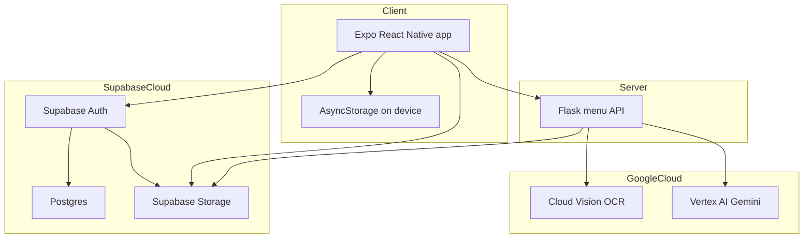
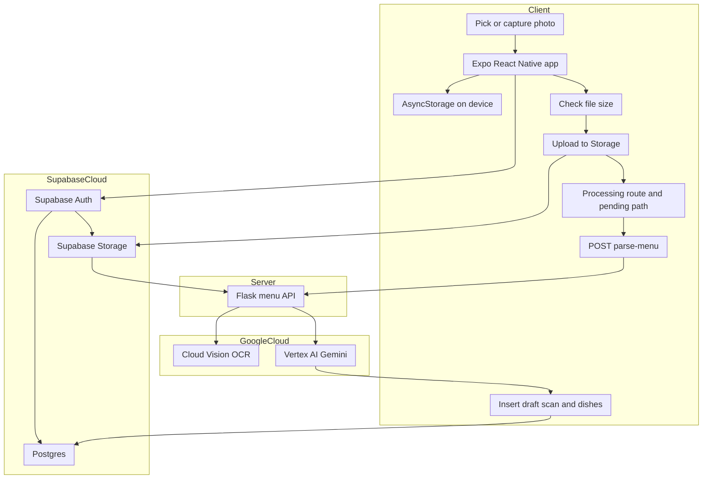
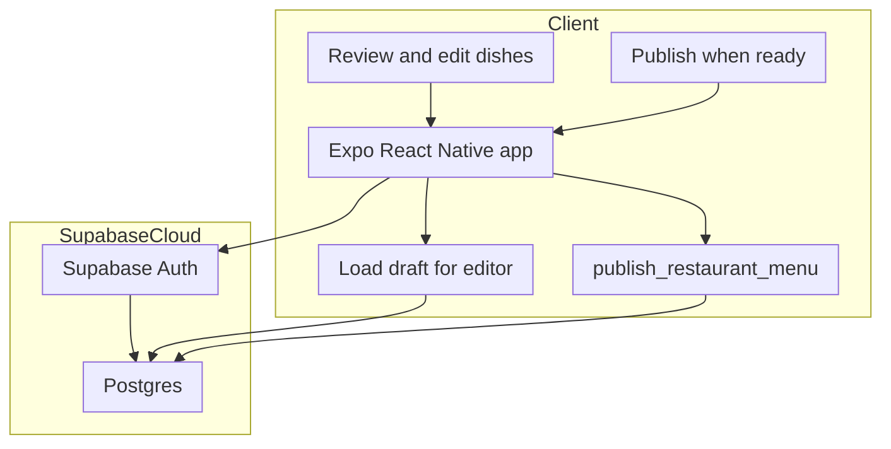
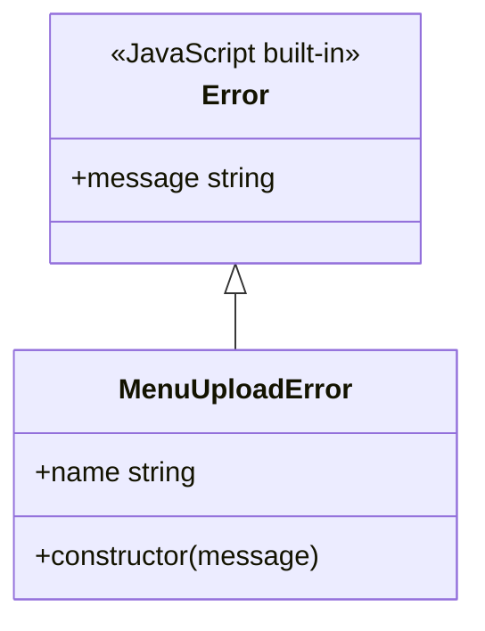
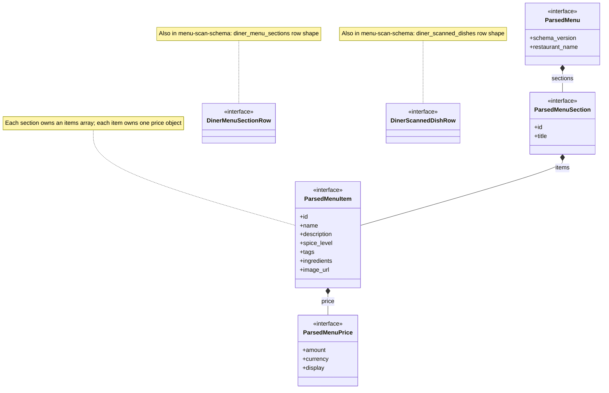
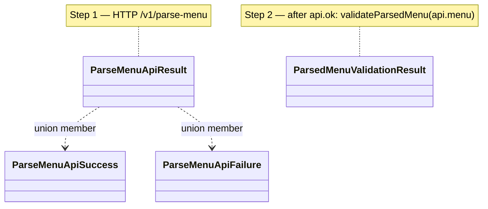
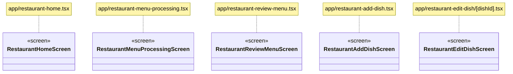
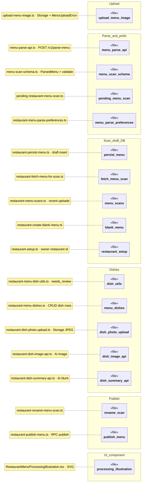
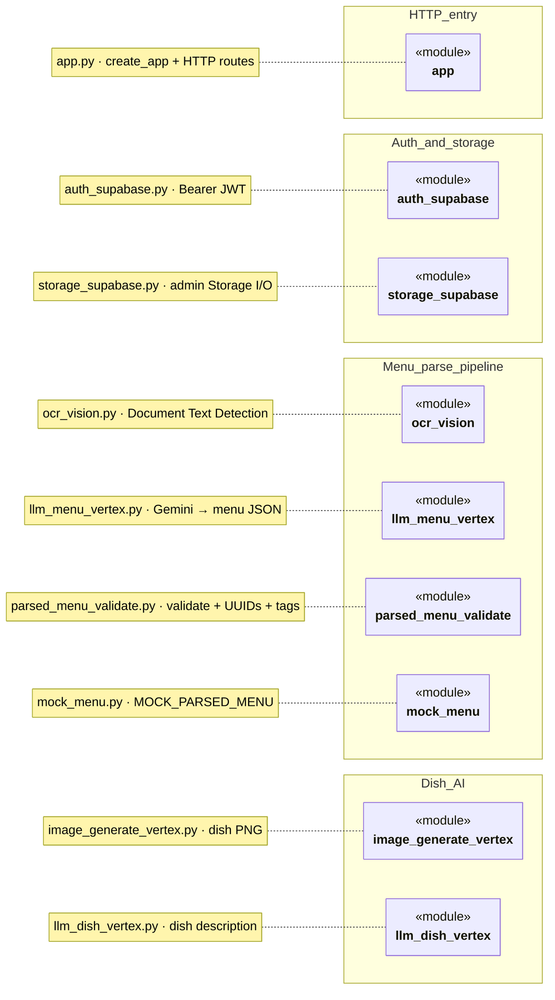

# US6: Restaurant Menu Upload Specs

## 1. Owners

- **Primary owner:** Yao Lu
- **Secondary owner:** Sofia Yu

## 2. Merge Date

- Merged into `main` on Mar 26, 2026 ([PR link](https://github.com/qianxuege/PickMyPlate2/pull/29)).

---

## 3. Architecture Diagram in Mermaid

Components are grouped as **client** (device), **server** (app backend you run), and **cloud** (hosted providers). Arrows show primary dependencies.

**Client** — Owner phone or tablet: the Expo app and local AsyncStorage (e.g. pending upload path).

**Server** — Your Flask service (laptop, VM, Cloud Run, etc.): calls cloud APIs and is not part of the mobile binary.

**Cloud · Supabase** — Managed Auth, Postgres, and private Storage for menu images and metadata.

**Cloud · Google** — Vision for OCR and Vertex Gemini for structuring menu JSON.

Install the **Markdown Preview Mermaid Support** extension (`bierner.markdown-mermaid`) on VS Code to see the mermaid diagram.

---

## 4. Information flow

The flow is split into **two** Mermaid figures so each diagram stays within typical VS Code preview width and height (`useMaxWidth` stays on; no wide horizontal band). Subgraph and node names still align with **Architecture Diagram in Mermaid**.

**Parse strategy:** When `MENU_LLM_STRATEGY=image_only` (see `backend/app.py` and `backend/llm_menu_vertex.py`), **Cloud Vision OCR is not run**. Flask still downloads the JPEG from **Supabase Storage**, but **`ocr_text` is empty** and **Vertex AI Gemini** receives the **image bytes** directly (`Part.from_data`) to produce `ParsedMenu` JSON. For other strategies (e.g. `text_first`), Vision may run before Gemini as shown in figure 1.

**1 — Upload image, parse menu, save draft**

**2 — Review or edit draft, then publish**

**Where edits live after the owner changes the menu:** Updates from **review / add dish / edit dish** are written with the Supabase client to **Postgres** tables (`restaurant_menu_scans`, `restaurant_menu_sections`, `restaurant_menu_dishes`, etc.). That is **not** a new write to the **`menu-uploads`** bucket—the original scan photo stays in **Supabase Storage** unless the owner replaces it with another upload flow. Optional **dish photos** use the **`dish-images`** bucket (separate from menu PDFs/JPEGs). **Supabase Storage** = files; **Postgres** = structured menu rows and publish pointer.

Note that **Postgres** holds draft rows (`restaurant_menu_scans` / sections / dishes) and, after publish, `restaurants.published_menu_scan_id`. Figure 2 omits **Server** / **GoogleCloud** and **StorageAPI** edges because this path is session + Postgres only.

**Data moved (direction):**

| Data                                                         | From → to                                     |
| ------------------------------------------------------------ | --------------------------------------------- |
| Menu image bytes                                             | Device → Supabase Storage (`menu-uploads`)    |
| `storage_bucket`, `storage_path`, `user_preferences`         | Client → Flask                                |
| Supabase access token (optional/required per `REQUIRE_AUTH`) | Client → Flask `Authorization`                |
| Image bytes                                                  | Storage → Flask (service role download)       |
| OCR text (when not `image_only`)                             | Vision → Flask (in memory)                    |
| `ParsedMenu` JSON                                            | Flask → Client                                |
| Scan/section/dish rows                                       | Client → Postgres (via Supabase client)       |
| Draft reads / edits                                          | Postgres → Client                             |
| Publish intent (`target_scan_id`)                            | Client → Postgres (`publish_restaurant_menu`) |

---

## 5. Class diagram (inheritance, types, composition)

**Language note:** The app is mostly **function components** and **modules**; the only `class` in the TypeScript menu-upload path is `MenuUploadError`. Types drawn as UML classes use the `«interface»` stereotype when they are **interfaces / type aliases** with interesting fields. **Bare class boxes** (no members) are type aliases or discriminated unions. **`Error` is the ECMAScript built-in superclass.** Subsections **1–4** focus on **data shapes and parse contracts**; **5–7** list the **same screens, client files, and backend modules** documented in **§6 Implementation inventory** (one diagram slice each).

Each numbered subsection uses the same layout: **what it is for**, the **diagram**, then **how to read** the boxes and arrows.

**§5 ↔ §6 coverage (every §6 inventory unit has a §5 box or row):**

| §6 subsection                                                             | §5 mirror                                                    |
| ------------------------------------------------------------------------- | ------------------------------------------------------------ |
| `MenuUploadError` (`lib/upload-menu-image.ts`)                            | **§5.1** (class) + **§5.6** `upload_menu_image` (module box) |
| `lib/menu-parse-api.ts`                                                   | **§5.3** (result unions) + **§5.6** `menu_parse_api`         |
| `lib/menu-scan-schema.ts`                                                 | **§5.2** (document types) + **§5.6** `menu_scan_schema`      |
| Row / pending / operation result types (`lib/restaurant-*`, `pending-*`)  | **§5.4** table + Mermaid                                     |
| Five `app/restaurant-*.tsx` screens                                       | **§5.5**                                                     |
| Remaining `lib/*` + `components/RestaurantMenuProcessingIllustration.tsx` | **§5.6**                                                     |
| Nine `backend/*.py` files                                                 | **§5.7**                                                     |

---

### 1. Errors

**What this is for:** Upload failures need a stable `name` so UI code can branch without string-matching `message`. `MenuUploadError` is the dedicated subclass for that path.

**How to read it:** The solid arrow with a hollow triangle is **inheritance** (`extends`). Everything else in the menu-upload flow is plain functions and types; this is the only class hierarchy in scope.

---

### 2. Parsed menu document (`menu-scan-schema`)

**What this is for:** After parsing (LLM / edge function), the app holds a **tree** of plain objects: one menu, many sections, many items, each item optionally carrying a **price object**. This is the shared schema for validation before anything is written to Postgres.

**How to read it:** Diamonds on the parent end mark **composition** (whole–part): `ParsedMenu` contains sections, each section contains items, each item contains a price. **`DinerMenuSectionRow`** / **`DinerScannedDishRow`** are **not** parents of **`ParsedMenu`**; they are **additional exported types** from the same module used when reassembling **`ParsedMenu`** from diner-side tables (see **§6 → `menu-scan-schema.ts`**). Member types are shortened; see `lib/menu-scan-schema.ts` for full TypeScript types (`string | null`, `0|1|2|3`, etc.).

---

### 3. Parse-menu API and validation

**What this is for:** The processing screen uses **two different discriminated result types** for two **pipeline steps** (see `runPipeline` in `app/restaurant-menu-processing.tsx`):

1. **`ParseMenuApiResult`** — Outcome of **`requestMenuParse`** (`lib/menu-parse-api.ts`): HTTP `POST` to Flask `/v1/parse-menu` with storage pointers. This step **requires network** (unless it fails earlier because `EXPO_PUBLIC_MENU_API_URL` is unset). On success you get `{ ok: true, menu: unknown }`; on failure `{ ok: false, error: string }` (HTTP errors, bad JSON, `fetch` thrown offline, etc.).
2. **`ParsedMenuValidationResult`** — Outcome of **`validateParsedMenu`** (`lib/menu-scan-schema.ts`): runs **on the device** against `api.menu` **after** a successful API response. No second HTTP call. Turns untrusted `unknown` into `{ ok: true, value: ParsedMenu }` or `{ ok: false, error: string }` (wrong `schema_version`, bad sections/items, etc.).

**Why the diagram looks “empty”:** Mermaid draws each type as a **class box**. These aliases are **unions** with no UML members, so many renderers show **one or two blank stripes** under the class name (reserved compartments with nothing in them). That is normal—not missing table rows in the spec.

**How to read it:** Top to bottom matches **runtime order**: API result first, validation result second. Open-headed arrows are **dependencies** (“this result type is built from these variants”). `ParseMenuApiSuccess` and `ParseMenuApiFailure` are **not** subclasses of `ParseMenuApiResult`; TypeScript models them as a **union**. `ParsedMenuValidationResult` is a **separate** union because it describes the **next** step (schema check → `ParsedMenu`), not the wire response.

**Offline or unreachable menu API:** `fetch` throws or fails; `requestMenuParse` returns `{ ok: false, error: … }` (typically the `Error.message`, or the string `'Network error'`). The pipeline then calls `failAndHome('Could not parse menu', api.error)`: an **alert** with that message and **no parsed menu** is shown—the user is sent **back to restaurant home** after OK. `validateParsedMenu` is **not** run on that path, because there is no `api.menu`.

---

### 4. Restaurant pipeline: rows, fetches, writes, and publish

**Superclass / subclass:** This subsection does **not** add any **`extends` / inheritance** links. For US6, the only superclass → subclass relationship in the class-diagram sense remains **§1** (`Error` <|-- `MenuUploadError`). The types below are **`type` aliases**, **discriminated unions** (`…Result`), or **inputs**—none of them is a subclass of another.

**Database shape (relational, not OO):** In Postgres, a **menu scan** has many **sections**, and each **section** has many **dishes** (`section_id` on `restaurant_menu_dishes`). That is a **foreign-key hierarchy**, not TypeScript inheritance. The section and dish **row types** are independent aliases; they do not `extend` a shared “Scan” class in code.

**What this is for:** Owner-side **row shapes**, **pending snapshot**, **operation results**, and **dish inputs** referenced from **§6** (`lib/*`). The diagram lists the same **type names** as the table; open source files for full member lists.

| Type                                  | Kind                                 | Definition / tables                                                                                                      |
| ------------------------------------- | ------------------------------------ | ------------------------------------------------------------------------------------------------------------------------ |
| `RestaurantMenuScanListRow`           | Row shape (selected columns)         | `restaurant_menu_scans` — `lib/restaurant-menu-scans.ts`                                                                 |
| `RestaurantMenuSectionRow`            | Row shape                            | `restaurant_menu_sections` — `lib/restaurant-fetch-menu-for-scan.ts`                                                     |
| `RestaurantMenuDishRow`               | Row shape                            | `restaurant_menu_dishes` — same file                                                                                     |
| `PendingRestaurantMenuScan`           | Device snapshot type                 | AsyncStorage key `@pickmyplate/pending_restaurant_menu_scan_v1` — `lib/pending-restaurant-menu-scan.ts` (not a DB table) |
| `FetchRestaurantMenuForScanResult`    | Discriminated union                  | `lib/restaurant-fetch-menu-for-scan.ts`                                                                                  |
| `PersistRestaurantMenuDraftResult`    | Discriminated union                  | `lib/restaurant-persist-menu.ts`                                                                                         |
| `CreateBlankMenuResult`               | Discriminated union                  | `lib/restaurant-create-blank-menu.ts`                                                                                    |
| `CreateRestaurantDishDraftInput`      | Input object type                    | `lib/restaurant-menu-dishes.ts`                                                                                          |
| `CreateRestaurantDishDraftResult`     | Discriminated union                  | same                                                                                                                     |
| `SaveRestaurantDishInput`             | Input object type                    | same                                                                                                                     |
| `RestaurantMenuDishNeedsReviewInput`  | Input object type                    | `lib/restaurant-menu-dish-utils.ts` (used by persist/save)                                                               |
| `RenameMenuScanResult`                | Discriminated union                  | `lib/restaurant-rename-menu-scan.ts`                                                                                     |
| `PublishRestaurantMenuResult`         | Discriminated union                  | `lib/restaurant-publish-menu.ts`                                                                                         |
| `PickUploadRestaurantDishPhotoResult` | Discriminated union (three outcomes) | `lib/restaurant-dish-photo-upload.ts`                                                                                    |

```mermaid
%%{init: {'class': {'hideEmptyMembersBox': true}}}%%
classDiagram
  direction LR
  namespace Postgres_row_shapes {
    class RestaurantMenuScanListRow <<row>>
    class RestaurantMenuSectionRow <<row>>
    class RestaurantMenuDishRow <<row>>
  }
  RestaurantMenuSectionRow *-- RestaurantMenuDishRow : section_id
  namespace Device_snapshot {
    class PendingRestaurantMenuScan <<type>>
  }
  namespace Operation_results {
    class FetchRestaurantMenuForScanResult <<union>>
    class PersistRestaurantMenuDraftResult <<union>>
    class CreateBlankMenuResult <<union>>
    class CreateRestaurantDishDraftResult <<union>>
    class RenameMenuScanResult <<union>>
    class PublishRestaurantMenuResult <<union>>
    class PickUploadRestaurantDishPhotoResult <<union>>
  }
  namespace Dish_inputs {
    class CreateRestaurantDishDraftInput <<input>>
    class SaveRestaurantDishInput <<input>>
    class RestaurantMenuDishNeedsReviewInput <<input>>
  }
  note for RestaurantMenuScanListRow "restaurant_menu_scans · list columns"
  note for RestaurantMenuSectionRow "restaurant_menu_sections row"
  note for RestaurantMenuDishRow "restaurant_menu_dishes row"
  note for PendingRestaurantMenuScan "AsyncStorage · pending path recovery"
  note for FetchRestaurantMenuForScanResult "fetch + group for review UI"
  note for PersistRestaurantMenuDraftResult "insert draft after parse"
  note for PickUploadRestaurantDishPhotoResult "library upload 3-way result"
```

**How to read it:** **Left → right:** table **row** shapes, the device **snapshot** type, **union** results from fetch/persist/publish/dish-photo flows, then **input** object types for dish CRUD. **`*--`** is the real **section → dishes** FK in Postgres. Full **`lib/*`** paths stay in the **table** above and **§6**.

---

### 5. Owner UI screens (§6 — React function components)

**What this is for:** Default-export **screens** on the restaurant menu-upload/review path. Each is a **function component**, not a `class`; boxes use the **`«screen»`** stereotype to show they map to **§6** subsections.

**How to read it:** There is **no inheritance** between screens. Routes and behaviors are described under **§6 → React screens**.

---

### 6. Client modules & co-located `MenuUpload` API (§6 — `lib/*` + component)

**What this is for:** One box per **TypeScript file** (or the single related **component**) that **§6** inventories beyond §5.1–§5.3 and §5.4 types. **`MenuUploadError` / `uploadMenuImageFromUri`** live in **`upload-menu-image.ts`** (already in **§5.1** as a class); this diagram includes that **file** so every **§6 client path** appears in **§5**.

**How to read it:** **`«file»`** boxes are **modules** (not classes). Namespaces follow the **pipeline**: upload → parse/prefs → scan/draft Supabase helpers → dish editing & media → publish → illustration. **Short notes** are filenames + role; **§6** lists every export and private helper.

---

### 7. Backend Python modules (§6 — Flask service)

**What this is for:** **Python files** behind **`POST /v1/parse-menu`** and related dish routes. There are **no user-defined Python classes** in these modules; boxes represent **modules** (the running app is a **`Flask` instance** from **`create_app()`**).

**How to read it:** **Left → right:** HTTP surface, **Auth + Storage** helpers, **menu scan** path (OCR → Gemini → validate, plus mock), then **dish** image/copy Vertex modules. **`app`** pulls the others **lazily** from route handlers. **§6** lists **public/private** symbols per file.

---

## 6. Implementation inventory: classes, modules, and backend

**Convention**

- **TypeScript `class`:** **Public** first (grouped by concept), then **private** (grouped by concept). The codebase rarely uses `public` / `private` keywords; here **public** means what other modules or React invoke; **private** means non-exported helpers, file-level `const`, or hook state that is not part of the export surface.
- **React screens:** Documented as **modules** — **public** = default export component and its routing/UI role; **private** = `useState` / `useCallback` / `useEffect` logic and file-local helpers.
- **Python (menu API):** **No user-defined classes** in the scanned files; the app is a **`Flask` instance** from **`create_app()`**. **Public** = module-level callables and config flags importers use; **private** = `_`-prefixed helpers. HTTP route handlers are listed as **public HTTP surface** under `backend/app.py`.
- **Purpose on every line:** Each **public** / **private** entry below ends with a **dash (—) explanation** of why it exists or what it does. Entries that say **no extra symbols** still state that explicitly so nothing is left without a purpose note.

### TypeScript class

#### `MenuUploadError` — `lib/upload-menu-image.ts`

**Public (construction / identity)**

- **`constructor(message: string)`** — Sets **`name`** to `'MenuUploadError'` and **`message`** so upload failures are identifiable without parsing free text.

**Public (inherited instance shape)**

- **`message`** — Human-readable failure text from `Error`, shown in alerts when upload throws.
- **`name`** — Set to **`'MenuUploadError'`** in the constructor so callers can branch with **`instanceof`** / string compare without parsing **`message`**.

**Private**

- **No additional instance fields or methods** — The subclass only runs **`constructor`** to set **`name`**; stack traces and **`message`** storage come from the built-in **`Error`** implementation, so there is nothing else to hide on **`MenuUploadError`** itself.

**Also in this module (not a class)**

**Public (constants & API)**

- **`MENU_UPLOAD_BUCKET`** — Storage bucket id for owner menu photos.
- **`uploadMenuImageFromUri({ localUri, fileSizeBytes, userId })`** — Validates size, JPEG-normalizes URI, uploads bytes, returns `{ bucket, path }` or throws **`MenuUploadError`**.

**Private (implementation)**

- **`uriToJpegForUpload(localUri)`** — Re-encodes the picked file to **JPEG** so Storage and Vision see a supported payload when iOS delivers HEIC or odd encodings under a `.jpg` URI.
- **`MAX_BYTES`** — Module-level **20 MiB** cap enforced before read/upload so oversized images fail fast with **`MenuUploadError`**.

### React screens (function components)

#### `RestaurantHomeScreen` — `app/restaurant-home.tsx`

**Public (navigation & UI)**

- **Default export component** — Restaurant-tab home: “Take photo,” “Upload menu,” “Create blank menu,” and **Recent uploads** list; wraps content in **`RestaurantTabScreenLayout`**.

**Private (state)**

- **`busy`** — When **`true`**, disables the three primary actions so **`startScan`** / **`createBlank`** cannot overlap and corrupt navigation.
- **`scansLoading`** — **`true`** while **`loadRecent`** awaits Supabase so the list shows a spinner instead of stale data.
- **`recentScans`** — Cached **`RestaurantMenuScanListRow[]`** rendered under **Recent uploads**.

**Private (handlers & data loading)**

- **`loadRecent`** — Calls **`fetchRestaurantRecentUploads`** on focus.
- **`resolveFileSize`** — Probes URI size via **`expo-file-system`** or picker metadata for the 20 MB check.
- **`startScan(source)`** — Permissions → picker → **`uploadMenuImageFromUri`** → **`writePendingRestaurantMenuScan`** → navigate to **`/restaurant-menu-processing`**.
- **`createBlank`** — **`createBlankRestaurantMenu`** → navigate to **`/restaurant-review-menu`** with **`scanId`**.

**Private (presentation)**

- **`cardShadow`** — **`Platform.select`** shadow/elevation styles applied to the main action card for visual depth.
- **`t`** — Shorthand for **`restaurantRoleTheme`** colors referenced throughout **`StyleSheet`** definitions.
- **`MAX_BYTES`** — Duplicates the upload module’s **20 MiB** cap for an early picker-size check before calling **`uploadMenuImageFromUri`**.

#### `RestaurantMenuProcessingScreen` — `app/restaurant-menu-processing.tsx`

**Public (navigation & UI)**

- **Default export component** — Full-screen “Processing your menu…” with illustration, rotating status copy, animated progress bar.

**Private (state & route resolution)**

- **`resolvedBucket`** — Supabase Storage bucket name (defaults to **`MENU_UPLOAD_BUCKET`**) passed into **`requestMenuParse`**.
- **`resolvedPath`** — Object path inside the bucket; comes from decoded route params or **`PendingRestaurantMenuScan.path`** when Expo drops params.
- **`storagePathFromParams`** — Memoized **`decodeURIComponent`** of the **`storagePath`** query param to avoid re-running decode on unrelated renders.
- **`statusIndex`** — Rotating index into **`STATUS_MESSAGES`** so the subtitle changes while waiting on the network.
- **`progressAnim`** — **`Animated.Value`** driving the faux progress bar width for perceived responsiveness.

**Private (pipeline)**

- **`failAndHome`** — `Alert` then **`router.replace('/restaurant-home')`**.
- **`runPipeline`** — **`fetchRestaurantIdForOwner`** → **`buildRestaurantMenuParseUserPreferences`** → **`requestMenuParse`** → validate **`api.menu`** → **`persistRestaurantMenuDraft`** → **`clearPendingRestaurantMenuScan`** → **`router.replace`** to review with **`scanId`**; handles mock-mode and empty-menu cases.
- **`runPipelineRef`** — Ref so **`useEffect`** always invokes latest **`runPipeline`**.

**Private (constants & layout)**

- **`STATUS_MESSAGES`** — Array of user-facing status strings cycled while the pipeline runs (independent of real backend progress).
- **`t`** — Restaurant role theme colors for the progress bar and text.
- **`styles`** — **`StyleSheet`** definitions for root layout, illustration slot, typography, and progress track.

#### `RestaurantReviewMenuScreen` — `app/restaurant-review-menu.tsx`

**Public (navigation & UI)**

- **Default export component** — Draft review: dish list, rename-menu modal, publish, navigation to add/edit dish.

**Private (state)**

- **`loading`** — **`true`** while **`fetchRestaurantMenuForScan`** is in flight for the current **`scanId`**.
- **`error`** — Non-null when the fetch fails; drives inline error UI instead of the dish list.
- **`restaurantName`** — Display string for the header (falls back to **“Menu”** when null/blank in the DB).
- **`dishes`** — Flattened **`RestaurantMenuDishRow[]`** used to render cards and compute review counts.
- **`defaultSectionId`** — First section id used when routing to **Add dish** so new rows land in a valid section.
- **`renameModalVisible`** — Toggles the rename modal overlay.
- **`renameInput`** — Controlled text field mirroring the editable scan title.
- **`renameSaving`** — Disables confirm while **`updateRestaurantMenuScanName`** runs.

**Private (data & actions)**

- **`load`** — **`fetchRestaurantMenuForScan`** → fills local state or **`error`**.
- **`runPublish`** — Async **`publishRestaurantMenu(scanId)`**; shows failure **`Alert`** or success **`Alert`** that **`router.replace('/restaurant-home')`** on OK.
- **`onPublish`** — Footer **`onPress`**: if **`counts.needReview > 0`**, prompts to cancel or **Publish anyway** (then **`runPublish`**); else calls **`runPublish`** immediately.
- **`onAddMissingItem`** — Navigates to **`/restaurant-add-dish`** with **`scanId`** and **`defaultSectionId`** for a new row at list end.
- **`onEditDish`** — Navigates to **`/restaurant-edit-dish/[dishId]`** with the selected dish’s id.
- **`openRenameMenu`** — Copies the current scan title into **`renameInput`** and sets **`renameModalVisible`**.
- **`onConfirmRenameMenu`** — Trims **`renameInput`**, calls **`updateRestaurantMenuScanName`**, closes the modal on success, and surfaces errors.

**Private (pure helpers)**

- **`titleize`** — Normalizes arbitrary tag strings to Title Case for display.
- **`tagChip`** — Maps a tag string to an icon name + label for consistent chip rendering (dietary vs spice vs generic).
- **`buildNeedsReviewCounts`** — Computes **`total`**, **`needReview`**, and **`reviewed`** counts from **`dishes`** for the publish confirmation copy.
- **`spiceLevelLabel`** — Maps numeric spice enums to **None/Mild/Medium/Spicy** labels in the list UI.

**Private (presentation)**

- **`cardShadow`** — Shadow style applied to each dish card on iOS/Android.
- **`footerShadow`** — Inverted shadow for the sticky publish footer to separate it from the scroll area.
- **`styles`** — All **`StyleSheet`** rules for list layout, typography, modal, and footer button row.

#### `RestaurantAddDishScreen` — `app/restaurant-add-dish.tsx`

**Public (navigation & UI)**

- **Default export component** — Form to create a dish: draft row, fields for name/price/summary/ingredients/tags/spice, optional AI image/summary and photo upload.

**Private (state)**

- **`dishId`** — Server-issued id after **`createRestaurantDishDraft`**; required for save, photo upload, and AI endpoints.
- **`loading`** — True while the initial draft row is being created from **`scanId`/`sectionId`**.
- **`saving`** — True during **`saveRestaurantDish`** so the primary button can disable and avoid double-submit.
- **`dishImageUrl`** — Last known public **`image_url`** for preview after upload or image generation.
- **`name`** — Controlled dish title bound to the text field and **`saveRestaurantDish`**.
- **`priceText`** — Free-text price field before **`parsePriceToAmount`** maps it to amount/currency/display.
- **`summary`** — Controlled description / blurb (manual entry or AI-filled via **`generateRestaurantDishSummary`**).
- **`ingredientsText`** — Comma-separated ingredients string before **`parseIngredientsText`** turns it into **`string[]`**.
- **`tagsText`** — Comma-separated tags string before **`parseTagsText`** turns it into **`string[]`**.
- **`spiceLevel`** — Current **`0|1|2|3`** selection for the spice control group.
- **`imageLoading`** — **`true`** while **`generateRestaurantDishImage`** runs so the AI image button shows a spinner.
- **`uploadPhotoLoading`** — **`true`** while **`pickAndUploadRestaurantDishPhoto`** runs after the owner picks from the library.
- **`summaryLoading`** — **`true`** while **`generateRestaurantDishSummary`** runs.
- **`imageError`** — Last failure message from image generation or photo upload for inline display.
- **`summaryError`** — Last failure message from AI summary generation.

**Private (lifecycle & actions)**

- **`useEffect` (mount)** — Resolves next **`sort_order`**, inserts an empty **`restaurant_menu_dishes`** draft via **`createRestaurantDishDraft`**, and stores **`dishId`** when **`scanId`** and **`sectionId`** are valid route params.
- **Save handler** — Maps form state into **`saveRestaurantDish`** input, touches **`last_activity_at`** on the scan, then **`router.back()`** on success.
- **Generate-image handler** — Calls **`generateRestaurantDishImage(dishId)`**, updates **`dishImageUrl`** on success, sets **`imageLoading`** / **`imageError`** around the call.
- **Generate-summary handler** — Calls **`generateRestaurantDishSummary(dishId)`**, writes the returned description into **`summary`**, sets **`summaryLoading`** / **`summaryError`**.
- **Pick-photo handler** — Calls **`pickAndUploadRestaurantDishPhoto(dishId)`**, refreshes **`dishImageUrl`** from the success branch, sets **`uploadPhotoLoading`** / **`imageError`**.

**Private (pure helpers)**

- **`parsePriceToAmount`** — Parses free-text price (currency symbols + digits) into **`amount` / `currency` / `display`** for **`saveRestaurantDish`**.
- **`parseIngredientsText`** — Splits comma-separated ingredients into **`string[]`**.
- **`parseTagsText`** — Splits comma-separated tags into **`string[]`**.

**Private (types & theme)**

- **`SpiceLevel`** — Local alias for **`0|1|2|3`** used by spice UI controls.
- **`t`** — **`restaurantRoleTheme`** shortcut for colors used in styles.
- **`styles`** — **`StyleSheet.create`** object: screen layout, form fields, buttons, and spice selector chrome for the add-dish form.

#### `RestaurantEditDishScreen` — `app/restaurant-edit-dish/[dishId].tsx`

**Public (navigation & UI)**

- **Default export component** — Same editing affordances as add flow, but loads an existing **`restaurant_menu_dishes`** row by **`dishId`**.

**Private (state)**

- **`loading`** — True while the initial **`select`** on **`restaurant_menu_dishes`** runs for **`dishId`**.
- **`saving`** — True during **`saveRestaurantDish`** to guard double-submit.
- **`dishImageUrl`** — Preview URL seeded from the loaded row, then updated like the add screen after AI or library upload.
- **`name`** — Controlled title initialized from Supabase and saved with **`saveRestaurantDish`**.
- **`priceText`** — Initialized from stored price display; parsed the same way as add before save.
- **`summary`** — Initialized from **`description`**; may be overwritten by AI summary.
- **`ingredientsText`** — Joined from DB **`ingredients[]`** for editing, then split again on save.
- **`tagsText`** — Joined from DB **`tags[]`** for editing, then split again on save.
- **`spiceLevel`** — Initialized from **`spice_level`** on the dish row.
- **`imageLoading`** — Busy flag for **`generateRestaurantDishImage`** on edit.
- **`uploadPhotoLoading`** — Busy flag for **`pickAndUploadRestaurantDishPhoto`** on edit.
- **`summaryLoading`** — Busy flag for **`generateRestaurantDishSummary`** on edit.
- **`imageError`** — Image-generation or photo-upload failure text on edit.
- **`summaryError`** — AI summary failure text on edit.

**Private (data loading)**

- **`useEffect` (mount / `dishId`)** — Reads one dish row from Supabase and hydrates all form fields; shows **`Dish not found`** if the id is missing.

**Private (actions & helpers)**

- **Save handler** — Same **`saveRestaurantDish`** mapping as add screen, using route **`dishId`** and **`router.back()`** on success.
- **Generate-image handler** — Same **`generateRestaurantDishImage`** flow as add screen with route **`dishId`**.
- **Generate-summary handler** — Same **`generateRestaurantDishSummary`** flow as add screen.
- **Pick-photo handler** — Same **`pickAndUploadRestaurantDishPhoto`** flow as add screen.
- **`parsePriceToAmount`** — Same as add screen: free-text → **`amount` / `currency` / `display`**.
- **`parseIngredientsText`** — Same as add screen: comma string → **`string[]`**.
- **`parseTagsText`** — Same as add screen: comma string → **`string[]`**.
- **`SpiceLevel`** — Same **`0|1|2|3`** alias as add screen.
- **`t`** — Same **`restaurantRoleTheme`** shortcut as add screen.
- **`styles`** — Same layout/typography pattern as add screen, applied to the edit form.

### Key TypeScript library modules

#### `lib/menu-parse-api.ts`

**Public**

- **`requestMenuParse({ storageBucket, storagePath, userPreferences })`** — Performs the **`fetch`** to Flask **`/v1/parse-menu`**, attaches optional Supabase **`Authorization`**, parses JSON, and normalizes outcomes into **`ParseMenuApiResult`** (network, HTTP, and shape errors become **`{ ok: false, error }`**).
- **`ParseMenuApiSuccess`** — Type of the **`ok: true`** branch: carries **`menu: unknown`** plus optional **`debug`** (e.g. mock flag) from the server.
- **`ParseMenuApiFailure`** — Type of the **`ok: false`** branch: carries a single human-readable **`error`** string for alerts.
- **`ParseMenuApiResult`** — Union of success and failure — the only return type of **`requestMenuParse`**, so callers can **`if (!api.ok)`** branch.

**Private**

- **`getMenuApiBaseUrl()`** — Reads **`EXPO_PUBLIC_MENU_API_URL`** (or **`expo-constants` `extra.menuApiUrl`**) and strips a trailing slash so **`fetch`** URLs are well-formed.

#### `lib/menu-scan-schema.ts`

**Public (contract)**

- **`MENU_SCAN_SCHEMA_VERSION`** — Literal **`1`**; both client and server require this value so LLM output cannot silently drift to an unsupported schema revision.
- **`ParsedMenuPrice`** — Typed **`amount` / `currency` / `display`** bundle for one dish price line.
- **`ParsedMenuItem`** — One dish inside a section: ids, copy, **`ParsedMenuPrice`**, spice, tags, ingredients, optional image.
- **`ParsedMenuSection`** — Section id, title, and **`items[]`** array.
- **`ParsedMenu`** — Root document: **`schema_version`**, optional **`restaurant_name`**, **`sections[]`**.
- **`ParsedMenuValidationResult`** — Either **`{ ok: true, value: ParsedMenu }`** or **`{ ok: false, error: string }`** from **`validateParsedMenu`**.
- **`DinerMenuSectionRow`** — Subset of **`diner_menu_sections`** columns when reading published/diner menus into the same contract.
- **`DinerScannedDishRow`** — Subset of **`diner_scanned_dishes`** columns for the same bridge.

**Public (validation & helpers)**

- **`validateParsedMenu(raw)`** — Walks **`unknown`** JSON and returns a typed **`ParsedMenu`** or a concise validation error before any Postgres write.
- **`parsedMenuHasItems(menu)`** — Returns false when the menu parses but contains zero dishes (processing screen uses this to reject empty extractions).
- **`dishRowToParsedItem(row)`** — Maps a **`DinerScannedDishRow`** into **`ParsedMenuItem`** shape for reuse of parsing utilities.
- **`assembleParsedMenu(restaurantName, sections, dishes)`** — Groups flat dish rows under sections to build a **`ParsedMenu`** for diner flows.

**Private**

- **`isNonEmptyString(v)`** — Type guard for required string ids/names inside **`validateParsedMenu`**.
- **`isSpiceLevel(v)`** — Ensures spice is exactly **`0|1|2|3`**.
- **`parsePrice(raw)`** — Builds **`ParsedMenuPrice | null`** from an untrusted object.
- **`parseIngredients(raw)`** — Normalizes missing vs array vs invalid ingredient lists.
- **`parseItem(raw)`** — Parses one **`ParsedMenuItem | null`** from **`unknown`**.
- **`parseSection(raw)`** — Parses one **`ParsedMenuSection | null`** including nested items.

#### `lib/pending-restaurant-menu-scan.ts`

**Public**

- **`PendingRestaurantMenuScan`** — Typed **`{ bucket, path, ts }`** snapshot written after a successful menu photo upload so the processing screen can recover Storage coordinates.
- **`writePendingRestaurantMenuScan(bucket, path)`** — Persists the latest upload reference immediately before navigation to **`/restaurant-menu-processing`**.
- **`readPendingRestaurantMenuScan()`** — Returns the saved snapshot or **`null`** when the route already carried **`storagePath`** or no pending upload exists.
- **`clearPendingRestaurantMenuScan()`** — Removes the key after **`persistRestaurantMenuDraft`** succeeds so stale paths cannot rerun the pipeline.

**Private**

- **`STORAGE_KEY`** — Fixed AsyncStorage key (**`@pickmyplate/pending_restaurant_menu_scan_v1`**) so pending payloads survive app restarts without colliding with other features.

#### `lib/restaurant-persist-menu.ts`

**Public**

- **`persistRestaurantMenuDraft(menu, restaurantId)`** — Transactional insert: creates **`restaurant_menu_scans`**, bulk inserts **`restaurant_menu_sections`**, bulk inserts **`restaurant_menu_dishes`** (with **`needs_review`** from **`restaurantMenuDishNeedsReview`**); deletes the scan row if any step fails.
- **`PersistRestaurantMenuDraftResult`** — **`{ ok: true, scanId }`** on success or **`{ ok: false, error }`** with Supabase/validation messaging.

**Private**

- **`coerceSpiceLevel(v)`** — Maps possibly-float or out-of-range DB/JSON spice values into the **`0|1|2|3`** union before insert so RLS and UI never see invalid integers.

#### `lib/restaurant-fetch-menu-for-scan.ts`

**Public**

- **`fetchRestaurantMenuForScan(scanId)`** — Runs three Supabase selects (scan, sections by **`scan_id`**, dishes by **`section_id`**) and returns either a grouped success object or an error string.
- **`RestaurantMenuSectionRow`** — Typed columns for each **`restaurant_menu_sections`** row returned to the client.
- **`RestaurantMenuDishRow`** — Typed columns for each **`restaurant_menu_dishes`** row including highlight flags and **`needs_review`**.
- **`FetchRestaurantMenuForScanResult`** — Discriminated union **`{ ok: true, scan, sections, dishes } | { ok: false, error }`** consumed by the review screen.

**Private**

- **`coerceSpiceLevel(v)`** — Same normalization as persist: guarantees each loaded dish satisfies the **`0|1|2|3`** union even if Postgres stored a wider integer historically.

#### `lib/restaurant-menu-scans.ts`

**Public**

- **`RestaurantMenuScanListRow`** — Typed subset of **`restaurant_menu_scans`** columns used to render **Recent uploads** cards.
- **`fetchRestaurantRecentUploads(limit)`** — Ordered list of recent scans for the current owner (default cap **10**).
- **`fetchRestaurantAllUploads(limit)`** — Same query with a higher cap (**100**) for screens that need a longer history.

**Private**

- **`fetchOwnerRestaurantId()`** — Ensures the list query filters by the correct **`restaurant_id`** for **`auth.uid()`**’s restaurant profile.

#### `lib/restaurant-create-blank-menu.ts`

**Public**

- **`createBlankRestaurantMenu()`** — Inserts a **`restaurant_menu_scans`** row plus one empty **`restaurant_menu_sections`** row so owners can type dishes without a photo parse.
- **`CreateBlankMenuResult`** — Discriminated union reporting **`scanId`** (and section context inside the ok branch) or an error string.

**Private**

- **No named file-private helpers** — All Supabase calls live inside **`createBlankRestaurantMenu`** so there is nothing further to hide at module scope.

#### `lib/restaurant-menu-dish-utils.ts`

**Public**

- **`RestaurantMenuDishNeedsReviewInput`** type — Fields used to decide if a dish still needs owner review (**`name`**, **`priceAmount`**, **`ingredients`**).
- **`restaurantMenuDishNeedsReview(input)`** — Pure predicate shared by **`persistRestaurantMenuDraft`** and **`saveRestaurantDish`**.

**Private**

- **No non-exported symbols** — The predicate is a single pure function; there are no module-private helpers.

#### `lib/restaurant-menu-dishes.ts`

**Public**

- **`CreateRestaurantDishDraftInput`** — **`sectionId`** + **`sortOrder`** payload for inserting a placeholder dish row before the owner fills the form.
- **`CreateRestaurantDishDraftResult`** — **`ok` + `dishId`** or error message from the insert.
- **`createRestaurantDishDraft(input)`** — Inserts an empty **`restaurant_menu_dishes`** row with defaults (**`needs_review: true`**, zero spice, empty tags).
- **`getRestaurantSectionNextDishSortOrder(sectionId)`** — Returns **`max(sort_order)+1`** (or **0**) so new dishes append at the end of a section.
- **`SaveRestaurantDishInput`** — Strongly typed patch bundle (name, prices, tags, ingredients, **`touchScan`**) passed to **`saveRestaurantDish`**.
- **`saveRestaurantDish(input)`** — Updates the dish row, recomputes **`needs_review`**, optionally calls **`touchRestaurantMenuScan`**, returns **`{ ok: true }`** or **`{ ok: false, error }`**.
- **`touchRestaurantMenuScan(scanId)`** — Sets **`last_activity_at = now()`** so **Recent uploads** ordering reflects edits.
- **`updateRestaurantDishHighlightFlags(dishId, flags)`** — Partial update for **`is_featured`** / **`is_new`** marketing toggles.

**Private**

- **No named file-private helpers** — **`needs_review`** is computed inline via **`restaurantMenuDishNeedsReview`**; no additional `_` helpers exist in this file.

#### `lib/restaurant-rename-menu-scan.ts`

**Public**

- **`updateRestaurantMenuScanName(scanId, rawName)`** — Trims the title, rejects empty names, updates **`restaurant_menu_scans`**, and returns **`RenameMenuScanResult`** for the modal on the review screen.
- **`RenameMenuScanResult`** — **`ok | error`** union for that update.

**Private**

- **No named file-private helpers** — Validation and Supabase update are inlined in the exported function.

#### `lib/restaurant-publish-menu.ts`

**Public**

- **`publishRestaurantMenu(scanId)`** — Calls the **`publish_restaurant_menu`** Postgres RPC so **`restaurants.published_menu_scan_id`** and related flags move atomically.
- **`PublishRestaurantMenuResult`** — **`ok | error`** union surfaced to **`Alert`** on the review screen.

**Private**

- **No named file-private helpers** — The RPC wrapper contains only the **`supabase.rpc`** call and error mapping.

#### `lib/restaurant-dish-photo-upload.ts`

**Public**

- **`RESTAURANT_DISH_IMAGES_BUCKET`** — Constant **`dish-images`** bucket id for owner dish photos.
- **`restaurantDishImageStoragePath(userId, dishId)`** — Builds the Storage path **`{userId}/restaurant-dishes/{dishId}.jpg`** so RLS first-segment rules match **`auth.uid()`**.
- **`uploadRestaurantDishPhotoFromUri({ localUri, dishId, userId })`** — JPEG-normalizes the URI, enforces **5 MB**, uploads with **`upsert`**, writes **`image_url`** on **`restaurant_menu_dishes`**, returns **`publicUrl`**.
- **`pickAndUploadRestaurantDishPhoto(dishId)`** — Requests library permission, launches picker, resolves current user id, calls **`uploadRestaurantDishPhotoFromUri`**, returns **`PickUploadRestaurantDishPhotoResult`** (**success / user cancel / error**).
- **`PickUploadRestaurantDishPhotoResult`** — Explicit three-way union so UI can distinguish cancel from failure.

**Private**

- **`uriToJpegForUpload(localUri)`** — Same JPEG re-encode pattern as menu upload so picked HEIC files still upload as JPEG.
- **`MAX_BYTES`** — **5 MiB** cap for dish photos (stricter than the 20 MiB menu scan limit).

#### `lib/restaurant-dish-image-api.ts`

**Public**

- **`generateRestaurantDishImage(dishId)`** — `POST` Flask **`/v1/restaurant-dishes/{id}/generate-image`** with optional Bearer token; parses JSON into **`{ ok: true, imageUrl }`** or **`{ ok: false, error }`** for the add/edit dish screens.

**Private**

- **`getMenuApiBaseUrl()`** — Identical env/`expo-constants` resolution as **`menu-parse-api.ts`** so every Flask client targets the same **`EXPO_PUBLIC_MENU_API_URL`**.

#### `lib/restaurant-dish-summary-api.ts`

**Public**

- **`generateRestaurantDishSummary(dishId)`** — `POST` **`/v1/restaurant-dishes/{id}/generate-summary`**; returns **`{ ok: true, description }`** or **`{ ok: false, error }`** for AI-filled blurbs.

**Private**

- **`getMenuApiBaseUrl()`** — Shared helper pattern with **`menu-parse-api.ts`** and **`restaurant-dish-image-api.ts`**.

#### `lib/restaurant-setup.ts`

**Public**

- **`fetchRestaurantIdForOwner()`** — Looks up **`restaurants.id`** for the signed-in **`owner_id`** so **`persistRestaurantMenuDraft`** can attach **`restaurant_id`** on new scans.

**Private**

- **No named file-private helpers** — Auth user lookup and restaurant **`select`** are inlined inside the exported async function.

#### `lib/restaurant-menu-parse-preferences.ts`

**Public**

- **`buildRestaurantMenuParseUserPreferences()`** — Returns a JSON-serializable preferences object (**`dietary`** list from **`DIETARY_OPTIONS`**, fixed **`spice_label`**, empty **`cuisines`/`smart_tags`**) that Flask turns into **`allowed_tags`** for LLM output.

**Private**

- **No non-exported symbols** — The module only exports the builder above.

#### `components/RestaurantMenuProcessingIllustration.tsx`

**Public**

- **`RestaurantMenuProcessingIllustration({ width?, height? })`** — Renders the branded “menu on phone” SVG while **`RestaurantMenuProcessingScreen`** waits on the network parse; **`width`/`height`** default to **216×286** for layout stability.

**Private**

- **`MENU_PROCESSING_ILLUSTRATION_XML`** — Large inline SVG string passed to **`SvgXml`** so the asset ships without a separate binary.
- **`Props`** (file-local type) — Optional **`width`**/**`height`** numbers for the illustration bounds.

### Backend Python modules

#### `backend/app.py`

**Public (application factory & WSGI)**

- **`create_app() -> Flask`** — Factory that wires **CORS**, registers all HTTP routes below, and returns a fresh **`Flask`** object (used by tests and **`app = create_app()`**).
- **`app`** — Pre-built application instance consumed by **`python app.py`** / production WSGI loaders without calling the factory again.
- **`MOCK_MENU_PARSE`** — Env-derived **`bool`**: when **`1`**, skips Storage/Vision/Gemini and serves validated **`MOCK_PARSED_MENU`** for local demos.
- **`MAX_JSON_BODY_BYTES`** — **2 MiB** upper bound on raw JSON bodies so a malicious client cannot post huge preference blobs.
- **`DISH_IMAGES_BUCKET`** — Env-configurable Storage bucket name (default **`dish-images`**) for generated/ uploaded dish artwork.

**Public (HTTP: menu parse — US6 core)**

- **`parse_menu` (POST `/v1/parse-menu`)** — Validates auth (if enabled), parses **`storage_bucket` / `storage_path` / `user_preferences`**, branches mock vs real pipeline, and always returns JSON **`{ ok: true, menu }`** or **`{ ok: false, error }`**.

**Public (HTTP: related endpoints)**

- **`generate_dish_image` (POST `/v1/dishes/<dish_id>/generate-image`)** — Diner-table dish image generation (legacy path in the same service).
- **`generate_restaurant_dish_image` (POST `/v1/restaurant-dishes/<dish_id>/generate-image`)** — Owner dish image generation with restaurant ownership checks.
- **`generate_restaurant_dish_summary` (POST `/v1/restaurant-dishes/<dish_id>/generate-summary`)** — Owner dish description generation via **`llm_dish_vertex`**.

**Private (helpers)**

- **`_is_flask_debug(app)`** — True when Flask debug mode or **`FLASK_DEBUG=1`**, gating verbose stderr logs.
- **`_log_supabase_object_ref(...)`** — Prints a reconstructed Storage object URL (for debugging **404** mismatches) without exposing secrets.
- **`_log_ocr_text(text)`** — Dumps full OCR transcript to stderr when debugging parse quality.
- **`_log_final_menu_after_tag_allowlist(menu)`** — Pretty-prints the final **`ParsedMenu`** JSON after server-side tag filtering.
- **`_log_backend_supabase_project_hint()`** — On startup, prints which Supabase host the backend will use so operators can compare to **`EXPO_PUBLIC_SUPABASE_URL`**.

#### `backend/auth_supabase.py`

**Public (configuration)**

- **`REQUIRE_AUTH`** — When true, protected routes reject unsigned requests before business logic runs.
- **`JWT_SECRET`** — Supabase JWT signing secret used to verify **`HS256`** tokens from the mobile client.
- **`JWT_ALGORITHMS`** — List **`["HS256"]`** passed to PyJWT so only Supabase-style symmetric tokens are accepted.

**Public (API)**

- **`verify_bearer_token(auth_header)`** — Parses **`Authorization: Bearer …`**, verifies signature/exp/audience, returns claims (**`sub`** = user id) or **`None`** if missing/invalid.
- **`auth_error_response()`** — Returns **`({"ok": False, "error": "unauthorized"}, 401)`** for consistent JSON errors.

**Private**

- **No underscore-prefixed helpers** — The module is intentionally tiny; all logic sits in the two public functions above.

#### `backend/storage_supabase.py`

**Public**

- **`get_supabase_admin()`** — Creates (once) a **`supabase-py`** client with **`SUPABASE_SERVICE_ROLE_KEY`** so the server can read private **`menu-uploads`** objects and write **`dish-images`**.
- **`download_storage_object(bucket, path)`** — Returns raw **bytes** for a Storage object, normalizing **`memoryview`**/empty responses and surfacing actionable **`RuntimeError`** text on **404** or network failures.
- **`storage_object_exists(bucket, path)`** — Cheap existence check used to skip regenerating dish artwork when a PNG is already stored.
- **`upload_storage_object(bucket, path, data, *, content_type, upsert=True)`** — Uploads generated PNG bytes and returns the bucket’s **public URL** string for DB updates.

**Private**

- **`_supabase`** — Module-global singleton **`Client | None`** so every helper reuses one TCP/auth session.
- **`_looks_like_storage_not_found(exc)`** — Heuristic on exception strings to classify Storage **404** separately from other failures.
- **`_exception_detail(exc)`** — Walks **`__cause__`**, HTTP response fragments, and status codes to build a log-safe explanation without leaking secrets.

#### `backend/ocr_vision.py`

**Public**

- **`validate_image_bytes_for_vision(image_bytes)`** — Rejects empty/tiny payloads and **HEIC/AVIF** blobs before Google Vision returns an opaque **Bad image data** error.
- **`extract_document_text(image_bytes)`** — Runs **Document Text Detection**, raises on API errors, returns the best-effort full transcript (may be empty if the photo has no text).

**Private**

- **`_MAX_LONG_EDGE_PX`** — **4096** pixel longest-edge cap before Vision to avoid huge-camera uploads exhausting quotas.
- **`_prepare_image_bytes_for_vision(image_bytes)`** — Pillow decode, EXIF rotation, RGB conversion, optional downscale, baseline JPEG re-encode.
- **`_detect_image_kind(data)`** — Magic-byte sniffing used only for clearer validation error messages.

#### `backend/llm_menu_vertex.py`

**Public**

- **`parse_menu_with_vertex(...)`** — Orchestrates one or more Gemini requests (text-only and/or multimodal) according to **`MENU_LLM_STRATEGY`**, returning a Python **`dict`** that still needs **`parsed_menu_validate`**.

**Private**

- **`_vertex_initialized`** — Boolean guard so **`vertexai.init`** runs only once per process.
- **`_ensure_vertex()`** — Reads **`GCP_PROJECT`/`VERTEX_LOCATION`** and initializes the Vertex SDK.
- **`_model_name()`** — Reads **`GEMINI_MODEL`** with a safe default.
- **`_strategy()`** — Normalizes **`MENU_LLM_STRATEGY`** env to a known enum string.
- **`_json_from_model_text(text)`** — Strips markdown fences and **`json.loads`** the model output, with error propagation.
- **`_user_message(...)`** — Builds the textual instruction payload describing OCR text and preferences.
- **`_log_llm_attempt(...)`** — stderr logging of raw model text when Flask debug is on.
- **`_mime_from_storage_path(path)`** — Guesses image MIME type for **`Part.from_data`**.
- **`_generate_json(...)`** — Low-level Gemini **`generate_content`** invocation shared by text and multimodal attempts.

#### `backend/parsed_menu_validate.py`

**Public (normalization & validation)**

- **`normalize_llm_menu_shape(menu)`** — Renames **`name→title`** on sections, fills default **`price.currency`**, keeping Gemini JSON closer to **`ParsedMenu`** before strict parsing.
- **`normalize_llm_scalar_coercions(menu)`** — In-place coercion of stringly-typed numbers, default empty **`price`** objects, etc., mirroring **`lib/menu-scan-schema.ts`** edge cases.
- **`assign_server_uuid_ids(menu)`** — Replaces LLM-generated ids with fresh UUIDs so Postgres inserts never collide.
- **`validate_parsed_menu(raw)`** — Returns **`(ok, err, menu_dict)`** triple analogous to the TS validator.
- **`parsed_menu_has_items(menu)`** — Ensures at least one dish exists after validation/tag filtering.
- **`validate_parsed_menu_db_ids(menu)`** — Confirms ids are RFC-4122 strings suitable for **`uuid`** columns.
- **`build_allowed_tags_from_user_preferences(prefs)`** — Derives a **`frozenset`** of allowed tag strings from the client **`user_preferences`** payload.
- **`constrain_menu_tags_to_allowed_tags(menu, allowed)`** — Drops or rewrites tags not in the allowlist so UI chips stay consistent.

**Private**

- **`_is_nonempty_str`** — Rejects empty/whitespace strings for required string fields during parse.
- **`_normalize_spice_level`** — Coerces LLM spice output to the allowed integer range before structural validation.
- **`_is_uuid_str`** — Validates id strings match RFC-4122 before they reach Postgres **`uuid`** columns.
- **`_parse_price`** — Parses a single untrusted price object into the internal price shape or **`None`**.
- **`_parse_ingredients`** — Normalizes ingredient lists from varied LLM shapes into a consistent list.
- **`_parse_item`** — Parses one menu item dict including nested price and tags.
- **`_parse_section`** — Parses one section dict including its nested items array.
- **`_resolve_tag_to_allowed(tag, allowed)`** — Case/alias handling when mapping LLM tags onto the allowlist.

**Public (constants)**

- **`MENU_SCAN_SCHEMA_VERSION`** — Python **`int`** mirror of the TS **`1`** constant.
- **`DEFAULT_PRICE_CURRENCY`** — Fallback (**`USD`**) when Gemini omits currency.

#### `backend/mock_menu.py`

**Public**

- **`MOCK_PARSED_MENU`** — Static **`dict`** shaped like **`ParsedMenu`** so developers can exercise the client pipeline without Vision/Gemini credentials.

**Private**

- **No non-public symbols** — The module is only the constant above.

#### `backend/image_generate_vertex.py` (supporting dish imagery)

**Public**

- **`build_dish_image_prompt(...)`** — Composes a text prompt from dish name, description, ingredients, and restaurant context for **`generate_dish_image_bytes`**.
- **`generate_dish_image_bytes(prompt)`** — Calls the configured Vertex image model and returns raw **PNG** bytes for Storage upload.

**Private**

- **`_vertex_initialized`** — Guards one-time Vertex initialization for the image model stack.
- **`_ensure_vertex()`** — Initializes Vertex with **`GCP_PROJECT`/`VERTEX_LOCATION`** when first generating an image.
- **`_image_model_name()`** — Reads **`IMAGE_MODEL`** (or default) distinct from the text Gemini model.

#### `backend/llm_dish_vertex.py` (supporting dish copy)

**Public**

- **`generate_dish_description(...)`** — Calls Gemini with dish name + ingredients + restaurant context and returns a short description string stored on **`restaurant_menu_dishes.description`** by the summary route.

**Private**

- **`_ensure_vertex()`** — Initializes Vertex (same pattern as menu module) before the first dish-description request.
- **`_model_name()`** — Selects the text Gemini model id for copy generation.
- **`_json_from_model_text(text)`** — Parses structured or plain-text model output into a description string safely.

---

## 7. Third-party technologies (not authored by PickMyPlate)

Each **rationale** below is a **comparison**: what we picked **instead of** other credible options for the same job, and why—not an exhaustive product review. Alternatives named are representative (self-host, another vendor, or another library), not a complete market list.

| Technology                                    | Version (pinned / range in repo) | Used for                                   | Rationale (vs other technologies)                                                                                                                                                                                                                                                                                   | Source & docs                                                                                |
| --------------------------------------------- | -------------------------------- | ------------------------------------------ | ------------------------------------------------------------------------------------------------------------------------------------------------------------------------------------------------------------------------------------------------------------------------------------------------------------------- | -------------------------------------------------------------------------------------------- |
| **TypeScript**                                | `~5.9.2` (dev)                   | Static typing for app and shared schema    | **vs plain JavaScript:** catches bad `ParsedMenu` / API shapes at build time instead of only in production. **vs Flow:** Expo and the wider RN ecosystem default to TypeScript, so tooling and examples align.                                                                                                      | Author: Microsoft — https://www.typescriptlang.org/docs/                                     |
| **React**                                     | `19.1.0`                         | UI rendering                               | **vs Vue / Svelte / Angular on this stack:** React Native is built around React; picking another web framework would not map to RN components. **vs imperative UI kits alone:** declarative components match how Expo Router and RN compose screens.                                                                | Author: Meta — https://react.dev                                                             |
| **React Native**                              | `0.81.5`                         | Native mobile UI                           | **vs Flutter or .NET MAUI:** keeps one **JavaScript/TypeScript** language across app and server-side examples the team already uses. **vs fully native Swift+Kotlin:** higher cost for a class-sized team maintaining two codebases for iOS and Android.                                                            | Author: Meta — https://reactnative.dev/docs/getting-started                                  |
| **Expo SDK**                                  | `~54.0.33`                       | Managed workflow, native modules, builds   | **vs “bare” React Native:** less Xcode/Android Studio plumbing, prebuilt native modules (camera, filesystem, etc.), and simpler builds for coursework timelines. **vs fully native apps:** trades maximum platform control for speed of iteration and shared JS logic.                                              | Author: Expo — https://docs.expo.dev                                                         |
| **expo-router**                               | `~6.0.23`                        | File-based navigation                      | **vs hand-wired React Navigation** alone: file-based routes mirror URL structure, improve deep linking, and match current Expo guidance. **vs other RN routers:** first-party Expo integration reduces version skew with the SDK.                                                                                   | Author: Expo — https://docs.expo.dev/router/introduction/                                    |
| **expo-image-picker**                         | `~17.0.10`                       | Camera / library for menu photos           | **vs non-Expo pickers:** Expo-maintained module avoids extra native linking steps and matches SDK release cadence. **vs OS-specific camera code only:** one API covers iOS and Android for owner uploads.                                                                                                           | Author: Expo — https://docs.expo.dev/versions/latest/sdk/imagepicker/                        |
| **expo-image-manipulator**                    | `~14.0.8`                        | HEIC→JPEG re-encode before Vision          | **vs uploading raw HEIC:** Google Cloud Vision and the pipeline expect workable raster formats; iOS often returns HEIC under a `.jpg` URI. **vs server-only conversion:** normalizing on-device reduces “unsupported format” failures before Storage upload.                                                        | Author: Expo — https://docs.expo.dev/versions/latest/sdk/imagemanipulator/                   |
| **expo-file-system**                          | `~18.0.12`                       | Local file size probing                    | **vs guessing size from URI alone:** the 20 MiB menu limit needs reliable byte counts (and picker metadata is not always enough). **vs shipping a heavier storage abstraction:** only lightweight reads are required.                                                                                               | Author: Expo — https://docs.expo.dev/versions/latest/sdk/filesystem/                         |
| **@supabase/supabase-js**                     | `^2.100.0`                       | Auth, Postgres, Storage from the app       | **vs Firebase:** Postgres + SQL + Row Level Security fit relational menu data and class-friendly querying; open-source/self-host story matches course narratives. **vs custom REST + hand-rolled auth:** Auth, PostgREST-style access, and Storage are integrated with one vendor client.                           | Author: Supabase — https://supabase.com/docs/reference/javascript/introduction               |
| **@react-native-async-storage/async-storage** | `2.2.0`                          | Pending upload path recovery               | **vs SQLite / Realm / MMKV:** only a tiny `{ bucket, path }` snapshot is needed; a key-value store avoids schema and sync overhead. **vs `expo-secure-store`:** the pending path is not a long-lived secret credential.                                                                                             | Author: React Native community — https://react-native-async-storage.github.io/async-storage/ |
| **react-native-svg**                          | `15.12.1`                        | SVG illustration on processing screen      | **vs PNG/JPEG assets:** vector stays sharp at any density and keeps the processing-screen asset small. **vs Lottie for this asset:** static illustration does not need a timeline/animation runtime.                                                                                                                | Author: Software Mansion / community — https://github.com/software-mansion/react-native-svg  |
| **@expo/vector-icons**                        | `^15.0.3`                        | Icons in UI                                | **vs manually wiring `react-native-vector-icons`:** ships with Expo, consistent fonts across dev builds, fewer native config steps. **vs custom icon fonts only:** reuse of common icon sets speeds UI work.                                                                                                        | Author: Expo — https://docs.expo.dev/guides/icons/                                           |
| **ESLint** + **eslint-config-expo**           | `^9.25.0`, `~10.0.0`             | Linting                                    | **vs no linter:** catches hooks mistakes, unused imports, and RN footguns early. **vs a generic ESLint preset alone:** `eslint-config-expo` encodes patterns known to work with Expo + RN, compared to rolling every rule by hand.                                                                                  | OpenJS / Expo — https://eslint.org/docs/latest/                                              |
| **Supabase CLI** (`supabase` npm)             | `^2.83.0` (dev)                  | Migrations, local tooling                  | **vs only editing SQL in the dashboard:** versioned migrations match the hosted project and are reproducible for teammates. **vs generic Postgres tools alone:** CLI speaks Supabase project layout, auth, and linked remotes.                                                                                      | Author: Supabase — https://supabase.com/docs/guides/cli                                      |
| **Python**                                    | 3.13+ (local `.venv`)            | Flask API runtime                          | **vs Node for this service:** strong first-party libraries for **Google Cloud Vision** and **Vertex AI**, and a small HTTP surface is easy to script and debug in Python. **vs Java/Go for the same:** lower ceremony for a single course-scale microservice.                                                       | Author: PSF — https://docs.python.org/3/                                                     |
| **Flask**                                     | `>=3.0,<4`                       | HTTP API for OCR/LLM                       | **vs FastAPI:** either fits; Flask was chosen for minimal boilerplate and a huge pool of tutorials for tiny route-only apps. **vs Django:** avoids ORM/admin surface we do not need. **vs serverless-only (e.g. Cloud Functions) everywhere:** a plain WSGI app is simple to run locally for dev.                   | Author: Pallets — https://flask.palletsprojects.com/en/stable/                               |
| **flask-cors**                                | `>=4.0`                          | Browser / Expo web CORS                    | **vs “no CORS middleware”:** Expo web and browser-based dev clients send cross-origin requests to a local or remote Flask origin; explicit CORS avoids opaque preflight failures. **vs pushing CORS solely to nginx/Ingress:** keeps dev ergonomics inside the app process.                                         | Author: Cory Dolphin — https://github.com/corydolphin/flask-cors                             |
| **python-dotenv**                             | `>=1.0`                          | `.env` loading                             | **vs hardcoding secrets in source:** standard pattern to load `SUPABASE_*`, `GCP_*`, etc. per environment. **vs OS env only:** `.env` files match local dev workflows without exporting dozens of variables manually.                                                                                               | Author: Saurabh Kumar — https://github.com/theskumar/python-dotenv                           |
| **httpx**                                     | `>=0.27`                         | HTTP client (transitively via supabase-py) | **Not chosen directly by app code;** it arrives with **supabase-py**. **vs an older `requests`-only stack:** `httpx` is the direction of the Supabase Python client’s dependency tree for modern HTTP.                                                                                                              | Author: Encode — https://www.python-httpx.org/                                               |
| **PyJWT**                                     | `>=2.8`                          | JWT verification optional on API           | **vs parsing JWTs by hand:** well-tested HS256 verification matches **Supabase-issued** access tokens when `REQUIRE_AUTH` is on. **vs OAuth2 server frameworks:** we only need bearer verification, not a full identity server.                                                                                     | Author: José Padilla — https://pyjwt.readthedocs.io/en/stable/                               |
| **cryptography**                              | `>=42.0`                         | Crypto primitives for JWT stack            | **Transitive dependency** (via PyJWT / TLS stacks); **not an application-level choice**. **vs bundling crypto in app code:** relies on maintained native-backed implementations instead of custom crypto.                                                                                                           | Author: Python Cryptographic Authority — https://cryptography.io/en/latest/                  |
| **supabase-py**                               | `>=2.10`                         | Server-side Storage + admin DB             | **vs raw S3/GCS SDKs only:** speaks the same Supabase Storage API and service-role pattern as the rest of the project. **vs calling PostgREST from Flask for file bytes:** Storage download/upload helpers match how the mobile client stores menu images.                                                          | Author: Supabase — https://supabase.com/docs/reference/python/introduction                   |
| **google-cloud-vision**                       | `>=3.7,<4`                       | Document Text Detection (OCR)              | **vs self-hosted Tesseract or other on-VM OCR:** managed API handles scaling, model updates, and skewed/noisy photos with less ops work for a course project. **vs AWS Textract / Azure Read:** keeps OCR in the **same cloud family** as Vertex (GCP) for one billing and IAM story.                               | Author: Google — https://cloud.google.com/python/docs/reference/vision/latest                |
| **Pillow**                                    | `>=10,<12`                       | Decode/resize images pre-Vision            | **vs sending huge camera JPEGs straight to Vision:** EXIF orientation, downscaling, and re-encode reduce quota failures and latency. **vs OpenCV for this path:** Pillow is lighter for decode/resize only and is the common pair with Python image pipelines.                                                      | Author: Jeffrey A. Clark (Alex) et al. — https://pillow.readthedocs.io/en/stable/            |
| **google-cloud-aiplatform**                   | `>=1.64,<2`                      | Vertex AI Gemini calls                     | **vs rules-only parsing of OCR text:** an LLM turns messy transcripts into structured **`ParsedMenu` JSON** that would be brittle with regex alone. **vs a non-GCP model API only:** Vertex client matches coursework use of Vision + IAM on GCP (alternative: OpenAI/Anthropic with separate keys and networking). | Author: Google — https://cloud.google.com/python/docs/reference/aiplatform/latest            |

---

## 8. Long-term storage: database & object types

**Byte notes:** Postgres uses **varlena** headers for variable types (~1–4 bytes) plus payload. Below uses **logical** sizes: fixed-width types per PostgreSQL docs; `text` / `numeric` / arrays are **variable** — estimate as **overhead + UTF-8 bytes** (or decimal digits for `numeric`).

### `public.restaurant_menu_scans`

| Column                      | DB type       | Purpose                                       | Size estimate                                         |
| --------------------------- | ------------- | --------------------------------------------- | ----------------------------------------------------- |
| `id`                        | `uuid`        | Primary key                                   | 16 B                                                  |
| `restaurant_id`             | `uuid`        | Owning venue                                  | 16 B                                                  |
| `restaurant_name`           | `text`        | Display title / inferred header               | ~24 B + ~1 B × char (typical 5–120 chars ⇒ ~30–150 B) |
| `scanned_at`                | `timestamptz` | First created timestamp                       | 8 B                                                   |
| `last_activity_at`          | `timestamptz` | Sort key for “Recent uploads”                 | 8 B                                                   |
| `published_at`              | `timestamptz` | When marked live                              | 8 B (null bitmap in row header)                       |
| `is_published`              | `boolean`     | Exactly one published per restaurant workflow | 1 B                                                   |
| `created_at` / `updated_at` | `timestamptz` | Audit                                         | 8 B each                                              |

**Row header / alignment:** add ~24 B; **typical row** (short name, no nulls except `published_at` when draft) **≈ 120–200 B** + name length.

### `public.restaurant_menu_sections`

| Column                      | Type          | Purpose                         | Size                         |
| --------------------------- | ------------- | ------------------------------- | ---------------------------- |
| `id`                        | `uuid`        | PK                              | 16 B                         |
| `scan_id`                   | `uuid`        | FK to scan                      | 16 B                         |
| `title`                     | `text`        | Section heading (“Lunch”, etc.) | variable (~30–200 B typical) |
| `sort_order`                | `int`         | Ordering                        | 4 B                          |
| `created_at` / `updated_at` | `timestamptz` | Audit                           | 8 B each                     |

**Typical section row ≈ 100–180 B + title.**

### `public.restaurant_menu_dishes`

| Column                      | Type            | Purpose                  | Size                         |
| --------------------------- | --------------- | ------------------------ | ---------------------------- |
| `id`                        | `uuid`          | PK / stable dish id      | 16 B                         |
| `section_id`                | `uuid`          | FK                       | 16 B                         |
| `sort_order`                | `int`           | Ordering in section      | 4 B                          |
| `name`                      | `text`          | Dish title               | variable                     |
| `description`               | `text`          | Blurb                    | variable (often 0–500 chars) |
| `price_amount`              | `numeric(12,2)` | Sortable price           | ~12–20 B typical             |
| `price_currency`            | `text`          | ISO 4217                 | ~5–10 B                      |
| `price_display`             | `text`          | Original string          | variable                     |
| `spice_level`               | `int`           | 0–3                      | 4 B                          |
| `tags`                      | `text[]`        | Preference chips         | array header + strings       |
| `ingredients`               | `text[]`        | Ingredient list          | variable                     |
| `image_url`                 | `text`          | Public URL or null       | variable                     |
| `needs_review`              | `boolean`       | Review UI flag           | 1 B                          |
| `is_featured` / `is_new`    | `boolean`       | Highlights (US7 overlap) | 1 B each                     |
| `created_at` / `updated_at` | `timestamptz`   | Audit                    | 8 B each                     |

**Typical dish row** (name + short description + a few tags): **≈ 400–1500 B** depending on text/array payload.

### `public.restaurants` (column touched by US6)

| Column                   | Type              | Purpose                         | Size               |
| ------------------------ | ----------------- | ------------------------------- | ------------------ |
| `published_menu_scan_id` | `uuid` (nullable) | Which draft is customer-visible | 16 B + null bitmap |

### Storage bucket `menu-uploads` (`storage.objects`)

| Field         | Purpose                                            | Size                                               |
| ------------- | -------------------------------------------------- | -------------------------------------------------- |
| Object body   | Original menu photo (JPEG after client processing) | **Up to 20,971,520 B** (20 MiB limit in migration) |
| `name` (path) | `{auth.uid()}/{filename}.jpg`                      | ~40–120 B typical                                  |

Metadata rows in `storage.objects` are small (hundreds of bytes) plus the **binary object** size above.

---

## 9. Frontend failure and abuse scenarios

Assumptions: **frontend** = Expo app process on device; **backend** = Supabase + Flask as configured.

| Event                                                      | User-visible effects                                                                                      | Internal / system effects                                                                                                                                |
| ---------------------------------------------------------- | --------------------------------------------------------------------------------------------------------- | -------------------------------------------------------------------------------------------------------------------------------------------------------- |
| **Process crash**                                          | App disappears; unsaved form text on an open edit screen may be lost.                                     | OS tears down JS runtime; in-flight `fetch` aborted. No automatic DB rollback for already-committed inserts.                                             |
| **Lost all runtime state**                                 | Navigation stack resets on relaunch; React state empty.                                                   | Must re-fetch menus from Supabase; user signs in again if session not restored.                                                                          |
| **Erased all stored data** (app uninstall / clear data)    | **AsyncStorage** pending path lost; user may need to re-upload if they land on processing without params. | Supabase session cookies cleared if applicable; user logs in again.                                                                                      |
| **DB data appears corrupt**                                | Lists fail or show errors from `fetchRestaurantMenuForScan`; publish may error.                           | Client surfaces PostgREST error strings; requires admin SQL repair or restore from backup.                                                               |
| **RPC / HTTP call failed** (`parse-menu`, Supabase insert) | Alerts: “Could not parse menu”, “Save failed”, etc.                                                       | No partial persist if `persistRestaurantMenuDraft` rolls back scan on section/dish failure.                                                              |
| **Client overloaded** (CPU)                                | UI jank; picker slow.                                                                                     | Timeouts possible on large image processing before upload.                                                                                               |
| **Client out of RAM**                                      | App killed by OS (user sees home screen).                                                                 | Same as crash; retry with smaller image.                                                                                                                 |
| **Database out of space**                                  | Writes fail; owner sees generic Supabase errors.                                                          | Inserts to `restaurant_menu_scans` / dishes fail; ops must expand disk / purge data.                                                                     |
| **Lost network**                                           | Upload or parse fails; user sees network error alert.                                                     | `fetch` throws; no menu persistence until connectivity returns.                                                                                          |
| **Lost DB access** (misconfigured URL/key)                 | All Supabase operations fail at startup or first query.                                                   | App unusable until env fixed.                                                                                                                            |
| **Bot signs up and spams users**                           | If auth is open, fake accounts could create noise.                                                        | Mitigation: rate limits, CAPTCHA, email verification (Supabase settings), monitoring — **not fully implemented in app code**; relies on platform config. |

---

## 10. PII in long-term storage

**Who may see this data (team policy):** **All founding members** of the team **can view** the information described in this section (Supabase auth data, restaurant profile fields, Storage paths and menu images, etc.). **Going forward**, access will be **limited by division**: each division will only see what its role requires. For **development** work specifically—live dashboards, database inspection, Storage browsing, exports, and the like—those artifacts remain **visible only to software engineering** members (plus closely related technical roles if needed), **solely for development and operations**, and **must not be leaked** or shared outside confidential, approved channels.

### What counts as PII here

| Data                                                       | Stored where                         | Why kept                | How stored                                                      | Enters via                      | Path into storage                                       | After storage (read path)                     | Custodian (assign names) | Minors                                                                                                         |
| ---------------------------------------------------------- | ------------------------------------ | ----------------------- | --------------------------------------------------------------- | ------------------------------- | ------------------------------------------------------- | --------------------------------------------- | ------------------------ | -------------------------------------------------------------------------------------------------------------- |
| **Owner account email**                                    | Supabase `auth.users`                | Account recovery, login | Encrypted at rest (Supabase); bcrypt/Supabase Auth for password | Restaurant registration / login | `RestaurantRegistrationScreen` → `supabase.auth.signUp` | `supabase.auth.getSession` in clients         | _Security owner (TBD)_   | With name, forms the team’s explicit **contact PII** ceiling for owners; age not verified—see **Minors** below |
| **Owner user UUID (`sub`)**                                | `auth.users`, `profiles`, FK columns | RLS ownership           | `uuid` columns                                                  | Signup                          | Auth triggers / inserts                                 | Every guarded query via `auth.uid()`          | _Backend lead (TBD)_     | Identifier; combine with policy                                                                                |
| **Restaurant business phone / address** (if owner entered) | `public.restaurants`                 | Venue contact           | `text`                                                          | Onboarding / profile            | `upsertRestaurantForOwner` etc.                         | Profile screens                               | _Data owner (TBD)_       | Could include personal phone for sole proprietors                                                              |
| **Storage object path prefix**                             | `storage.objects.name`               | Locates menu image      | Text path starting with `auth.uid()`                            | Upload                          | `uploadMenuImageFromUri` → Supabase Storage API         | Flask `download_storage_object(bucket, path)` | _Infra owner (TBD)_      | UUID links object to account                                                                                   |
| **Menu image bytes**                                       | `menu-uploads`                       | OCR input               | Private object                                                  | Camera/library                  | Client upload                                           | Vision + Gemini in Flask (transient)          | _Infra owner (TBD)_      | May photograph patrons or receipts—**content-dependent**                                                       |

### Auditing access to PII

- **Routine:** Supabase Dashboard access restricted to named maintainers (aligned with **software engineering** / ops above; other divisions use read-only or anonymized views where possible once division policies apply); enable **audit logs** / log drains where available; JWT/service-role keys in secret manager only.
- **Non-routine:** Ticket + approval for SQL queries touching `auth.users` or exports; document reason, time range, and erasure date if copied locally—the same **no-leakage** expectation applies to any export or screenshot of production-like data.

### Minors — policy questions

**Scope of stored owner contact data (team policy):** For restaurant **owner accounts**, the team treats **name** and **email address** as the only **intentional** human-identifying contact fields this product is meant to persist for that person. **Passwords** are credentials managed by **Supabase Auth** (hashed by the provider—not application-held plaintext). Other columns in this document (e.g. UUID keys, optional phone/address on `restaurants`, menu images) exist for product function but are **not** additional “profile” solicitations aimed at children; nonetheless, if a minor uses the app, **any** stored row tied to that account could still constitute their data. The answers below focus on **name + email** as the core contact PII surface.

**Is PII of a minor under the age of 18 solicited or stored by the system?**  
**Solicited:** The registration and profile flows ask for information typical of an adult business owner—**name**, **email**, and a **password** for login. The app **does not** ask for date of birth or school grade, so it does not _explicitly_ solicit “minor-specific” fields. **Stored:** If a person under 18 completes signup anyway, the same fields (**name**, **email**, auth metadata, and any rows their account creates) **can be stored** without the system ever classifying them as a minor. **Why:** The MVP has **no age verification** and no COPPA-style gate in code; storage follows normal account creation.

**Why (why is it stored at all)?**  
**Name** and **email** are stored so owners can sign in, recover access, and be distinguished in the database; they are ordinary prerequisites for a multi-tenant restaurant product, not because the product targets minors.

**Does your application solicit a guardian’s permission to have that PII?**  
**No.** There is **no** guardian consent flow, parental e-mail loop, or COPPA-style authorization step in this repository. A legal/compliance review should decide whether the product must add such a flow or restrict use to **18+** (or **13+** with consent), **document owner: legal/compliance (TBD)**.

**What is your team’s policy for ensuring that minors’ PII is not accessible by anyone convicted or suspected of child abuse?**  
This codebase **does not** query any child-abuse registry or maintain a workforce eligibility database. Mitigation is **organizational**, not automated:

- **Access control:** Production data access is limited to trusted team members, with **division-scoped** access planned (see **Who may see this data** above) and **software engineering–only** paths for raw development access.
- **People risk:** Hiring and continued access should follow **institution and legal counsel** guidance (e.g. background checks, student employment rules, revocation of dashboard keys when someone leaves).
- **No false assurance:** The team does **not** claim technical enforcement against every risk scenario; the policy is **least-privilege access + HR/institutional process**, with optional future hardening (e.g. vendor tools, legal age gate) documented if adopted.
