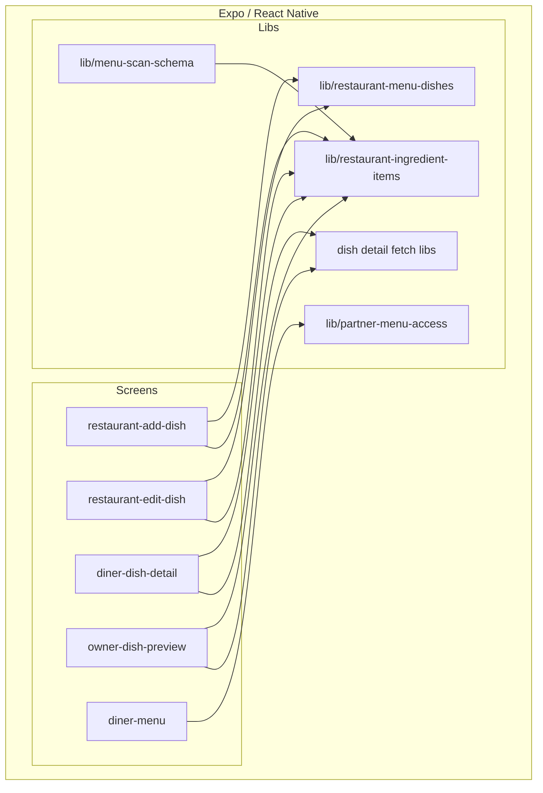
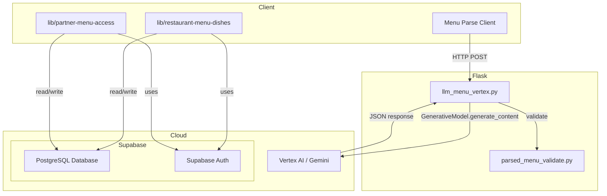
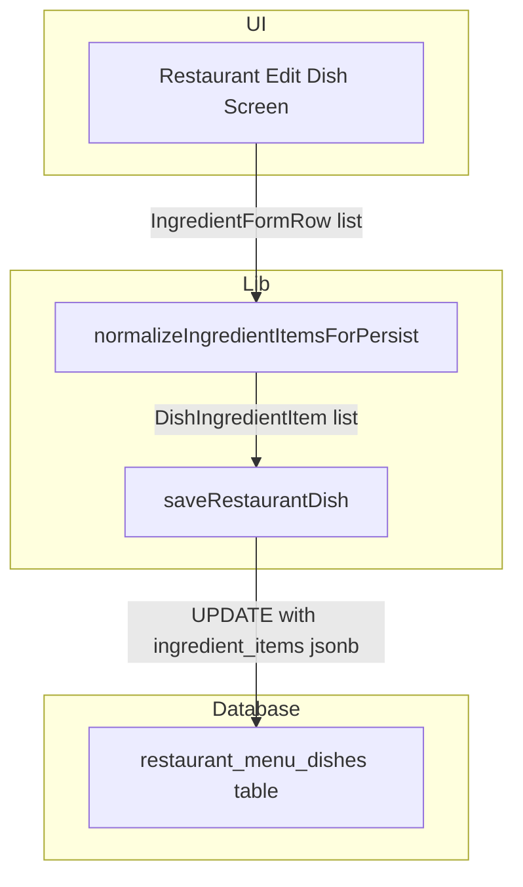
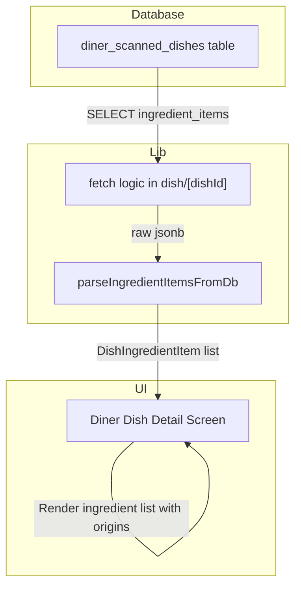
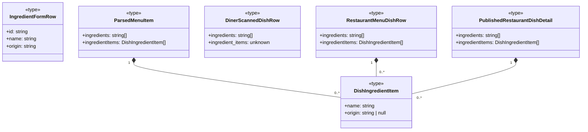
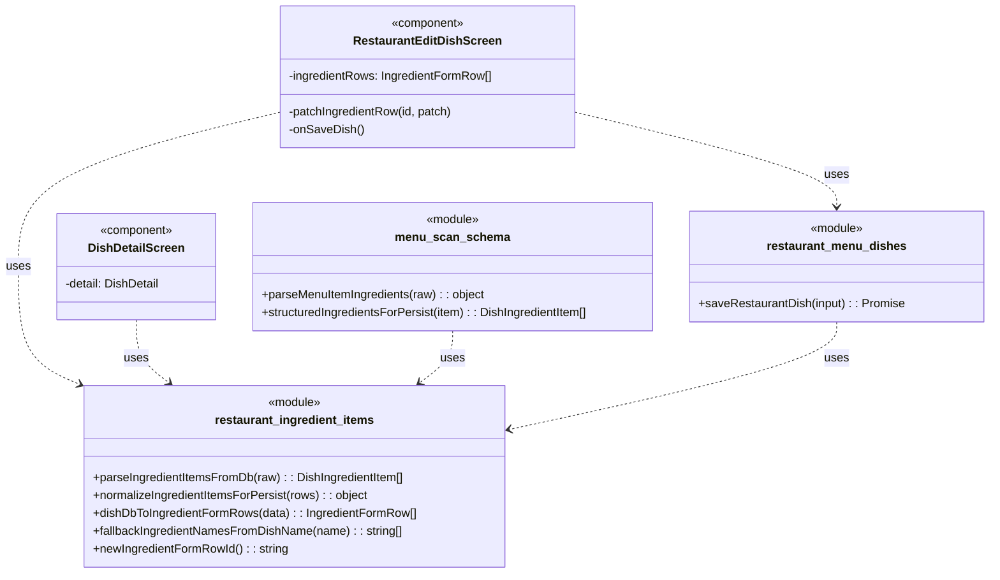

An excellent user story. Here is the development specification.

---

### 1. Primary and Secondary Owners

| Role | Name | Notes |
|------|------|-------|
| Primary owner | Cici Ge | Owns requirements and release sign-off |
| Secondary owner | Sofia Yu | Owns implementation review and test plan |

---

### 2. Date Merged into `main`

2026-04-16 (PR #84)

---

### 3. Architecture Diagram (Mermaid)

#### 3a. Client-side architecture

#### 3b. Backend and cloud architecture

---

### 4. Information Flow Diagram (Mermaid)

#### 4a. Write path

#### 4b. Read path

---

### 5. Class Diagram (Mermaid)

#### 5a. Data types and schemas

#### 5b. Components and modules

---

### 6. Implementation Units

#### `app/diner-menu.tsx`
- **File path:** `app/diner-menu.tsx`
- **Purpose:** Renders the menu for a diner based on a scan. This was updated to refresh partner-linked menus if the source restaurant menu has been updated, ensuring diners see the latest ingredient information.
- **Public fields and methods:**
  - `DinerMenuScreen()`: `React.FC` - The main component for the screen.
- **Private fields and methods:**
  - `loadMenu()`: `() => Promise<void>` - Fetches menu data, now includes a call to `refreshPartnerLinkedDinerScanIfStale`.
  - `DishCard`: `React.FC<{ dish: ParsedMenuItem }>` - Renders a single dish item in the menu list.

#### `app/dish/[dishId].tsx`
- **File path:** `app/dish/[dishId].tsx`
- **Purpose:** Displays the detailed view of a single dish for a diner. This was updated to display a structured list of ingredients and their origins.
- **Public fields and methods:**
  - `DishDetailScreen()`: `React.FC` - The main component for the screen.
- **Private fields and methods:**
  - `useEffect()` hook: Fetches dish details from `diner_scanned_dishes`, now including the `ingredient_items` column.
  - `detail`: `useState<DishDetail | null>` - State holding the fetched and parsed dish details, including `ingredientItems`.

#### `app/restaurant-add-dish.tsx`
- **File path:** `app/restaurant-add-dish.tsx`
- **Purpose:** A form for restaurant owners to add a new dish. The previous free-text ingredient input was replaced with a structured form allowing multiple ingredient rows, each with a name and an optional origin.
- **Public fields and methods:**
  - `RestaurantAddDishScreen()`: `React.FC` - The main component for the screen.
- **Private fields and methods:**
  - `ingredientRows`: `useState<IngredientFormRow[]>` - State for the dynamic list of ingredient inputs.
  - `addIngredientRow()`: `() => void` - Adds a new, empty ingredient row to the form.
  - `removeIngredientRow(id: string)`: `() => void` - Removes an ingredient row by its unique ID.
  - `patchIngredientRow(id: string, patch: Partial<...>)`: `() => void` - Updates the name or origin of a specific ingredient row.
  - `onSaveDish()`: `() => Promise<void>` - Saves the new dish, passing the structured `ingredientItemsForSave` to `saveRestaurantDish`.

#### `app/restaurant-edit-dish/[dishId].tsx`
- **File path:** `app/restaurant-edit-dish/[dishId].tsx`
- **Purpose:** A form for restaurant owners to edit an existing dish. This was updated to use the new structured ingredient form, replacing the old comma-separated text input.
- **Public fields and methods:**
  - `RestaurantEditDishScreen()`: `React.FC` - The main component for the screen.
- **Private fields and methods:**
  - `useEffect()` hook: Fetches existing dish data, now using `dishDbToIngredientFormRows` to populate the ingredient form state.
  - `ingredientRows`: `useState<IngredientFormRow[]>` - State for the dynamic list of ingredient inputs.
  - `addIngredientRow`, `removeIngredientRow`, `patchIngredientRow`, `onSaveDish`: Same as in `restaurant-add-dish.tsx`.

#### `app/restaurant-dish/[dishId].tsx`
- **File path:** `app/restaurant-dish/[dishId].tsx`
- **Purpose:** Displays a public, read-only view of a restaurant's dish. Updated to show the structured list of ingredients and their origins.
- **Public fields and methods:**
  - `RestaurantDishDetailScreen()`: `React.FC` - The main component for the screen.

#### `app/restaurant-owner-dish/[dishId].tsx`
- **File path:** `app/restaurant-owner-dish/[dishId].tsx`
- **Purpose:** Displays a read-only preview of a dish for the restaurant owner. Updated to show the structured list of ingredients and their origins, including a placeholder for unspecified origins.
- **Public fields and methods:**
  - `RestaurantOwnerDishDetailScreen()`: `React.FC` - The main component for the screen.

#### `backend/llm_menu_vertex.py`
- **File path:** `backend/llm_menu_vertex.py`
- **Purpose:** Contains the logic for parsing a menu using Vertex AI (Gemini). The prompt was updated to provide better instructions for inferring ingredients, especially for simple items.
- **Public fields and methods:**
  - `parse_menu_with_llm(...)`: The main entry point function.
- **Private fields and methods:**
  - `_build_prompt()`: Constructs the prompt sent to the LLM, which now has more detailed ingredient instructions.

#### `backend/parsed_menu_validate.py`
- **File path:** `backend/parsed_menu_validate.py`
- **Purpose:** Validates the JSON structure returned by the LLM. The ingredient parsing was made more flexible to accept arrays of strings or arrays of `{name, ...}` objects.
- **Public fields and methods:**
  - `validate_parsed_menu(...)`: The main validation function.
- **Private fields and methods:**
  - `_parse_ingredients(raw: Any)`: `-> list[str] | None` - Updated to extract ingredient names from various possible structures.

#### `lib/restaurant-ingredient-items.ts`
- **File path:** `lib/restaurant-ingredient-items.ts`
- **Purpose:** A new module containing all shared logic for handling structured dish ingredients. It provides functions for parsing, normalizing, validating, and transforming ingredient data between different formats (DB, form, API).
- **Public fields and methods:**
  - `parseIngredientItemsFromDb(raw: unknown)`: `-> DishIngredientItem[]` - Safely parses the `jsonb` column from the database into a typed array.
  - `normalizeIngredientItemsForPersist(rows: ...)`: `-> { ok, items } | { ok, error }` - Validates and cleans ingredient form data before saving to the database.
  - `dishDbToIngredientFormRows(data: ...)`: `-> IngredientFormRow[]` - Converts database data (new `ingredient_items` or legacy `ingredients`) into the state structure for the edit form.
  - `fallbackIngredientNamesFromDishName(name: string)`: `-> string[]` - Infers ingredients from a dish name if none are provided.
  - `ingredientNamesForLegacy(items: DishIngredientItem[])`: `-> string[]` - Extracts just the names to populate the legacy `ingredients` text array.
  - `newIngredientFormRowId()`: `-> string` - Generates a unique ID for new ingredient form rows.

#### `lib/restaurant-menu-dishes.ts`
- **File path:** `lib/restaurant-menu-dishes.ts`
- **Purpose:** Contains functions for saving and updating restaurant dishes.
- **Public fields and methods:**
  - `saveRestaurantDish(input: SaveRestaurantDishInput)`: `-> Promise<...>` - Updated to accept `ingredientItems`, validate them using `normalizeIngredientItemsForPersist`, and save both the new `ingredient_items` (jsonb) and legacy `ingredients` (text[]) columns.

#### `lib/menu-scan-schema.ts`
- **File path:** `lib/menu-scan-schema.ts`
- **Purpose:** Defines the schema and validation for parsed menu data.
- **Public fields andmethods:**
  - `parseMenuItemIngredients(raw: unknown)`: `-> { names: string[], items: DishIngredientItem[] }` - Normalizes various ingredient formats from the LLM into a consistent structure.
  - `structuredIngredientsForPersist(it: ParsedMenuItem)`: `-> DishIngredientItem[]` - Prepares the structured ingredient data for database insertion.
  - `dishRowToParsedItem(row: DinerScannedDishRow)`: `-> ParsedMenuItem` - Maps a database row to a `ParsedMenuItem`, now including `ingredientItems`.

#### `lib/partner-menu-access.ts`
- **File path:** `lib/partner-menu-access.ts`
- **Purpose:** Handles logic for partner QR codes, which create a copy of a restaurant menu for a diner.
- **Public fields and methods:**
  - `resolvePartnerTokenToDinerScan(...)`: Updated to copy the `ingredient_items` from the source `restaurant_menu_dishes` to the new `diner_scanned_dishes` row.
  - `refreshPartnerLinkedDinerScanIfStale(dinerScanId: string)`: `-> Promise<...>` - New function to check if a diner's copied menu is stale and re-copy it if necessary.

---

### 7. Technologies, Libraries, and APIs

| Technology | Version | Used for | Why chosen over alternatives | Source / Docs URL |
|------------|---------|----------|------------------------------|-------------------|
| TypeScript | ~5.3.3 | Language for the mobile app | Provides type safety for a large codebase. | https://www.typescriptlang.org/ |
| React Native | 0.73.6 | Mobile application framework | Cross-platform (iOS/Android) development from a single codebase. | https://reactnative.dev/ |
| Expo SDK | ~50.0.17 | Toolchain and libraries for React Native | Simplifies build, deployment, and provides a suite of native APIs. | https://docs.expo.dev/ |
| Expo Router | ~3.4.10 | File-based routing for React Native | Provides a web-like routing paradigm for native apps. | https://docs.expo.dev/router/introduction/ |
| Python | 3.11 | Language for the backend server | Robust, with excellent support for web frameworks and machine learning. | https://www.python.org/ |
| Flask | 2.3.3 | Backend web framework | Lightweight and flexible for creating the menu parsing API. | https://flask.palletsprojects.com/ |
| Supabase JS Client | ~2.43.4 | Interacting with Supabase from the client | Official library for querying the database and handling auth directly from Expo. | https://supabase.com/docs/reference/javascript/ |
| Supabase (PostgreSQL) | 15.1 | Database | Provides a scalable, relational database for storing all application data. | https://supabase.com/docs/guides/database |
| Supabase (Auth) | 2.0 | User authentication | Manages user sign-up, sign-in, and session management. | https://supabase.com/docs/guides/auth |
| Vertex AI (Gemini) | Unknown | AI-powered menu parsing | Used via the Flask backend to extract structured data from menu images/text. | https://cloud.google.com/vertex-ai |
| Node.js | 20.x | JavaScript runtime for tooling | Runs the development environment for the Expo app. | https://nodejs.org/ |

---

### 8. Database — Long-Term Storage

#### `restaurant_menu_dishes`
- **Table purpose:** Stores the canonical data for every dish created by a restaurant owner.
- **Columns added/modified:**
  - `ingredient_items`: `jsonb`, Stores a JSON array of objects, where each object represents an ingredient with a `name` (string) and an optional `origin` (string or null). E.g., `[{"name": "Tomatoes", "origin": "Local Farm"}, {"name": "Salt", "origin": null}]`. Estimated storage: 50-500 bytes per row, depending on ingredient count.
- **Estimated total storage per user:** Negligible increase. Assuming a restaurant has 100 dishes, this adds ~50 KB.

#### `diner_scanned_dishes`
- **Table purpose:** Stores dish data from a menu scan, including copies from partner QR codes.
- **Columns added/modified:**
  - `ingredient_items`: `jsonb`, Same structure and purpose as in `restaurant_menu_dishes`. This column is populated when a diner scans a partner QR code, creating a copy of the restaurant's structured ingredient data. It remains `[]` for OCR-scanned menus. Estimated storage: 50-500 bytes per row.
- **Estimated total storage per user:** Negligible increase. Assuming a user scans 10 partner menus with 50 dishes each, this adds ~250 KB.

---

### 9. Failure Scenarios

1.  **Frontend process crash:** Any unsaved ingredient changes in the "Add/Edit Dish" screen will be lost. The user will have to re-enter them upon restarting the app.
2.  **Loss of all runtime state:** Same as a crash. Unsaved ingredient data is lost.
3.  **All stored data erased:** All dishes and their ingredients would be gone. The UI on both diner and owner sides would show empty states or "Information not available" placeholders where ingredients would normally appear.
4.  **Corrupt data in the database:** If the `ingredient_items` JSONB column contains malformed data, the `parseIngredientItemsFromDb` function is designed to fail gracefully, returning an empty array. The user would see "Information not available" instead of a crash.
5.  **Remote procedure call (API call) failed:**
    - **User-visible:** When saving a dish, an alert modal will appear stating the save failed. When viewing a dish, an error message will be displayed instead of the dish content.
    - **Internally-visible:** A `Promise` rejection is caught in a `try/catch` block, and state is updated to show an error message. The Supabase client will log the specific database error.
6.  **Client overloaded:** The "Add/Edit Dish" screen might become slow and unresponsive if a user adds an extremely large number of ingredient rows, as each input is a controlled component causing re-renders.
7.  **Client out of RAM:** The application will crash. This is more likely on the "Add/Edit Dish" screen if it holds many complex state objects for a large number of ingredient rows.
8.  **Database out of storage space:** `UPDATE` or `INSERT` queries to `restaurant_menu_dishes` or `diner_scanned_dishes` will fail. The user will see a generic "Save failed" error.
9.  **Network connectivity lost:** All Supabase client calls will fail. The user will see error messages when trying to load or save dish data.
10. **Database access lost:** Same as network connectivity loss. The Supabase client will be unable to connect, resulting in failed API calls and user-visible errors.
11. **Bot signs up and spams users:** A bot could sign up as a restaurant owner and create dishes with spam content in the ingredient name and origin fields. This content would then be visible to diners. No specific anti-spam measures were added in this PR.

---

### 10. PII, Security, and Compliance

This feature does not solicit, handle, or store any Personally Identifying Information (PII). The data stored consists of food ingredient names (e.g., "Chicken", "Tomato") and their geographical or supplier origins (e.g., "Spain", "Local Farm"), which are not linked to any individual's identity.

**Minor users:**
- Does this feature solicit or store PII of users under 18?
  - No.
- If yes: does the app solicit guardian permission?
  - N/A.
- What is the team policy for ensuring minors' PII is not accessible by anyone convicted or suspected of child abuse?
  - N/A.