## 1. Primary and Secondary Owners

| Role | Name | Notes |
|------|------|-------|
| Primary owner | Unknown — leave blank for human to fill in. | Owns requirements and release sign-off |
| Secondary owner | Unknown — leave blank for human to fill in. | Owns implementation review and test plan |

---

### 2. Date Merged into `main`

2026-04-16 (PR #84)

---

### 3. Architecture Diagram (Mermaid)

```mermaid
flowchart TB
    subgraph Client
        DinerApp["app/dish/[dishId].tsx (DishDetailScreen)"]
        DinerMenuApp["app/diner-menu.tsx (DinerMenuScreen)"]
        RestaurantOwnerApp["app/restaurant-owner-dish/[dishId].tsx (RestaurantOwnerDishDetailScreen)"]
        RestaurantAddDishApp["app/restaurant-add-dish.tsx (RestaurantAddDishScreen)"]
        RestaurantEditDishApp["app/restaurant-edit-dish/[dishId].tsx (RestaurantEditDishScreen)"]
        RestaurantPublicDishApp["app/restaurant-dish/[dishId].tsx (RestaurantDishDetailScreen)"]
        LibRestaurantIngredientItems["lib/restaurant-ingredient-items.ts"]
        LibMenuScanSchema["lib/menu-scan-schema.ts"]
        LibFetchParsedMenuForScan["lib/fetch-parsed-menu-for-scan.ts"]
        LibPartnerMenuAccess["lib/partner-menu-access.ts"]
        LibPersistParsedMenu["lib/persist-parsed-menu.ts"]
        LibRestaurantFetchMenuForScan["lib/restaurant-fetch-menu-for-scan.ts"]
        LibRestaurantMenuDishes["lib/restaurant-menu-dishes.ts"]
        LibRestaurantOwnerDishDetail["lib/restaurant-owner-dish-detail.ts"]
        LibRestaurantPublicDish["lib/restaurant-public-dish.ts"]
        LibRestaurantPersistMenu["lib/restaurant-persist-menu.ts"]
    end

    subgraph Server
        FlaskBackend["Flask Backend"]
        LLMMenuVertex["backend/llm_menu_vertex.py"]
        ParsedMenuValidate["backend/parsed_menu_validate.py"]
    end

    subgraph Cloud
        SupabaseAuth["Supabase Auth"]
        SupabasePostgreSQL["Supabase PostgreSQL"]
        VertexAIGemini["Vertex AI / Gemini"]
    end

    DinerApp --> LibRestaurantIngredientItems
    DinerApp --> LibMenuScanSchema
    DinerMenuApp --> LibPartnerMenuAccess
    DinerMenuApp --> LibFetchParsedMenuForScan
    RestaurantOwnerApp --> LibRestaurantIngredientItems
    RestaurantOwnerApp --> LibRestaurantOwnerDishDetail
    RestaurantAddDishApp --> LibRestaurantIngredientItems
    RestaurantAddDishApp --> LibRestaurantMenuDishes
    RestaurantEditDishApp --> LibRestaurantIngredientItems
    RestaurantEditDishApp --> LibRestaurantMenuDishes
    RestaurantPublicDishApp --> LibRestaurantIngredientItems
    RestaurantPublicDishApp --> LibRestaurantPublicDish

    LibFetchParsedMenuForScan --> SupabasePostgreSQL
    LibPartnerMenuAccess --> SupabasePostgreSQL
    LibPartnerMenuAccess --> SupabaseAuth
    LibPersistParsedMenu --> SupabasePostgreSQL
    LibRestaurantFetchMenuForScan --> SupabasePostgreSQL
    LibRestaurantMenuDishes --> SupabasePostgreSQL
    LibRestaurantOwnerDishDetail --> SupabasePostgreSQL
    LibRestaurantPublicDish --> SupabasePostgreSQL
    LibRestaurantPersistMenu --> SupabasePostgreSQL

    FlaskBackend --> LLMMenuVertex
    FlaskBackend --> ParsedMenuValidate
    LLMMenuVertex --> VertexAIGemini
    ParsedMenuValidate --> LibMenuScanSchema

    LibMenuScanSchema -- LLM output parsing --> ParsedMenuValidate
    LibMenuScanSchema -- LLM output parsing --> LibRestaurantIngredientItems

    LibPersistParsedMenu -- Persist LLM output --> SupabasePostgreSQL
    LibRestaurantPersistMenu -- Persist LLM output --> SupabasePostgreSQL

    RestaurantAddDishApp -- Generate Summary/Image --> FlaskBackend
    RestaurantEditDishApp -- Generate Summary/Image --> FlaskBackend

    SupabasePostgreSQL -- Read/Write `restaurant_menu_dishes` --> LibRestaurantMenuDishes
    SupabasePostgreSQL -- Read `restaurant_menu_dishes` --> LibRestaurantFetchMenuForScan
    SupabasePostgreSQL -- Read `restaurant_menu_dishes` --> LibRestaurantOwnerDishDetail
    SupabasePostgreSQL -- Read `restaurant_menu_dishes` --> LibRestaurantPublicDish
    SupabasePostgreSQL -- Read/Write `diner_scanned_dishes` --> LibFetchParsedMenuForScan
    SupabasePostgreSQL -- Read/Write `diner_scanned_dishes` --> LibPartnerMenuAccess
    SupabasePostgreSQL -- Read `diner_scanned_dishes` --> DinerApp
    SupabasePostgreSQL -- Read `diner_menu_scans` --> LibPartnerMenuAccess
    SupabasePostgreSQL -- Read `diner_partner_qr_scans` --> LibPartnerMenuAccess

    style DinerApp fill:#bbf,stroke:#33c,stroke-width:2px
    style DinerMenuApp fill:#bbf,stroke:#33c,stroke-width:2px
    style RestaurantOwnerApp fill:#bbf,stroke:#33c,stroke-width:2px
    style RestaurantAddDishApp fill:#bbf,stroke:#33c,stroke-width:2px
    style RestaurantEditDishApp fill:#bbf,stroke:#33c,stroke-width:2px
    style RestaurantPublicDishApp fill:#bbf,stroke:#33c,stroke-width:2px
    style LibRestaurantIngredientItems fill:#bbf,stroke:#33c,stroke-width:2px
    style LibMenuScanSchema fill:#bbf,stroke:#33c,stroke-width:2px
    style LibFetchParsedMenuForScan fill:#bbf,stroke:#33c,stroke-width:2px
    style LibPartnerMenuAccess fill:#bbf,stroke:#33c,stroke-width:2px
    style LibPersistParsedMenu fill:#bbf,stroke:#33c,stroke-width:2px
    style LibRestaurantFetchMenuForScan fill:#bbf,stroke:#33c,stroke-width:2px
    style LibRestaurantMenuDishes fill:#bbf,stroke:#33c,stroke-width:2px
    style LibRestaurantOwnerDishDetail fill:#bbf,stroke:#33c,stroke-width:2px
    style LibRestaurantPublicDish fill:#bbf,stroke:#33c,stroke-width:2px
    style LibRestaurantPersistMenu fill:#bbf,stroke:#33c,stroke-width:2px

    style FlaskBackend fill:#bfb,stroke:#3c3,stroke-width:2px
    style LLMMenuVertex fill:#bfb,stroke:#3c3,stroke-width:2px
    style ParsedMenuValidate fill:#bfb,stroke:#3c3,stroke-width:2px

    style SupabaseAuth fill:#fbb,stroke:#c33,stroke-width:2px
    style SupabasePostgreSQL fill:#fbb,stroke:#c33,stroke-width:2px
    style VertexAIGemini fill:#fbb,stroke:#c33,stroke-width:2px
```



---

### 4. Information Flow Diagram (Mermaid)

```mermaid
flowchart LR
    User(User) -- Enters ingredient name/origin --> RestaurantAddDishApp
    User -- Enters ingredient name/origin --> RestaurantEditDishApp

    RestaurantAddDishApp -- DishIngredientItem[] --> LibRestaurantMenuDishes
    RestaurantEditDishApp -- DishIngredientItem[] --> LibRestaurantMenuDishes
    LibRestaurantMenuDishes -- DishIngredientItem[] (JSONB) --> SupabasePostgreSQL(Supabase PostgreSQL)

    LLMMenuVertex(backend/llm_menu_vertex.py) -- Parsed ingredients (flexible format) --> ParsedMenuValidate(backend/parsed_menu_validate.py)
    ParsedMenuValidate -- Parsed ingredients (string[] or {name, origin}[]) --> LibMenuScanSchema(lib/menu-scan-schema.ts)
    LibMenuScanSchema -- DishIngredientItem[] --> LibPersistParsedMenu(lib/persist-parsed-menu.ts)
    LibMenuScanSchema -- DishIngredientItem[] --> LibRestaurantPersistMenu(lib/restaurant-persist-menu.ts)
    LibPersistParsedMenu -- DishIngredientItem[] (JSONB) --> SupabasePostgreSQL
    LibRestaurantPersistMenu -- DishIngredientItem[] (JSONB) --> SupabasePostgreSQL

    SupabasePostgreSQL -- `restaurant_menu_dishes.ingredient_items` --> LibRestaurantFetchMenuForScan(lib/restaurant-fetch-menu-for-scan.ts)
    LibRestaurantFetchMenuForScan -- DishIngredientItem[] --> LibPartnerMenuAccess(lib/partner-menu-access.ts)
    LibPartnerMenuAccess -- DishIngredientItem[] (JSONB) --> SupabasePostgreSQL

    SupabasePostgreSQL -- `diner_scanned_dishes.ingredient_items` --> LibFetchParsedMenuForScan(lib/fetch-parsed-menu-for-scan.ts)
    LibFetchParsedMenuForScan -- DishIngredientItem[] --> DinerApp(app/dish/[dishId].tsx)
    DinerApp -- Displays ingredient name/origin --> User

    SupabasePostgreSQL -- `restaurant_menu_dishes.ingredient_items` --> LibRestaurantOwnerDishDetail(lib/restaurant-owner-dish-detail.ts)
    LibRestaurantOwnerDishDetail -- DishIngredientItem[] --> RestaurantOwnerApp(app/restaurant-owner-dish/[dishId].tsx)
    RestaurantOwnerApp -- Displays ingredient name/origin --> User

    SupabasePostgreSQL -- `restaurant_menu_dishes.ingredient_items` --> LibRestaurantPublicDish(lib/restaurant-public-dish.ts)
    LibRestaurantPublicDish -- DishIngredientItem[] --> RestaurantPublicDishApp(app/restaurant-dish/[dishId].tsx)
    RestaurantPublicDishApp -- Displays ingredient name/origin --> User

    style User fill:#fff,stroke:#333,stroke-width:2px
    style DinerApp fill:#bbf,stroke:#33c,stroke-width:2px
    style RestaurantAddDishApp fill:#bbf,stroke:#33c,stroke-width:2px
    style RestaurantEditDishApp fill:#bbf,stroke:#33c,stroke-width:2px
    style RestaurantOwnerApp fill:#bbf,stroke:#33c,stroke-width:2px
    style RestaurantPublicDishApp fill:#bbf,stroke:#33c,stroke-width:2px
    style LLMMenuVertex fill:#bfb,stroke:#3c3,stroke-width:2px
    style ParsedMenuValidate fill:#bfb,stroke:#3c3,stroke-width:2px
    style SupabasePostgreSQL fill:#fbb,stroke:#c33,stroke-width:2px
```

---

### 5. Class Diagram (Mermaid)

```mermaid
classDiagram
    direction LR

    class DishDetailScreen <<component>>
    class DinerMenuScreen <<component>>
    class RestaurantAddDishScreen <<component>>
    class RestaurantEditDishScreen <<component>>
    class RestaurantOwnerDishDetailScreen <<component>>
    class RestaurantDishDetailScreen <<component>>

    class DishDetail <<type>>
    class ParsedMenuItem <<type>>
    class DinerScannedDishRow <<type>>
    class RestaurantMenuDishRow <<type>>
    class RestaurantOwnerDishDetail <<type>>
    class PublishedRestaurantDishDetail <<type>>
    class SaveRestaurantDishInput <<type>>

    class DishIngredientItem <<type>> {
        +name: string
        +origin: string | null
    }
    class IngredientFormRow <<type>> {
        +id: string
        +name: string
        +origin: string
    }

    class LibRestaurantIngredientItems <<module>> {
        +MAX_DISH_INGREDIENT_ORIGIN_LEN: number
        +DISH_INGREDIENT_ORIGIN_NOT_SPECIFIED: string
        +newIngredientFormRowId(): string
        +fallbackIngredientNamesFromDishName(name: string): string[]
        +dishDbToIngredientFormRows(data: {ingredient_items?: unknown, ingredients?: unknown, name?: string | null}): IngredientFormRow[]
        +ingredientNamesForLegacy(items: DishIngredientItem[]): string[]
        +parseIngredientItemsFromDb(raw: unknown): DishIngredientItem[]
        +normalizeIngredientItemsForPersist(rows: {name: string, origin: string | null | undefined}[]): {ok: true, items: DishIngredientItem[]} | {ok: false, error: string}
    }

    class LibMenuScanSchema <<module>> {
        +parseMenuItemIngredients(raw: unknown): {names: string[], items: DishIngredientItem[]}
        +structuredIngredientsForPersist(it: ParsedMenuItem): DishIngredientItem[]
        +dishRowToParsedItem(row: DinerScannedDishRow): ParsedMenuItem
    }

    class LibFetchParsedMenuForScan <<module>>
    class LibPartnerMenuAccess <<module>>
    class LibPersistParsedMenu <<module>>
    class LibRestaurantFetchMenuForScan <<module>>
    class LibRestaurantMenuDishes <<module>>
    class LibRestaurantOwnerDishDetail <<module>>
    class LibRestaurantPublicDish <<module>>
    class LibRestaurantPersistMenu <<module>>

    class LLMMenuVertex <<service>>
    class ParsedMenuValidate <<service>>

    DishDetailScreen --> DishDetail
    DishDetailScreen --> DishIngredientItem
    DishDetailScreen --> LibRestaurantIngredientItems

    DinerMenuScreen --> ParsedMenuItem
    DinerMenuScreen --> LibPartnerMenuAccess
    DinerMenuScreen --> LibFetchParsedMenuForScan

    RestaurantAddDishScreen --> IngredientFormRow
    RestaurantAddDishScreen --> DishIngredientItem
    RestaurantAddDishScreen --> LibRestaurantIngredientItems
    RestaurantAddDishScreen --> SaveRestaurantDishInput
    RestaurantAddDishScreen --> LibRestaurantMenuDishes

    RestaurantEditDishScreen --> IngredientFormRow
    RestaurantEditDishScreen --> DishIngredientItem
    RestaurantEditDishScreen --> LibRestaurantIngredientItems
    RestaurantEditDishScreen --> SaveRestaurantDishInput
    RestaurantEditDishScreen --> LibRestaurantMenuDishes

    RestaurantOwnerDishDetailScreen --> RestaurantOwnerDishDetail
    RestaurantOwnerDishDetailScreen --> DishIngredientItem
    RestaurantOwnerDishDetailScreen --> LibRestaurantIngredientItems

    RestaurantDishDetailScreen --> PublishedRestaurantDishDetail
    RestaurantDishDetailScreen --> DishIngredientItem
    RestaurantDishDetailScreen --> LibRestaurantIngredientItems

    DishDetail *-- DishIngredientItem
    ParsedMenuItem *-- DishIngredientItem
    DinerScannedDishRow *-- DishIngredientItem
    RestaurantMenuDishRow *-- DishIngredientItem
    RestaurantOwnerDishDetail *-- DishIngredientItem
    PublishedRestaurantDishDetail *-- DishIngredientItem
    SaveRestaurantDishInput *-- DishIngredientItem

    IngredientFormRow -- uses --> LibRestaurantIngredientItems
    LibRestaurantIngredientItems ..> DishIngredientItem
    LibRestaurantIngredientItems ..> IngredientFormRow

    LibMenuScanSchema ..> DishIngredientItem
    LibMenuScanSchema ..> ParsedMenuItem
    LibMenuScanSchema -- uses --> LibRestaurantIngredientItems

    LibFetchParsedMenuForScan ..> DinerScannedDishRow
    LibFetchParsedMenuForScan ..> ParsedMenuItem

    LibPartnerMenuAccess ..> RestaurantMenuDishRow
    LibPartnerMenuAccess ..> DishIngredientItem

    LibPersistParsedMenu ..> ParsedMenuItem
    LibPersistParsedMenu ..> DishIngredientItem
    LibPersistParsedMenu -- uses --> LibMenuScanSchema

    LibRestaurantFetchMenuForScan ..> RestaurantMenuDishRow
    LibRestaurantFetchMenuForScan ..> DishIngredientItem
    LibRestaurantFetchMenuForScan -- uses --> LibRestaurantIngredientItems

    LibRestaurantMenuDishes ..> SaveRestaurantDishInput
    LibRestaurantMenuDishes -- uses --> LibRestaurantIngredientItems

    LibRestaurantOwnerDishDetail ..> RestaurantOwnerDishDetail
    LibRestaurantOwnerDishDetail ..> DishIngredientItem
    LibRestaurantOwnerDishDetail -- uses --> LibRestaurantIngredientItems

    LibRestaurantPublicDish ..> PublishedRestaurantDishDetail
    LibRestaurantPublicDish ..> DishIngredientItem
    LibRestaurantPublicDish -- uses --> LibRestaurantIngredientItems

    LibRestaurantPersistMenu ..> ParsedMenuItem
    LibRestaurantPersistMenu ..> DishIngredientItem
    LibRestaurantPersistMenu -- uses --> LibMenuScanSchema

    LLMMenuVertex ..> ParsedMenuValidate
    ParsedMenuValidate ..> LibMenuScanSchema
```

---

### 6. Implementation Units

**File path: `app/diner-menu.tsx`**
*   **Purpose**: Displays the diner's menu, allowing filtering and favoriting dishes. Updated to refresh partner-linked scans if stale.
*   **Public fields and methods**:
    *   `DinerMenuScreen()`: React component. The main screen for diners to view menus.
*   **Private fields and methods**:
    *   `loadMenu()`: `useCallback` function. Fetches diner preferences and the parsed menu for a given `scanId`. Now includes logic to refresh partner-linked diner scans if stale and update `scanId` in router params if a new scan is generated.
    *   `handleToggleFavorite(dishId: string)`: `useCallback` function. Toggles the favorite status of a dish.
    *   `availableTags`: `useMemo` array of strings. Derives available filter tags from diner preferences.
    *   `menuTagSet`: `useMemo` `Set<string>`. Contains all unique tags present in the current menu.
    *   `sectionBlocks`: `useMemo` array of objects `{ title: string, items: ParsedMenuItem[] }`. Filters menu sections and dishes based on `selectedTags`.
    *   `formatPrice(dish: ParsedMenuItem)`: Formats the price for display.
    *   `renderSpiceFlames(level: ParsedMenuItem['spice_level'])`: Renders spice level icons.
    *   `DishCard({ dish: ParsedMenuItem })`: React sub-component. Renders an individual dish card.

**File path: `app/dish/[dishId].tsx`**
*   **Purpose**: Displays detailed information for a single dish, including ingredients and dietary indicators. Now displays structured ingredient names and origins.
*   **Public fields and methods**:
    *   `DishDetailScreen()`: React component. The main screen for displaying dish details.
*   **Private fields and methods**:
    *   `DishDetail`: `type`. Defines the structure of dish detail data, now includes `ingredientItems: DishIngredientItem[]`.
    *   `titleize(label: string)`: Formats a string to title case.
    *   `deriveFlavorTags(tags: string[], spiceLevel: 0 | 1 | 2 | 3, description: string | null)`: Derives flavor tags from dish data.
    *   `deriveDietaryIndicators(tags: string[])`: Derives dietary indicators from dish tags.
    *   `formatPrice(amount: number | null, currency: string, display: string | null)`: Formats the dish price for display.
    *   `inferBudgetTier(amount: number | null)`: Infers a budget tier from the dish price.
    *   `buildFallbackSummary(input: { name: string; description: string | null; flavorTags: string[]; ingredients: string[]; spiceLevel: 0 | 1 | 2 | 3; })`: Generates a summary if no description is available.
    *   `buildWhyThisMatchesYou(detail: DishDetail, prefs: DinerPreferenceSnapshot | null)`: Generates reasons why a dish matches diner preferences.
    *   `useEffect` hook: Fetches dish details from Supabase, including the new `ingredient_items` column, and sets state. Also fetches diner preferences and favorite status.
    *   `reasons`: `useMemo` array of strings. Derived reasons why the dish matches user preferences.
    *   `onGenerateImage()`: Asynchronous function. Generates an AI image for the dish if one doesn't exist.

**File path: `app/restaurant-add-dish.tsx`**
*   **Purpose**: Allows restaurant owners to add new dishes to their menu. Updated to support structured ingredient input with optional origins.
*   **Public fields and methods**:
    *   `RestaurantAddDishScreen()`: React component. The screen for adding a new dish.
*   **Private fields and methods**:
    *   `SpiceLevel`: `type`. Union type for spice levels (0, 1, 2, 3).
    *   `parsePriceToAmount(input: string)`: Parses a price string into amount, currency, and display.
    *   `parseTagsText(input: string)`: Parses a comma-separated string of tags into an array.
    *   `ingredientItemsForSave`: `useMemo` array of `DishIngredientItem`. Transforms `ingredientRows` state into the format suitable for saving.
    *   `addIngredientRow()`: `useCallback` function. Adds a new blank ingredient row to the form.
    *   `removeIngredientRow(id: string)`: `useCallback` function. Removes an ingredient row by its ID.
    *   `patchIngredientRow(id: string, patch: Partial<Pick<IngredientFormRow, 'name' | 'origin'>>)`: `useCallback` function. Updates a specific ingredient row.
    *   `useEffect` hook: Creates a draft dish in Supabase when the component mounts.
    *   `commitCurrentFields(opts?: { touchScan?: boolean; description?: string | null })`: `useCallback` function. Saves the current dish form data to Supabase.
    *   `onUploadPhoto()`: `useCallback` function. Handles uploading a photo for the dish.
    *   `onGenerateImage()`: `useCallback` function. Generates an AI image for the dish.
    *   `onGenerateSummary()`: `useCallback` function. Generates an AI summary for the dish.
    *   `onSaveDish()`: `useCallback` function. Validates and saves the new dish, then navigates to the review menu screen.
    *   `spiceOptions`: Array of objects `{ level: SpiceLevel; label: string }`. Defines options for spice level selection.

**File path: `app/restaurant-dish/[dishId].tsx`**
*   **Purpose**: Displays a public preview of a restaurant dish. Updated to show structured ingredient names and origins.
*   **Public fields and methods**:
    *   `RestaurantDishDetailScreen()`: React component. Displays a public dish detail.
*   **Private fields and methods**:
    *   `useEffect` hook: Fetches the published restaurant dish detail from Supabase.
    *   `formatPrice(amount: number | null, currency: string, display: string | null)`: Formats the price for display.
    *   `renderSpiceFlames(level: 0 | 1 | 2 | 3)`: Renders spice level icons.

**File path: `app/restaurant-edit-dish/[dishId].tsx`**
*   **Purpose**: Allows restaurant owners to edit existing dishes. Updated to support structured ingredient input with optional origins.
*   **Public fields and methods**:
    *   `RestaurantEditDishScreen()`: React component. The screen for editing an existing dish.
*   **Private fields and methods**:
    *   `SpiceLevel`: `type`. Union type for spice levels (0, 1, 2, 3).
    *   `parsePriceToAmount(input: string)`: Parses a price string into amount, currency, and display.
    *   `parseTagsText(input: string)`: Parses a comma-separated string of tags into an array.
    *   `useEffect` hook: Fetches existing dish data from Supabase, including `ingredient_items`, and populates the form fields.
    *   `ingredientItemsForSave`: `useMemo` array of `DishIngredientItem`. Transforms `ingredientRows` state into the format suitable for saving.
    *   `addIngredientRow()`: `useCallback` function. Adds a new blank ingredient row to the form.
    *   `removeIngredientRow(id: string)`: `useCallback` function. Removes an ingredient row by its ID.
    *   `patchIngredientRow(id: string, patch: Partial<Pick<IngredientFormRow, 'name' | 'origin'>>)`: `useCallback` function. Updates a specific ingredient row.
    *   `onUploadPhoto()`: `useCallback` function. Handles uploading a photo for the dish.
    *   `onGenerateImage()`: `useCallback` function. Generates an AI image for the dish.
    *   `onGenerateSummary()`: `useCallback` function. Generates an AI summary for the dish.
    *   `onSaveDish()`: `useCallback` function. Validates and saves the edited dish, then navigates to the review menu screen.
    *   `spiceOptions`: Array of objects `{ level: SpiceLevel; label: string }`. Defines options for spice level selection.

**File path: `app/restaurant-owner-dish/[dishId].tsx`**
*   **Purpose**: Displays a detailed view of a dish for the restaurant owner. Updated to show structured ingredient names and origins.
*   **Public fields and methods**:
    *   `RestaurantOwnerDishDetailScreen()`: React component. Displays owner's dish detail.
*   **Private fields and methods**:
    *   `useEffect` hook: Fetches the restaurant owner dish detail from Supabase.
    *   `formatPrice(amount: number | null, currency: string, display: string | null)`: Formats the price for display.
    *   `renderSpiceFlames(level: 0 | 1 | 2 | 3)`: Renders spice level icons.

**File path: `backend/llm_menu_vertex.py`**
*   **Purpose**: Defines the prompt and parsing rules for the LLM (Vertex AI/Gemini) to extract menu information. Updated to clarify ingredient parsing.
*   **Public fields and methods**:
    *   `_json_from_model_text(text: str)`: Helper to parse JSON from model output.
    *   `generate_menu_json(image_bytes: bytes, allowed_tags: list[str], existing_menu_json: dict | None = None)`: Main function to generate menu JSON.
*   **Private fields and methods**:
    *   `_SYSTEM_INSTRUCTIONS`: String. System instructions for the LLM, updated to clarify `items[].ingredients` parsing to include single-component dishes and avoid empty arrays when the name implies components.

**File path: `backend/parsed_menu_validate.py`**
*   **Purpose**: Validates and normalizes the JSON output from the LLM for menu parsing. Updated to handle flexible ingredient formats.
*   **Public fields and methods**:
    *   `validate_parsed_menu(raw: Any)`: Validates the entire parsed menu structure.
*   **Private fields and methods**:
    *   `_parse_ingredients(raw: Any)`: Parses and normalizes ingredient data. Now accepts `list[str]`, `dict` with "name" or "ingredient" keys, and filters out empty strings.
    *   `_parse_item(raw: Any)`: Parses and validates a single menu item.

**File path: `lib/fetch-parsed-menu-for-scan.ts`**
*   **Purpose**: Fetches a parsed menu for a diner's scan from Supabase. Updated to select the new `ingredient_items` column.
*   **Public fields and methods**:
    *   `fetchParsedMenuForScan(scanId: string)`: Asynchronous function. Fetches menu data.
*   **Private fields and methods**:
    *   (None explicitly private, but internal to module)

**File path: `lib/menu-scan-schema.ts`**
*   **Purpose**: Defines the schema for parsed menu data and provides utility functions for parsing and normalization. Significantly updated to handle structured ingredients.
*   **Public fields and methods**:
    *   `MENU_SCAN_SCHEMA_VERSION`: `const number`. Current schema version.
    *   `ParsedMenuPrice`: `type`.
    *   `ParsedMenuItem`: `type`. Now includes optional `ingredientItems: DishIngredientItem[]`.
    *   `ParsedMenuSection`: `type`.
    *   `ParsedMenu`: `type`.
    *   `DinerScannedDishRow`: `type`. Now includes optional `ingredient_items: unknown`.
    *   `validateParsedMenu(raw: unknown)`: Validates a raw menu object against the schema.
    *   `parsedMenuHasItems(menu: ParsedMenu)`: Checks if a parsed menu contains any items.
    *   `assembleParsedMenu(sections: ParsedMenuSection[], restaurantName: string | null)`: Assembles a `ParsedMenu` object.
    *   `normalizeSpiceLevel(n: unknown)`: Normalizes a spice level value.
    *   `dishRowToParsedItem(row: DinerScannedDishRow)`: Maps a Supabase dish row to a `ParsedMenuItem`.
    *   `parseMenuItemIngredients(raw: unknown)`: Parses flexible ingredient input (string, string[], object[]) into `names` and `items`.
    *   `structuredIngredientsForPersist(it: ParsedMenuItem)`: Converts `ParsedMenuItem` ingredients into `DishIngredientItem[]` for persistence, prioritizing `ingredientItems` then `ingredients` then `fallbackIngredientNamesFromDishName`.
*   **Private fields and methods**:
    *   `parsePrice(raw: unknown)`: Parses price data.
    *   `parseItem(raw: unknown)`: Parses a single menu item, now using `parseMenuItemIngredients` and `parseIngredientItemsFromDb`.
    *   `parseSection(raw: unknown)`: Parses a menu section.

**File path: `lib/partner-menu-access.ts`**
*   **Purpose**: Handles access to partner menus via QR codes, including copying restaurant menus to diner scans. Updated to copy structured ingredient data and refresh stale scans.
*   **Public fields and methods**:
    *   `buildPartnerMenuLink(token: string)`: Builds a deep link for a partner menu.
    *   `buildPartnerMenuQrUrl(token: string)`: Builds a QR URL for a partner menu.
    *   `getOrCreateOwnerPartnerMenuToken(restaurantId: string)`: Gets or creates an owner's partner menu token.
    *   `resolvePartnerTokenToDinerScan(token: string)`: Resolves a partner token to a diner scan, copying menu data if necessary. Now copies `ingredient_items`.
    *   `refreshPartnerLinkedDinerScanIfStale(dinerScanId: string)`: Refreshes a diner's partner-linked scan if the restaurant's menu has been updated.
*   **Private fields and methods**:
    *   (None explicitly private, but internal to module)

**File path: `lib/persist-parsed-menu.ts`**
*   **Purpose**: Persists a parsed menu (from OCR/LLM) into the `diner_scanned_dishes` table. Updated to save the new `ingredient_items` column.
*   **Public fields and methods**:
    *   `PersistParsedMenuResult`: `type`.
    *   `persistParsedMenu(menu: ParsedMenu, profileId: string)`: Asynchronous function. Persists the menu.
*   **Private fields and methods**:
    *   (None explicitly private, but internal to module)

**File path: `lib/restaurant-fetch-menu-for-scan.ts`**
*   **Purpose**: Fetches a restaurant's menu for a specific scan. Updated to retrieve and process the new `ingredient_items` column.
*   **Public fields and methods**:
    *   `RestaurantMenuSectionRow`: `type`.
    *   `RestaurantMenuDishRow`: `type`. Now includes `ingredientItems: DishIngredientItem[]`.
    *   `FetchRestaurantMenuForScanResult`: `type`.
    *   `fetchRestaurantMenuForScan(scanId: string)`: Asynchronous function. Fetches the restaurant menu.
*   **Private fields and methods**:
    *   (None explicitly private, but internal to module)

**File path: `lib/restaurant-ingredient-items.ts`**
*   **Purpose**: Provides types and utility functions for handling structured ingredient items (name + optional origin). This is a new module.
*   **Public fields and methods**:
    *   `MAX_DISH_INGREDIENT_ORIGIN_LEN`: `const number`. Maximum length for ingredient origin.
    *   `DISH_INGREDIENT_ORIGIN_NOT_SPECIFIED`: `const string`. Placeholder text for unspecified origin.
    *   `DishIngredientItem`: `type`. Defines the structure `{ name: string; origin: string | null; }`.
    *   `IngredientFormRow`: `type`. Defines the structure `{ id: string; name: string; origin: string; }` for UI forms.
    *   `newIngredientFormRowId()`: Generates a unique ID for form rows.
    *   `fallbackIngredientNamesFromDishName(name: string)`: Derives ingredient names from a dish name as a fallback.
    *   `dishDbToIngredientFormRows(data: { ingredient_items?: unknown; ingredients?: unknown; name?: string | null; })`: Converts database ingredient data (structured or legacy) into `IngredientFormRow[]` for UI.
    *   `ingredientNamesForLegacy(items: DishIngredientItem[])`: Extracts only names from `DishIngredientItem[]` for legacy `ingredients` array.
    *   `parseIngredientItemsFromDb(raw: unknown)`: Parses flexible database/API input for `ingredient_items` into `DishIngredientItem[]`.
    *   `normalizeIngredientItemsForPersist(rows: { name: string; origin: string | null | undefined }[])`: Validates and normalizes `IngredientFormRow` data for persistence.
*   **Private fields and methods**:
    *   (None)

**File path: `lib/restaurant-menu-dishes.ts`**
*   **Purpose**: Provides functions for creating, saving, and managing restaurant menu dishes. Updated to handle structured ingredient items.
*   **Public fields and methods**:
    *   `SaveRestaurantDishInput`: `type`. Now includes `ingredientItems: DishIngredientItem[]`.
    *   `createRestaurantDishDraft(input: { sectionId: string; sortOrder: number; })`: Creates a draft dish.
    *   `getRestaurantSectionNextDishSortOrder(sectionId: string)`: Gets the next sort order for a dish in a section.
    *   `touchRestaurantMenuScan(scanId: string)`: Updates the `last_activity_at` timestamp for a menu scan.
    *   `saveRestaurantDish(input: SaveRestaurantDishInput)`: Asynchronous function. Saves a restaurant dish, now persisting `ingredient_items` and deriving `ingredients` from it.
*   **Private fields and methods**:
    *   (None explicitly private, but internal to module)

**File path: `lib/restaurant-owner-dish-detail.ts`**
*   **Purpose**: Fetches detailed information about a dish for the restaurant owner. Updated to retrieve and process the new `ingredient_items` column.
*   **Public fields and methods**:
    *   `RestaurantOwnerDishDetail`: `type`. Now includes `ingredientItems: DishIngredientItem[]`.
    *   `FetchRestaurantOwnerDishDetailResult`: `type`.
    *   `fetchRestaurantOwnerDishDetail(dishId: string)`: Asynchronous function. Fetches dish details.
*   **Private fields and methods**:
    *   (None explicitly private, but internal to module)

**File path: `lib/restaurant-persist-menu.ts`**
*   **Purpose**: Persists a parsed menu (from OCR/LLM) into the `restaurant_menu_dishes` table. Updated to save the new `ingredient_items` column.
*   **Public fields and methods**:
    *   `PersistRestaurantMenuDraftResult`: `type`.
    *   `persistRestaurantMenuDraft(menu: ParsedMenu, restaurantId: string)`: Asynchronous function. Persists the menu.
*   **Private fields and methods**:
    *   (None explicitly private, but internal to module)

**File path: `lib/restaurant-public-dish.ts`**
*   **Purpose**: Fetches public details of a restaurant dish. Updated to retrieve and process the new `ingredient_items` column.
*   **Public fields and methods**:
    *   `PublishedRestaurantDishDetail`: `type`. Now includes `ingredientItems: DishIngredientItem[]`.
    *   `FetchPublishedRestaurantDishDetailResult`: `type`.
    *   `fetchPublishedRestaurantDishDetail(dishId: string)`: Asynchronous function. Fetches public dish details.
*   **Private fields and methods**:
    *   (None explicitly private, but internal to module)

---

### 7. Technologies, Libraries, and APIs

| Technology | Version | Used for | Why chosen over alternatives | Source / Docs URL |
|------------|---------|----------|------------------------------|-------------------|
| TypeScript | Unknown | Type-safe JavaScript development | Enhances code quality, maintainability, and developer experience in large React Native projects. | [TypeScript Handbook](https://www.typescriptlang.org/docs/handbook/intro.html) |
| Node.js | Unknown | JavaScript runtime environment | Standard runtime for React Native/Expo development and tooling. | [Node.js Docs](https://nodejs.org/docs/) |
| React Native | Unknown | Mobile application framework | Cross-platform mobile development using JavaScript/TypeScript. | [React Native Docs](https://reactnative.dev/docs/getting-started) |
| Expo SDK | Unknown | React Native development platform | Simplifies React Native development, build, and deployment processes. | [Expo Docs](https://docs.expo.dev/) |
| Flask | Unknown | Python web framework | Lightweight backend for API endpoints, particularly for AI integrations. | [Flask Documentation](https://flask.palletsprojects.com/en/latest/) |
| Python | Unknown | Backend logic and AI integration | Language for Flask backend and Vertex AI/Gemini integration. | [Python Docs](https://docs.python.org/3/) |
| Supabase | Unknown | Backend-as-a-Service (BaaS) | Provides PostgreSQL database, authentication, and storage, simplifying backend development. | [Supabase Docs](https://supabase.com/docs) |
| PostgreSQL | Unknown | Relational database | Primary data store for application data. | [PostgreSQL Docs](https://www.postgresql.org/docs/) |
| Supabase JS client | Unknown | Interact with Supabase services | Official client library for JavaScript/TypeScript applications to connect to Supabase. | [Supabase JS Docs](https://supabase.com/docs/reference/javascript/initializing) |
| `@expo/vector-icons` | Unknown | Icon library for UI | Provides a wide range of customizable vector icons for React Native apps. | [Expo Vector Icons](https://docs.expo.dev/guides/icons/) |
| `expo-image` | Unknown | Image component for Expo | Optimized image loading and display in Expo apps. | [Expo Image](https://docs.expo.dev/versions/latest/sdk/image/) |
| `expo-linear-gradient` | Unknown | Linear gradient component | Allows creation of linear gradient backgrounds in React Native. | [Expo Linear Gradient](https://docs.expo.dev/versions/latest/sdk/linear-gradient/) |
| `expo-linking` | Unknown | Deep linking functionality | Handles deep links for navigation within the app. | [Expo Linking](https://docs.expo.dev/versions/latest/sdk/linking/) |
| `@react-navigation/native` | Unknown | Navigation for React Native | Provides routing and navigation capabilities for React Native applications. | [React Navigation Docs](https://reactnavigation.org/docs/getting-started/) |
| `expo-router` | Unknown | File-system based router for Expo | Simplifies routing in Expo projects. | [Expo Router Docs](https://expo.github.io/router/docs/) |
| `react-native-safe-area-context` | Unknown | Safe area handling | Provides hooks and components to handle safe areas on devices with notches/cutouts. | [React Native Safe Area Context](https://th3rdwave.github.io/react-native-safe-area-context/) |
| Vertex AI / Gemini | Unknown | Large Language Model (LLM) | Used for generating dish summaries and parsing menu data from images/text. | [Google Cloud Vertex AI](https://cloud.google.com/vertex-ai) |
| `JSON.parse` | Built-in | JSON string parsing | Standard JavaScript function for parsing JSON strings. | [MDN Web Docs](https://developer.mozilla.org/en-US/docs/Web/JavaScript/Reference/Global_Objects/JSON/parse) |
| `globalThis.crypto.randomUUID` | Built-in / Web Crypto API | UUID generation | Generates unique identifiers for ingredient form rows. | [MDN Web Docs](https://developer.mozilla.org/en-US/docs/Web/API/Crypto/randomUUID) |

---

### 8. Database — Long-Term Storage

**Table name: `public.restaurant_menu_dishes`**
*   **Purpose**: Stores information about dishes on restaurant menus.
*   **Columns**:
    *   `id`: `uuid`, Purpose: Unique identifier for the dish. Estimated storage: 16 bytes.
    *   `section_id`: `uuid`, Purpose: Foreign key to the menu section this dish belongs to. Estimated storage: 16 bytes.
    *   `name`: `text`, Purpose: Name of the dish. Estimated storage: 50 bytes (avg).
    *   `description`: `text`, Purpose: Detailed description of the dish. Estimated storage: 200 bytes (avg).
    *   `price_amount`: `numeric`, Purpose: Numeric price of the dish. Estimated storage: 8 bytes.
    *   `price_currency`: `text`, Purpose: ISO 4217 currency code (e.g., 'USD'). Estimated storage: 4 bytes.
    *   `price_display`: `text`, Purpose: Formatted price string for display. Estimated storage: 10 bytes (avg).
    *   `spice_level`: `smallint`, Purpose: Spice level (0-3). Estimated storage: 2 bytes.
    *   `tags`: `text[]`, Purpose: Array of descriptive tags for the dish. Estimated storage: 50 bytes (avg).
    *   `ingredients`: `text[]`, Purpose: Legacy array of key ingredient names. Estimated storage: 100 bytes (avg).
    *   `ingredient_items`: `jsonb`, Purpose: Structured JSON array of `{ name: string, origin: string | null }` for detailed ingredient information. Estimated storage: 200 bytes (avg, for ~5-10 ingredients with origins).
    *   `image_url`: `text`, Purpose: URL to the dish image. Estimated storage: 150 bytes (avg).
    *   `needs_review`: `boolean`, Purpose: Flag indicating if the dish needs owner review. Estimated storage: 1 byte.
    *   `is_featured`: `boolean`, Purpose: Flag indicating if the dish is featured. Estimated storage: 1 byte.
    *   `is_new`: `boolean`, Purpose: Flag indicating if the dish is new. Estimated storage: 1 byte.
*   **Estimated total storage per user**: This table stores dishes per restaurant. A restaurant might have 50-100 dishes. If a user owns one restaurant with 100 dishes, total storage for `ingredient_items` would be `100 dishes * 200 bytes/dish = 20 KB`. Total storage for all dish data would be `100 dishes * (16+16+50+200+8+4+10+2+50+100+200+150+1+1+1) bytes/dish = 100 * 809 bytes = ~81 KB`.

**Table name: `public.diner_scanned_dishes`**
*   **Purpose**: Stores copies of dishes from scanned menus for diners.
*   **Columns**:
    *   `id`: `uuid`, Purpose: Unique identifier for the scanned dish. Estimated storage: 16 bytes.
    *   `section_id`: `uuid`, Purpose: Foreign key to the menu section this dish belongs to. Estimated storage: 16 bytes.
    *   `name`: `text`, Purpose: Name of the dish. Estimated storage: 50 bytes (avg).
    *   `description`: `text`, Purpose: Detailed description of the dish. Estimated storage: 200 bytes (avg).
    *   `price_amount`: `numeric`, Purpose: Numeric price of the dish. Estimated storage: 8 bytes.
    *   `price_currency`: `text`, Purpose: ISO 4217 currency code (e.g., 'USD'). Estimated storage: 4 bytes.
    *   `price_display`: `text`, Purpose: Formatted price string for display. Estimated storage: 10 bytes (avg).
    *   `spice_level`: `smallint`, Purpose: Spice level (0-3). Estimated storage: 2 bytes.
    *   `tags`: `text[]`, Purpose: Array of descriptive tags for the dish. Estimated storage: 50 bytes (avg).
    *   `ingredients`: `text[]`, Purpose: Legacy array of key ingredient names. Estimated storage: 100 bytes (avg).
    *   `ingredient_items`: `jsonb`, Purpose: Optional structured JSON array of `{ name: string, origin: string | null }` for partner QR menu copies. Estimated storage: 200 bytes (avg, for ~5-10 ingredients with origins).
    *   `image_url`: `text`, Purpose: URL to the dish image. Estimated storage: 150 bytes (avg).
*   **Estimated total storage per user**: A diner might scan many menus, each with 50-100 dishes. If a user has 10 scanned menus with 50 dishes each, total storage for `ingredient_items` would be `10 scans * 50 dishes/scan * 200 bytes/dish = 100 KB`. Total storage for all dish data would be `10 scans * 50 dishes/scan * (16+16+50+200+8+4+10+2+50+100+200+150) bytes/dish = 500 * 826 bytes = ~413 KB`.

---

### 9. Failure Scenarios

1.  **Frontend process crash**
    *   **User-visible effect**: The app freezes or closes unexpectedly. Any unsaved ingredient data in the "Add Dish" or "Edit Dish" screens will be lost. If viewing a dish detail, the screen will disappear.
    *   **Internally-visible effect**: React Native app process terminates. State in `RestaurantAddDishScreen`, `RestaurantEditDishScreen`, `DishDetailScreen` (e.g., `ingredientRows`, `detail`) is lost. No data corruption in backend.

2.  **Loss of all runtime state**
    *   **User-visible effect**: Similar to a crash, the app might restart or lose its current context. User would need to navigate back to the desired screen. Unsaved ingredient data would be lost.
    *   **Internally-visible effect**: All in-memory state (React component states, Redux/Context stores, local variables) is reset. Data already persisted to Supabase remains intact.

3.  **All stored data erased**
    *   **User-visible effect**: All restaurant menus and diner scanned menus disappear. Dish details, including ingredient names and origins, would be gone. Owners would see empty menus, diners would see no scanned menus.
    *   **Internally-visible effect**: `public.restaurant_menu_dishes` and `public.diner_scanned_dishes` tables (including the `ingredient_items` column) are empty. Data loss is permanent unless backups exist.

4.  **Corrupt data detected in the database**
    *   **User-visible effect**:
        *   If `ingredient_items` JSONB is malformed: Dish detail screens might fail to load ingredients, display an error, or show an empty list. Owner edit screens might fail to populate ingredient rows.
        *   If `name` or `origin` within `ingredient_items` is invalid (e.g., too long, wrong type): Display might be truncated, show `null`, or cause rendering errors.
    *   **Internally-visible effect**: Database queries might return errors or unexpected data. Frontend parsing functions (`parseIngredientItemsFromDb`) might return empty arrays or throw errors, leading to fallback behavior (e.g., showing "Information not available" or legacy `ingredients` array).

5.  **Remote procedure call (API call) failed**
    *   **User-visible effect**:
        *   When adding/editing a dish: Saving fails, an error message ("Save failed") is displayed, and ingredient data is not persisted.
        *   When viewing a dish: Dish details (including ingredients) fail to load, an error message ("Failed to load dish") is displayed.
        *   When refreshing a partner scan: Menu might not update, or an error might be shown.
    *   **Internally-visible effect**: Network request to Supabase or Flask backend fails (e.g., 5xx HTTP status, network timeout). `supabase.from(...).select/update` calls return an `error` object. Frontend `try/catch` blocks handle the error and update UI state (e.g., `setError`, `setSaving(false)`).

6.  **Client overloaded**
    *   **User-visible effect**: App becomes slow, unresponsive, or crashes. Inputting many ingredient rows might cause lag.
    *   **Internally-visible effect**: High CPU/memory usage on the client device. UI rendering becomes slow. JavaScript event loop is blocked. `useEffect` and `useMemo` hooks might re-run frequently if dependencies are unstable, contributing to performance issues.

7.  **Client out of RAM**
    *   **User-visible effect**: App crashes or is terminated by the OS.
    *   **Internally-visible effect**: OS kills the app process. Similar to frontend process crash. Large numbers of ingredient rows in state could exacerbate this.

8.  **Database out of storage space**
    *   **User-visible effect**: Users cannot add new dishes or edit existing ones (save operations fail). Partner QR scans might fail to copy menus.
    *   **Internally-visible effect**: Supabase write operations (`insert`, `update`) fail with a storage-related error. The `ingredient_items` column, being JSONB, can grow, but individual dish entries are relatively small. This is unlikely to be the first point of failure unless the database is already near capacity.

9.  **Network connectivity lost**
    *   **User-visible effect**: Any operation requiring network (saving dishes, loading dish details, refreshing partner scans) will fail with a network error. Users cannot see or modify ingredient data.
    *   **Internally-visible effect**: All Supabase client calls and Flask API calls will fail with network errors. Frontend error handling will activate.

10. **Database access lost**
    *   **User-visible effect**: Similar to network connectivity loss, but specifically for database operations. Users cannot retrieve or store any dish data, including ingredient details.
    *   **Internally-visible effect**: Supabase client library calls will fail, likely with authentication or authorization errors if access tokens are invalid, or network errors if the database server is unreachable.

11. **Bot signs up and spams users**
    *   **User-visible effect**: A bot could create many restaurant accounts and add numerous dishes with potentially offensive or nonsensical ingredient names and origins. Diners viewing these menus would see the spam.
    *   **Internally-visible effect**: The `restaurant_menu_dishes` table (and subsequently `diner_scanned_dishes` via partner QR copies) would be filled with bot-generated data in the `name`, `description`, `tags`, `ingredients`, and `ingredient_items` columns. This would increase storage usage and potentially degrade performance. Existing validation (e.g., `MAX_DISH_INGREDIENT_ORIGIN_LEN`) helps limit the size of individual fields but not the quantity of entries.

---

### 10. PII, Security, and Compliance

This feature introduces structured ingredient names and optional origins for dishes.

-   **What it is and why it must be stored**:
    *   **Ingredient Name**: The name of an ingredient (e.g., "Tomato", "Chicken"). Stored to inform diners about dish contents and for restaurant owners to manage their menu.
    *   **Ingredient Origin**: An optional string describing where an ingredient comes from (e.g., "Local farm", "Spain"). Stored to provide additional transparency and detail to diners.
    *   Neither of these fields are considered Personally Identifying Information (PII) as they describe food items, not individuals.

-   **How it is stored (encrypted, hashed, plaintext)**:
    *   Both ingredient name and origin are stored as plaintext strings within a JSONB array in the `ingredient_items` column of `public.restaurant_menu_dishes` and `public.diner_scanned_dishes`.
    *   The `ingredients` column (legacy `text[]`) also stores ingredient names in plaintext.

-   **How it entered the system (user input path → modules → fields → storage)**:
    1.  **User Input Path**: Restaurant owner types ingredient name and optional origin into `TextInput` fields in `RestaurantAddDishScreen` or `RestaurantEditDishScreen`.
    2.  **Modules**:
        *   `app/restaurant-add-dish.tsx` / `app/restaurant-edit-dish/[dishId].tsx` capture input into `IngredientFormRow` state.
        *   `lib/restaurant-ingredient-items.ts` (`normalizeIngredientItemsForPersist`) validates and transforms `IngredientFormRow` into `DishIngredientItem[]`.
        *   `lib/restaurant-menu-dishes.ts` (`saveRestaurantDish`) receives `DishIngredientItem[]`.
    3.  **Fields**: `SaveRestaurantDishInput.ingredientItems`.
    4.  **Storage**: `public.restaurant_menu_dishes.ingredient_items` (JSONB array).
    5.  *(Additionally, for LLM-parsed menus)*:
        *   **Input**: LLM output from `backend/llm_menu_vertex.py` contains ingredient data (flexible format).
        *   **Modules**:
            *   `backend/parsed_menu_validate.py` (`_parse_ingredients`) parses the LLM output.
            *   `lib/menu-scan-schema.ts` (`parseMenuItemIngredients`, `structuredIngredientsForPersist`) normalizes this into `DishIngredientItem[]`.
            *   `lib/persist-parsed-menu.ts` or `lib/restaurant-persist-menu.ts` persist this data.
        *   **Storage**: `public.diner_scanned_dishes.ingredient_items` or `public.restaurant_menu_dishes.ingredient_items`.

-   **How it exits the system (storage → fields → modules → output path)**:
    1.  **Storage**: `public.restaurant_menu_dishes.ingredient_items` or `public.diner_scanned_dishes.ingredient_items`.
    2.  **Modules**:
        *   `lib/restaurant-ingredient-items.ts` (`parseIngredientItemsFromDb`) reads and parses the JSONB into `DishIngredientItem[]`.
        *   `lib/fetch-parsed-menu-for-scan.ts`, `lib/restaurant-fetch-menu-for-scan.ts`, `lib/restaurant-owner-dish-detail.ts`, `lib/restaurant-public-dish.ts` retrieve this data.
        *   `app/dish/[dishId].tsx`, `app/restaurant-owner-dish/[dishId].tsx`, `app/restaurant-dish/[dishId].tsx` receive the `DishIngredientItem[]`.
    3.  **Fields**: `DishDetail.ingredientItems`, `RestaurantOwnerDishDetail.ingredientItems`, `PublishedRestaurantDishDetail.ingredientItems`.
    4.  **Output Path**: Displayed to the user on the dish detail screens in the mobile app.

-   **Who on the team is responsible for securing it**: Unknown — leave blank for human to fill in.
-   **Procedures for auditing routine and non-routine access**: Unknown — leave blank for human to fill in.

**Minor users:**
-   Does this feature solicit or store PII of users under 18? No. The feature stores information about food ingredients, not personal data of any user.
-   If yes: does the app solicit guardian permission? N/A
-   What is the team policy for ensuring minors' PII is not accessible by anyone convicted or suspected of child abuse? N/A