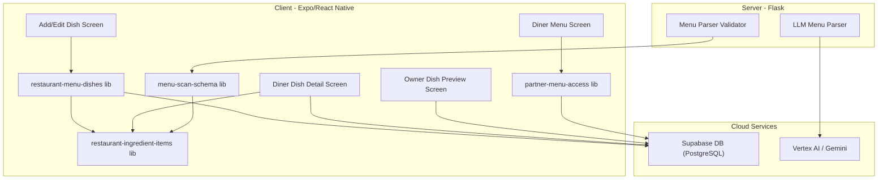
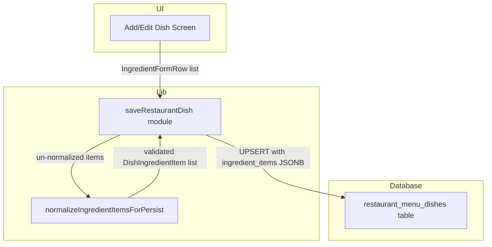
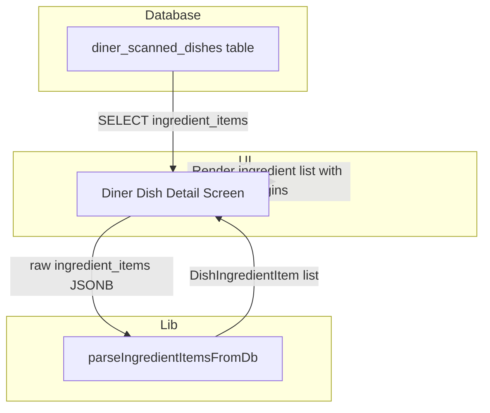
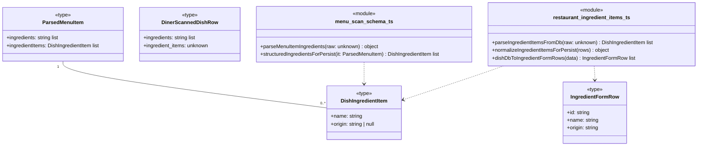
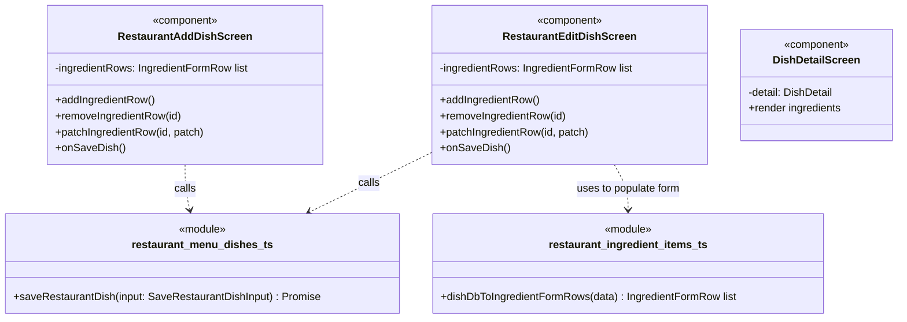

## 1. Primary and Secondary Owners

| Role | Name | Notes |
|------|------|-------|
| Primary owner | Cici Ge | Owns requirements and release sign-off |
| Secondary owner | Sofia Yu | Owns implementation review and test plan |

---

## 2. Date Merged into `main`

`2026-04-16 (PR #84)`

---

## 3. Architecture Diagram (Mermaid)

---

## 4. Information Flow Diagram (Mermaid)

### 4a. Write path

### 4b. Read path

---

## 5. Class Diagram (Mermaid)

### 5a. Data types and schemas

### 5b. Components and modules

---

## 6. Implementation Units

### `app/diner-menu.tsx`

-   **Purpose**: Displays the menu for a diner from a specific scan. It now supports refreshing stale partner-linked menus to show updated ingredient information.
-   **Public fields and methods**:
    -   `DinerMenuScreen()`: React component. Renders the main screen.
-   **Private fields and methods**:
    -   `loadMenu()`: `useCallback`. Fetches menu data. Now calls `refreshPartnerLinkedDinerScanIfStale` to get the latest `scanId` before fetching the menu, ensuring diners see the most recent version of a partner restaurant's menu.

### `app/dish/[dishId].tsx`

-   **Purpose**: Displays the detailed view of a single dish for a diner. It now shows structured ingredients with their origins.
-   **Public fields and methods**:
    -   `DishDetailScreen()`: React component. Renders the dish detail view.
-   **Private fields and methods**:
    -   `useEffect()`: Fetches dish details from `diner_scanned_dishes`, now selecting the `ingredient_items` column.
    -   `parseIngredientItemsFromDb()`: (from lib) Used to parse the `ingredient_items` JSONB data into a structured array for rendering.
    -   The render logic now checks for `detail.ingredientItems` and maps over them to display each ingredient's name and origin. If an origin is not specified, it displays "Origin not specified". It falls back to the legacy `ingredients` array if `ingredientItems` is empty.

### `app/restaurant-add-dish.tsx`

-   **Purpose**: Allows a restaurant owner to add a new dish to a menu section. The UI for ingredients has been updated from a single text field to a dynamic list of name/origin input pairs.
-   **Public fields and methods**:
    -   `RestaurantAddDishScreen()`: React component. Renders the add dish form.
-   **Private fields and methods**:
    -   `ingredientRows`: `useState<IngredientFormRow[]>`. Manages the state for the list of ingredient inputs.
    -   `addIngredientRow()`: `useCallback`. Adds a new, empty ingredient row to the form.
    -   `removeIngredientRow(id)`: `useCallback`. Removes an ingredient row by its unique ID.
    -   `patchIngredientRow(id, patch)`: `useCallback`. Updates the name or origin of a specific ingredient row.
    -   `onSaveDish()`: `useCallback`. Saves the new dish, now passing the structured `ingredientItemsForSave` to `saveRestaurantDish`.

### `app/restaurant-edit-dish/[dishId].tsx`

-   **Purpose**: Allows a restaurant owner to edit an existing dish. The UI for ingredients is updated to match the add dish screen.
-   **Public fields and methods**:
    -   `RestaurantEditDishScreen()`: React component. Renders the edit dish form.
-   **Private fields andmethods**:
    -   `useEffect()`: Fetches the existing dish data, now selecting `ingredient_items` and using `dishDbToIngredientFormRows` to populate the initial state of the ingredient input rows.
    -   `ingredientRows`, `addIngredientRow`, `removeIngredientRow`, `patchIngredientRow`, `onSaveDish`: Same as `RestaurantAddDishScreen`.

### `app/restaurant-dish/[dishId].tsx` & `app/restaurant-owner-dish/[dishId].tsx`

-   **Purpose**: Display a preview of a dish (publicly or for the owner). Both now render the structured ingredient list with origins.
-   **Public fields and methods**:
    -   `RestaurantDishDetailScreen()` / `RestaurantOwnerDishDetailScreen()`: React components.
-   **Private fields and methods**:
    -   The render logic is updated to display `ingredientItems` with their names and origins, showing "Origin not specified" for items without an origin.

### `lib/restaurant-ingredient-items.ts` (New File)

-   **Purpose**: A new library module to centralize logic for handling, parsing, validating, and transforming dish ingredient data structures.
-   **Public fields and methods**:
    -   `MAX_DISH_INGREDIENT_ORIGIN_LEN`: `100`. Constant for origin max length.
    -   `DISH_INGREDIENT_ORIGIN_NOT_SPECIFIED`: `"Origin not specified"`. Constant for placeholder text.
    -   `DishIngredientItem`: `type`. `{ name: string; origin: string | null; }`.
    -   `IngredientFormRow`: `type`. `{ id: string; name: string; origin: string; }`.
    -   `newIngredientFormRowId()`: `string`. Generates a unique ID for a form row.
    -   `parseIngredientItemsFromDb(raw: unknown)`: `DishIngredientItem[]`. Safely parses `ingredient_items` JSONB from the database into a structured array.
    -   `dishDbToIngredientFormRows(data)`: `IngredientFormRow[]`. Converts database data (preferring `ingredient_items`, falling back to `ingredients`) into an array of `IngredientFormRow` for the edit screen UI.
    -   `normalizeIngredientItemsForPersist(rows)`: `{ ok, items } | { ok, error }`. Validates and cleans ingredient rows before saving to the database.
    -   `ingredientNamesForLegacy(items)`: `string[]`. Extracts just the names from `DishIngredientItem[]` to populate the legacy `ingredients` text array for search/compatibility.
    -   `fallbackIngredientNamesFromDishName(name)`: `string[]`. Derives a list of ingredient names from a dish name as a fallback.

### `lib/restaurant-menu-dishes.ts`

-   **Purpose**: Manages creating, saving, and updating restaurant dishes.
-   **Public fields and methods**:
    -   `saveRestaurantDish(input: SaveRestaurantDishInput)`: `Promise<{ ok, error? }>`. The input type now requires `ingredientItems: DishIngredientItem[]` instead of `ingredients: string[]`. The function calls `normalizeIngredientItemsForPersist` for validation and saves both the new `ingredient_items` (JSONB) and the legacy `ingredients` (text array of names) to the `restaurant_menu_dishes` table.

### `lib/menu-scan-schema.ts`

-   **Purpose**: Defines the schema and validation for parsed menu data from the backend.
-   **Public fields and methods**:
    -   `parseMenuItemIngredients(raw: unknown)`: `{ names, items }`. Normalizes various ingredient formats (string, string array, object array) from the LLM into a consistent structure.
    -   `structuredIngredientsForPersist(it: ParsedMenuItem)`: `DishIngredientItem[]`. Prepares the `ingredient_items` JSONB value for database insertion from a `ParsedMenuItem`.
    -   `dishRowToParsedItem(row: DinerScannedDishRow)`: `ParsedMenuItem`. Now processes `ingredient_items` from the DB row into the `ParsedMenuItem` structure.

### `lib/partner-menu-access.ts`

-   **Purpose**: Handles logic related to partner QR codes, which create a diner-facing copy of a restaurant's menu.
-   **Public fields and methods**:
    -   `resolvePartnerTokenToDinerScan(token)`: Now copies `ingredient_items` from the source `restaurant_menu_dishes` to the new `diner_scanned_dishes` rows.
    -   `refreshPartnerLinkedDinerScanIfStale(dinerScanId)`: `Promise<{ ok, scanId } | { ok: false }>`. New function to check if a partner-linked menu is stale and re-resolve the token to get a fresh copy if needed.

### `backend/parsed_menu_validate.py`

-   **Purpose**: Python-side validation of the menu JSON produced by the LLM.
-   **Private fields and methods**:
    -   `_parse_ingredients(raw)`: Updated to be more flexible, accepting a list of strings or a list of dicts (e.g., `{'name': '...'}`, `{'ingredient': '...'}`) and extracting the name string. This supports richer output from the LLM.

---

## 7. Technologies, Libraries, and APIs

| Technology | Version | Used for | Why chosen over alternatives | Source / Docs URL |
|------------|---------|----------|------------------------------|-------------------|
| React Native | Unknown | Mobile application framework | Project standard for cross-platform mobile development. | https://reactnative.dev/ |
| Expo SDK | Unknown | Toolchain for React Native development | Project standard, simplifies builds and provides access to native APIs. | https://docs.expo.dev/ |
| TypeScript | Unknown | Programming language for frontend | Project standard, provides type safety for JavaScript. | https://www.typescriptlang.org/ |
| expo-router | Unknown | File-based routing for React Native | Project standard for navigation and deep linking. | https://expo.github.io/router/ |
| Flask | Unknown | Backend web framework | Project standard for the Python backend. | https://flask.palletsprojects.com/ |
| Python | Unknown | Programming language for backend | Project standard for the backend and ML workflows. | https://www.python.org/ |
| Supabase | Unknown | Backend-as-a-Service platform | Project standard, provides PostgreSQL DB, Auth, and Storage. | https://supabase.com/docs |
| Supabase JS Client | Unknown | Client library for interacting with Supabase | Project standard for frontend-to-database communication. | https://supabase.com/docs/reference/javascript/ |
| PostgreSQL | Unknown | Relational database | Provided by Supabase for long-term data storage. | https://www.postgresql.org/docs/ |
| Vertex AI | Unknown | Google Cloud AI Platform | Used for the LLM-based menu parsing (Gemini). | https://cloud.google.com/vertex-ai/docs |

---

## 8. Database — Long-Term Storage

### `restaurant_menu_dishes`

-   **Purpose**: Stores the canonical information for every dish created by a restaurant owner.
-   **Columns changed**:
    -   `ingredient_items`: `jsonb`, Stores a structured list of ingredients, each with a name and an optional origin. Format: `[{ "name": "string", "origin": "string" | null }]`. Estimated storage: ~500 bytes per dish, assuming an average of 10 ingredients.

### `diner_scanned_dishes`

-   **Purpose**: Stores a copy of dish information for a specific diner's menu scan. This is used for both OCR'd menus and copies of partner restaurant menus.
-   **Columns changed**:
    -   `ingredient_items`: `jsonb`, Mirrors the structure in `restaurant_menu_dishes`. It is populated when a diner scans a partner QR code, copying the structured ingredients from the owner's menu. For OCR scans, it remains an empty array. Estimated storage: ~500 bytes per dish for partner menu copies.

-   **Estimated total storage per user**: Negligible increase for diner users unless they frequently scan partner QR codes. For restaurant owners, the increase is proportional to the number of ingredients they add across all their dishes. An owner with 50 dishes and 10 ingredients each would add approximately 25 KB of storage.

---

## 9. Failure Scenarios

1.  **Frontend process crash**:
    -   **User-visible**: The app closes unexpectedly. If the user was editing ingredients, any unsaved changes are lost.
    -   **Internally-visible**: The React Native process terminates. No data is corrupted on the backend.

2.  **Loss of all runtime state**:
    -   **User-visible**: Same as a crash. The user is sent back to the home screen or login screen. Unsaved ingredient edits are lost.
    -   **Internally-visible**: The component state (e.g., `ingredientRows`) is cleared. The app re-initializes on next launch, fetching data from the database again.

3.  **All stored data erased**:
    -   **User-visible**: Catastrophic. Restaurant owners would find their menus, including all ingredient data, gone. Diners would see empty menus.
    -   **Internally-visible**: The `restaurant_menu_dishes` and `diner_scanned_dishes` tables are empty. All ingredient data is lost permanently unless restored from a backup.

4.  **Corrupt data detected in the database**:
    -   **User-visible**: If `ingredient_items` contains invalid JSON, the `parseIngredientItemsFromDb` function will return an empty array. The user would see no ingredients listed for that dish, or it would fall back to the legacy `ingredients` text array if available. The app does not crash.
    -   **Internally-visible**: The `JSON.parse` call within `parseIngredientItemsFromDb` would throw an exception, which is caught, and an empty array is returned. This is a graceful degradation.

5.  **Remote procedure call (API call) failed**:
    -   **User-visible**: If saving a dish with ingredients fails, an alert "Save failed" appears with an error message. The user's input remains on the screen, and they can try again. If fetching a dish fails, the user sees a loading error.
    -   **Internally-visible**: A Supabase client promise is rejected. The `.catch()` block in the calling function (e.g., `onSaveDish`) handles the error and updates the UI to show the alert.

6.  **Client overloaded**:
    -   **User-visible**: The UI becomes slow and unresponsive, especially on the Add/Edit Dish screen if a user adds a very large number of ingredient rows.
    -   **Internally-visible**: Rapid state updates from `patchIngredientRow` could cause excessive re-renders, leading to high CPU usage on the client device.

7.  **Client out of RAM**:
    -   **User-visible**: The app may crash or be terminated by the OS. Unsaved ingredient edits are lost.
    -   **Internally-visible**: The OS reclaims memory from the app process, causing it to terminate.

8.  **Database out of storage space**:
    -   **User-visible**: Saving a new dish or updating ingredients would fail, likely showing a generic "Save failed" error.
    -   **Internally-visible**: The `UPDATE` or `INSERT` query to Supabase would fail with a database-level error, which is propagated back to the client as a failed RPC.

9.  **Network connectivity lost**:
    -   **User-visible**: User cannot save new ingredients or view dish details. An error message about the network failure would be shown when an API call is attempted.
    -   **Internally-visible**: All Supabase client calls would fail with network errors until connectivity is restored.

10. **Database access lost**:
    -   **User-visible**: The app is completely non-functional. Users cannot log in, view menus, or save data. They would see continuous loading spinners or error messages.
    -   **Internally-visible**: All Supabase client calls would fail, likely with authentication or connection errors.

11. **Bot signs up and spams users**:
    -   **User-visible**: Not applicable to this feature, as ingredients are not a communication channel.
    -   **Internally-visible**: Not applicable. A bot could create a restaurant and add dishes with spammy ingredient names, but this is a general platform issue, not specific to this feature.

---

## 10. PII, Security, and Compliance

This user story does not involve the collection, storage, or display of any Personally Identifying Information (PII). The new data fields (`ingredient_items`) store information about food ingredients and their origins, which is not personal data.

-   **What it is and why it must be stored**: Not applicable.
-   **How it is stored**: Not applicable.
-   **How it entered the system**: Not applicable.
-   **How it exits the system**: Not applicable.
-   **Who on the team is responsible for securing it**: Not applicable.
-   **Procedures for auditing routine and non-routine access**: Not applicable.

**Minor users:**
-   Does this feature solicit or store PII of users under 18?
    -   No.
-   If yes: does the app solicit guardian permission?
    -   Not applicable.
-   What is the team policy for ensuring minors' PII is not accessible by anyone convicted or suspected of child abuse?
    -   Not applicable, as no PII is handled by this feature.