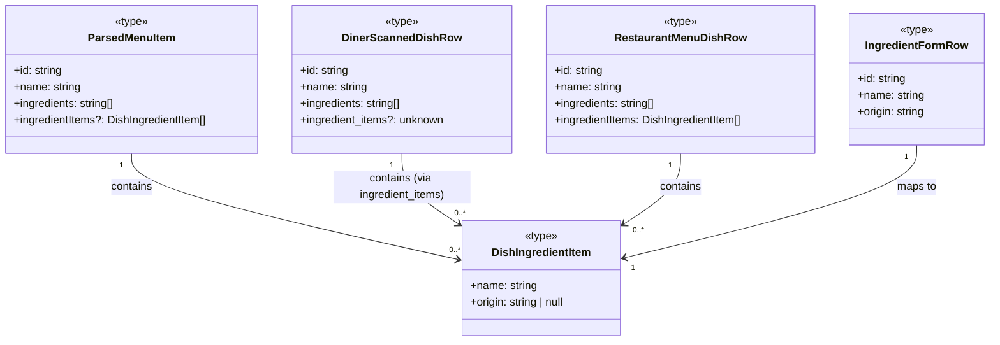

### 1. Primary and Secondary Owners

| Role | Name | Notes |
|------|------|-------|
| Primary owner | Cici Ge | Owns requirements and release sign-off |
| Secondary owner | Sofia Yu | Owns implementation review and test plan |

---

### 2. Date Merged into `main`

2026-04-16 (PR #84)

---

### 3. Architecture Diagram (Mermaid)

```mermaid
flowchart TB
    subgraph Client
        diner_menu_tsx[diner-menu.tsx] --> lib_partner_menu_access[partner-menu-access.ts]
        diner_menu_tsx --> lib_fetch_parsed_menu[fetch-parsed-menu-for-scan.ts]
        dish_dishId_tsx[dish/[dishId].tsx] --> lib_restaurant_ingredient_items[restaurant-ingredient-items.ts]
        dish_dishId_tsx --> lib_menu_scan_schema[menu-scan-schema.ts]
        restaurant_add_dish_tsx[restaurant-add-dish.tsx] --> lib_restaurant_ingredient_items
        restaurant_add_dish_tsx --> lib_restaurant_menu_dishes[restaurant-menu-dishes.ts]
        restaurant_edit_dish_dishId_tsx[restaurant-edit-dish/[dishId].tsx] --> lib_restaurant_ingredient_items
        restaurant_edit_dish_dishId_tsx --> lib_restaurant_menu_dishes
        restaurant_dish_dishId_tsx[restaurant-dish/[dishId].tsx] --> lib_restaurant_ingredient_items
        restaurant_owner_dish_dishId_tsx[restaurant-owner-dish/[dishId].tsx] --> lib_restaurant_ingredient_items
        lib_fetch_parsed_menu --> lib_menu_scan_schema
        lib_partner_menu_access --> lib_restaurant_fetch_menu[restaurant-fetch-menu-for-scan.ts]
        lib_partner_menu_access --> lib_restaurant_ingredient_items
        lib_persist_parsed_menu[persist-parsed-menu.ts] --> lib_menu_scan_schema
        lib_restaurant_fetch_menu --> lib_restaurant_ingredient_items
        lib_restaurant_owner_dish_detail[restaurant-owner-dish-detail.ts] --> lib_restaurant_ingredient_items
        lib_restaurant_public_dish[restaurant-public-dish.ts] --> lib_restaurant_ingredient_items
        lib_restaurant_persist_menu[restaurant-persist-menu.ts] --> lib_menu_scan_schema
    end

    subgraph Server
        backend_llm_menu_vertex[llm_menu_vertex.py] --> backend_parsed_menu_validate[parsed_menu_validate.py]
    end

    subgraph Cloud
        supabase_migrations_sql[supabase/migrations/*.sql]
    end

    Client --> Cloud
    Server --> Cloud
    Server --> VertexAI[Vertex AI / Gemini]
```

### 4. Information Flow Diagram (Mermaid)

#### 4a. Write path

```mermaid
flowchart TB
    subgraph UI
        RestaurantAddDish[restaurant-add-dish.tsx]
        RestaurantEditDish[restaurant-edit-dish/[dishId].tsx]
    end

    subgraph Lib
        IngredientFormRow[IngredientFormRow]
        NormalizeIngredients[normalizeIngredientItemsForPersist]
        SaveDish[saveRestaurantDish]
        StructuredIngredients[structuredIngredientsForPersist]
        PartnerMenuAccess[partner-menu-access.ts]
        PersistParsedMenu[persist-parsed-menu.ts]
    end

    subgraph Database
        RestaurantMenuDishes[restaurant_menu_dishes.ingredient_items]
        DinerScannedDishes[diner_scanned_dishes.ingredient_items]
    end

    RestaurantAddDish --> IngredientFormRow[User input]
    RestaurantEditDish --> IngredientFormRow[User input]
    IngredientFormRow --> NormalizeIngredients[name, origin]
    NormalizeIngredients --> SaveDish[DishIngredientItem[]]
    SaveDish --> RestaurantMenuDishes[DishIngredientItem[]]

    PartnerMenuAccess --> DinerScannedDishes[DishIngredientItem[] from restaurant]
    StructuredIngredients --> PersistParsedMenu[DishIngredientItem[] from parsed menu]
    PersistParsedMenu --> DinerScannedDishes[DishIngredientItem[]]
```

#### 4b. Read path

```mermaid
flowchart TB
    subgraph Database
        RestaurantMenuDishes[restaurant_menu_dishes.ingredient_items]
        DinerScannedDishes[diner_scanned_dishes.ingredient_items]
    end

    subgraph Lib
        ParseIngredientItems[parseIngredientItemsFromDb]
        DishDbToFormRows[dishDbToIngredientFormRows]
        FetchParsedMenu[fetch-parsed-menu-for-scan.ts]
        FetchRestaurantMenu[restaurant-fetch-menu-for-scan.ts]
        FetchOwnerDishDetail[restaurant-owner-dish-detail.ts]
        FetchPublicDishDetail[restaurant-public-dish.ts]
    end

    subgraph UI
        DishDetail[dish/[dishId].tsx]
        RestaurantDish[restaurant-dish/[dishId].tsx]
        RestaurantOwnerDish[restaurant-owner-dish/[dishId].tsx]
        RestaurantEditDish[restaurant-edit-dish/[dishId].tsx]
    end

    RestaurantMenuDishes --> ParseIngredientItems[jsonb]
    DinerScannedDishes --> ParseIngredientItems[jsonb]

    ParseIngredientItems --> FetchParsedMenu[DishIngredientItem[]]
    ParseIngredientItems --> FetchRestaurantMenu[DishIngredientItem[]]
    ParseIngredientItems --> FetchOwnerDishDetail[DishIngredientItem[]]
    ParseIngredientItems --> FetchPublicDishDetail[DishIngredientItem[]]

    FetchParsedMenu --> DishDetail[DishIngredientItem[]]
    FetchRestaurantMenu --> RestaurantDish[DishIngredientItem[]]
    FetchOwnerDishDetail --> RestaurantOwnerDish[DishIngredientItem[]]

    ParseIngredientItems --> DishDbToFormRows[DishIngredientItem[]]
    DishDbToFormRows --> RestaurantEditDish[IngredientFormRow[]]
```

---

### 5. Class Diagram (Mermaid)

#### 5a. Data types and schemas



#### 5b. Components and modules

```mermaid
classDiagram
    class restaurant_ingredient_items <<module>> {
        +MAX_DISH_INGREDIENT_ORIGIN_LEN: number
        +DISH_INGREDIENT_ORIGIN_NOT_SPECIFIED: string
        +newIngredientFormRowId(): string
        +fallbackIngredientNamesFromDishName(name: string): string[]
        +dishDbToIngredientFormRows(data: object): IngredientFormRow[]
        +ingredientNamesForLegacy(items: DishIngredientItem[]): string[]
        +parseIngredientItemsFromDb(raw: unknown): DishIngredientItem[]
        +normalizeIngredientItemsForPersist(rows: object[]): {ok: boolean, items?: DishIngredientItem[], error?: string}
    }
    class menu_scan_schema <<module>> {
        +parseMenuItemIngredients(raw: unknown): {names: string[], items: DishIngredientItem[]}
        +structuredIngredientsForPersist(it: ParsedMenuItem): DishIngredientItem[]
        +dishRowToParsedItem(row: DinerScannedDishRow): ParsedMenuItem
    }
    class RestaurantAddDishScreen <<component>> {
        -ingredientRows: IngredientFormRow[]
        -ingredientItemsForSave: DishIngredientItem[]
        +addIngredientRow()
        +removeIngredientRow(id: string)
        +patchIngredientRow(id: string, patch: object)
    }
    class RestaurantEditDishScreen <<component>> {
        -ingredientRows: IngredientFormRow[]
        -ingredientItemsForSave: DishIngredientItem[]
        +addIngredientRow()
        +removeIngredientRow(id: string)
        +patchIngredientRow(id: string, patch: object)
    }
    class DishDetailScreen <<component>> {
        -detail: DishDetail
    }
    class RestaurantDishDetailScreen <<component>> {
        -detail: PublishedRestaurantDishDetail
    }
    class RestaurantOwnerDishDetailScreen <<component>> {
        -detail: RestaurantOwnerDishDetail
    }

    RestaurantAddDishScreen ..> restaurant_ingredient_items : uses
    RestaurantEditDishScreen ..> restaurant_ingredient_items : uses
    DishDetailScreen ..> restaurant_ingredient_items : uses
    RestaurantDishDetailScreen ..> restaurant_ingredient_items : uses
    RestaurantOwnerDishDetailScreen ..> restaurant_ingredient_items : uses
    menu_scan_schema ..> restaurant_ingredient_items : uses
```

---

### 6. Implementation Units

**File path:** `lib/restaurant-ingredient-items.ts`
**Purpose:** Provides utility functions and types for handling structured ingredient data (name and optional origin) for restaurant dishes, including parsing from database formats, normalizing for persistence, and generating fallback names.

*   **Public fields and methods:**
    *   `MAX_DISH_INGREDIENT_ORIGIN_LEN`: `100` (constant) - Maximum length for an ingredient origin string.
    *   `DISH_INGREDIENT_ORIGIN_NOT_SPECIFIED`: `'Origin not specified'` (constant) - Default text shown when an origin is not provided.
    *   `DishIngredientItem`: `type { name: string; origin: string | null; }` - Represents a single ingredient with its name and optional origin.
    *   `IngredientFormRow`: `type { id: string; name: string; origin: string; }` - Represents an ingredient row in the UI form, including a stable ID.
    *   `newIngredientFormRowId()`: `() => string` - Generates a unique ID for a new ingredient form row.
    *   `fallbackIngredientNamesFromDishName(name: string)`: `(name: string) => string[]` - Extracts potential ingredient names from a dish name string, used when no explicit ingredients are provided.
    *   `dishDbToIngredientFormRows(data: { ingredient_items?: unknown; ingredients?: unknown; name?: string | null; })`: `(data: object) => IngredientFormRow[]` - Converts database ingredient data (structured or legacy text array) into `IngredientFormRow` objects for UI editing.
    *   `ingredientNamesForLegacy(items: DishIngredientItem[])`: `(items: DishIngredientItem[]) => string[]` - Extracts only the names from a list of `DishIngredientItem`s for compatibility with legacy `ingredients` text arrays.
    *   `parseIngredientItemsFromDb(raw: unknown)`: `(raw: unknown) => DishIngredientItem[]` - Parses raw data (from Supabase `jsonb` or API) into an array of `DishIngredientItem`s, handling various input formats and invalid entries.
    *   `normalizeIngredientItemsForPersist(rows: { name: string; origin: string | null | undefined }[])`: `(rows: object[]) => { ok: true; items: DishIngredientItem[] } | { ok: false; error: string }` - Validates and normalizes ingredient rows from a form for persistence, trimming values, enforcing origin length, and handling blank entries.

**File path:** `lib/menu-scan-schema.ts`
**Purpose:** Defines schemas and parsing logic for scanned menu data, now updated to support structured ingredient items.

*   **Public fields and methods:**
    *   `ParsedMenuItem`: `type { ..., ingredients: string[]; ingredientItems?: DishIngredientItem[]; }` - Type for a parsed menu item, now includes an optional `ingredientItems` array.
    *   `DinerScannedDishRow`: `type { ..., ingredients: string[]; ingredient_items?: unknown; }` - Type for a diner scanned dish row from the database, now includes an optional `ingredient_items` field.
    *   `parseMenuItemIngredients(raw: unknown)`: `(raw: unknown) => { names: string[]; items: DishIngredientItem[]; }` - Normalizes raw ingredient data from menu-parse/LLM JSON into a list of names and structured items.
    *   `structuredIngredientsForPersist(it: ParsedMenuItem)`: `(it: ParsedMenuItem) => DishIngredientItem[]` - Prepares structured ingredient items for persistence based on a `ParsedMenuItem`, prioritizing `ingredientItems` or falling back to `ingredients` or dish name.
    *   `dishRowToParsedItem(row: DinerScannedDishRow)`: `(row: DinerScannedDishRow) => ParsedMenuItem` - Maps a database `DinerScannedDishRow` to a `ParsedMenuItem`, now including parsing `ingredient_items`.

**File path:** `app/dish/[dishId].tsx`
**Purpose:** Displays detailed information about a dish to diners, now including structured ingredient names and origins.

*   **Public fields and methods:**
    *   `DishDetail`: `type { ..., ingredients: string[]; ingredientItems: DishIngredientItem[]; }` - Local state type for dish details, includes structured ingredient items.
*   **Private fields and methods:**
    *   `useEffect` (anonymous async IIFE): Fetches dish details from `diner_scanned_dishes`, including `ingredient_items`, and uses `parseIngredientItemsFromDb` to populate `detail.ingredientItems`.
    *   `render` logic: Iterates `detail.ingredientItems` to display each ingredient name and its origin (or "Origin not specified" placeholder). Falls back to legacy `detail.ingredients` if `ingredientItems` is empty.

**File path:** `app/restaurant-add-dish.tsx`
**Purpose:** Allows restaurant owners to add new dishes, now with structured ingredient input.

*   **Private fields and methods:**
    *   `ingredientRows`: `useState<IngredientFormRow[]>` - State to manage the list of ingredient input rows in the form.
    *   `ingredientItemsForSave`: `useMemo<DishIngredientItem[]>` - Derives `DishIngredientItem[]` from `ingredientRows` for saving, converting empty origins to `null`.
    *   `addIngredientRow()`: `useCallback<() => void>` - Adds a new empty `IngredientFormRow` to the state.
    *   `removeIngredientRow(id: string)`: `useCallback<(id: string) => void>` - Removes an `IngredientFormRow` by its ID.
    *   `patchIngredientRow(id: string, patch: Partial<Pick<IngredientFormRow, 'name' | 'origin'>>)`: `useCallback<(id: string, patch: object) => void>` - Updates a specific `IngredientFormRow` by its ID.
    *   `commitCurrentFields()`: `useCallback<async (opts?: object) => CommitResult>` - Saves the current dish fields, now including `ingredientItemsForSave`.
    *   `onSaveDish()`: `useCallback<async () => void>` - Handles saving the dish, passing `ingredientItemsForSave` to `saveRestaurantDish`.
    *   `render` logic: Displays a dynamic list of `TextInput` fields for ingredient name and origin, with "Add ingredient" and "Delete" buttons. Enforces `MAX_DISH_INGREDIENT_ORIGIN_LEN`.

**File path:** `app/restaurant-edit-dish/[dishId].tsx`
**Purpose:** Allows restaurant owners to edit existing dishes, now with structured ingredient input.

*   **Private fields and methods:**
    *   `ingredientRows`: `useState<IngredientFormRow[]>` - State to manage the list of ingredient input rows in the form.
    *   `ingredientItemsForSave`: `useMemo<DishIngredientItem[]>` - Derives `DishIngredientItem[]` from `ingredientRows` for saving, converting empty origins to `null`.
    *   `addIngredientRow()`: `useCallback<() => void>` - Adds a new empty `IngredientFormRow` to the state.
    *   `removeIngredientRow(id: string)`: `useCallback<(id: string) => void>` - Removes an `IngredientFormRow` by its ID.
    *   `patchIngredientRow(id: string, patch: Partial<Pick<IngredientFormRow, 'name' | 'origin'>>)`: `useCallback<(id: string, patch: object) => void>` - Updates a specific `IngredientFormRow` by its ID.
    *   `useEffect` (anonymous async IIFE): Fetches existing dish data, including `ingredient_items`, and uses `dishDbToIngredientFormRows` to initialize `ingredientRows`.
    *   `commitCurrentFields()`: `useCallback<async (opts?: object) => CommitResult>` - Saves the current dish fields, now including `ingredientItemsForSave`.
    *   `onSaveDish()`: `useCallback<async () => void>` - Handles saving the dish, passing `ingredientItemsForSave` to `saveRestaurantDish`.
    *   `render` logic: Displays a dynamic list of `TextInput` fields for ingredient name and origin, with "Add ingredient" and "Delete" buttons. Enforces `MAX_DISH_INGREDIENT_ORIGIN_LEN`.

**File path:** `app/restaurant-dish/[dishId].tsx`
**Purpose:** Displays a public preview of a restaurant dish, now including structured ingredient names and origins.

*   **Private fields and methods:**
    *   `render` logic: Iterates `detail.ingredientItems` to display each ingredient name and its origin (or "Origin not specified" placeholder).

**File path:** `app/restaurant-owner-dish/[dishId].tsx`
**Purpose:** Displays a detailed view of a restaurant owner's dish, now including structured ingredient names and origins.

*   **Private fields and methods:**
    *   `render` logic: Iterates `detail.ingredientItems` to display each ingredient name and its origin (or "Origin not specified" placeholder). Falls back to legacy `detail.ingredients` if `ingredientItems` is empty.

**File path:** `lib/restaurant-menu-dishes.ts`
**Purpose:** Provides functions for managing restaurant menu dishes, including saving dish data.

*   **Public fields and methods:**
    *   `SaveRestaurantDishInput`: `type { ..., ingredientItems: DishIngredientItem[]; }` - Input type for saving a dish, now requires `ingredientItems`.
    *   `saveRestaurantDish(input: SaveRestaurantDishInput)`: `async (input: SaveRestaurantDishInput) => { ok: true } | { ok: false; error: string }` - Saves a restaurant dish to Supabase. It now uses `normalizeIngredientItemsForPersist` for validation and `ingredientNamesForLegacy` to derive the `ingredients` text array, then persists `normalized.items` to `ingredient_items` column.

**File path:** `lib/restaurant-fetch-menu-for-scan.ts`
**Purpose:** Fetches restaurant menu data for scanning, now including structured ingredient items.

*   **Public fields and methods:**
    *   `RestaurantMenuDishRow`: `type { ..., ingredients: string[]; ingredientItems: DishIngredientItem[]; }` - Type for a restaurant menu dish row, now includes `ingredientItems`.
    *   `fetchRestaurantMenuForScan(scanId: string)`: `async (scanId: string) => FetchRestaurantMenuResult` - Fetches menu data, now selecting `ingredient_items` from the database and populating `ingredientItems` on the returned `RestaurantMenuDishRow` objects using `parseIngredientItemsFromDb`.

**File path:** `lib/restaurant-owner-dish-detail.ts`
**Purpose:** Fetches detailed information for a restaurant owner's dish, now including structured ingredient items.

*   **Public fields and methods:**
    *   `RestaurantOwnerDishDetail`: `type { ..., ingredients: string[]; ingredientItems: DishIngredientItem[]; }` - Type for owner dish detail, now includes `ingredientItems`.
    *   `fetchRestaurantOwnerDishDetail(dishId: string)`: `async (dishId: string) => FetchRestaurantOwnerDishDetailResult` - Fetches dish detail, now selecting `ingredient_items` from the database and populating `ingredientItems` using `parseIngredientItemsFromDb`.

**File path:** `lib/restaurant-public-dish.ts`
**Purpose:** Fetches public details for a restaurant dish, now including structured ingredient items.

*   **Public fields and methods:**
    *   `PublishedRestaurantDishDetail`: `type { ..., ingredients: string[]; ingredientItems: DishIngredientItem[]; }` - Type for public dish detail, now includes `ingredientItems`.
    *   `fetchPublishedRestaurantDishDetail(dishId: string)`: `async (dishId: string) => FetchPublishedRestaurantDishDetailResult` - Fetches dish detail, now selecting `ingredient_items` from the database and populating `ingredientItems` using `parseIngredientItemsFromDb`.

**File path:** `lib/partner-menu-access.ts`
**Purpose:** Manages access to partner menus, including copying restaurant menu data to diner scans.

*   **Public fields and methods:**
    *   `refreshPartnerLinkedDinerScanIfStale(dinerScanId: string)`: `async (dinerScanId: string) => { ok: true; scanId: string } | { ok: false }` - New function to re-resolve a partner token if a diner's scanned menu is stale, ensuring `ingredient_items` are updated.
    *   `resolvePartnerTokenToDinerScan(token: string)`: `async (token: string) => ResolvePartnerTokenResult` - Copies restaurant menu data to `diner_scanned_dishes`, now including `ingredient_items` from the source `RestaurantMenuDishRow`.

**File path:** `lib/persist-parsed-menu.ts`
**Purpose:** Persists parsed menu data (from OCR/LLM) to diner scanned dishes.

*   **Public fields and methods:**
    *   `persistParsedMenu(menu: ParsedMenu, profileId: string)`: `async (menu: ParsedMenu, profileId: string) => PersistParsedMenuResult` - Persists parsed menu data, now using `structuredIngredientsForPersist` to populate the `ingredient_items` column in `diner_scanned_dishes`.

**File path:** `lib/restaurant-persist-menu.ts`
**Purpose:** Persists parsed menu data (from OCR/LLM) to restaurant menu drafts.

*   **Public fields and methods:**
    *   `persistRestaurantMenuDraft(menu: ParsedMenu, restaurantId: string)`: `async (menu: ParsedMenu, restaurantId: string) => PersistRestaurantMenuDraftResult` - Persists parsed menu data, now using `structuredIngredientsForPersist` to populate the `ingredient_items` column in `restaurant_menu_dishes`.

**File path:** `backend/llm_menu_vertex.py`
**Purpose:** Flask route for LLM-based menu parsing.

*   **Private fields and methods:**
    *   `_MENU_PARSE_PROMPT`: Modified prompt to LLM to clarify that `items[].ingredients` should be a string array and to list obvious main components for simple dishes.

**File path:** `backend/parsed_menu_validate.py`
**Purpose:** Flask module for validating parsed menu data.

*   **Private fields and methods:**
    *   `_parse_ingredients(raw: Any)`: `(raw: Any) -> list[str] | None` - Modified to accept more flexible input for ingredients (string, list of strings, or list of dicts with 'name' or 'ingredient' keys) and normalize them into a list of strings.

---

### 7. Technologies, Libraries, and APIs

| Technology | Version | Used for | Why chosen over alternatives | Source / Docs URL |
|:-----------|:--------|:---------|:-----------------------------|:------------------|
| TypeScript | 5.x (implied) | Application logic, type safety | Superset of JavaScript, strong typing for maintainability | [typescriptlang.org](https://www.typescriptlang.org/) |
| React Native | 0.73.x (implied by Expo) | Mobile UI framework | Cross-platform mobile development with native performance | [reactnative.dev](https://reactnative.dev/) |
| Expo SDK | 50.x (implied) | Mobile app development platform | Simplified development workflow, managed environment, native module access | [docs.expo.dev](https://docs.expo.dev/) |
| Node.js | 18.x (implied) | JavaScript runtime environment | Executes React Native/Expo development tools and client-side logic | [nodejs.org](https://nodejs.org/en/docs/) |
| Flask | 2.x (implied) | Backend web framework | Lightweight and flexible for API development | [flask.palletsprojects.com](https://flask.palletsprojects.com/en/2.3.x/) |
| Python | 3.x (implied) | Backend scripting language | General-purpose language for backend logic and AI integration | [python.org](https://www.python.org/doc/) |
| Supabase | Latest (implied) | Backend-as-a-Service (DB, Auth, Storage) | Open-source Firebase alternative, PostgreSQL database, integrated auth/storage | [supabase.com](https://supabase.com/docs) |
| Supabase JS client | Latest (implied) | Interact with Supabase services | Official client library for JavaScript/TypeScript applications | [supabase.com/docs/reference/javascript](https://supabase.com/docs/reference/javascript) |
| PostgreSQL | Latest (implied by Supabase) | Relational database | Robust, open-source, and feature-rich database | [postgresql.org](https://www.postgresql.org/docs/) |
| Vertex AI / Gemini | Latest (implied) | Large Language Model (LLM) | AI-powered text generation for menu parsing and summarization | [cloud.google.com/vertex-ai](https://cloud.google.com/vertex-ai/docs) |
| `@expo/vector-icons` | Latest (implied) | Icon library for React Native | Easy access to a large set of vector icons | [docs.expo.dev/guides/icons/](https://docs.expo.dev/guides/icons/) |
| `expo-image` | Latest (implied) | Optimized image component | Enhanced image loading and display performance | [docs.expo.dev/versions/latest/sdk/image/](https://docs.expo.dev/versions/latest/sdk/image/) |
| `expo-linear-gradient` | Latest (implied) | Linear gradient component | UI styling with gradient backgrounds | [docs.expo.dev/versions/latest/sdk/linear-gradient/](https://docs.expo.dev/versions/latest/sdk/linear-gradient/) |
| `expo-linking` | Latest (implied) | Deep linking and URL handling | Handling external URLs and app deep links | [docs.expo.dev/versions/latest/sdk/linking/](https://docs.expo.dev/versions/latest/sdk/linking/) |

---

### 8. Database — Long-Term Storage

**Table name and purpose:** `public.restaurant_menu_dishes`
**Purpose:** Stores detailed information about dishes offered by restaurants, including their structured ingredient lists.

*   **Column:** `ingredient_items`
    *   **Type:** `jsonb`
    *   **Purpose:** Stores a JSON array of objects, where each object represents an ingredient with its `name` (string) and optional `origin` (string or null). This allows for structured storage of ingredient details.
    *   **Estimated storage in bytes per row:**
        *   Assuming an average of 5 ingredients per dish.
        *   Each `DishIngredientItem` (e.g., `{ "name": "Tomato", "origin": "Spain" }`) is approximately 40 characters (bytes) when serialized to JSON.
        *   JSONB overhead for array and objects.
        *   Estimated: 5 ingredients * 40 bytes/ingredient + 50 bytes overhead = ~250 bytes.

**Table name and purpose:** `public.diner_scanned_dishes`
**Purpose:** Stores copies of dishes from scanned menus (OCR or partner-linked) for diners, now including structured ingredient lists for partner-linked menus.

*   **Column:** `ingredient_items`
    *   **Type:** `jsonb`
    *   **Purpose:** Stores a JSON array of objects, similar to `restaurant_menu_dishes.ingredient_items`. This column is populated when a diner's menu is copied from a restaurant's structured menu (e.g., via partner QR link) or when an LLM parse infers structured ingredients. OCR-only scans typically leave this empty.
    *   **Estimated storage in bytes per row:**
        *   Similar to `restaurant_menu_dishes`, estimated ~250 bytes per row for dishes with structured ingredients.

**Estimated total storage per user:**
*   **Restaurant Owner:** If a restaurant owner has 50 dishes, and each dish has `ingredient_items` data: 50 dishes * 250 bytes/dish = 12,500 bytes (approx. 12.5 KB).
*   **Diner:** If a diner scans 10 menus, and 2 of those are partner-linked with 10 dishes each having `ingredient_items` data: 2 scans * 10 dishes/scan * 250 bytes/dish = 5,000 bytes (approx. 5 KB). OCR-scanned dishes would add negligible storage for this column.

---

### 9. Failure Scenarios

1.  **Frontend process crash**
    *   **User-visible effect:** The app crashes or freezes. If the crash occurs during ingredient input, unsaved changes will be lost. If it occurs during viewing, the app will close.
    *   **Internally-visible effect:** React Native app process terminates. Crash logs are generated. Any in-memory state related to ingredient forms (`ingredientRows`) or fetched dish details (`detail`) is lost.

2.  **Loss of all runtime state**
    *   **User-visible effect:** The app behaves as if it was just launched. Any unsaved ingredient input in forms is lost. Navigational state might reset.
    *   **Internally-visible effect:** All React component states (`useState`, `useReducer`), `useMemo` caches, and `useCallback` memoized functions are re-initialized. Data fetched from Supabase and stored in local state (e.g., `detail`, `ingredientRows`) is gone and would need to be re-fetched upon re-render.

3.  **All stored data erased**
    *   **User-visible effect:**
        *   **Restaurant Owner:** All dish details, including ingredient names and origins, disappear from their menus. Existing dishes will show no ingredients.
        *   **Diner:** All scanned menus and favorited dishes, including any structured ingredient information, disappear. Dish detail screens will show "Information not available" for ingredients.
    *   **Internally-visible effect:** `restaurant_menu_dishes` and `diner_scanned_dishes` tables become empty or are dropped. Queries for `ingredient_items` will return `null` or empty arrays.

4.  **Corrupt data detected in the database**
    *   **User-visible effect:**
        *   **Restaurant Owner:** When editing a dish, the ingredient form might display malformed or missing data, or fail to load with an error.
        *   **Diner:** Dish detail screens might show incorrect ingredient names/origins, or fail to display ingredients with an error message.
    *   **Internally-visible effect:**
        *   `ingredient_items` column contains invalid JSON or JSON that doesn't conform to `DishIngredientItem[]` structure.
        *   `parseIngredientItemsFromDb` or `dishDbToIngredientFormRows` functions might return empty arrays or throw errors, which would be caught and potentially logged.
        *   `normalizeIngredientItemsForPersist` might fail validation if attempting to save corrupt data.

5.  **Remote procedure call (API call) failed**
    *   **User-visible effect:**
        *   **Restaurant Owner:** Saving a dish with ingredients fails, showing an alert like "Save failed" or "Could not save dish". Generating a summary or image might also fail.
        *   **Diner:** Loading a dish detail page fails, showing an error message like "Failed to load dish".
    *   **Internally-visible effect:**
        *   Supabase client calls (`supabase.from(...).select(...)`, `.update(...)`) return an `error` object.
        *   Network requests to Flask backend (e.g., for LLM parsing) fail.
        *   Error messages are logged to console/monitoring. UI state (e.g., `loading`, `error` flags) is updated.

6.  **Client overloaded**
    *   **User-visible effect:** The app becomes unresponsive, slow, or crashes. Scrolling through long ingredient lists or complex forms might lag.
    *   **Internally-visible effect:** High CPU usage, excessive memory allocation. JavaScript event loop is blocked. This could be exacerbated by very large `ingredient_items` arrays if not handled efficiently, though current limits (e.g., 12 fallback ingredients) mitigate this.

7.  **Client out of RAM**
    *   **User-visible effect:** The app crashes abruptly, often without a specific error message, or the device becomes very slow.
    *   **Internally-visible effect:** Operating system terminates the app process due to memory pressure. Large `ingredient_items` arrays or numerous `IngredientFormRow` objects in memory could contribute, especially on devices with limited RAM.

8.  **Database out of storage space**
    *   **User-visible effect:**
        *   **Restaurant Owner:** Saving new dishes or updating existing ones (including `ingredient_items`) fails with a "disk full" or storage-related error message.
        *   **Diner:** Partner-linked menu copies or parsed menu persistence fails.
    *   **Internally-visible effect:** Supabase `INSERT` or `UPDATE` operations on `restaurant_menu_dishes` or `diner_scanned_dishes` tables return database-specific storage errors.

9.  **Network connectivity lost**
    *   **User-visible effect:**
        *   **Restaurant Owner:** Attempts to save dishes or load existing ones fail with network error messages.
        *   **Diner:** Attempts to load menus or dish details fail with network error messages.
    *   **Internally-visible effect:** All Supabase and Flask API calls fail with network-related errors (e.g., `Network request failed`). The app's error handling for API calls would activate.

10. **Database access lost**
    *   **User-visible effect:** Similar to network connectivity loss, but specifically for database operations. The app cannot fetch or save any data related to dishes or ingredients.
    *   **Internally-visible effect:** Supabase client library reports errors indicating connection issues to the PostgreSQL database or authentication failures.

11. **Bot signs up and spams users**
    *   **User-visible effect:**
        *   **Restaurant Owner:** A bot could create many dishes with nonsensical or offensive ingredient names/origins.
        *   **Diner:** If such dishes are published or appear in partner menus, diners might see inappropriate content.
    *   **Internally-visible effect:**
        *   The `normalizeIngredientItemsForPersist` function has basic validation (name required if origin present, origin length limit), but no content filtering.
        *   The `ingredient_items` column in `restaurant_menu_dishes` and `diner_scanned_dishes` would contain the spam data.
        *   Backend validation would need to be enhanced to include content moderation or rate limiting for dish creation/updates.

---

### 10. PII, Security, and Compliance

This feature introduces structured ingredient names and origins.

*   **What it is and why it must be stored:**
    *   **Ingredient Name:** The name of an ingredient (e.g., "Tomato", "Chicken"). Stored to inform diners about dish composition.
    *   **Ingredient Origin:** An optional string describing the origin of an ingredient (e.g., "Local Farm", "Spain"). Stored to provide additional transparency and detail to diners.
    *   Neither of these fields are considered Personally Identifying Information (PII) as they describe food items, not individuals. They are not linked to specific users in a way that would identify them.

*   **How it is stored:** Plaintext within a `jsonb` column (`ingredient_items`) in the `restaurant_menu_dishes` and `diner_scanned_dishes` tables.

*   **How it entered the system:**
    *   **User input path:** Restaurant owner inputs ingredient name and origin into `TextInput` fields in `app/restaurant-add-dish.tsx` or `app/restaurant-edit-dish/[dishId].tsx`.
    *   **Modules:** The input is managed by `IngredientFormRow` state, normalized by `normalizeIngredientItemsForPersist` in `lib/restaurant-ingredient-items.ts`, and then passed to `saveRestaurantDish` in `lib/restaurant-menu-dishes.ts`.
    *   **Fields:** `name` and `origin` fields of `DishIngredientItem` objects.
    *   **Storage:** Stored in the `ingredient_items` `jsonb` column of `public.restaurant_menu_dishes`.
    *   **Automated path (LLM/Partner):**
        *   LLM (Vertex AI/Gemini) generates ingredient names/origins during menu parsing, processed by `backend/llm_menu_vertex.py` and `backend/parsed_menu_validate.py`.
        *   This data is then persisted via `lib/persist-parsed-menu.ts` or copied from `restaurant_menu_dishes` via `lib/partner-menu-access.ts`.
        *   **Storage:** Stored in the `ingredient_items` `jsonb` column of `public.diner_scanned_dishes` (for diner-facing menus) or `public.restaurant_menu_dishes` (for restaurant drafts).

*   **How it exits the system:**
    *   **Storage:** `ingredient_items` `jsonb` column from `public.restaurant_menu_dishes` or `public.diner_scanned_dishes`.
    *   **Fields:** `name` and `origin` fields of `DishIngredientItem` objects.
    *   **Modules:** Fetched by `lib/restaurant-fetch-menu-for-scan.ts`, `lib/restaurant-owner-dish-detail.ts`, `lib/restaurant-public-dish.ts`, `lib/fetch-parsed-menu-for-scan.ts`, and parsed by `lib/restaurant-ingredient-items.ts::parseIngredientItemsFromDb`.
    *   **Output path:** Displayed in `app/dish/[dishId].tsx`, `app/restaurant-dish/[dishId].tsx`, and `app/restaurant-owner-dish/[dishId].tsx`.

*   **Who on the team is responsible for securing it:** Unknown — leave blank for human to fill in.

*   **Procedures for auditing routine and non-routine access:** Unknown — leave blank for human to fill in.

**Minor users:**
*   **Does this feature solicit or store PII of users under 18?** No. Ingredient names and origins are not PII.
*   **If yes: does the app solicit guardian permission?** N/A.
*   **What is the team policy for ensuring minors' PII is not accessible by anyone convicted or suspected of child abuse?** N/A.