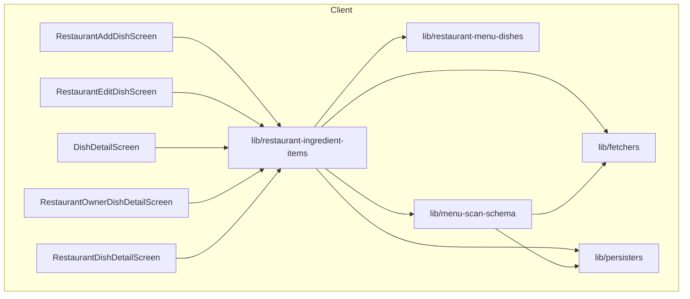
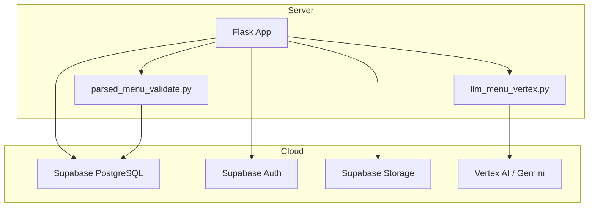
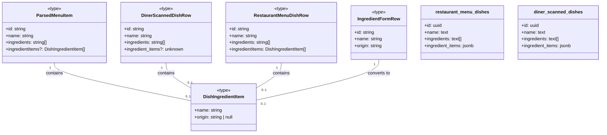

## 1. Primary and Secondary Owners

| Role | Name | Notes |
|------|------|-------|
| Primary owner | Cici Ge | Owns requirements and release sign-off |
| Secondary owner | Sofia Yu | Owns implementation review and test plan |

---

## 2. Date Merged into `main`

2026-04-16 (PR #84)

---

## 3. Architecture Diagram (Mermaid)

### 3a. Client-side architecture



### 3b. Backend and cloud architecture



---

## 4. Information Flow Diagram (Mermaid)

### 4a. Write path

```mermaid
flowchart TB
    subgraph UI
        owner_ui[Owner UI]
        add_edit_dish_screen[Add/Edit Dish Screen]
    end

    subgraph Lib
        ingredient_form_data[IngredientFormRow[]]
        normalize_items[normalizeIngredientItemsForPersist]
        dish_ingredient_items[DishIngredientItem[]]
        save_dish[saveRestaurantDish]
    end

    subgraph Database
        supabase[Supabase]
        restaurant_dish_table[restaurant_menu_dishes.ingredient_items]
    end

    owner_ui --> add_edit_dish_screen: User input
    add_edit_dish_screen --> ingredient_form_data: IngredientFormRow[]
    ingredient_form_data --> normalize_items: IngredientFormRow[]
    normalize_items --> dish_ingredient_items: DishIngredientItem[]
    dish_ingredient_items --> save_dish: DishIngredientItem[]
    save_dish --> supabase: UPSERT dish data
    supabase --> restaurant_dish_table: Store JSONB
```

### 4b. Read path

```mermaid
flowchart TB
    subgraph Database
        restaurant_dish_table[restaurant_menu_dishes.ingredient_items]
        diner_dish_table[diner_scanned_dishes.ingredient_items]
        supabase[Supabase]
    end

    subgraph Lib
        fetch_data[Data Fetchers]
        parse_items[parseIngredientItemsFromDb]
        dish_ingredient_items[DishIngredientItem[]]
    end

    subgraph UI
        diner_owner_public_ui[Diner/Owner/Public Dish UI]
        ingredient_display[Ingredient Display]
    end

    restaurant_dish_table --> supabase: SELECT ingredient_items
    diner_dish_table --> supabase: SELECT ingredient_items
    supabase --> fetch_data: JSONB data
    fetch_data --> parse_items: raw ingredient_items
    parse_items --> dish_ingredient_items: DishIngredientItem[]
    dish_ingredient_items --> diner_owner_public_ui: DishIngredientItem[]
    diner_owner_public_ui --> ingredient_display: Render ingredients
```

---

## 5. Class Diagram (Mermaid)

### 5a. Data types and schemas



### 5b. Components and modules

```mermaid
classDiagram
    class restaurant_ingredient_items <<module>> {
        +MAX_DISH_INGREDIENT_ORIGIN_LEN: number
        +DISH_INGREDIENT_ORIGIN_NOT_SPECIFIED: string
        +newIngredientFormRowId(): string
        +fallbackIngredientNamesFromDishName(name: string): string[]
        +dishDbToIngredientFormRows(data: object): IngredientFormRow[]
        +ingredientNamesForLegacy(items: DishIngredientItem[]): string[]
        +parseIngredientItemsFromDb(raw: unknown): DishIngredientItem[]
        +normalizeIngredientItemsForPersist(rows: object[]): object
    }

    class menu_scan_schema <<module>> {
        +parseMenuItemIngredients(raw: unknown): object
        +structuredIngredientsForPersist(it: ParsedMenuItem): DishIngredientItem[]
        +dishRowToParsedItem(row: DinerScannedDishRow): ParsedMenuItem
    }

    class restaurant_menu_dishes <<module>> {
        +saveRestaurantDish(input: SaveRestaurantDishInput): object
    }

    class RestaurantAddDishScreen <<component>> {
        -ingredientRows: IngredientFormRow[]
        +addIngredientRow(): void
        +removeIngredientRow(id: string): void
        +patchIngredientRow(id: string, patch: object): void
    }

    class RestaurantEditDishScreen <<component>> {
        -ingredientRows: IngredientFormRow[]
        +addIngredientRow(): void
        +removeIngredientRow(id: string): void
        +patchIngredientRow(id: string, patch: object): void
    }

    class DishDetailScreen <<component>> {
        -detail: DishDetail | null
    }

    class parsed_menu_validate <<service>> {
        -_parse_ingredients(raw: Any): list
        -_parse_item(raw: Any): dict
    }

    class llm_menu_vertex <<service>> {
        -_json_from_model_text(text: str): Any
    }

    RestaurantAddDishScreen ..> restaurant_ingredient_items
    RestaurantEditDishScreen ..> restaurant_ingredient_items
    DishDetailScreen ..> restaurant_ingredient_items
    restaurant_menu_dishes ..> restaurant_ingredient_items
    menu_scan_schema ..> restaurant_ingredient_items
    parsed_menu_validate ..> llm_menu_vertex
```



---

## 6. Implementation Units

### `app/diner-menu.tsx`

*   **Purpose**: Displays the diner's menu, allowing filtering and favoriting of dishes. It now includes logic to refresh partner-linked diner scans if stale.
*   **Public fields and methods**:
    *   `DinerMenuScreen()`: React functional component for the diner menu.
*   **Private fields and methods**:
    *   `scanId`: State variable for the current menu scan ID.
    *   `loadMenu()`: Callback to fetch menu data, now includes `refreshPartnerLinkedDinerScanIfStale`.
    *   `handleToggleFavorite(dishId: string)`: Callback to toggle a dish's favorite status.
    *   `availableTags`: Memoized list of tags derived from diner preferences.
    *   `sectionBlocks`: Memoized filtered menu sections based on selected tags.
    *   `formatPrice(dish: ParsedMenuItem)`: Formats dish price for display.
    *   `renderSpiceFlames(level: SpiceLevel)`: Renders spice level icons.
    *   `DishCard({ dish: ParsedMenuItem })`: Inner component for displaying a single dish.

### `app/dish/[dishId].tsx`

*   **Purpose**: Displays detailed information for a single dish to diners. It now supports displaying structured ingredient items with origins.
*   **Public fields and methods**:
    *   `DishDetailScreen()`: React functional component for dish details.
*   **Private fields and methods**:
    *   `dishId`: Local search parameter for the dish ID.
    *   `scanId`: Local search parameter for the menu scan ID.
    *   `restaurantName`: Local search parameter for the restaurant name.
    *   `detail`: State variable holding `DishDetail` object.
    *   `prefs`: State variable holding `DinerPreferenceSnapshot`.
    *   `useEffect` hook: Fetches dish details, diner preferences, and favorite status. It now selects `ingredient_items` from `diner_scanned_dishes` and uses `parseIngredientItemsFromDb`.
    *   `titleize(label: string)`: Capitalizes words in a string.
    *   `deriveFlavorTags(tags: string[], spiceLevel: number, description: string | null)`: Extracts flavor tags.
    *   `deriveDietaryIndicators(tags: string[])`: Extracts dietary indicators.
    *   `formatPrice(amount: number | null, currency: string, display: string | null)`: Formats price.
    *   `inferBudgetTier(amount: number | null)`: Infers budget tier.
    *   `buildFallbackSummary(input: object)`: Creates a summary if description is missing.
    *   `buildWhyThisMatchesYou(detail: DishDetail, prefs: DinerPreferenceSnapshot | null)`: Generates reasons why a dish matches diner preferences.
    *   `onGenerateImage()`: Handles AI image generation.
    *   `onToggleFavorite()`: Handles toggling dish favorite status.
    *   `noteInput`, `editingNote`, `savingNote`: State for managing favorite notes.

### `app/restaurant-add-dish.tsx`

*   **Purpose**: Allows restaurant owners to add new dishes to their menu. This file has been updated to support structured ingredient input with names and optional origins.
*   **Public fields and methods**:
    *   `RestaurantAddDishScreen()`: React functional component for adding a dish.
*   **Private fields and methods**:
    *   `scanId`, `sectionId`: Local search parameters.
    *   `dishId`: State variable for the ID of the dish being added.
    *   `name`, `priceText`, `summary`, `tagsText`, `spiceLevel`: State variables for dish properties.
    *   `ingredientRows`: State variable for managing structured ingredient input rows (`IngredientFormRow[]`).
    *   `ingredientItemsForSave`: Memoized `DishIngredientItem[]` derived from `ingredientRows` for persistence.
    *   `addIngredientRow()`: Callback to add a new blank ingredient row to the form.
    *   `removeIngredientRow(id: string)`: Callback to remove an ingredient row from the form.
    *   `patchIngredientRow(id: string, patch: object)`: Callback to update an ingredient row's name or origin.
    *   `useEffect` hook: Creates a draft dish on component mount.
    *   `commitCurrentFields(opts?: object)`: Saves current dish fields to the database.
    *   `onUploadPhoto()`: Handles photo upload.
    *   `onGenerateImage()`: Handles AI image generation.
    *   `onGenerateSummary()`: Handles AI summary generation.
    *   `onSaveDish()`: Handles saving the new dish.
    *   `parsePriceToAmount(input: string)`: Parses price string into amount, currency, and display.
    *   `parseTagsText(input: string)`: Parses comma-separated tags.

### `app/restaurant-dish/[dishId].tsx`

*   **Purpose**: Displays a public-facing detail view of a restaurant dish. It now supports displaying structured ingredient items with origins.
*   **Public fields and methods**:
    *   `RestaurantDishDetailScreen()`: React functional component for public dish details.
*   **Private fields and methods**:
    *   `dishId`: Local search parameter for the dish ID.
    *   `detail`: State variable holding `PublishedRestaurantDishDetail` object.
    *   `useEffect` hook: Fetches published dish details. It now uses `fetchPublishedRestaurantDishDetail` which includes `ingredientItems`.
    *   `formatPrice(amount: number | null, currency: string, display: string | null)`: Formats price.

### `app/restaurant-edit-dish/[dishId].tsx`

*   **Purpose**: Allows restaurant owners to edit existing dishes. This file has been updated to support structured ingredient input with names and optional origins.
*   **Public fields and methods**:
    *   `RestaurantEditDishScreen()`: React functional component for editing a dish.
*   **Private fields and methods**:
    *   `dishId`, `scanId`: Local search parameters.
    *   `name`, `priceText`, `summary`, `tagsText`, `spiceLevel`: State variables for dish properties.
    *   `ingredientRows`: State variable for managing structured ingredient input rows (`IngredientFormRow[]`).
    *   `ingredientItemsForSave`: Memoized `DishIngredientItem[]` derived from `ingredientRows` for persistence.
    *   `addIngredientRow()`: Callback to add a new blank ingredient row to the form.
    *   `removeIngredientRow(id: string)`: Callback to remove an ingredient row from the form.
    *   `patchIngredientRow(id: string, patch: object)`: Callback to update an ingredient row's name or origin.
    *   `useEffect` hook: Fetches existing dish data and populates form fields. It now uses `dishDbToIngredientFormRows` to initialize `ingredientRows`.
    *   `commitCurrentFields(opts?: object)`: Saves current dish fields to the database.
    *   `onUploadPhoto()`: Handles photo upload.
    *   `onGenerateImage()`: Handles AI image generation.
    *   `onGenerateSummary()`: Handles AI summary generation.
    *   `onSaveDish()`: Handles saving the edited dish.
    *   `parsePriceToAmount(input: string)`: Parses price string.
    *   `parseTagsText(input: string)`: Parses comma-separated tags.

### `app/restaurant-owner-dish/[dishId].tsx`

*   **Purpose**: Displays a detail view of a restaurant dish for the owner, including internal details. It now supports displaying structured ingredient items with origins.
*   **Public fields and methods**:
    *   `RestaurantOwnerDishDetailScreen()`: React functional component for owner dish details.
*   **Private fields and methods**:
    *   `dishId`: Local search parameter for the dish ID.
    *   `detail`: State variable holding `RestaurantOwnerDishDetail` object.
    *   `useEffect` hook: Fetches owner dish details. It now uses `fetchRestaurantOwnerDishDetail` which includes `ingredientItems`.
    *   `formatPrice(amount: number | null, currency: string, display: string | null)`: Formats price.

### `backend/llm_menu_vertex.py`

*   **Purpose**: Handles LLM interactions for menu parsing. The prompt for ingredient extraction has been updated to encourage more specific ingredient listing.
*   **Public fields and methods**:
    *   `_json_from_model_text(text: str)`: Parses JSON from model text.
    *   `_call_vertex_ai_gemini_api(prompt: str)`: Calls the Vertex AI Gemini API.
    *   `parse_menu_from_image_and_ocr(image_bytes: bytes, ocr_text: str, allowed_tags: list[str])`: Main function to parse menu.
*   **Private fields and methods**:
    *   The prompt string for Gemini has been updated to clarify expectations for `items[].ingredients`, specifically encouraging listing main components even for simple dishes and avoiding empty arrays.

### `backend/parsed_menu_validate.py`

*   **Purpose**: Validates and normalizes parsed menu data from the LLM. The ingredient parsing logic has been enhanced to handle various input formats for ingredients, including objects with `name` and `origin`.
*   **Public fields and methods**:
    *   `validate_parsed_menu(raw: Any)`: Validates the entire parsed menu structure.
*   **Private fields and methods**:
    *   `_parse_ingredients(raw: Any)`: **Modified**. Now accepts `list[str]`, `list[dict]`, or `None`. It extracts ingredient names from strings or from `name`/`ingredient` keys in dictionaries, stripping whitespace. It returns `list[str]` (names only).
    *   `_parse_item(raw: Any)`: Calls `_parse_ingredients`.

### `lib/fetch-parsed-menu-for-scan.ts`

*   **Purpose**: Fetches parsed menu data for a diner's scan. The database query now includes the new `ingredient_items` column.
*   **Public fields and methods**:
    *   `fetchParsedMenuForScan(scanId: string)`: Fetches menu data.
*   **Private fields and methods**:
    *   Supabase query: `select` statement for `diner_scanned_dishes` now includes `ingredient_items`.

### `lib/menu-scan-schema.ts`

*   **Purpose**: Defines the schema for parsed menu data and provides utility functions for parsing and normalization. This module has been significantly updated to handle structured ingredient items.
*   **Public fields and methods**:
    *   `MENU_SCAN_SCHEMA_VERSION`: Constant for schema version.
    *   `ParsedMenuPrice`, `ParsedMenuSection`, `ParsedMenuItem`, `DinerScannedDishRow`: Exported types.
    *   `parseMenuItemIngredients(raw: unknown)`: **New function**. Normalizes `ingredients` from various LLM/parse formats (string, string[], object[]) into `names: string[]` and `items: DishIngredientItem[]`.
    *   `structuredIngredientsForPersist(it: ParsedMenuItem)`: **New function**. Determines the `DishIngredientItem[]` to persist based on `ParsedMenuItem`'s `ingredientItems` or `ingredients`, falling back to dish name if both are empty.
    *   `dishRowToParsedItem(row: DinerScannedDishRow)`: Maps a DB dish row to `ParsedMenuItem`, now including `ingredientItems` by parsing `row.ingredient_items`.
    *   `validateParsedMenu(raw: unknown)`: Validates a raw menu object.
    *   `assembleParsedMenu(sections: ParsedMenuSection[])`: Assembles a menu.
    *   `parsedMenuHasItems(menu: ParsedMenu)`: Checks if a menu has items.
*   **Private fields and methods**:
    *   `parseItem(raw: unknown)`: **Modified**. Now uses `parseMenuItemIngredients` to process `o.ingredients` and `parseIngredientItemsFromDb` for `o.ingredient_items`, merging them to populate `ingredients` and `ingredientItems` fields of `ParsedMenuItem`.

### `lib/partner-menu-access.ts`

*   **Purpose**: Manages access to partner menus via QR codes. A new function `refreshPartnerLinkedDinerScanIfStale` has been added to ensure diners always see the latest menu from a partner.
*   **Public fields and methods**:
    *   `buildPartnerMenuLink(token: string)`: Builds a partner menu link.
    *   `buildPartnerMenuQrUrl(token: string)`: Builds a QR URL.
    *   `getOrCreateOwnerPartnerMenuToken(restaurantId: string)`: Gets or creates an owner token.
    *   `resolvePartnerTokenToDinerScan(token: string)`: Resolves a partner token to a diner scan. **Modified** to include `ingredient_items` when copying dishes.
    *   `refreshPartnerLinkedDinerScanIfStale(dinerScanId: string)`: **New function**. Checks if a partner-linked diner scan is stale (restaurant menu updated) and re-resolves the token to get a fresh copy if needed.
*   **Private fields and methods**:
    *   `resolvePartnerTokenToDinerScan`: The dish mapping now explicitly includes `ingredient_items` from `RestaurantMenuDishRow` when creating `diner_scanned_dishes` entries.
    *   `refreshPartnerLinkedDinerScanIfStale`: Checks `diner_partner_qr_scans` for the given `dinerScanId` and `profile_id`, then calls `resolvePartnerTokenToDinerScan` if a token is found.

### `lib/persist-parsed-menu.ts`

*   **Purpose**: Persists parsed menu data (e.g., from OCR or LLM) into `diner_scanned_dishes`. The persistence logic now includes the `ingredient_items` column.
*   **Public fields and methods**:
    *   `persistParsedMenu(menu: ParsedMenu, profileId: string)`: Persists menu data.
*   **Private fields and methods**:
    *   Supabase `insert` statement for `diner_scanned_dishes` now includes `ingredient_items` populated by `structuredIngredientsForPersist`.

### `lib/restaurant-fetch-menu-for-scan.ts`

*   **Purpose**: Fetches a restaurant's menu for scanning purposes. The fetched dish rows now include structured ingredient items.
*   **Public fields and methods**:
    *   `RestaurantMenuSectionRow`, `RestaurantMenuDishRow`: Exported types.
    *   `fetchRestaurantMenuForScan(scanId: string)`: Fetches menu data.
*   **Private fields and methods**:
    *   Supabase query: `select` statement for `restaurant_menu_dishes` now includes `ingredient_items`.
    *   Dish mapping: Logic to populate `ingredientItems` from `row.ingredient_items` or fall back to `row.ingredients`, and to derive `ingredients` (legacy text array) from `ingredientItems` using `ingredientNamesForLegacy`.

### `lib/restaurant-ingredient-items.ts`

*   **Purpose**: **New module**. Provides types, constants, and utility functions for managing structured ingredient items (name + optional origin) in restaurant dish forms and for parsing/normalizing them from various sources.
*   **Public fields and methods**:
    *   `MAX_DISH_INGREDIENT_ORIGIN_LEN`: Constant for max origin length.
    *   `DISH_INGREDIENT_ORIGIN_NOT_SPECIFIED`: Constant string for UI placeholder.
    *   `DishIngredientItem`: Type definition `{ name: string; origin: string | null; }`.
    *   `IngredientFormRow`: Type definition `{ id: string; name: string; origin: string; }` for UI forms.
    *   `newIngredientFormRowId()`: Generates a unique ID for form rows.
    *   `fallbackIngredientNamesFromDishName(name: string)`: Derives ingredient names from a dish title (e.g., "Pop corn" -> ["Pop", "corn"]).
    *   `dishDbToIngredientFormRows(data: object)`: Converts database-fetched ingredient data (`ingredient_items` or `ingredients`) into `IngredientFormRow[]` for UI.
    *   `ingredientNamesForLegacy(items: DishIngredientItem[])`: Extracts only names from `DishIngredientItem[]` for the legacy `ingredients` text array.
    *   `parseIngredientItemsFromDb(raw: unknown)`: Parses raw `ingredient_items` (JSONB from DB or API) into `DishIngredientItem[]`, handling various input shapes and validation.
    *   `normalizeIngredientItemsForPersist(rows: object[])`: Validates and normalizes `IngredientFormRow[]` before persistence, checking for empty names with origins and origin length.
*   **Private fields and methods**: None.

### `lib/restaurant-menu-dishes.ts`

*   **Purpose**: Provides functions for creating and saving restaurant menu dishes. The `saveRestaurantDish` function has been updated to handle structured ingredient items.
*   **Public fields and methods**:
    *   `SaveRestaurantDishInput`: Type definition. **Modified** to include `ingredientItems: DishIngredientItem[]`.
    *   `getRestaurantSectionNextDishSortOrder(sectionId: string)`: Fetches next sort order.
    *   `createRestaurantDishDraft(input: object)`: Creates a dish draft.
    *   `saveRestaurantDish(input: SaveRestaurantDishInput)`: Saves a restaurant dish. **Modified** to use `normalizeIngredientItemsForPersist` for validation and to store `ingredient_items` JSONB, while also populating the legacy `ingredients` text array using `ingredientNamesForLegacy`.
*   **Private fields and methods**:
    *   `touchRestaurantMenuScan(scanId: string)`: Updates scan activity timestamp.

### `lib/restaurant-owner-dish-detail.ts`

*   **Purpose**: Fetches detailed information about a restaurant dish for the owner. The fetched dish data now includes structured ingredient items.
*   **Public fields and methods**:
    *   `RestaurantOwnerDishDetail`: Type definition. **Modified** to include `ingredientItems: DishIngredientItem[]`.
    *   `fetchRestaurantOwnerDishDetail(dishId: string)`: Fetches dish details.
*   **Private fields and methods**:
    *   Supabase query: `select` statement for `restaurant_menu_dishes` now includes `ingredient_items`.
    *   Dish mapping: Logic to populate `ingredientItems` from `row.ingredient_items` or fall back to `row.ingredients`, and to derive `ingredients` (legacy text array) from `ingredientItems` using `ingredientNamesForLegacy`.

### `lib/restaurant-public-dish.ts`

*   **Purpose**: Fetches public-facing detailed information about a restaurant dish. The fetched dish data now includes structured ingredient items.
*   **Public fields and methods**:
    *   `PublishedRestaurantDishDetail`: Type definition. **Modified** to include `ingredientItems: DishIngredientItem[]`.
    *   `fetchPublishedRestaurantDishDetail(dishId: string)`: Fetches dish details.
*   **Private fields and methods**:
    *   Supabase query: `select` statement for `restaurant_menu_dishes` now includes `ingredient_items`.
    *   Dish mapping: Logic to populate `ingredientItems` from `row.ingredient_items` or fall back to `row.ingredients`, and to derive `ingredients` (legacy text array) from `ingredientItems` using `ingredientNamesForLegacy`.

### `lib/restaurant-persist-menu.ts`

*   **Purpose**: Persists a restaurant's menu draft. The persistence logic now includes the `ingredient_items` column.
*   **Public fields and methods**:
    *   `persistRestaurantMenuDraft(menu: ParsedMenu, restaurantId: string)`: Persists menu draft.
*   **Private fields and methods**:
    *   Supabase `insert` statement for `restaurant_menu_dishes` now includes `ingredient_items` populated by `structuredIngredientsForPersist`.

---

## 7. Technologies, Libraries, and APIs

| Technology | Version | Used for | Why chosen over alternatives | Source / Docs URL |
|------------|---------|----------|------------------------------|-------------------|
| TypeScript | ~5.x | Primary programming language for frontend | Type safety, improved developer experience, better maintainability | [TypeScript Handbook](https://www.typescriptlang.org/docs/handbook/intro.html) |
| JavaScript | ES2022+ | Runtime for React Native | Standard web language, widely supported | [MDN Web Docs](https://developer.mozilla.org/en-US/docs/Web/JavaScript) |
| React Native | ~0.73.x | Mobile app development framework | Cross-platform development, large community, declarative UI | [React Native Docs](https://reactnative.dev/docs/getting-started) |
| Expo | ~50.x | React Native development platform | Simplified development workflow, managed environment, easy deployment | [Expo Docs](https://docs.expo.dev/) |
| Node.js | ~18.x | JavaScript runtime for development tooling | Standard for JS development, package management (npm/yarn) | [Node.js Docs](https://nodejs.org/en/docs/) |
| Python | ~3.10.x | Primary programming language for backend | Versatile, large ecosystem, good for AI/ML tasks | [Python Docs](https://docs.python.org/3/) |
| Flask | ~2.x | Backend web framework | Lightweight, flexible, easy to get started | [Flask Docs](https://flask.palletsprojects.com/en/latest/) |
| Supabase | Latest | Backend-as-a-Service (BaaS) | PostgreSQL database, authentication, storage, real-time capabilities, open-source alternative to Firebase | [Supabase Docs](https://supabase.com/docs) |
| Supabase JS client | Latest | Interact with Supabase from frontend | Official client library, simplifies API calls and authentication | [Supabase JS Docs](https://supabase.com/docs/reference/javascript/initializing) |
| PostgreSQL | Latest (managed by Supabase) | Relational database | Robust, ACID compliant, widely used, good for structured data | [PostgreSQL Docs](https://www.postgresql.org/docs/) |
| Vertex AI / Gemini | Latest | Large Language Model (LLM) for menu parsing | Advanced AI capabilities for natural language understanding and generation | [Google Cloud Vertex AI Docs](https://cloud.google.com/vertex-ai/docs) |
| `expo-router` | ~3.4.x | File-system based routing for Expo | Simplifies navigation and deep linking in Expo apps | [Expo Router Docs](https://docs.expo.dev/router/introduction/) |
| `expo-image` | ~1.10.x | Optimized image component for Expo | Improved performance and features over standard React Native Image | [Expo Image Docs](https://docs.expo.dev/versions/latest/sdk/image/) |
| `expo-linear-gradient` | ~12.7.x | Linear gradient component for Expo | Easy to add gradient backgrounds | [Expo Linear Gradient Docs](https://docs.expo.dev/versions/latest/sdk/linear-gradient/) |
| `@react-navigation/native` | ~6.x | Navigation library for React Native | Standard navigation solution, flexible and powerful | [React Navigation Docs](https://reactnavigation.org/docs/getting-started/) |

---

## 8. Database — Long-Term Storage

### `public.restaurant_menu_dishes`

*   **Table name and purpose**: `restaurant_menu_dishes` — Stores detailed information about dishes created and managed by restaurant owners.
*   **Column**: `ingredient_items`
    *   **Type**: `jsonb`
    *   **Purpose**: Stores a JSON array of structured ingredient objects, each containing a `name` (string) and an `origin` (string or null). This allows for detailed ingredient information and optional origin tracking.
    *   **Estimated storage in bytes per row**: Varies based on the number and length of ingredients. Assuming an average of 5 ingredients, each with a name (e.g., "Tomato", 6 chars) and an origin (e.g., "Local farm", 10 chars), plus JSON overhead: `5 * (6 + 10 + ~10 JSON overhead) = ~130 bytes`. Max 12 ingredients * (100 chars origin + 50 chars name + overhead) = ~1800 bytes. Average: **~200 bytes**.
*   **Estimated total storage per user**:
    *   Assuming a restaurant owner manages 50 dishes: `50 dishes * 200 bytes/dish = 10,000 bytes (10 KB)`.

### `public.diner_scanned_dishes`

*   **Table name and purpose**: `diner_scanned_dishes` — Stores copies of menu dishes scanned or linked by diners, potentially including OCR-parsed or partner-provided data.
*   **Column**: `ingredient_items`
    *   **Type**: `jsonb`
    *   **Purpose**: Stores a JSON array of structured ingredient objects, mirroring the `restaurant_menu_dishes` structure for partner-linked menus. For OCR-scanned menus, this column might remain empty or be populated by LLM parsing if structured data is inferred.
    *   **Estimated storage in bytes per row**: Similar to `restaurant_menu_dishes`, average **~200 bytes**.
*   **Estimated total storage per user**:
    *   Assuming a diner scans 100 dishes over time: `100 dishes * 200 bytes/dish = 20,000 bytes (20 KB)`.

---

## 9. Failure Scenarios

1.  **Frontend process crash**
    *   **User-visible effect**: The app freezes or closes unexpectedly. Any unsaved ingredient data in the add/edit dish forms will be lost.
    *   **Internally-visible effect**: React Native app process terminates. Crash logs are generated. State in `RestaurantAddDishScreen` or `RestaurantEditDishScreen` (e.g., `ingredientRows`) is lost.

2.  **Loss of all runtime state**
    *   **User-visible effect**: The app restarts, requiring the user to navigate back to their previous location. Any unsaved ingredient data in forms is lost.
    *   **Internally-visible effect**: React Native app process is killed and restarted. All in-memory state, including `ingredientRows` and fetched `DishIngredientItem[]` data, is cleared. Data would need to be re-fetched from Supabase.

3.  **All stored data erased**
    *   **User-visible effect**: Restaurant owners lose all their dish information, including ingredient details and origins. Diners lose all scanned menus and favorited dishes, including ingredient details. The app would appear empty or broken.
    *   **Internally-visible effect**: Supabase PostgreSQL tables (`restaurant_menu_dishes`, `diner_scanned_dishes`) are empty. Queries for `ingredient_items` would return null or empty arrays.

4.  **Corrupt data detected in the database**
    *   **User-visible effect**:
        *   If `ingredient_items` JSONB is malformed: Ingredient lists might appear empty, incomplete, or cause UI rendering errors on dish detail screens.
        *   If `name` or `origin` fields within `ingredient_items` are corrupt: Displayed ingredient names or origins might be garbled or missing.
        *   If `normalizeIngredientItemsForPersist` fails due to unexpected data: Dish saving might fail with an error message.
    *   **Internally-visible effect**:
        *   `parseIngredientItemsFromDb` would return an empty array or partially parsed data, logging errors.
        *   `normalizeIngredientItemsForPersist` would return `{ ok: false, error: string }`.
        *   Database queries might return JSON parsing errors if the `jsonb` column contains invalid JSON.

5.  **Remote procedure call (API call) failed**
    *   **User-visible effect**:
        *   When saving a dish: An error message like "Save failed: Each ingredient needs a name..." or "Could not save dish" would appear.
        *   When loading a dish: "Failed to load dish" or "Dish not found" would appear, and ingredient details would be absent.
        *   When generating AI image/summary: "Unable to generate AI image/summary right now."
    *   **Internally-visible effect**: Network request to Supabase or Flask backend fails (e.g., `saveRestaurantDish`, `fetchRestaurantOwnerDishDetail`). Error objects are returned from `supabase.from(...).update()` or `fetch(...)` calls.

6.  **Client overloaded**
    *   **User-visible effect**: The app becomes unresponsive, slow, or crashes. Scrolling through long ingredient lists might be janky.
    *   **Internally-visible effect**: High CPU/memory usage on the client device. UI rendering thread is blocked. Large `ingredient_items` payloads could contribute to this if not handled efficiently.

7.  **Client out of RAM**
    *   **User-visible effect**: The app crashes or is killed by the operating system.
    *   **Internally-visible effect**: OutOfMemoryError. Large `ingredient_items` payloads, especially if many dishes are loaded simultaneously without proper memory management, could exacerbate this.

8.  **Database out of storage space**
    *   **User-visible effect**: Restaurant owners cannot save new dishes or update existing ones (including ingredient details). Diners might experience issues with new menu scans or favoriting.
    *   **Internally-visible effect**: Supabase operations (INSERT/UPDATE) fail with a storage-related error. The `ingredient_items` column, being `jsonb`, can consume significant space if many dishes have extensive ingredient lists.

9.  **Network connectivity lost**
    *   **User-visible effect**:
        *   Saving dishes (with ingredient data) fails.
        *   Loading dish details (with ingredient data) fails.
        *   AI image/summary generation fails.
        *   App displays "Failed to load menu" or "Could not save dish" messages.
    *   **Internally-visible effect**: All Supabase client calls fail with network errors. Flask backend calls (e.g., to Vertex AI) also fail.

10. **Database access lost**
    *   **User-visible effect**: Similar to "All stored data erased" or "Remote procedure call failed". The app cannot fetch or store any data, including ingredient details.
    *   **Internally-visible effect**: Supabase client library reports authentication or connection errors. All database operations fail.

11. **Bot signs up and spams users**
    *   **User-visible effect**: Not directly impacted by ingredient features. However, a bot could potentially create many dishes with nonsensical or offensive ingredient names/origins, which would then be visible to diners.
    *   **Internally-visible effect**: Increased database writes to `restaurant_menu_dishes.ingredient_items`. The validation in `normalizeIngredientItemsForPersist` (e.g., max length) helps mitigate some spam, but content filtering for names/origins would require additional measures.

---

## 10. PII, Security, and Compliance

List every piece of Personally Identifying Information (PII) stored in long-term storage for this user story.

No new PII is introduced by this user story. Ingredient names and origins (e.g., "Tomatoes", "Local farm") are not considered PII.

**Minor users:**
- Does this feature solicit or store PII of users under 18? No.
- If yes: does the app solicit guardian permission? N/A
- What is the team policy for ensuring minors' PII is not accessible by anyone convicted or suspected of child abuse? N/A