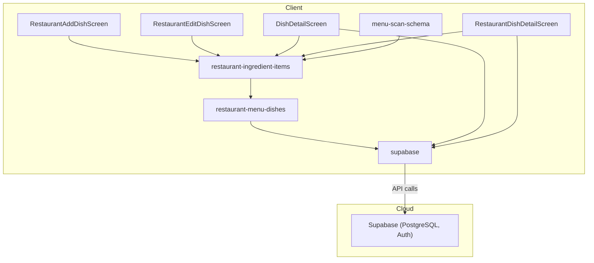
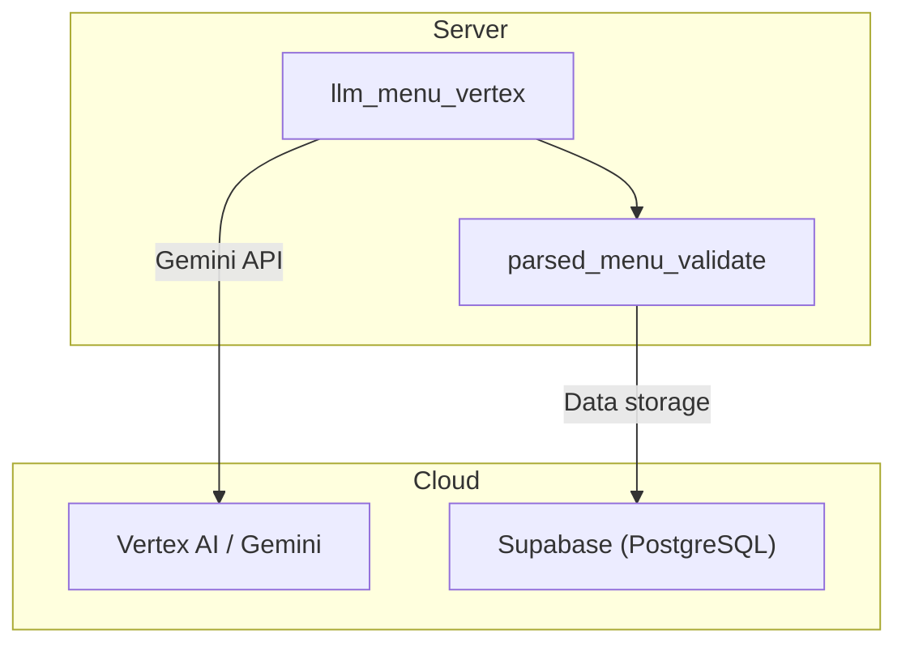
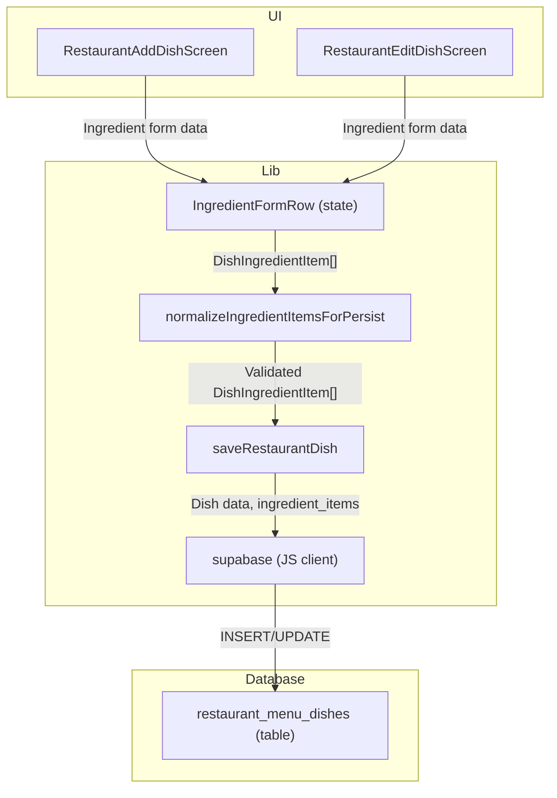
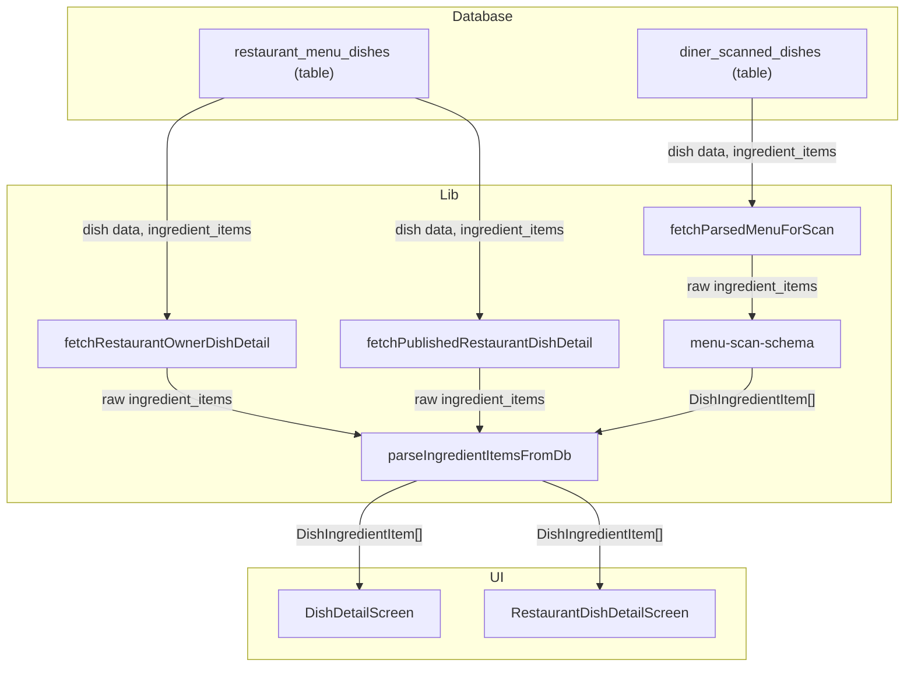
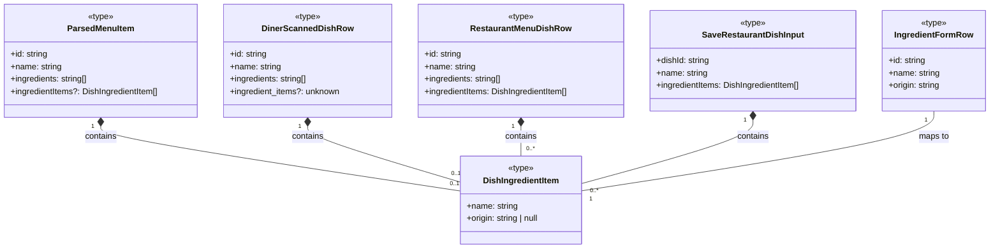

### 1. Primary and Secondary Owners

| Role | Name | Notes |
|------|------|-------|
| Primary owner | Cici Ge | Owns requirements and release sign-off |
| Secondary owner | Sofia Yu | Owns implementation review and test plan |

---

### 2. Date Merged into `main`

2026-04-16 (PR #84)

---

### 3. Architecture Diagram (Mermaid)

#### 3a. Client-side architecture



#### 3b. Backend and cloud architecture



---

### 4. Information Flow Diagram (Mermaid)

#### 4a. Write path



#### 4b. Read path



---

### 5. Class Diagram (Mermaid)

#### 5a. Data types and schemas



#### 5b. Components and modules

```mermaid
classDiagram
    class restaurant_ingredient_items <<module>> {
        +MAX_DISH_INGREDIENT_ORIGIN_LEN: number
        +DISH_INGREDIENT_ORIGIN_NOT_SPECIFIED: string
        +newIngredientFormRowId(): string
        +fallbackIngredientNamesFromDishName(name: string): string[]
        +dishDbToIngredientFormRows(data: object): IngredientFormRow[]
        +ingredientNamesForLegacy(items: DishIngredientItem[]): string[]
        +parseIngredientItemsFromDb(raw: unknown): DishIngredientItem[]
        +normalizeIngredientItemsForPersist(rows: object[]): {ok: boolean, items?: DishIngredientItem[], error?: string}
    }
    class menu_scan_schema <<module>> {
        +parseMenuItemIngredients(raw: unknown): {names: string[], items: DishIngredientItem[]}
        +structuredIngredientsForPersist(it: ParsedMenuItem): DishIngredientItem[]
        +dishRowToParsedItem(row: DinerScannedDishRow): ParsedMenuItem
    }
    class restaurant_menu_dishes <<module>> {
        +saveRestaurantDish(input: SaveRestaurantDishInput): Promise<object>
    }
    class DishDetailScreen <<component>> {
        -detail: DishDetail | null
        -ingredientItems: DishIngredientItem[]
    }
    class RestaurantAddDishScreen <<component>> {
        -ingredientRows: IngredientFormRow[]
        -addIngredientRow(): void
        -removeIngredientRow(id: string): void
        -patchIngredientRow(id: string, patch: object): void
    }
    class RestaurantEditDishScreen <<component>> {
        -ingredientRows: IngredientFormRow[]
        -addIngredientRow(): void
        -removeIngredientRow(id: string): void
        -patchIngredientRow(id: string, patch: object): void
    }
    class RestaurantDishDetailScreen <<component>> {
        -detail: PublishedRestaurantDishDetail | null
        -ingredientItems: DishIngredientItem[]
    }
    class parsed_menu_validate <<service>> {
        -_parse_ingredients(raw: Any): list[str] | None
    }

    DishDetailScreen ..> restaurant_ingredient_items : uses
    RestaurantAddDishScreen ..> restaurant_ingredient_items : uses
    RestaurantEditDishScreen ..> restaurant_ingredient_items : uses
    RestaurantDishDetailScreen ..> restaurant_ingredient_items : uses
    restaurant_menu_dishes ..> restaurant_ingredient_items : uses
    menu_scan_schema ..> restaurant_ingredient_items : uses
    parsed_menu_validate ..> menu_scan_schema : uses
```

---

### 6. Implementation Units

**File path: `app/diner-menu.tsx`**
Purpose: Displays the diner's menu, allowing filtering and favoriting. It now includes logic to refresh partner-linked diner scans if stale.
Public fields and methods:
- `DinerMenuScreen`: React functional component, default export.
  - `loadMenu()`: `useCallback` hook, fetches diner preferences and parsed menu for a scan ID, handles stale partner QR scans.
  - `handleToggleFavorite(dishId: string)`: `useCallback` hook, toggles a dish's favorite status.
  - `DishCard({ dish: ParsedMenuItem })`: React functional component, renders a single dish card.
Private fields and methods:
- `scanId: string | undefined`: Local state, extracted from URL params.
- `menu: ParsedMenu | null`: Local state, stores the fetched menu.
- `prefs: DinerPreferenceSnapshot | null`: Local state, stores diner preferences.
- `loading: boolean`: Local state, indicates if menu is loading.
- `error: string | null`: Local state, stores any error message.
- `selectedTags: string[]`: Local state, stores currently selected filter tags.
- `favoriteIds: Set<string>`: Local state, stores IDs of favorited dishes.
- `availableTags: string[]`: `useMemo` hook, derives filter tags from diner preferences.
- `menuTagSet: Set<string>`: `useMemo` hook, derives all tags present in the current menu.
- `sectionBlocks: { title: string; items: ParsedMenuItem[] }[]`: `useMemo` hook, filters menu sections based on `selectedTags`.
- `formatPrice(dish: ParsedMenuItem)`: Helper function, formats dish price for display.
- `renderSpiceFlames(level: ParsedMenuItem['spice_level'])`: Helper function, renders spice level icons.

**File path: `app/dish/[dishId].tsx`**
Purpose: Displays detailed information for a single dish to diners, including structured ingredient details and dietary indicators, and allows adding private notes.
Public fields and methods:
- `DishDetailScreen`: React functional component, default export.
  - `onGenerateImage()`: `async` function, triggers AI image generation for the dish.
Private fields and methods:
- `dishId: string | undefined`: Local state, extracted from URL params.
- `scanId: string | undefined`: Local state, extracted from URL params.
- `restaurantParam: string | undefined`: Local state, extracted from URL params.
- `detail: DishDetail | null`: Local state, stores the fetched dish details.
- `prefs: DinerPreferenceSnapshot | null`: Local state, stores diner preferences.
- `loading: boolean`: Local state, indicates if dish details are loading.
- `error: string | null`: Local state, stores any error message.
- `favorite: boolean`: Local state, indicates if the dish is favorited.
- `imageLoading: boolean`: Local state, indicates if AI image is being generated.
- `imageError: string | null`: Local state, stores any error from image generation.
- `note: string | null`: Local state, stores the diner's private note for the dish.
- `noteInput: string`: Local state, stores the current value of the note input field.
- `editingNote: boolean`: Local state, indicates if the note is being edited.
- `savingNote: boolean`: Local state, indicates if the note is being saved.
- `DIETARY_TAGS: Set<string>`: Constant, set of recognized dietary tags.
- `PRICE_SYMBOL: Record<string, string>`: Constant, map of currency codes to symbols.
- `titleize(label: string): string`: Helper function, capitalizes words in a string.
- `deriveFlavorTags(tags: string[], spiceLevel: 0 | 1 | 2 | 3, description: string | null): string[]`: Helper function, extracts and formats flavor tags.
- `deriveDietaryIndicators(tags: string[]): string[]`: Helper function, extracts and formats dietary indicators.
- `formatPrice(amount: number | null, currency: string, display: string | null): string`: Helper function, formats dish price.
- `inferBudgetTier(amount: number | null): '$' | '$$' | '$$$' | '$$$$' | null`: Helper function, infers budget tier from price.
- `buildFallbackSummary(input: object): string`: Helper function, creates a summary if description is missing.
- `buildWhyThisMatchesYou(detail: DishDetail, prefs: DinerPreferenceSnapshot | null): string[]`: Helper function, generates reasons why a dish matches diner preferences.
- `reasons: string[]`: `useMemo` hook, derives reasons why the dish matches diner preferences.

**File path: `app/restaurant-add-dish.tsx`**
Purpose: Allows restaurant owners to add new dishes to their menu, including structured ingredient details with optional origins.
Public fields and methods:
- `RestaurantAddDishScreen`: React functional component, default export.
  - `onUploadPhoto()`: `useCallback` hook, handles photo upload for the dish.
  - `onGenerateImage()`: `useCallback` hook, triggers AI image generation for the dish.
  - `onGenerateSummary()`: `useCallback` hook, triggers AI summary generation for the dish.
  - `onSaveDish()`: `useCallback` hook, saves the new dish to the database.
Private fields and methods:
- `scanId: string | undefined`: Local state, extracted from URL params.
- `sectionId: string | undefined`: Local state, extracted from URL params.
- `dishId: string | null`: Local state, stores the ID of the newly created dish draft.
- `loading: boolean`: Local state, indicates initial loading state.
- `saving: boolean`: Local state, indicates if the dish is being saved.
- `dishImageUrl: string | null`: Local state, stores the URL of the dish image.
- `name: string`: Local state, dish name input.
- `priceText: string`: Local state, price input.
- `summary: string`: Local state, summary/description input.
- `ingredientRows: IngredientFormRow[]`: Local state, array of ingredient form rows.
- `tagsText: string`: Local state, comma-separated tags input.
- `spiceLevel: SpiceLevel`: Local state, spice level selection.
- `imageLoading: boolean`: Local state, indicates if AI image is being generated.
- `uploadPhotoLoading: boolean`: Local state, indicates if photo is being uploaded.
- `summaryLoading: boolean`: Local state, indicates if AI summary is being generated.
- `imageError: string | null`: Local state, stores any error from image generation/upload.
- `summaryError: string | null`: Local state, stores any error from summary generation.
- `tags: string[]`: `useMemo` hook, parses `tagsText` into an array.
- `ingredientItemsForSave: DishIngredientItem[]`: `useMemo` hook, transforms `ingredientRows` for saving.
- `addIngredientRow()`: `useCallback` hook, adds a new blank ingredient row to the form.
- `removeIngredientRow(id: string)`: `useCallback` hook, removes an ingredient row from the form.
- `patchIngredientRow(id: string, patch: Partial<Pick<IngredientFormRow, 'name' | 'origin'>>)`: `useCallback` hook, updates a specific ingredient row.
- `parsePriceToAmount(input: string): object`: Helper function, parses price text into amount, currency, and display.
- `parseTagsText(input: string): string[]`: Helper function, parses comma-separated tags.
- `commitCurrentFields(opts?: object): Promise<CommitResult>`: `useCallback` hook, saves current dish fields to the database.

**File path: `app/restaurant-dish/[dishId].tsx`**
Purpose: Displays a public preview of a restaurant dish, including structured ingredient details.
Public fields and methods:
- `RestaurantDishDetailScreen`: React functional component, default export.
Private fields and methods:
- `dishId: string | undefined`: Local state, extracted from URL params.
- `detail: PublishedRestaurantDishDetail | null`: Local state, stores the fetched dish details.
- `loading: boolean`: Local state, indicates if dish details are loading.
- `error: string | null`: Local state, stores any error message.
- `formatPrice(amount: number | null, currency: string, display: string | null): string`: Helper function, formats dish price.
- `renderSpiceFlames(level: 0 | 1 | 2 | 3)`: Helper function, renders spice level icons.

**File path: `app/restaurant-edit-dish/[dishId].tsx`**
Purpose: Allows restaurant owners to edit existing dishes, including structured ingredient details with optional origins.
Public fields and methods:
- `RestaurantEditDishScreen`: React functional component, default export.
  - `onUploadPhoto()`: `useCallback` hook, handles photo upload for the dish.
  - `onGenerateImage()`: `useCallback` hook, triggers AI image generation for the dish.
  - `onGenerateSummary()`: `useCallback` hook, triggers AI summary generation for the dish.
  - `onSaveDish()`: `useCallback` hook, saves the edited dish to the database.
Private fields and methods:
- `dishId: string | undefined`: Local state, extracted from URL params.
- `scanId: string | undefined`: Local state, extracted from URL params.
- `loading: boolean`: Local state, indicates initial loading state.
- `saving: boolean`: Local state, indicates if the dish is being saved.
- `dishImageUrl: string | null`: Local state, stores the URL of the dish image.
- `name: string`: Local state, dish name input.
- `priceText: string`: Local state, price input.
- `summary: string`: Local state, summary/description input.
- `ingredientRows: IngredientFormRow[]`: Local state, array of ingredient form rows.
- `tagsText: string`: Local state, comma-separated tags input.
- `spiceLevel: SpiceLevel`: Local state, spice level selection.
- `imageLoading: boolean`: Local state, indicates if AI image is being generated.
- `uploadPhotoLoading: boolean`: Local state, indicates if photo is being uploaded.
- `summaryLoading: boolean`: Local state, indicates if AI summary is being generated.
- `imageError: string | null`: Local state, stores any error from image generation/upload.
- `summaryError: string | null`: Local state, stores any error from summary generation.
- `tags: string[]`: `useMemo` hook, parses `tagsText` into an array.
- `ingredientItemsForSave: DishIngredientItem[]`: `useMemo` hook, transforms `ingredientRows` for saving.
- `addIngredientRow()`: `useCallback` hook, adds a new blank ingredient row to the form.
- `removeIngredientRow(id: string)`: `useCallback` hook, removes an ingredient row from the form.
- `patchIngredientRow(id: string, patch: Partial<Pick<IngredientFormRow, 'name' | 'origin'>>)`: `useCallback` hook, updates a specific ingredient row.
- `parsePriceToAmount(input: string): object`: Helper function, parses price text into amount, currency, and display.
- `parseTagsText(input: string): string[]`: Helper function, parses comma-separated tags.
- `commitCurrentFields(opts?: object): Promise<CommitResult>`: `useCallback` hook, saves current dish fields to the database.

**File path: `app/restaurant-owner-dish/[dishId].tsx`**
Purpose: Displays detailed information for a restaurant owner's dish, including structured ingredient details.
Public fields and methods:
- `RestaurantOwnerDishDetailScreen`: React functional component, default export.
Private fields and methods:
- `dishId: string | undefined`: Local state, extracted from URL params.
- `detail: RestaurantOwnerDishDetail | null`: Local state, stores the fetched dish details.
- `loading: boolean`: Local state, indicates if dish details are loading.
- `error: string | null`: Local state, stores any error message.
- `formatPrice(amount: number | null, currency: string, display: string | null): string`: Helper function, formats dish price.
- `renderSpiceFlames(level: 0 | 1 | 2 | 3)`: Helper function, renders spice level icons.

**File path: `backend/llm_menu_vertex.py`**
Purpose: Flask service route for generating menu data using Vertex AI/Gemini. The prompt for ingredient generation has been updated to provide more specific guidance.
Public fields and methods:
- `_json_from_model_text(text: str) -> Any`: Helper function, parses JSON from model output.
Private fields and methods:
- `_prompt_template: str`: String template for the LLM prompt.
- `_safety_settings: list`: Safety configuration for the LLM.
- `_model: GenerativeModel`: Vertex AI Gemini model instance.
- `_generate_content(prompt: str) -> str`: Calls the Gemini model to generate content.
- `_parse_menu_from_llm(menu_text: str, allowed_tags: list[str]) -> dict`: Parses menu data from LLM output.
- `_parse_menu_from_image(image_bytes: bytes, allowed_tags: list[str]) -> dict`: Parses menu data from an image using LLM.
- `_parse_menu_from_image_and_text(image_bytes: bytes, menu_text: str, allowed_tags: list[str]) -> dict`: Parses menu data from image and text using LLM.
- `_parse_menu_from_text(menu_text: str, allowed_tags: list[str]) -> dict`: Parses menu data from text using LLM.
- `_parse_menu_from_ocr_text(ocr_text: str, allowed_tags: list[str]) -> dict`: Parses menu data from OCR text using LLM.
- `_parse_menu_from_ocr_image(image_bytes: bytes, allowed_tags: list[str]) -> dict`: Parses menu data from OCR image using LLM.
- `_parse_menu_from_ocr_image_and_text(image_bytes: bytes, ocr_text: str, allowed_tags: list[str]) -> dict`: Parses menu data from OCR image and text using LLM.
- `_parse_menu_from_ocr_image_and_text_and_user_text(image_bytes: bytes, ocr_text: str, user_text: str, allowed_tags: list[str]) -> dict`: Parses menu data from OCR image, OCR text, and user text using LLM.

**File path: `backend/parsed_menu_validate.py`**
Purpose: Validates and normalizes parsed menu data, including ingredient lists. The `_parse_ingredients` function has been updated to handle more flexible input formats for ingredients, including objects with `name` or `ingredient` keys.
Public fields and methods:
- `_parse_ingredients(raw: Any) -> list[str] | None`: Helper function, parses raw ingredient data into a list of strings, now supporting string, list of strings, or list of objects with 'name'/'ingredient' keys.
Private fields and methods:
- `_parse_price(raw: Any) -> dict[str, Any] | None`: Parses price data.
- `_parse_item(raw: Any) -> dict[str, Any] | None`: Parses a single menu item.
- `_parse_section(raw: Any) -> dict[str, Any] | None`: Parses a menu section.
- `_parse_menu(raw: Any) -> dict[str, Any] | None`: Parses the entire menu.
- `validate_parsed_menu(raw: Any) -> tuple[bool, str | dict]`: Validates the entire parsed menu.

**File path: `lib/fetch-parsed-menu-for-scan.ts`**
Purpose: Fetches a parsed menu for a given scan ID from Supabase for diner display. The query now selects the `ingredient_items` column.
Public fields and methods:
- `fetchParsedMenuForScan(scanId: string): Promise<FetchParsedMenuResult>`: Fetches menu data, including `ingredient_items`.

**File path: `lib/menu-scan-schema.ts`**
Purpose: Defines types and utility functions for parsing and validating menu scan data. It now includes types for structured ingredients and functions to parse and persist them, handling various input formats from the LLM.
Public fields and methods:
- `MENU_SCAN_SCHEMA_VERSION: number`: Constant, current schema version.
- `ParsedMenuPrice`: Type definition.
- `ParsedMenuItem`: Type definition, now includes `ingredientItems?: DishIngredientItem[]`.
- `ParsedMenuSection`: Type definition.
- `ParsedMenu`: Type definition.
- `DinerScannedDishRow`: Type definition, now includes `ingredient_items?: unknown`.
- `parseMenuItemIngredients(raw: unknown): { names: string[]; items: DishIngredientItem[] }`: Parses raw ingredient data (string, string[], object[]) into structured items and names.
- `structuredIngredientsForPersist(it: ParsedMenuItem): DishIngredientItem[]`: Converts `ParsedMenuItem` ingredients into `DishIngredientItem[]` for persistence, prioritizing `ingredientItems` then `ingredients`, then falling back to dish name.
- `isSpiceLevel(n: unknown): n is 0 | 1 | 2 | 3`: Type guard for spice level.
- `normalizeSpiceLevel(n: unknown): 0 | 1 | 2 | 3`: Normalizes a value to a valid spice level.
- `dishRowToParsedItem(row: DinerScannedDishRow): ParsedMenuItem`: Maps a Supabase `DinerScannedDishRow` to a `ParsedMenuItem`, now handling `ingredient_items`.
- `assembleParsedMenu(sections: ParsedMenuSection[], restaurantName: string | null): ParsedMenu`: Assembles a full parsed menu object.
- `parsedMenuHasItems(menu: ParsedMenu): boolean`: Checks if a parsed menu contains any items.
- `validateParsedMenu(raw: unknown): { ok: true; value: ParsedMenu } | { ok: false; error: string }`: Validates a raw menu object against the schema.
Private fields and methods:
- `parsePrice(raw: unknown): ParsedMenuPrice | null`: Parses raw price data.
- `parseItem(raw: unknown): ParsedMenuItem | null`: Parses a raw menu item.
- `parseSection(raw: unknown): ParsedMenuSection | null`: Parses a raw menu section.

**File path: `lib/partner-menu-access.ts`**
Purpose: Handles partner QR code access for diners. It now includes logic to refresh a diner's linked partner scan if the source restaurant menu has been updated, and copies `ingredient_items` when creating a diner scan.
Public fields and methods:
- `buildPartnerMenuLink(token: string): string`: Builds a deep link URL for a partner menu.
- `buildPartnerMenuQrUrl(token: string): string`: Builds a QR code URL for a partner menu.
- `getOrCreateOwnerPartnerMenuToken(restaurantId: string): Promise<OwnerTokenResult>`: Gets or creates a partner menu token for a restaurant owner.
- `resolvePartnerTokenToDinerScan(token: string): Promise<ResolveTokenResult>`: Resolves a partner token to a diner scan, creating a new scan if necessary or refreshing if stale, now copying `ingredient_items`.
- `refreshPartnerLinkedDinerScanIfStale(dinerScanId: string): Promise<{ ok: true; scanId: string } | { ok: false }>`: Refreshes a diner's linked partner scan if the source restaurant menu has been updated.

**File path: `lib/persist-parsed-menu.ts`**
Purpose: Persists a parsed menu (from OCR or partner scan) to the diner's Supabase tables. It now includes `ingredient_items` when inserting dishes.
Public fields and methods:
- `persistParsedMenu(menu: ParsedMenu, profileId: string): Promise<PersistParsedMenuResult>`: Persists a parsed menu, now including `ingredient_items` for each dish.

**File path: `lib/restaurant-fetch-menu-for-scan.ts`**
Purpose: Fetches a restaurant's menu for a given scan ID for owner display. It now populates the `ingredientItems` field in `RestaurantMenuDishRow` from the `ingredient_items` column or falls back to legacy `ingredients`.
Public fields and methods:
- `RestaurantMenuSectionRow`: Type definition.
- `RestaurantMenuDishRow`: Type definition, now includes `ingredientItems: DishIngredientItem[]`.
- `fetchRestaurantMenuForScan(scanId: string): Promise<FetchRestaurantMenuResult>`: Fetches menu data, now populating `ingredientItems` from `ingredient_items` or `ingredients`.
Private fields and methods:
- `coerceSpiceLevel(n: unknown): 0 | 1 | 2 | 3`: Helper function, coerces a value to a valid spice level.

**File path: `lib/restaurant-ingredient-items.ts` (NEW FILE)**
Purpose: Provides types and utility functions for managing structured ingredient data (name + optional origin) for restaurant dishes, including parsing from DB, converting to form rows, and normalizing for persistence.
Public fields and methods:
- `MAX_DISH_INGREDIENT_ORIGIN_LEN: number`: Constant, maximum length for ingredient origin (100 characters).
- `DISH_INGREDIENT_ORIGIN_NOT_SPECIFIED: string`: Constant, placeholder text for unspecified origin.
- `DishIngredientItem`: Type definition for a structured ingredient `{ name: string; origin: string | null; }`.
- `IngredientFormRow`: Type definition for an ingredient row in the UI form `{ id: string; name: string; origin: string; }`.
- `newIngredientFormRowId(): string`: Generates a unique ID for a new ingredient form row.
- `fallbackIngredientNamesFromDishName(name: string): string[]`: Derives ingredient names from a dish name as a fallback when no other ingredient data is available.
- `dishDbToIngredientFormRows(data: { ingredient_items?: unknown; ingredients?: unknown; name?: string | null; }): IngredientFormRow[]`: Converts database dish data into `IngredientFormRow`s, prioritizing `ingredient_items` then `ingredients`, then dish name.
- `ingredientNamesForLegacy(items: DishIngredientItem[]): string[]`: Extracts only names from `DishIngredientItem[]` for the legacy `ingredients` text[] field.
- `parseIngredientItemsFromDb(raw: unknown): DishIngredientItem[]`: Parses raw data (from `jsonb` column or API) into `DishIngredientItem[]`, handling various formats and skipping invalid entries.
- `normalizeIngredientItemsForPersist(rows: { name: string; origin: string | null | undefined }[]): { ok: true; items: DishIngredientItem[] } | { ok: false; error: string }`: Validates and normalizes ingredient form rows for persistence, trimming, dropping blank names, and enforcing origin length.

**File path: `lib/restaurant-menu-dishes.ts`**
Purpose: Provides functions for creating, saving, and managing restaurant menu dishes. The `saveRestaurantDish` function now normalizes and persists `ingredientItems` to the `ingredient_items` column and derives the legacy `ingredients` array from it.
Public fields and methods:
- `SaveRestaurantDishInput`: Type definition, now includes `ingredientItems: DishIngredientItem[]`.
- `getRestaurantSectionNextDishSortOrder(sectionId: string): Promise<number>`: Fetches the next sort order for a new dish in a section.
- `createRestaurantDishDraft(input: object): Promise<CreateRestaurantDishDraftResult>`: Creates a new dish draft.
- `touchRestaurantMenuScan(scanId: string): Promise<void>`: Updates the `last_activity_at` timestamp for a menu scan.
- `saveRestaurantDish(input: SaveRestaurantDishInput): Promise<{ ok: true } | { ok: false; error: string }>`: Saves a restaurant dish, now normalizing and persisting `ingredientItems` and deriving legacy `ingredients`.

**File path: `lib/restaurant-owner-dish-detail.ts`**
Purpose: Fetches detailed information for a restaurant owner's dish. It now populates the `ingredientItems` field in `RestaurantOwnerDishDetail` from the `ingredient_items` column or falls back to legacy `ingredients`.
Public fields and methods:
- `RestaurantOwnerDishDetail`: Type definition, now includes `ingredientItems: DishIngredientItem[]`.
- `fetchRestaurantOwnerDishDetail(dishId: string): Promise<FetchRestaurantOwnerDishDetailResult>`: Fetches dish details, now populating `ingredientItems` from `ingredient_items` or `ingredients`.
Private fields and methods:
- `coerceSpice(n: unknown): 0 | 1 | 2 | 3`: Helper function, coerces a value to a valid spice level.

**File path: `lib/restaurant-persist-menu.ts`**
Purpose: Persists a parsed menu to the restaurant owner's Supabase tables. It now includes `ingredient_items` when inserting dishes.
Public fields and methods:
- `persistRestaurantMenuDraft(menu: ParsedMenu, restaurantId: string): Promise<PersistRestaurantMenuDraftResult>`: Persists a restaurant menu draft, now including `ingredient_items` for each dish.

**File path: `lib/restaurant-public-dish.ts`**
Purpose: Fetches publicly viewable details for a restaurant dish. It now populates the `ingredientItems` field in `PublishedRestaurantDishDetail` from the `ingredient_items` column or falls back to legacy `ingredients`.
Public fields and methods:
- `PublishedRestaurantDishDetail`: Type definition, now includes `ingredientItems: DishIngredientItem[]`.
- `fetchPublishedRestaurantDishDetail(dishId: string): Promise<FetchPublishedRestaurantDishDetailResult>`: Fetches public dish details, now populating `ingredientItems` from `ingredient_items` or `ingredients`.
Private fields and methods:
- `coerceSpice(n: unknown): 0 | 1 | 2 | 3`: Helper function, coerces a value to a valid spice level.

**File path: `supabase/migrations/20260415120000_us9_restaurant_dish_ingredient_items.sql` (NEW FILE)**
Purpose: Database migration to add a `jsonb` column `ingredient_items` to the `public.restaurant_menu_dishes` table. It also includes a backfill script to populate `ingredient_items` from the existing `ingredients` `text[]` column for dishes that don't yet have structured data.
Public fields and methods: None (SQL migration script).
Private fields and methods: None.

**File path: `supabase/migrations/20260415133000_diner_scanned_dishes_ingredient_items.sql` (NEW FILE)**
Purpose: Database migration to add a `jsonb` column `ingredient_items` to the `public.diner_scanned_dishes` table. This column is intended for structured ingredient data copied from partner QR menus.
Public fields and methods: None (SQL migration script).
Private fields and methods: None.

---

### 7. Technologies, Libraries, and APIs

| Technology | Version | Used for | Why chosen over alternatives | Source / Docs URL |
|------------|---------|----------|------------------------------|-------------------|
| TypeScript | 5.x (assumed) | Language for React Native app | Type safety, improved developer experience | [typescriptlang.org](https://www.typescriptlang.org/) |
| React Native | 0.7x (assumed) | Mobile app UI framework | Cross-platform mobile development | [reactnative.dev](https://reactnative.dev/) |
| Expo | 50.x (assumed) | React Native development platform | Simplified development, build, and deployment | [expo.dev](https://expo.dev/) |
| Flask | 2.x (assumed) | Backend API server | Lightweight Python web framework | [flask.palletsprojects.com](https://flask.palletsprojects.com/) |
| Python | 3.10+ (assumed) | Backend language | General-purpose language for backend logic | [python.org](https://www.python.org/) |
| Supabase | N/A | Backend-as-a-Service (PostgreSQL, Auth, Storage) | Integrated database, authentication, and storage solution | [supabase.com](https://supabase.com/docs) |
| Supabase JS client | 2.x (assumed) | Interact with Supabase from frontend | Convenient API for Supabase services | [supabase.com/docs/reference/javascript](https://supabase.com/docs/reference/javascript) |
| Vertex AI / Gemini | N/A | Large Language Model (LLM) for menu parsing | AI-powered content generation and understanding | [cloud.google.com/vertex-ai/docs/generative-ai/learn/overview](https://cloud.google.com/vertex-ai/docs/generative-ai/learn/overview) |
| `expo-linking` | 6.x (assumed) | Deep linking in Expo app | Handle incoming URLs for app navigation | [docs.expo.dev/versions/latest/sdk/linking/](https://docs.expo.dev/versions/latest/sdk/linking/) |
| `react-native-safe-area-context` | 4.x (assumed) | Handle safe area insets | Adjust UI for device notches and system bars | [github.com/th3rdwave/react-native-safe-area-context](https://github.com/th3rdwave/react-native-safe-area-context) |
| `expo-image` | 1.x (assumed) | Optimized image loading | Fast and efficient image display in Expo | [docs.expo.dev/versions/latest/sdk/image/](https://docs.expo.dev/versions/latest/sdk/image/) |
| `expo-linear-gradient` | 12.x (assumed) | Linear gradient backgrounds | Aesthetic UI elements | [docs.expo.dev/versions/latest/sdk/linear-gradient/](https://docs.expo.dev/versions/latest/sdk/linear-gradient/) |
| `@react-navigation/native` | 6.x (assumed) | React Navigation hooks | Navigation utilities for React Native | [reactnavigation.org/docs/getting-started](https://reactnavigation.org/docs/getting-started) |
| `expo-router` | 3.x (assumed) | File-system based routing for Expo | Declarative routing for Expo apps | [expo.fyi/router-docs](https://expo.fyi/router-docs) |

---

### 8. Database — Long-Term Storage

**Table name and purpose: `public.restaurant_menu_dishes`**
Purpose: Stores details of dishes created and managed by restaurant owners.
- **Column: `id`**
  - Type: `uuid`
  - Purpose: Primary key, unique identifier for the dish.
  - Estimated storage: 16 bytes
- **Column: `section_id`**
  - Type: `uuid`
  - Purpose: Foreign key to `restaurant_menu_sections`, links dish to a menu section.
  - Estimated storage: 16 bytes
- **Column: `name`**
  - Type: `text`
  - Purpose: Name of the dish.
  - Estimated storage: 50 bytes (average)
- **Column: `description`**
  - Type: `text`
  - Purpose: Detailed description of the dish.
  - Estimated storage: 200 bytes (average)
- **Column: `price_amount`**
  - Type: `numeric`
  - Purpose: Numeric value of the dish price.
  - Estimated storage: 8 bytes
- **Column: `price_currency`**
  - Type: `text`
  - Purpose: ISO 4217 currency code (e.g., 'USD').
  - Estimated storage: 3 bytes
- **Column: `price_display`**
  - Type: `text`
  - Purpose: Formatted price string for display (e.g., '$12.50').
  - Estimated storage: 10 bytes
- **Column: `spice_level`**
  - Type: `smallint`
  - Purpose: Spice level of the dish (0-3).
  - Estimated storage: 2 bytes
- **Column: `tags`**
  - Type: `text[]`
  - Purpose: Array of tags associated with the dish (e.g., 'vegetarian', 'spicy').
  - Estimated storage: 50 bytes (average)
- **Column: `ingredients`**
  - Type: `text[]`
  - Purpose: Legacy array of ingredient names (name-only, for search/compatibility).
  - Estimated storage: 100 bytes (average)
- **Column: `ingredient_items`** (NEW)
  - Type: `jsonb`
  - Purpose: Structured JSON array of `{ "name": string, "origin": string | null }` for detailed ingredient information.
  - Estimated storage: 200 bytes (average, for 5-10 ingredients with origins)
- **Column: `image_url`**
  - Type: `text`
  - Purpose: URL of the dish image.
  - Estimated storage: 150 bytes (average)
- **Column: `needs_review`**
  - Type: `boolean`
  - Purpose: Flag indicating if the dish needs owner review.
  - Estimated storage: 1 byte
- **Column: `is_featured`**
  - Type: `boolean`
  - Purpose: Flag indicating if the dish is featured.
  - Estimated storage: 1 byte
- **Column: `is_new`**
  - Type: `boolean`
  - Purpose: Flag indicating if the dish is new.
  - Estimated storage: 1 byte
- **Column: `sort_order`**
  - Type: `integer`
  - Purpose: Order of the dish within its section.
  - Estimated storage: 4 bytes
- **Column: `created_at`**
  - Type: `timestamp with time zone`
  - Purpose: Timestamp of creation.
  - Estimated storage: 8 bytes
- **Column: `updated_at`**
  - Type: `timestamp with time zone`
  - Purpose: Timestamp of last update.
  - Estimated storage: 8 bytes
Estimated storage in bytes per row: ~730 bytes (excluding overhead)

**Table name and purpose: `public.diner_scanned_dishes`**
Purpose: Stores details of dishes from scanned menus or partner QR codes for diners.
- **Column: `id`**
  - Type: `uuid`
  - Purpose: Primary key, unique identifier for the dish.
  - Estimated storage: 16 bytes
- **Column: `section_id`**
  - Type: `uuid`
  - Purpose: Foreign key to `diner_menu_sections`, links dish to a menu section.
  - Estimated storage: 16 bytes
- **Column: `name`**
  - Type: `text`
  - Purpose: Name of the dish.
  - Estimated storage: 50 bytes (average)
- **Column: `description`**
  - Type: `text`
  - Purpose: Detailed description of the dish.
  - Estimated storage: 200 bytes (average)
- **Column: `price_amount`**
  - Type: `numeric`
  - Purpose: Numeric value of the dish price.
  - Estimated storage: 8 bytes
- **Column: `price_currency`**
  - Type: `text`
  - Purpose: ISO 4217 currency code (e.g., 'USD').
  - Estimated storage: 3 bytes
- **Column: `price_display`**
  - Type: `text`
  - Purpose: Formatted price string for display.
  - Estimated storage: 10 bytes
- **Column: `spice_level`**
  - Type: `smallint`
  - Purpose: Spice level of the dish (0-3).
  - Estimated storage: 2 bytes
- **Column: `tags`**
  - Type: `text[]`
  - Purpose: Array of tags associated with the dish.
  - Estimated storage: 50 bytes (average)
- **Column: `ingredients`**
  - Type: `text[]`
  - Purpose: Legacy array of ingredient names.
  - Estimated storage: 100 bytes (average)
- **Column: `ingredient_items`** (NEW)
  - Type: `jsonb`
  - Purpose: Structured JSON array of `{ name, origin }` for partner QR menu copies; OCR menus stay `[]`.
  - Estimated storage: 200 bytes (average, for 5-10 ingredients with origins)
- **Column: `image_url`**
  - Type: `text`
  - Purpose: URL of the dish image.
  - Estimated storage: 150 bytes (average)
- **Column: `sort_order`**
  - Type: `integer`
  - Purpose: Order of the dish within its section.
  - Estimated storage: 4 bytes
- **Column: `created_at`**
  - Type: `timestamp with time zone`
  - Purpose: Timestamp of creation.
  - Estimated storage: 8 bytes
- **Column: `updated_at`**
  - Type: `timestamp with time zone`
  - Purpose: Timestamp of last update.
  - Estimated storage: 8 bytes
Estimated storage in bytes per row: ~830 bytes (excluding overhead)

Estimated total storage per user: Unknown — depends on number of dishes and menus.

---

### 9. Failure Scenarios

1.  **Frontend process crash**
    *   **User-visible effect:** The app freezes or closes unexpectedly. Any unsaved ingredient changes in `RestaurantAddDishScreen` or `RestaurantEditDishScreen` are lost.
    *   **Internally-visible effect:** React Native app process terminates. Crash logs are generated (e.g., via Expo's crash reporting or Sentry if integrated). Local state in components is reset.

2.  **Loss of all runtime state**
    *   **User-visible effect:** Similar to a crash, the app might restart or refresh. Any unsaved ingredient changes are lost. If a diner was viewing a dish, they might need to navigate back to it.
    *   **Internally-visible effect:** All in-memory data (React component states, Redux/Context stores, `useMemo` caches) is cleared. Data fetched from Supabase would need to be re-fetched.

3.  **All stored data erased**
    *   **User-visible effect:** Restaurant owners would see their menus (including dishes and ingredient details) completely empty. Diners would see no scanned menus or dish details. The app would appear as if it's a fresh install for all users.
    *   **Internally-visible effect:** Supabase PostgreSQL tables (`restaurant_menu_dishes`, `diner_scanned_dishes`, etc.) are empty. All user data, including ingredient items, is permanently lost.

4.  **Corrupt data detected in the database**
    *   **User-visible effect:**
        *   If `ingredient_items` JSON is malformed: Owners might see errors when editing dishes, or the ingredient list might appear empty/incorrect. Diners might see empty or malformed ingredient lists on dish detail screens.
        *   If other dish data is corrupt: Dish names, prices, or descriptions might be incorrect or missing, leading to display errors or app crashes when trying to render.
    *   **Internally-visible effect:** Database queries might return errors (e.g., JSON parsing errors). Frontend parsing functions (`parseIngredientItemsFromDb`, `parseMenuItemIngredients`) might return empty lists or `null`, leading to fallback logic or errors. Error logs would show database query failures or data deserialization issues.

5.  **Remote procedure call (API call) failed**
    *   **User-visible effect:**
        *   When saving a dish: The owner sees an "Save failed" alert with an error message. Ingredient changes are not persisted.
        *   When loading a menu/dish: The diner/owner sees a "Failed to load menu/dish" error message or an empty screen. Ingredient details would not be displayed.
        *   When generating AI image/summary: The owner sees an "Unable to generate…" error.
    *   **Internally-visible effect:** Network requests (e.g., Supabase client calls, Flask API calls) fail. `Promise` rejections occur in `fetchParsedMenuForScan`, `saveRestaurantDish`, `generateRestaurantDishImage`, etc. Error messages are logged.

6.  **Client overloaded**
    *   **User-visible effect:** The app becomes unresponsive, UI animations stutter, or input lag occurs. Scrolling through long ingredient lists might be slow.
    *   **Internally-visible effect:** High CPU usage on the client device. JavaScript event loop is blocked. React Native's UI thread might be overloaded, leading to "jank."

7.  **Client out of RAM**
    *   **User-visible effect:** The app crashes or is terminated by the operating system. Any unsaved ingredient changes are lost.
    *   **Internally-visible effect:** The app process receives an out-of-memory (OOM) signal. Crash logs indicate OOM.

8.  **Database out of storage space**
    *   **User-visible effect:**
        *   When saving a dish: Owners receive an error message like "Could not save dish: Database storage full." Ingredient changes are not saved.
        *   When persisting a menu scan: Diners/owners cannot save new menus.
    *   **Internally-visible effect:** Supabase PostgreSQL returns storage-related errors (e.g., `disk full`). `supabase.from().insert()` or `update()` operations fail with specific error codes.

9.  **Network connectivity lost**
    *   **User-visible effect:**
        *   Any action requiring network (saving dishes, loading menus, generating AI content) fails with a "Network error" or similar message.
        *   Existing displayed data (including ingredient lists) remains visible but cannot be refreshed or updated.
    *   **Internally-visible effect:** Network requests time out or fail immediately. `fetch` or Supabase client calls throw network-related exceptions.

10. **Database access lost**
    *   **User-visible effect:** Similar to "Remote procedure call failed" for all data operations. Users cannot load or save any data, including ingredient details. The app might show persistent loading indicators or error messages.
    *   **Internally-visible effect:** Supabase client calls fail with authentication or authorization errors, or connection errors if the database itself is unreachable. Error logs show database connection failures.

11. **Bot signs up and spams users**
    *   **User-visible effect:**
        *   If a bot creates restaurant accounts and spams dishes with inappropriate ingredient names/origins: Diners might see offensive content in ingredient lists.
        *   If a bot creates diner accounts and spams notes: Other diners might see spam in public areas (though notes are private, this is a general scenario).
    *   **Internally-visible effect:** Increased database writes for `restaurant_menu_dishes` and `diner_scanned_dishes` with unusual content. Abuse detection systems (if implemented) would flag suspicious activity. Manual review of reported content would be necessary. The `normalizeIngredientItemsForPersist` function has basic validation (name cannot be empty if origin is present, origin length limit), but no content filtering.

---

### 10. PII, Security, and Compliance

This user story introduces `ingredient_items` which stores `name` (string) and `origin` (string or null) for ingredients. Ingredient names and origins are generally **not considered PII** unless they contain specific personal names or locations that could identify an individual. For example, "John Doe's Farm" would be PII, but "Local Farm" or "Spain" would not. The current implementation does not explicitly restrict users from entering PII into the `name` or `origin` fields.

**Potential PII (if user enters it): Ingredient Name / Origin**
- **What it is and why it must be stored:** User-provided text for ingredient names and their optional origins. Stored to provide detailed dish information to diners.
- **How it is stored:** Plaintext in a `jsonb` column (`ingredient_items`) in `restaurant_menu_dishes` and `diner_scanned_dishes` tables.
- **How it entered the system:**
    - **Owner input:** `RestaurantAddDishScreen` / `RestaurantEditDishScreen` (UI) → `IngredientFormRow` (state) → `normalizeIngredientItemsForPersist` (lib) → `saveRestaurantDish` (lib) → `supabase` (JS client) → `restaurant_menu_dishes.ingredient_items` (DB).
    - **LLM generation:** `llm_menu_vertex` (service) → `parsed_menu_validate` (service) → `persistRestaurantMenuDraft` (lib) / `persistParsedMenu` (lib) → `supabase` (JS client) → `restaurant_menu_dishes.ingredient_items` / `diner_scanned_dishes.ingredient_items` (DB).
- **How it exits the system:**
    - **Diner view:** `diner_scanned_dishes.ingredient_items` (DB) → `fetchParsedMenuForScan` (lib) → `parseIngredientItemsFromDb` (lib) → `DishDetailScreen` (UI).
    - **Owner view:** `restaurant_menu_dishes.ingredient_items` (DB) → `fetchRestaurantOwnerDishDetail` (lib) / `fetchPublishedRestaurantDishDetail` (lib) → `parseIngredientItemsFromDb` (lib) → `RestaurantOwnerDishDetailScreen` / `RestaurantDishDetailScreen` (UI).
    - **Owner edit:** `restaurant_menu_dishes.ingredient_items` (DB) → `fetchRestaurantOwnerDishDetail` (lib) → `dishDbToIngredientFormRows` (lib) → `RestaurantEditDishScreen` (UI).
- **Who on the team is responsible for securing it:** Unknown — leave blank for human to fill in.
- **Procedures for auditing routine and non-routine access:** Unknown — leave blank for human to fill in.

**Minor users:**
- **Does this feature solicit or store PII of users under 18?** No, this feature is for dish ingredients, not user PII. However, if a minor restaurant owner were to input PII into the ingredient fields, it would be stored. The app does not explicitly solicit PII of users under 18 for this feature.
- **If yes: does the app solicit guardian permission?** N/A, as it does not solicit PII of minors for this feature.
- **What is the team policy for ensuring minors' PII is not accessible by anyone convicted or suspected of child abuse?** Unknown — leave blank for human to fill in.