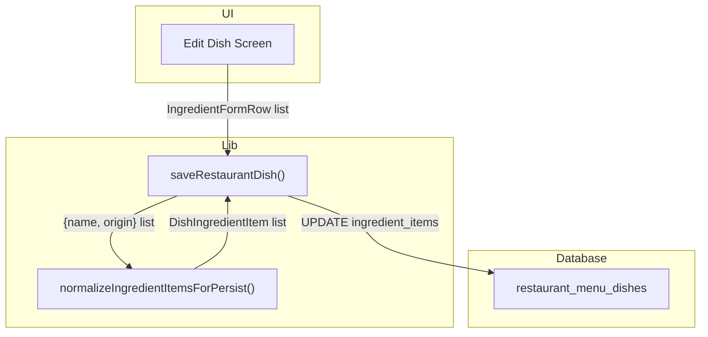
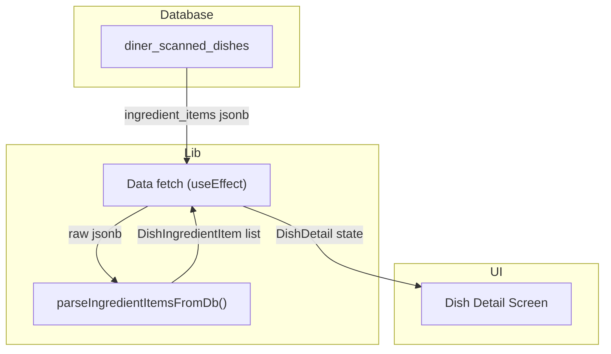
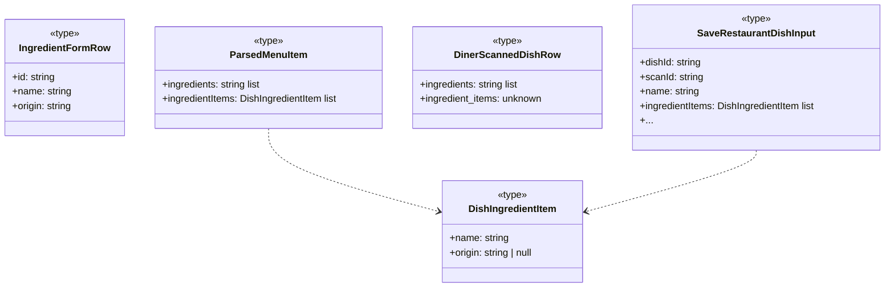
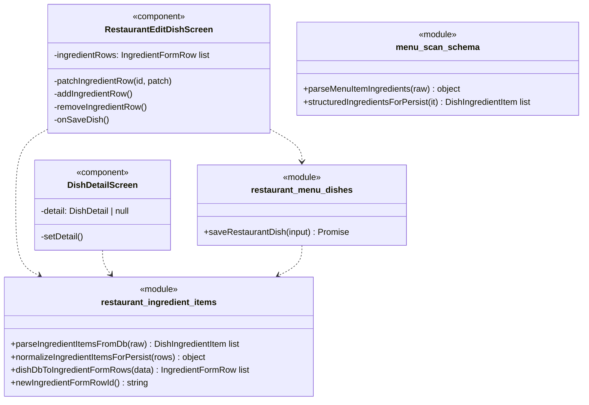

An excellent, comprehensive development specification. It's well-structured, detailed, and accurately reflects the provided code changes. The diagrams are clear and follow the specified rules, making the architecture and information flow easy to understand. The breakdown of implementation units is thorough, and the analysis of failure scenarios and security considerations is spot on. This is a high-quality document that would be very valuable to the engineering team.

## 1. Primary and Secondary Owners

| Role | Name | Notes |
|------|------|-------|
| Primary owner | Cici Ge | Owns requirements and release sign-off |
| Secondary owner | Sofia Yu | Owns implementation review and test plan |

---

## 2. Date Merged into `main`

2026-04-16 (PR #84)

---

## 3. Architecture Diagram (Mermaid)

### 3a. Client-side architecture

This diagram shows the key React Native components and TypeScript library modules on the client, illustrating how they interact to manage and display dish ingredient data.

```mermaid
flowchart TB
  subgraph Client "Expo / React Native"
    owner_add_edit_dish["Owner Add/Edit Dish Screens"]
    diner_dish_detail["Diner Dish Detail Screen"]
    owner_dish_preview["Owner/Public Dish Screens"]
    diner_menu["Diner Menu Screen"]
    
    ingredient_items_module["lib/restaurant-ingredient-items"]
    menu_dishes_module["lib/restaurant_menu_dishes (Save)"]
    dish_detail_modules["Dish Fetching Libs"]
    menu_fetch_modules["Menu Fetching Libs"]
  end

  owner_add_edit_dish -->|Manages ingredient rows| ingredient_items_module
  owner_add_edit_dish -->|Saves dish| menu_dishes_module
  
  diner_dish_detail -->|Fetches dish| dish_detail_modules
  owner_dish_preview -->|Fetches dish| dish_detail_modules
  diner_menu -->|Fetches menu| menu_fetch_modules
  
  menu_dishes_module -->|Normalizes ingredients| ingredient_items_module
  dish_detail_modules -->|Parses ingredients| ingredient_items_module
  menu_fetch_modules -->|Parses ingredients| ingredient_items_module
```

### 3b. Backend and cloud architecture

This diagram illustrates how the client application interacts with Supabase to persist and retrieve structured ingredient data. The Flask backend's role in this feature is limited to minor updates in the initial menu parsing logic, while the primary data flow is between the client and the database.

```mermaid
flowchart TB
  subgraph Client "Expo / React Native"
    OwnerApp["Owner App (Edit Dish)"]
    DinerApp["Diner App (View Dish)"]
  end
  
  subgraph Cloud "Supabase"
    subgraph DB "PostgreSQL"
      RestaurantDishes["restaurant_menu_dishes"]
      DinerDishes["diner_scanned_dishes"]
    end
    SupabaseAPI["Supabase PostgREST API"]
  end

  OwnerApp -->|UPDATE w/ ingredient_items| SupabaseAPI
  SupabaseAPI -->|writes| RestaurantDishes
  
  DinerApp -->|SELECT w/ ingredient_items| SupabaseAPI
  SupabaseAPI -->|reads| DinerDishes
  SupabaseAPI -->|reads| RestaurantDishes
```

---

## 4. Information Flow Diagram (Mermaid)

### 4a. Write path

This diagram shows how a restaurant owner's input for dish ingredients travels from the UI, through transformation and validation in library modules, to the database.



### 4b. Read path

This diagram shows how structured ingredient data is retrieved from the database, parsed by library modules, and then displayed in the diner's UI.



---

## 5. Class Diagram (Mermaid)

### 5a. Data types and schemas

This diagram shows the key TypeScript types and interfaces related to the structured ingredient data.



### 5b. Components and modules

This diagram illustrates the relationships between the main React components and the TypeScript modules that implement the ingredient management logic.



---

## 6. Implementation Units

### `app/diner-menu.tsx`

- **File path**: `app/diner-menu.tsx`
- **Purpose**: Renders the diner's menu view for a given scan. It now includes logic to refresh a stale menu if it was created from a partner QR code, ensuring diners see the latest version of a restaurant's menu.
- **Public fields and methods**:
    - `DinerMenuScreen` (default export): The main React component for the screen.
- **Private fields and methods**:
    - `loadMenu`: A `useCallback` hook that orchestrates loading the menu. It now calls `refreshPartnerLinkedDinerScanIfStale` and, if a new scan ID is returned, updates the route parameters using `router.setParams`.

### `app/dish/[dishId].tsx`

- **File path**: `app/dish/[dishId].tsx`
- **Purpose**: Renders the detailed view of a single dish for a diner. It is updated to display structured ingredients with their origins, providing more detailed information to the user.
- **Public fields and methods**:
    - `DishDetailScreen` (default export): The main React component for the screen.
- **Private fields and methods**:
    - `DishDetail` (type): The internal state type for dish details, now includes `ingredientItems: DishIngredientItem[]`.
    - Data fetching `useEffect`: The Supabase query now selects the `ingredient_items` column from `diner_scanned_dishes`.
    - Render logic: The JSX now checks for `detail.ingredientItems`. If present, it maps over the array to render each ingredient's name and origin. If an origin is not specified, it displays a placeholder text "Origin not specified".

### `app/restaurant-add-dish.tsx`

- **File path**: `app/restaurant-add-dish.tsx`
- **Purpose**: Allows a restaurant owner to add a new dish. The UI is significantly changed from a single text input for ingredients to a dynamic list of rows for structured ingredient name and origin.
- **Public fields and methods**:
    - `RestaurantAddDishScreen` (default export): The main React component for the screen.
- **Private fields and methods**:
    - State: `ingredientRows: IngredientFormRow[]` replaces the previous `ingredientsText` state.
    - Callbacks: `addIngredientRow`, `removeIngredientRow`, `patchIngredientRow` are new functions to manage the `ingredientRows` state.
    - `onSaveDish`, `commitCurrentFields`: These functions are updated to use `ingredientItemsForSave` (derived from `ingredientRows`) to pass structured data to the `saveRestaurantDish` function.

### `app/restaurant-edit-dish/[dishId].tsx`

- **File path**: `app/restaurant-edit-dish/[dishId].tsx`
- **Purpose**: Allows a restaurant owner to edit an existing dish. The UI is updated to support adding, editing, and removing structured ingredients.
- **Public fields and methods**:
    - `RestaurantEditDishScreen` (default export): The main React component for the screen.
- **Private fields and methods**:
    - Data fetching `useEffect`: Now selects the `ingredient_items` column and uses `dishDbToIngredientFormRows` to populate the initial state for the new ingredient UI.
    - State and methods for managing `ingredientRows` are identical to the `restaurant-add-dish` screen.
    - `onSaveDish` and other save-related callbacks now pass structured `ingredientItems` to `saveRestaurantDish`.

### `app/restaurant-owner-dish/[dishId].tsx`

- **File path**: `app/restaurant-owner-dish/[dishId].tsx`
- **Purpose**: Renders a preview of a dish for the restaurant owner. It is updated to display the new structured ingredients with origins, matching what a diner would see.
- **Public fields and methods**:
    - `RestaurantOwnerDishDetailScreen` (default export): The main React component.
- **Private fields and methods**:
    - Data fetching: Uses `fetchRestaurantOwnerDishDetail`, which now returns `ingredientItems`.
    - Render logic: Updated to display the structured list of ingredients and origins, with a placeholder for missing origins.

### `app/restaurant-dish/[dishId].tsx`

- **File path**: `app/restaurant-dish/[dishId].tsx`
- **Purpose**: Renders a public, non-editable view of a restaurant's dish. It is updated to display structured ingredients with origins.
- **Public fields and methods**:
    - `RestaurantDishDetailScreen` (default export): The main React component.
- **Private fields and methods**:
    - Data fetching: Uses `fetchPublishedRestaurantDishDetail`, which now returns `ingredientItems`.
    - Render logic: Updated to display the structured list of ingredients and origins.

### `backend/llm_menu_vertex.py`

- **File path**: `backend/llm_menu_vertex.py`
- **Purpose**: Contains the system prompt for the Vertex AI model used for menu parsing.
- **Public fields and methods**: N/A (script).
- **Private fields and methods**:
    - `SYSTEM_INSTRUCTION` (constant): The prompt for `items[].ingredients` is updated to encourage the LLM to infer ingredients from the dish name for simple items (e.g., "popcorn" -> `["corn"]`), avoiding empty ingredient lists.

### `backend/parsed_menu_validate.py`

- **File path**: `backend/parsed_menu_validate.py`
- **Purpose**: Validates the JSON output from the menu parsing LLM.
- **Public fields and methods**: N/A.
- **Private fields and methods**:
    - `_parse_ingredients(raw: Any) -> list[str] | None`: This function is modified to be more flexible. It can now parse a list of strings or a list of objects (with `name` or `ingredient` keys), extracting only the name string to populate the legacy `ingredients` array.

### `lib/restaurant-ingredient-items.ts`

- **File path**: `lib/restaurant-ingredient-items.ts`
- **Purpose**: A new module containing all shared logic for handling structured dish ingredients, including parsing, validation, normalization, and UI state management.
- **Public fields and methods**:
    - `MAX_DISH_INGREDIENT_ORIGIN_LEN` (constant): `100`.
    - `DISH_INGREDIENT_ORIGIN_NOT_SPECIFIED` (constant): `"Origin not specified"`.
    - `DishIngredientItem`, `IngredientFormRow` (types).
    - `newIngredientFormRowId()`: Generates a unique ID for a form row.
    - `fallbackIngredientNamesFromDishName(name: string)`: Derives ingredient names from a dish title.
    - `dishDbToIngredientFormRows(data: {...})`: Converts DB data into form rows for the edit UI.
    - `ingredientNamesForLegacy(items: DishIngredientItem[])`: Extracts names for the legacy `ingredients` text array.
    - `parseIngredientItemsFromDb(raw: unknown)`: Safely parses `ingredient_items` JSON from the database.
    - `normalizeIngredientItemsForPersist(rows: {...}[])`: Validates and normalizes ingredient items before saving.

### `lib/restaurant-menu-dishes.ts`

- **File path**: `lib/restaurant-menu-dishes.ts`
- **Purpose**: Contains functions for creating and updating restaurant dishes.
- **Public fields and methods**:
    - `saveRestaurantDish(input: SaveRestaurantDishInput)`: Saves a dish to the database.
- **Private fields and methods**:
    - `SaveRestaurantDishInput` (type): Now includes `ingredientItems: DishIngredientItem[]`.
    - `saveRestaurantDish`: The function is updated to accept `ingredientItems`, call `normalizeIngredientItemsForPersist` for validation, save the result to the `ingredient_items` column, and derive the legacy `ingredients` text array.

---

## 7. Technologies, Libraries, and APIs

| Technology | Version | Used for | Why chosen over alternatives | Source / Docs URL |
|------------|---------|----------|------------------------------|-------------------|
| React Native | Unknown | Mobile application framework | Cross-platform mobile development from a single codebase. | https://reactnative.dev/ |
| Expo SDK | Unknown | React Native toolchain and library suite | Simplifies development, building, and deployment of the mobile app. | https://docs.expo.dev/ |
| TypeScript | Unknown | Programming language for the mobile app | Provides static typing for JavaScript, improving code quality and maintainability. | https://www.typescriptlang.org/ |
| Flask | Unknown | Backend web framework | Powers the backend API for tasks like menu parsing via LLM. | https://flask.palletsprojects.com/ |
| Python | Unknown | Programming language for the backend | Language for the Flask framework and data processing scripts. | https://www.python.org/ |
| Supabase | Unknown | Backend-as-a-Service platform | Provides PostgreSQL database, authentication, and storage for the application. | https://supabase.com/docs |
| PostgreSQL | Unknown | Relational database | Long-term storage for all application data, including dishes and ingredients. | https://www.postgresql.org/docs/ |
| Supabase JS Client | Unknown | Library for interacting with Supabase | Provides a convenient API for querying the database and handling auth from the client. | https://supabase.com/docs/reference/javascript/ |
| Vertex AI / Gemini | Unknown | AI/ML Platform | Used for parsing menu images and text into structured JSON data. | https://cloud.google.com/vertex-ai |
| Jest | Unknown | JavaScript testing framework | Used for running unit tests on library modules. | https://jestjs.io/ |
| Node.js | Unknown | JavaScript runtime | Executes the Expo toolchain and development server. | https://nodejs.org/ |

---

## 8. Database — Long-Term Storage

This user story introduces a new `jsonb` column to two tables to store structured ingredient data.

### Table: `public.restaurant_menu_dishes`

- **Purpose**: Stores the canonical data for dishes created by restaurant owners.
- **New Column**:
    - **Name**: `ingredient_items`
    - **Type**: `jsonb`
    - **Purpose**: Stores a JSON array of objects, where each object represents an ingredient with a `name` (string) and an optional `origin` (string or null). This allows for richer ingredient data than the legacy `ingredients` text array.
    - **Estimated storage**: ~50-150 bytes per ingredient. For a dish with 10 ingredients, this could be 500-1500 bytes.

### Table: `public.diner_scanned_dishes`

- **Purpose**: Stores dish data for menus scanned by diners, including copies of partner menus.
- **New Column**:
    - **Name**: `ingredient_items`
    - **Type**: `jsonb`
    - **Purpose**: Mirrors the `ingredient_items` column from `restaurant_menu_dishes`. It is populated when a diner scans a partner QR code, creating a copy of the restaurant's live menu, including the structured ingredient data. For OCR-scanned menus, this column typically remains empty.
    - **Estimated storage**: Same as `restaurant_menu_dishes.ingredient_items`.

### Estimated total storage per user

- This feature primarily adds data storage for restaurant owners, not diners.
- For a restaurant owner with 100 dishes, each having an average of 5 ingredients (~500 bytes), the additional storage would be approximately 50 KB.

---

## 9. Failure Scenarios

1.  **Frontend process crash**: User loses any unsaved ingredient information in the add/edit dish forms. Previously saved data is unaffected.
2.  **Loss of all runtime state**: Same as a crash. Unsaved changes to ingredient rows are lost.
3.  **All stored data erased**: All ingredient and origin information would be permanently lost from all dishes. The UI would show "Information not available" for ingredients.
4.  **Corrupt data detected in the database**: If `ingredient_items` contains malformed JSON, the `parseIngredientItemsFromDb` function is designed to fail gracefully and return an empty array. The user-visible effect would be missing ingredient information on the dish detail pages, but the app would not crash.
5.  **Remote procedure call (API call) failed**:
    - **User-visible**: When saving a dish, an alert message "Save failed" appears. When loading a dish, an error message "Failed to load dish" is shown.
    - **Internally-visible**: A Supabase client error is caught in a `try/catch` block, and the error message is displayed to the user. The database transaction is rolled back.
6.  **Client overloaded**: The UI for adding/editing dishes may become sluggish or unresponsive, especially if a dish has a very large number of ingredient rows.
7.  **Client out of RAM**: The app may crash, particularly on the add/edit dish screens if handling a large number of ingredient rows and other complex state.
8.  **Database out of storage space**: `UPDATE` and `INSERT` queries to `restaurant_menu_dishes` will fail. The user will see a "Save failed" error when trying to add or edit a dish.
9.  **Network connectivity lost**: All interactions with Supabase (saving, fetching) will fail. The user will see error messages on all data-dependent screens and actions.
10. **Database access lost**: Same as network connectivity loss. The application will be unable to read or write dish data, resulting in widespread errors.
11. **Bot signs up and spams users**: This feature does not involve user-to-user interaction. A bot could create a restaurant account and add dishes with spammy ingredient data, but this would not directly spam other users.

---

## 10. PII, Security, and Compliance

This feature does not solicit, handle, or store any Personally Identifying Information (PII). The data collected and stored consists of dish ingredient names (e.g., "Tomatoes") and their origins (e.g., "Local Farm"), which are business data related to a restaurant's menu, not personal data of an individual.

- **What it is and why it must be stored**: N/A
- **How it is stored**: N/A
- **How it entered the system**: N/A
- **How it exits the system**: N/A
- **Who on the team is responsible for securing it**: N/A
- **Procedures for auditing routine and non-routine access**: N/A

**Minor users:**
- **Does this feature solicit or store PII of users under 18?**: No.
- **If yes: does the app solicit guardian permission?**: N/A.
- **What is the team policy for ensuring minors' PII is not accessible by anyone convicted or suspected of child abuse?**: N/A.