### 1. Primary and Secondary Owners

| Role | Name | Notes |
|------|------|-------|
| Primary owner | Unknown — leave blank for human to fill in. | Owns requirements and release sign-off |
| Secondary owner | Unknown — leave blank for human to fill in. | Owns implementation review and test plan |

---

### 2. Date Merged into `main`

2026-04-16 (PR #84)

---

### 3. Architecture Diagram (Mermaid)

```mermaid
flowchart TB
    subgraph Client
        DinerMenuScreen
        DishDetailScreen
        RestaurantAddDishScreen
        RestaurantEditDishScreen
        RestaurantDishDetailScreen
        RestaurantOwnerDishDetailScreen
        lib_restaurant_ingredient_items_ts[lib/restaurant-ingredient-items.ts]
        lib_menu_scan_schema_ts[lib/menu-scan-schema.ts]
        lib_restaurant_menu_dishes_ts[lib/restaurant-menu-dishes.ts]
        lib_restaurant_fetch_menu_for_scan_ts[lib/restaurant-fetch-menu-for-scan.ts]
        lib_restaurant_owner_dish_detail_ts[lib/restaurant-owner-dish-detail.ts]
        lib_restaurant_public_dish_ts[lib/restaurant-public-dish.ts]
        lib_persist_parsed_menu_ts[lib/persist-parsed-menu.ts]
        lib_restaurant_persist_menu_ts[lib/restaurant-persist-menu.ts]
        lib_partner_menu_access_ts[lib/partner-menu-access.ts]
    end

    subgraph Server
        backend_llm_menu_vertex_py[backend/llm_menu_vertex.py]
        backend_parsed_menu_validate_py[backend/parsed_menu_validate.py]
    end

    subgraph Cloud
        SupabaseAuth(Supabase Auth)
        SupabasePostgreSQL(Supabase PostgreSQL)
        SupabaseStorage(Supabase Storage)
        VertexAIGemini(Vertex AI / Gemini)
    end

    DinerMenuScreen --> lib_partner_menu_access_ts
    DishDetailScreen --> SupabasePostgreSQL
    DishDetailScreen --> lib_restaurant_ingredient_items_ts
    RestaurantAddDishScreen --> lib_restaurant_ingredient_items_ts
    RestaurantAddDishScreen --> lib_restaurant_menu_dishes_ts
    RestaurantAddDishScreen --> SupabasePostgreSQL
    RestaurantEditDishScreen --> lib_restaurant_ingredient_items_ts
    RestaurantEditDishScreen --> lib_restaurant_menu_dishes_ts
    RestaurantEditDishScreen --> SupabasePostgreSQL
    RestaurantDishDetailScreen --> lib_restaurant_ingredient_items_ts
    RestaurantDishDetailScreen --> lib_restaurant_public_dish_ts
    RestaurantDishDetailScreen --> SupabasePostgreSQL
    RestaurantOwnerDishDetailScreen --> lib_restaurant_ingredient_items_ts
    RestaurantOwnerDishDetailScreen --> lib_restaurant_owner_dish_detail_ts
    RestaurantOwnerDishDetailScreen --> SupabasePostgreSQL

    lib_partner_menu_access_ts --> SupabaseAuth
    lib_partner_menu_access_ts --> SupabasePostgreSQL
    lib_partner_menu_access_ts --> lib_restaurant_fetch_menu_for_scan_ts
    lib_partner_menu_access_ts --> lib_menu_scan_schema_ts

    lib_menu_scan_schema_ts --> lib_restaurant_ingredient_items_ts
    lib_fetch_parsed_menu_for_scan_ts[lib/fetch-parsed-menu-for-scan.ts] --> SupabasePostgreSQL
    lib_fetch_parsed_menu_for_scan_ts --> lib_menu_scan_schema_ts

    lib_persist_parsed_menu_ts --> SupabasePostgreSQL
    lib_persist_parsed_menu_ts --> lib_menu_scan_schema_ts

    lib_restaurant_persist_menu_ts --> SupabasePostgreSQL
    lib_restaurant_persist_menu_ts --> lib_menu_scan_schema_ts

    lib_restaurant_menu_dishes_ts --> SupabasePostgreSQL
    lib_restaurant_menu_dishes_ts --> lib_restaurant_ingredient_items_ts

    lib_restaurant_fetch_menu_for_scan_ts --> SupabasePostgreSQL
    lib_restaurant_fetch_menu_for_scan_ts --> lib_restaurant_ingredient_items_ts

    lib_restaurant_owner_dish_detail_ts --> SupabasePostgreSQL
    lib_restaurant_owner_dish_detail_ts --> lib_restaurant_ingredient_items_ts

    lib_restaurant_public_dish_ts --> SupabasePostgreSQL
    lib_restaurant_public_dish_ts --> lib_restaurant_ingredient_items_ts

    backend_llm_menu_vertex_py --> VertexAIGemini
    backend_parsed_menu_validate_py --> backend_llm_menu_vertex_py

    Client -- API Calls --> Server
    Server -- LLM API --> VertexAIGemini
    Client -- Supabase Client --> SupabaseAuth
    Client -- Supabase Client --> SupabasePostgreSQL
    Client -- Supabase Client --> SupabaseStorage
    Server -- Supabase Client --> SupabasePostgreSQL

    SupabasePostgreSQL -- SQL Migrations --> supabase_migrations_sql[supabase/migrations/*.sql]
```



---

### 4. Information Flow Diagram (Mermaid)

```mermaid
flowchart LR
    Client_RestaurantUI[Client (Restaurant UI)] -- IngredientFormRow (name, origin) --> lib_restaurant_ingredient_items_ts[lib/restaurant-ingredient-items.ts]
    lib_restaurant_ingredient_items_ts -- DishIngredientItem[] (name, origin) --> lib_restaurant_menu_dishes_ts[lib/restaurant-menu-dishes.ts]
    lib_restaurant_menu_dishes_ts -- ingredient_items (JSONB), ingredients (text[]) --> SupabasePostgreSQL[Supabase PostgreSQL]

    SupabasePostgreSQL -- ingredient_items (JSONB), ingredients (text[]) --> lib_restaurant_fetch_menu_for_scan_ts[lib/restaurant-fetch-menu-for-scan.ts]
    SupabasePostgreSQL -- ingredient_items (JSONB), ingredients (text[]) --> lib_restaurant_owner_dish_detail_ts[lib/restaurant-owner-dish-detail.ts]
    SupabasePostgreSQL -- ingredient_items (JSONB), ingredients (text[]) --> lib_restaurant_public_dish_ts[lib/restaurant-public-dish.ts]
    SupabasePostgreSQL -- ingredient_items (JSONB), ingredients (text[]) --> lib_fetch_parsed_menu_for_scan_ts[lib/fetch-parsed-menu-for-scan.ts]

    lib_restaurant_fetch_menu_for_scan_ts -- RestaurantMenuDishRow (ingredientItems, ingredients) --> lib_partner_menu_access_ts[lib/partner-menu-access.ts]
    lib_restaurant_owner_dish_detail_ts -- RestaurantOwnerDishDetail (ingredientItems, ingredients) --> Client_OwnerPreview[Client (Owner Preview UI)]
    lib_restaurant_public_dish_ts -- PublishedRestaurantDishDetail (ingredientItems, ingredients) --> Client_PublicPreview[Client (Public Preview UI)]
    lib_fetch_parsed_menu_for_scan_ts -- ParsedMenuItem (ingredientItems, ingredients) --> Client_DinerMenu[Client (Diner Menu UI)]

    backend_llm_menu_vertex_py[backend/llm_menu_vertex.py] -- LLM Prompt (ingredients structure) --> VertexAIGemini[Vertex AI / Gemini]
    VertexAIGemini -- Parsed Ingredients (string[] or {name, origin?}[] JSON) --> backend_parsed_menu_validate_py[backend/parsed_menu_validate.py]
    backend_parsed_menu_validate_py -- ParsedMenuItem (ingredientItems, ingredients) --> lib_menu_scan_schema_ts[lib/menu-scan-schema.ts]
    lib_menu_scan_schema_ts -- ParsedMenuItem (ingredientItems, ingredients) --> lib_persist_parsed_menu_ts[lib/persist-parsed-menu.ts]
    lib_menu_scan_schema_ts -- ParsedMenuItem (ingredientItems, ingredients) --> lib_restaurant_persist_menu_ts[lib/restaurant-persist-menu.ts]

    lib_persist_parsed_menu_ts -- ingredient_items (JSONB), ingredients (text[]) --> SupabasePostgreSQL
    lib_restaurant_persist_menu_ts -- ingredient_items (JSONB), ingredients (text[]) --> SupabasePostgreSQL

    lib_partner_menu_access_ts -- DinerScannedDishRow (ingredient_items, ingredients) --> SupabasePostgreSQL

    SupabasePostgreSQL -- ingredient_items (JSONB), ingredients (text[]) --> DishDetailScreen[Client (Diner Dish Detail UI)]
    DishDetailScreen -- DishIngredientItem[] (name, origin) --> Client_DinerDishDetail[Client (Diner Dish Detail UI)]
```

---

### 5. Class Diagram (Mermaid)

```mermaid
classDiagram
    direction TB

    class DishDetailScreen <<component>> {
        -dishId: string
        -detail: DishDetail | null
        +fetchDishDetail(): Promise<void>
    }
    class RestaurantAddDishScreen <<component>> {
        -name: string
        -priceText: string
        -summary: string
        -ingredientRows: IngredientFormRow[]
        -tagsText: string
        -spiceLevel: SpiceLevel
        +addIngredientRow(): void
        +removeIngredientRow(id: string): void
        +patchIngredientRow(id: string, patch: Partial<Pick<IngredientFormRow, 'name' | 'origin'>>): void
        +onSaveDish(): Promise<void>
    }
    class RestaurantEditDishScreen <<component>> {
        -dishId: string
        -name: string
        -priceText: string
        -summary: string
        -ingredientRows: IngredientFormRow[]
        -tagsText: string
        -spiceLevel: SpiceLevel
        +addIngredientRow(): void
        +removeIngredientRow(id: string): void
        +patchIngredientRow(id: string, patch: Partial<Pick<IngredientFormRow, 'name' | 'origin'>>): void
        +onSaveDish(): Promise<void>
    }
    class RestaurantDishDetailScreen <<component>> {
        -dishId: string
        -detail: PublishedRestaurantDishDetail | null
    }
    class RestaurantOwnerDishDetailScreen <<component>> {
        -dishId: string
        -detail: RestaurantOwnerDishDetail | null
    }
    class DinerMenuScreen <<component>> {
        -scanId: string
        +fetchMenu(): Promise<void>
    }

    class lib_restaurant_ingredient_items_ts <<module>> {
        +MAX_DISH_INGREDIENT_ORIGIN_LEN: number
        +DISH_INGREDIENT_ORIGIN_NOT_SPECIFIED: string
        +newIngredientFormRowId(): string
        +fallbackIngredientNamesFromDishName(name: string): string[]
        +dishDbToIngredientFormRows(data: { ingredient_items?: unknown; ingredients?: unknown; name?: string | null }): IngredientFormRow[]
        +ingredientNamesForLegacy(items: DishIngredientItem[]): string[]
        +parseIngredientItemsFromDb(raw: unknown): DishIngredientItem[]
        +normalizeIngredientItemsForPersist(rows: { name: string; origin: string | null | undefined }[]): { ok: true; items: DishIngredientItem[] } | { ok: false; error: string }
    }
    class lib_menu_scan_schema_ts <<module>> {
        +MENU_SCAN_SCHEMA_VERSION: number
        +parseMenuItemIngredients(raw: unknown): { names: string[]; items: DishIngredientItem[] }
        +structuredIngredientsForPersist(it: ParsedMenuItem): DishIngredientItem[]
        +dishRowToParsedItem(row: DinerScannedDishRow): ParsedMenuItem
    }
    class lib_restaurant_menu_dishes_ts <<module>> {
        +saveRestaurantDish(input: SaveRestaurantDishInput): Promise<{ ok: true } | { ok: false; error: string }>
    }
    class lib_restaurant_fetch_menu_for_scan_ts <<module>> {
        +fetchRestaurantMenuForScan(scanId: string): Promise<FetchRestaurantMenuForScanResult>
    }
    class lib_restaurant_owner_dish_detail_ts <<module>> {
        +fetchRestaurantOwnerDishDetail(dishId: string): Promise<FetchRestaurantOwnerDishDetailResult>
    }
    class lib_restaurant_public_dish_ts <<module>> {
        +fetchPublishedRestaurantDishDetail(dishId: string): Promise<FetchPublishedRestaurantDishDetailResult>
    }
    class lib_persist_parsed_menu_ts <<module>> {
        +persistParsedMenu(menu: ParsedMenu, profileId: string): Promise<PersistParsedMenuResult>
    }
    class lib_restaurant_persist_menu_ts <<module>> {
        +persistRestaurantMenuDraft(menu: ParsedMenu, restaurantId: string): Promise<PersistRestaurantMenuDraftResult>
    }
    class lib_partner_menu_access_ts <<module>> {
        +resolvePartnerTokenToDinerScan(token: string): Promise<ResolvePartnerTokenToDinerScanResult>
        +refreshPartnerLinkedDinerScanIfStale(dinerScanId: string): Promise<{ ok: true; scanId: string } | { ok: false }>
    }

    class backend_llm_menu_vertex_py <<service>> {
        +_json_from_model_text(text: str): Any
    }
    class backend_parsed_menu_validate_py <<service>> {
        +_parse_ingredients(raw: Any): list[str] | None
        +_parse_item(raw: Any): dict[str, Any] | None
    }

    class DishIngredientItem <<type>> {
        +name: string
        +origin: string | null
    }
    class IngredientFormRow <<type>> {
        +id: string
        +name: string
        +origin: string
    }
    class DishDetail <<type>> {
        +ingredientItems: DishIngredientItem[]
        +ingredients: string[]
    }
    class ParsedMenuItem <<type>> {
        +ingredients: string[]
        +ingredientItems?: DishIngredientItem[]
    }
    class DinerScannedDishRow <<type>> {
        +ingredients: string[]
        +ingredient_items?: unknown
    }
    class RestaurantMenuDishRow <<type>> {
        +ingredients: string[]
        +ingredientItems: DishIngredientItem[]
    }
    class SaveRestaurantDishInput <<type>> {
        +ingredientItems: DishIngredientItem[]
    }
    class RestaurantOwnerDishDetail <<type>> {
        +ingredients: string[]
        +ingredientItems: DishIngredientItem[]
    }
    class PublishedRestaurantDishDetail <<type>> {
        +ingredients: string[]
        +ingredientItems: DishIngredientItem[]
    }

    DishDetailScreen --> DishDetail
    DishDetailScreen --> DishIngredientItem
    RestaurantAddDishScreen --> IngredientFormRow
    RestaurantAddDishScreen --> DishIngredientItem
    RestaurantAddDishScreen --> SaveRestaurantDishInput
    RestaurantEditDishScreen --> IngredientFormRow
    RestaurantEditDishScreen --> DishIngredientItem
    RestaurantEditDishScreen --> SaveRestaurantDishInput
    RestaurantDishDetailScreen --> PublishedRestaurantDishDetail
    RestaurantDishDetailScreen --> DishIngredientItem
    RestaurantOwnerDishDetailScreen --> RestaurantOwnerDishDetail
    RestaurantOwnerDishDetailScreen --> DishIngredientItem

    lib_restaurant_ingredient_items_ts --> DishIngredientItem
    lib_restaurant_ingredient_items_ts --> IngredientFormRow

    lib_menu_scan_schema_ts --> DishIngredientItem
    lib_menu_scan_schema_ts --> ParsedMenuItem
    lib_menu_scan_schema_ts --> DinerScannedDishRow

    lib_restaurant_menu_dishes_ts --> DishIngredientItem
    lib_restaurant_menu_dishes_ts --> SaveRestaurantDishInput

    lib_restaurant_fetch_menu_for_scan_ts --> DishIngredientItem
    lib_restaurant_fetch_menu_for_scan_ts --> RestaurantMenuDishRow

    lib_restaurant_owner_dish_detail_ts --> DishIngredientItem
    lib_restaurant_owner_dish_detail_ts --> RestaurantOwnerDishDetail

    lib_restaurant_public_dish_ts --> DishIngredientItem
    lib_restaurant_public_dish_ts --> PublishedRestaurantDishDetail

    lib_persist_parsed_menu_ts --> ParsedMenuItem
    lib_restaurant_persist_menu_ts --> ParsedMenuItem

    lib_partner_menu_access_ts --> RestaurantMenuDishRow
    lib_partner_menu_access_ts --> DinerScannedDishRow

    backend_parsed_menu_validate_py --> backend_llm_menu_vertex_py

    DishDetail --* DishIngredientItem
    ParsedMenuItem --* DishIngredientItem
    DinerScannedDishRow --* DishIngredientItem
    RestaurantMenuDishRow --* DishIngredientItem
    SaveRestaurantDishInput --* DishIngredientItem
    RestaurantOwnerDishDetail --* DishIngredientItem
    PublishedRestaurantDishDetail --* DishIngredientItem
```

---

### 6. Implementation Units

#### `app/diner-menu.tsx`

*   **Purpose**: Diner's main menu screen, displaying dishes from a scanned menu.
*   **Public fields and methods**:
    *   `DinerMenuScreen()`: React functional component. Fetches diner preferences and the parsed menu for a given `scanId`.
*   **Private fields and methods**:
    *   `useEffect` hook: Triggers `fetchMenu` on `scanId` change.
    *   `useFocusEffect` hook: Triggers `fetchMenu` when the screen gains focus.
    *   `fetchMenu()`: Asynchronous function to fetch diner preferences and the parsed menu. It now calls `refreshPartnerLinkedDinerScanIfStale` to ensure the menu is up-to-date if it originated from a partner QR.

#### `app/dish/[dishId].tsx`

*   **Purpose**: Displays detailed information for a specific dish to a diner.
*   **Public fields and methods**:
    *   `DishDetailScreen()`: React functional component. Fetches and displays dish details.
*   **Private fields and methods**:
    *   `DishDetail` (type): Defines the structure of dish details displayed on this screen, now includes `ingredientItems: DishIngredientItem[]`.
    *   `useEffect` hook: Fetches dish details from `diner_scanned_dishes` based on `dishId`. The `select` query now includes `ingredient_items`.
    *   `deriveFlavorTags(tags: string[], spiceLevel: number, description: string | null)`: Derives flavor tags.
    *   `deriveDietaryIndicators(tags: string[])`: Derives dietary indicators.
    *   `buildFallbackSummary(opts: { name: string; description: string | null; ingredients: string[] })`: Builds a fallback summary.
    *   `styles`: StyleSheet for component styling, now includes styles for structured ingredient display (`ingredientStructuredRow`, `ingredientTitleRow`, `ingredientOriginLine`, `ingredientOriginPlaceholder`).
    *   Render logic: Displays `detail.ingredientItems` if available, falling back to `detail.ingredients` (legacy text array). Shows "Origin not specified" for items without an origin.

#### `app/restaurant-add-dish.tsx`

*   **Purpose**: Allows restaurant owners to add new dishes to their menu.
*   **Public fields and methods**:
    *   `RestaurantAddDishScreen()`: React functional component. Manages state and UI for adding a dish.
*   **Private fields and methods**:
    *   `name`, `priceText`, `summary`, `ingredientRows`, `tagsText`, `spiceLevel`: State variables for dish input fields. `ingredientRows` is a new state for structured ingredients.
    *   `ingredientItemsForSave`: Memoized array of `DishIngredientItem` derived from `ingredientRows` for persistence.
    *   `addIngredientRow()`: Callback to add a new empty `IngredientFormRow`.
    *   `removeIngredientRow(id: string)`: Callback to remove an `IngredientFormRow` by its ID.
    *   `patchIngredientRow(id: string, patch: Partial<Pick<IngredientFormRow, 'name' | 'origin'>>)`: Callback to update a specific `IngredientFormRow`.
    *   `onSaveDish(opts?: { touchScan?: boolean })`: Asynchronous function to save the dish. Now passes `ingredientItemsForSave` to `saveRestaurantDish`.
    *   `onUploadPhoto()`: Handles photo upload.
    *   `onGenerateSummary()`: Handles summary generation.
    *   `styles`: StyleSheet for component styling, now includes styles for the new ingredient input UI (`ingredientsIntro`, `ingredientRowCard`, `ingredientRowHeader`, `ingredientRowHeading`, `subFieldLabel`, `removeIngredient`, `originCounter`, `addIngredientBtn`, `addIngredientBtnText`).
    *   Render logic: Replaces single `ingredientsText` input with a dynamic list of `TextInput` components for `ingredientRows`, allowing name and optional origin.

#### `app/restaurant-dish/[dishId].tsx`

*   **Purpose**: Displays a public-facing preview of a restaurant dish.
*   **Public fields and methods**:
    *   `RestaurantDishDetailScreen()`: React functional component. Fetches and displays dish details.
*   **Private fields and methods**:
    *   `useEffect` hook: Fetches dish details using `fetchPublishedRestaurantDishDetail`.
    *   `styles`: StyleSheet for component styling, now includes styles for structured ingredient display (`ingredientList`, `ingredientLine`, `ingredientName`, `ingredientOrigin`, `ingredientOriginPlaceholder`).
    *   Render logic: Displays `detail.ingredientItems` if available, showing name and origin (or "Origin not specified"). Falls back to `detail.ingredients` if `ingredientItems` is empty.

#### `app/restaurant-edit-dish/[dishId].tsx`

*   **Purpose**: Allows restaurant owners to edit existing dishes.
*   **Public fields and methods**:
    *   `RestaurantEditDishScreen()`: React functional component. Manages state and UI for editing a dish.
*   **Private fields and methods**:
    *   `dishId`: Route parameter for the dish being edited.
    *   `name`, `priceText`, `summary`, `ingredientRows`, `tagsText`, `spiceLevel`: State variables for dish input fields. `ingredientRows` is a new state for structured ingredients.
    *   `ingredientItemsForSave`: Memoized array of `DishIngredientItem` derived from `ingredientRows` for persistence.
    *   `addIngredientRow()`: Callback to add a new empty `IngredientFormRow`.
    *   `removeIngredientRow(id: string)`: Callback to remove an `IngredientFormRow` by its ID.
    *   `patchIngredientRow(id: string, patch: Partial<Pick<IngredientFormRow, 'name' | 'origin'>>)`: Callback to update a specific `IngredientFormRow`.
    *   `useEffect` hook: Fetches existing dish data from `restaurant_menu_dishes` on load. The `select` query now includes `ingredient_items`. Initializes `ingredientRows` using `dishDbToIngredientFormRows`.
    *   `onUploadPhoto()`: Handles photo upload.
    *   `onGenerateSummary()`: Handles summary generation.
    *   `onSaveDish()`: Asynchronous function to save the dish. Now passes `ingredientItemsForSave` to `saveRestaurantDish`.
    *   `styles`: StyleSheet for component styling, now includes styles for the new ingredient input UI (`ingredientRowCard`, `ingredientRowHeader`, `ingredientRowHeading`, `subFieldLabel`, `removeIngredient`, `originCounter`, `addIngredientBtn`, `addIngredientBtnText`).
    *   Render logic: Replaces single `ingredientsText` input with a dynamic list of `TextInput` components for `ingredientRows`, allowing name and optional origin.

#### `app/restaurant-owner-dish/[dishId].tsx`

*   **Purpose**: Displays a preview of a restaurant dish for the owner, including internal details.
*   **Public fields and methods**:
    *   `RestaurantOwnerDishDetailScreen()`: React functional component. Fetches and displays dish details.
*   **Private fields and methods**:
    *   `useEffect` hook: Fetches dish details using `fetchRestaurantOwnerDishDetail`.
    *   `styles`: StyleSheet for component styling, now includes styles for structured ingredient display (`ingredientRowBlock`, `ingredientTitleRow`, `ingredientOriginText`, `ingredientOriginPlaceholder`).
    *   Render logic: Displays `detail.ingredientItems` if available, showing name and origin (or "Origin not specified"). Falls back to `detail.ingredients` if `ingredientItems` is empty.

#### `lib/fetch-parsed-menu-for-scan.ts`

*   **Purpose**: Fetches a parsed menu for a diner scan from Supabase.
*   **Public fields and methods**:
    *   `fetchParsedMenuForScan(scanId: string)`: Asynchronously fetches menu data.
*   **Private fields and methods**:
    *   Supabase query: The `select` statement for `diner_scanned_dishes` now includes `ingredient_items`.

#### `lib/menu-scan-schema.ts`

*   **Purpose**: Defines types and utility functions for parsed menu data, including validation and transformation.
*   **Public fields and methods**:
    *   `MENU_SCAN_SCHEMA_VERSION`: Constant for schema version.
    *   `ParsedMenuPrice`, `ParsedMenuItem`, `ParsedMenuSection`, `ParsedMenu`: Types defining the structure of parsed menu data. `ParsedMenuItem` now includes `ingredientItems?: DishIngredientItem[]`.
    *   `DinerScannedDishRow`: Type for database rows, now includes `ingredient_items?: unknown`.
    *   `parseMenuItemIngredients(raw: unknown)`: Parses raw ingredient data (string, string array, or object array) into structured `DishIngredientItem[]` and `string[]` names.
    *   `structuredIngredientsForPersist(it: ParsedMenuItem)`: Converts `ParsedMenuItem` ingredients into `DishIngredientItem[]` suitable for persistence, prioritizing `ingredientItems` then `ingredients` text array, then falling back to dish name.
    *   `dishRowToParsedItem(row: DinerScannedDishRow)`: Maps a `DinerScannedDishRow` to a `ParsedMenuItem`, now parsing `ingredient_items` and setting `ingredientItems` on the result.
    *   `validateParsedMenu(raw: unknown)`: Validates raw menu data against the schema.
    *   `parsedMenuHasItems(menu: ParsedMenu)`: Checks if a parsed menu has any items.
    *   `assembleParsedMenu(sections: ParsedMenuSection[])`: Assembles a `ParsedMenu` from sections.
*   **Private fields and methods**:
    *   `parsePrice(raw: unknown)`: Parses raw price data.
    *   `parseItem(raw: unknown)`: Parses a raw menu item, now using `parseMenuItemIngredients` and `parseIngredientItemsFromDb` to populate `ingredients` and `ingredientItems`.
    *   `parseSection(raw: unknown)`: Parses a raw menu section.
    *   `normalizeSpiceLevel(n: unknown)`: Normalizes spice level.

#### `lib/partner-menu-access.ts`

*   **Purpose**: Handles partner QR code scanning and menu access, including refreshing stale diner scans.
*   **Public fields and methods**:
    *   `resolvePartnerTokenToDinerScan(token: string)`: Resolves a partner token to a diner scan, copying restaurant menu data. Now copies `ingredient_items` from `RestaurantMenuDishRow` to `diner_scanned_dishes`.
    *   `refreshPartnerLinkedDinerScanIfStale(dinerScanId: string)`: Checks if a partner-linked diner scan is stale and re-resolves the token if needed.
*   **Private fields and methods**:
    *   `OwnerTokenResult`, `ResolvePartnerTokenToDinerScanResult`: Types for function return values.
    *   Logic for reusing cached diner scans now explicitly checks `scanned_at` vs `last_activity_at` to prevent stale menus.

#### `lib/persist-parsed-menu.ts`

*   **Purpose**: Persists a parsed menu (from OCR/LLM) to `diner_scanned_dishes` and `diner_menu_sections`.
*   **Public fields and methods**:
    *   `persistParsedMenu(menu: ParsedMenu, profileId: string)`: Asynchronously persists the menu.
*   **Private fields and methods**:
    *   Supabase insert: Now includes `ingredient_items` using `structuredIngredientsForPersist(it)`.

#### `lib/restaurant-fetch-menu-for-scan.ts`

*   **Purpose**: Fetches a restaurant's menu for a given scan ID, typically for owner preview or partner integration.
*   **Public fields and methods**:
    *   `fetchRestaurantMenuForScan(scanId: string)`: Asynchronously fetches menu data.
*   **Private fields and methods**:
    *   `RestaurantMenuSectionRow`, `RestaurantMenuDishRow`: Types for fetched data. `RestaurantMenuDishRow` now includes `ingredientItems: DishIngredientItem[]`.
    *   Supabase query: The `select` statement for `restaurant_menu_dishes` now includes `ingredient_items`.
    *   Mapping logic: Populates `ingredientItems` by parsing `ingredient_items` from the DB, falling back to legacy `ingredients` text array. `ingredients` text array is now derived from `ingredientItems` using `ingredientNamesForLegacy`.

#### `lib/restaurant-ingredient-items.ts`

*   **Purpose**: Provides types and utility functions for managing structured dish ingredients (name + optional origin).
*   **Public fields and methods**:
    *   `MAX_DISH_INGREDIENT_ORIGIN_LEN`: Constant for maximum origin length.
    *   `DISH_INGREDIENT_ORIGIN_NOT_SPECIFIED`: Constant string for placeholder text.
    *   `DishIngredientItem`: Type for a structured ingredient item.
    *   `IngredientFormRow`: Type for an ingredient row in the UI form, including a unique `id`.
    *   `newIngredientFormRowId()`: Generates a unique ID for form rows.
    *   `fallbackIngredientNamesFromDishName(name: string)`: Derives ingredient names from a dish name (e.g., "Pop corn" -> ["Pop", "corn"]).
    *   `dishDbToIngredientFormRows(data: { ingredient_items?: unknown; ingredients?: unknown; name?: string | null })`: Converts database ingredient data (structured or legacy) into `IngredientFormRow[]` for UI.
    *   `ingredientNamesForLegacy(items: DishIngredientItem[])`: Extracts only names from `DishIngredientItem[]` for the legacy `ingredients` text array.
    *   `parseIngredientItemsFromDb(raw: unknown)`: Parses raw `ingredient_items` data (from JSONB or API) into `DishIngredientItem[]`, handling various input formats and invalid entries.
    *   `normalizeIngredientItemsForPersist(rows: { name: string; origin: string | null | undefined }[])`: Validates and normalizes `IngredientFormRow` data into `DishIngredientItem[]` for persistence, including origin length validation and handling blank names/origins.
*   **Private fields and methods**: None.

#### `lib/restaurant-menu-dishes.ts`

*   **Purpose**: Provides functions for creating and saving restaurant dishes.
*   **Public fields and methods**:
    *   `SaveRestaurantDishInput`: Type for input when saving a dish. Now includes `ingredientItems: DishIngredientItem[]`.
    *   `createRestaurantDishDraft(...)`: Creates a draft dish.
    *   `getRestaurantSectionNextDishSortOrder(...)`: Gets the next sort order.
    *   `saveRestaurantDish(input: SaveRestaurantDishInput)`: Asynchronously saves a dish.
*   **Private fields and methods**:
    *   `touchRestaurantMenuScan(scanId: string)`: Updates the `last_activity_at` timestamp for a menu scan.
    *   `saveRestaurantDish` now uses `normalizeIngredientItemsForPersist` to validate and prepare `ingredientItems`, and `ingredientNamesForLegacy` to derive the `ingredients` text array. The Supabase `update` query now includes `ingredient_items`.

#### `lib/restaurant-owner-dish-detail.ts`

*   **Purpose**: Fetches detailed information about a restaurant dish for the owner.
*   **Public fields and methods**:
    *   `RestaurantOwnerDishDetail`: Type for owner dish details. Now includes `ingredientItems: DishIngredientItem[]`.
    *   `fetchRestaurantOwnerDishDetail(dishId: string)`: Asynchronously fetches dish details.
*   **Private fields and methods**:
    *   Supabase query: The `select` statement for `restaurant_menu_dishes` now includes `ingredient_items`.
    *   Mapping logic: Populates `ingredientItems` by parsing `ingredient_items` from the DB, falling back to legacy `ingredients` text array. `ingredients` text array is now derived from `ingredientItems` using `ingredientNamesForLegacy`.

#### `lib/restaurant-persist-menu.ts`

*   **Purpose**: Persists a parsed menu (from OCR/LLM) to `restaurant_menu_dishes` and `restaurant_menu_sections` as a draft.
*   **Public fields and methods**:
    *   `persistRestaurantMenuDraft(menu: ParsedMenu, restaurantId: string)`: Asynchronously persists the menu draft.
*   **Private fields and methods**:
    *   Supabase insert: Now includes `ingredient_items` using `structuredIngredientsForPersist(it)`.

#### `lib/restaurant-public-dish.ts`

*   **Purpose**: Fetches detailed information about a restaurant dish for public display.
*   **Public fields and methods**:
    *   `PublishedRestaurantDishDetail`: Type for public dish details. Now includes `ingredientItems: DishIngredientItem[]`.
    *   `fetchPublishedRestaurantDishDetail(dishId: string)`: Asynchronously fetches dish details.
*   **Private fields and methods**:
    *   Supabase query: The `select` statement for `restaurant_menu_dishes` now includes `ingredient_items`.
    *   Mapping logic: Populates `ingredientItems` by parsing `ingredient_items` from the DB, falling back to legacy `ingredients` text array. `ingredients` text array is now derived from `ingredientItems` using `ingredientNamesForLegacy`.

#### `backend/llm_menu_vertex.py`

*   **Purpose**: Defines the prompt for the LLM (Vertex AI/Gemini) to parse menu text.
*   **Public fields and methods**:
    *   `_json_from_model_text(text: str)`: Helper to parse JSON from model output.
*   **Private fields and methods**:
    *   LLM prompt string: Updated instruction for `items[].ingredients` to clarify that it should be a string array and to list obvious main components even for simple dishes. It also mentions that the parser accepts flexible shapes including `{ name, origin? }` objects, which `parsed_menu_validate.py` will handle.

#### `backend/parsed_menu_validate.py`

*   **Purpose**: Validates and normalizes parsed menu data received from the LLM.
*   **Public fields and methods**: None directly exposed as public API.
*   **Private fields and methods**:
    *   `_parse_ingredients(raw: Any)`: Now handles more flexible input for ingredients. It can parse `string` (comma/semicolon separated), `list[str]`, or `list[dict]` where dicts can have `name` or `ingredient` keys. It extracts only the ingredient names for the legacy `ingredients` field.
    *   `_parse_item(raw: Any)`: Parses a single menu item, using the updated `_parse_ingredients` logic.

#### `supabase/migrations/20260415120000_us9_restaurant_dish_ingredient_items.sql`

*   **Purpose**: Database migration to add the `ingredient_items` column to `restaurant_menu_dishes` and backfill existing data.
*   **Public fields and methods**: None.
*   **Private fields and methods**:
    *   `ALTER TABLE public.restaurant_menu_dishes ADD COLUMN IF NOT EXISTS ingredient_items jsonb NOT NULL DEFAULT '[]'::jsonb;`: Adds the new column.
    *   `COMMENT ON COLUMN public.restaurant_menu_dishes.ingredient_items IS ...;`: Adds a comment describing the column.
    *   `UPDATE public.restaurant_menu_dishes d SET ingredient_items = ... WHERE ...;`: Backfills `ingredient_items` from the existing `ingredients` text array for rows where `ingredient_items` is empty.

#### `supabase/migrations/20260415133000_diner_scanned_dishes_ingredient_items.sql`

*   **Purpose**: Database migration to add the `ingredient_items` column to `diner_scanned_dishes`.
*   **Public fields and methods**: None.
*   **Private fields and methods**:
    *   `ALTER TABLE public.diner_scanned_dishes ADD COLUMN IF NOT EXISTS ingredient_items jsonb NOT NULL DEFAULT '[]'::jsonb;`: Adds the new column.
    *   `COMMENT ON COLUMN public.diner_scanned_dishes.ingredient_items IS ...;`: Adds a comment describing the column.

---

### 7. Technologies, Libraries, and APIs

| Technology | Version | Used for | Why chosen over alternatives | Source / Docs URL |
|------------|---------|----------|------------------------------|-------------------|
| TypeScript | Unknown | Type-safe JavaScript development | Enhances code quality, maintainability, and developer experience in large React Native projects. | [https://www.typescriptlang.org/](https://www.typescriptlang.org/) |
| React Native | Unknown | Mobile UI development | Cross-platform mobile app development using JavaScript/TypeScript. | [https://reactnative.dev/](https://reactnative.dev/) |
| Expo SDK | Unknown | React Native development tooling and APIs | Simplifies React Native development, provides managed workflow, access to device APIs. | [https://docs.expo.dev/](https://docs.expo.dev/) |
| Node.js | Unknown | JavaScript runtime environment | Executes TypeScript code (transpiled to JS) for the React Native app and build processes. | [https://nodejs.org/](https://nodejs.org/) |
| Flask | Unknown | Backend API development | Lightweight Python web framework for building RESTful APIs. | [https://flask.palletsprojects.com/](https://flask.palletsprojects.com/) |
| Python | Unknown | Backend logic and LLM integration | Chosen for its ecosystem, especially for AI/ML tasks and scripting. | [https://www.python.org/](https://www.python.org/) |
| Supabase JS client | Unknown | Client-side interaction with Supabase | Provides convenient SDK for Supabase Auth, Database, and Storage. | [https://supabase.com/docs/reference/javascript/initializing](https://supabase.com/docs/reference/javascript/initializing) |
| PostgreSQL | Unknown | Relational database | Robust, open-source, and feature-rich database, managed by Supabase. | [https://www.postgresql.org/](https://www.postgresql.org/) |
| Supabase Auth | Unknown | User authentication and authorization | Managed authentication service, integrated with PostgreSQL. | [https://supabase.com/docs/guides/auth](https://supabase.com/docs/guides/auth) |
| Supabase Storage | Unknown | File storage | Managed object storage for images and other media. | [https://supabase.com/docs/guides/storage](https://supabase.com/docs/guides/storage) |
| Vertex AI / Gemini | Unknown | Large Language Model (LLM) | Provides AI capabilities for menu parsing and content generation. | [https://cloud.google.com/vertex-ai/docs/generative-ai/learn/overview](https://cloud.google.com/vertex-ai/docs/generative-ai/learn/overview) |
| `expo-linking` | Unknown | Deep linking and URL handling | Handles opening external links and deep links within the Expo app. | [https://docs.expo.dev/versions/latest/sdk/linking/](https://docs.expo.dev/versions/latest/sdk/linking/) |
| `react-native-safe-area-context` | Unknown | Handles safe area insets for UI | Ensures UI elements avoid device notches and system bars. | [https://github.com/th3rdwave/react-native-safe-area-context](https://github.com/th3rdwave/react-native-safe-area-context) |

---

### 8. Database — Long-Term Storage

#### Table: `public.restaurant_menu_dishes`

*   **Purpose**: Stores detailed information about dishes offered by restaurants.
*   **Column**: `ingredient_items`
    *   **Type**: `jsonb`
    *   **Purpose**: Stores a JSON array of structured ingredient objects, each containing a `name` (string) and an optional `origin` (string or null). This allows for more detailed and structured ingredient information compared to the legacy `ingredients` text array.
    *   **Estimated storage in bytes per row**:
        *   Assuming 5-10 ingredients per dish.
        *   Each ingredient: `{"name": "Tomato", "origin": "Local Farm"}` (approx 40-50 chars)
        *   `[{"name":"Tomato","origin":"Local Farm"},{"name":"Salt","origin":null}]` (approx 80-100 chars for 2 items)
        *   Average 5 ingredients: ~200-250 bytes.
        *   Max 12 ingredients (from `fallbackIngredientNamesFromDishName` limit): ~500-600 bytes.
        *   `jsonb` storage overhead: small.
        *   **Estimate**: 250 - 600 bytes per row.
*   **Column**: `ingredients`
    *   **Type**: `text[]`
    *   **Purpose**: Stores a legacy array of ingredient names (strings). This column is maintained for backward compatibility and search functionality, derived from the `name` fields of `ingredient_items`.
    *   **Estimated storage in bytes per row**:
        *   Assuming 5-10 ingredients, each 5-15 chars.
        *   `{"Tomato", "Salt", "Onion"}` (approx 20-50 chars)
        *   `text[]` storage overhead.
        *   **Estimate**: 50 - 150 bytes per row.

#### Table: `public.diner_scanned_dishes`

*   **Purpose**: Stores copies of dishes from scanned menus or partner QR codes for individual diners.
*   **Column**: `ingredient_items`
    *   **Type**: `jsonb`
    *   **Purpose**: Stores a JSON array of structured ingredient objects, mirroring the `restaurant_menu_dishes.ingredient_items` for partner QR menu copies. For OCR-scanned menus, this will typically be an empty array.
    *   **Estimated storage in bytes per row**: Same as `restaurant_menu_dishes.ingredient_items`, 250 - 600 bytes per row.
*   **Column**: `ingredients`
    *   **Type**: `text[]`
    *   **Purpose**: Stores a legacy array of ingredient names (strings), mirroring `restaurant_menu_dishes.ingredients`.
    *   **Estimated storage in bytes per row**: Same as `restaurant_menu_dishes.ingredients`, 50 - 150 bytes per row.

**Estimated total storage per user**:
This feature adds ingredient data to dishes. The storage is per dish, not directly per user. A user might have many scanned dishes or restaurant dishes.
*   If a diner scans 100 dishes, and each dish has `ingredient_items` (e.g., from a partner QR), this adds roughly `100 * (250 + 50) = 30,000 bytes` (30 KB) per diner.
*   If a restaurant owner creates 100 dishes, this adds roughly `100 * (250 + 50) = 30,000 bytes` (30 KB) per restaurant.
*   **Overall estimate**: Negligible impact on total storage per user, likely in the tens of kilobytes range.

---

### 9. Failure Scenarios

1.  **Frontend process crash**
    *   **User-visible effect**: The app crashes or freezes. If a user was in the middle of adding/editing a dish with structured ingredients, their unsaved changes would be lost. If viewing a dish, the app would close.
    *   **Internally-visible effect**: React Native process terminates. No data corruption, but in-memory state (e.g., `ingredientRows` in `RestaurantAddDishScreen`) is lost.

2.  **Loss of all runtime state**
    *   **User-visible effect**: Similar to a crash, but might occur due to app being backgrounded and OS reclaiming memory. User returns to the app and finds their current screen reset or app restarted. Unsaved ingredient changes are lost.
    *   **Internally-visible effect**: React Native component state (e.g., `useState` variables like `ingredientRows`) is cleared. No persistent data is affected.

3.  **All stored data erased**
    *   **User-visible effect**: All dish information, including ingredient details and origins, would disappear from both diner and restaurant owner views. Menus would appear empty or incomplete.
    *   **Internally-visible effect**: `restaurant_menu_dishes` and `diner_scanned_dishes` tables in Supabase PostgreSQL would be empty or corrupted. Data loss is permanent unless backups exist.

4.  **Corrupt data detected in the database**
    *   **User-visible effect**:
        *   If `ingredient_items` JSONB is malformed: Dish detail screens might fail to render ingredient lists, or display an empty list. Restaurant edit screens might fail to load existing ingredient data, appearing empty or causing a crash.
        *   If `ingredients` text array is malformed: Legacy ingredient displays might show incorrect data or fail to render.
    *   **Internally-visible effect**: `parseIngredientItemsFromDb` or `dishDbToIngredientFormRows` might return empty arrays or throw errors if the JSONB structure is unexpected. Supabase queries might return errors or `null` for the affected columns. Backend validation (`_parse_ingredients`) might fail.

5.  **Remote procedure call (API call) failed**
    *   **User-visible effect**:
        *   When saving a dish: "Failed to save dish" error message. Structured ingredient data (name, origin) would not be persisted.
        *   When fetching a dish: Dish details might fail to load, or load partially (e.g., without ingredients), displaying an error or a blank section.
        *   When refreshing a partner-linked scan: The menu might not update, or an error indicating a network issue could be shown.
    *   **Internally-visible effect**: `supabase.from(...).insert/update/select` calls would return an `error` object. Network requests to Flask backend (e.g., for LLM parsing) would fail. Error logs would show network or database connectivity issues.

6.  **Client overloaded**
    *   **User-visible effect**: App becomes slow, unresponsive, or crashes. Scrolling through long ingredient lists might be janky.
    *   **Internally-visible effect**: High CPU usage, excessive memory allocation (e.g., if `ingredientRows` state becomes very large, though capped by `MAX_DISH_INGREDIENT_ORIGIN_LEN` and reasonable UI limits). UI rendering threads become blocked.

7.  **Client out of RAM**
    *   **User-visible effect**: App crashes or is terminated by the OS. Unsaved ingredient data is lost.
    *   **Internally-visible effect**: Memory allocation failures. The OS kills the app process.

8.  **Database out of storage space**
    *   **User-visible effect**:
        *   When saving a dish: "Failed to save dish" error, as new `ingredient_items` data cannot be written.
        *   When creating new diner scans: New menus cannot be saved.
    *   **Internally-visible effect**: Supabase PostgreSQL would return storage-related errors on insert/update operations.

9.  **Network connectivity lost**
    *   **User-visible effect**:
        *   Saving dishes with ingredient details would fail.
        *   Fetching dish details (including ingredients) would fail, showing loading spinners indefinitely or network error messages.
        *   Partner-linked menu refreshes would fail.
    *   **Internally-visible effect**: All Supabase client calls and network requests to the Flask backend would fail with network errors (e.g., `fetch` errors).

10. **Database access lost**
    *   **User-visible effect**: Similar to network connectivity loss, but specifically for database operations. Users cannot save or retrieve any dish data, including ingredients.
    *   **Internally-visible effect**: Supabase client library would report database connection errors. This could be due to network issues, database server downtime, or incorrect credentials.

11. **Bot signs up and spams users**
    *   **User-visible effect**: A bot could create many restaurant dishes with nonsensical or offensive ingredient names and origins. These could appear in diner views or owner previews.
    *   **Internally-visible effect**: `restaurant_menu_dishes` table would be filled with junk data in `name`, `description`, `tags`, `ingredients`, and the new `ingredient_items` columns. This would increase storage usage and potentially degrade performance. The `normalizeIngredientItemsForPersist` function provides some validation (e.g., origin length), but not content filtering.

---

### 10. PII, Security, and Compliance

This feature introduces `DishIngredientItem` which contains `name` and `origin`.

*   **What it is and why it must be stored**:
    *   `name`: The name of an ingredient (e.g., "Tomato", "Chicken"). Stored to inform diners about dish contents and for restaurant owners to manage their menu.
    *   `origin`: An optional string describing the origin of an ingredient (e.g., "Local Farm", "Spain"). Stored to provide additional transparency and detail to diners, and for restaurant owners to highlight sourcing.
*   **How it is stored**:
    *   `name`: Plaintext string within a JSONB array (`ingredient_items`) in `restaurant_menu_dishes` and `diner_scanned_dishes`. Also as plaintext string within a `text[]` array (`ingredients`) in the same tables.
    *   `origin`: Plaintext string (or `null`) within a JSONB array (`ingredient_items`) in `restaurant_menu_dishes` and `diner_scanned_dishes`.
*   **How it entered the system**:
    *   **User input path**: Restaurant owner types ingredient name and origin into `TextInput` fields in `RestaurantAddDishScreen` or `RestaurantEditDishScreen`.
    *   **Modules**: `app/restaurant-add-dish.tsx` or `app/restaurant-edit-dish/[dishId].tsx` -> `IngredientFormRow` state -> `lib/restaurant-ingredient-items.ts` (`normalizeIngredientItemsForPersist`) -> `DishIngredientItem[]` -> `lib/restaurant-menu-dishes.ts` (`saveRestaurantDish`) -> Supabase client.
    *   **Fields**: `IngredientFormRow.name`, `IngredientFormRow.origin` -> `DishIngredientItem.name`, `DishIngredientItem.origin`.
    *   **Storage**: `public.restaurant_menu_dishes.ingredient_items` (JSONB), `public.restaurant_menu_dishes.ingredients` (text[]).
    *   **LLM input path**: LLM (Vertex AI/Gemini) generates ingredient data based on menu text/image -> `backend/llm_menu_vertex.py` -> `backend/parsed_menu_validate.py` (`_parse_ingredients`) -> `ParsedMenuItem` (potentially `ingredientItems`) -> `lib/menu-scan-schema.ts` (`structuredIngredientsForPersist`) -> `lib/persist-parsed-menu.ts` or `lib/restaurant-persist-menu.ts` -> Supabase client.
    *   **Partner QR path**: Restaurant owner's menu data (including `ingredient_items`) is copied via `lib/partner-menu-access.ts` (`resolvePartnerTokenToDinerScan`) to `diner_scanned_dishes`.
*   **How it exits the system**:
    *   **Storage**: `public.restaurant_menu_dishes.ingredient_items`, `public.diner_scanned_dishes.ingredient_items`.
    *   **Fields**: `DishIngredientItem.name`, `DishIngredientItem.origin`.
    *   **Modules**: `lib/restaurant-public-dish.ts` (`fetchPublishedRestaurantDishDetail`), `lib/restaurant-owner-dish-detail.ts` (`fetchRestaurantOwnerDishDetail`), `lib/fetch-parsed-menu-for-scan.ts` (`fetchParsedMenuForScan`) -> `lib/restaurant-ingredient-items.ts` (`parseIngredientItemsFromDb`) -> `DishIngredientItem[]`.
    *   **Output path**: Displayed in plaintext on `RestaurantDishDetailScreen`, `RestaurantOwnerDishDetailScreen`, `DishDetailScreen` (diner view).
*   **Who on the team is responsible for securing it**: Unknown — leave blank for human to fill in.
*   **Procedures for auditing routine and non-routine access**: Unknown — leave blank for human to fill in.

**Minor users:**
*   **Does this feature solicit or store PII of users under 18?**: No. Ingredient names and origins are generally not considered PII. While an "origin" could theoretically be a specific farm name that might identify a person, the feature is not designed to collect personal information about individuals. It's intended for food sourcing details.
*   **If yes: does the app solicit guardian permission?**: N/A, as no PII of minors is solicited.
*   **What is the team policy for ensuring minors' PII is not accessible by anyone convicted or suspected of child abuse?**: N/A, as no PII of minors is solicited.