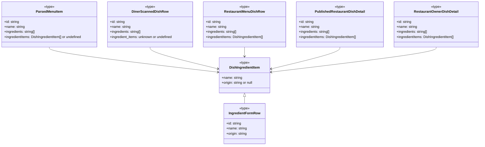
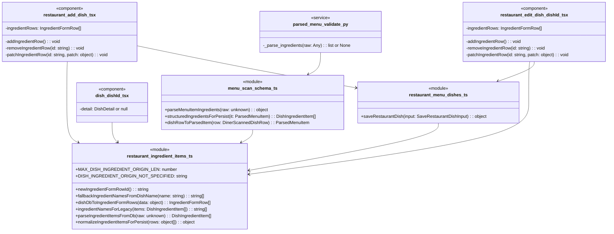

### 1. Primary and Secondary Owners

| Role | Name | Notes |
|------|------|-------|
| Primary owner | Cici Ge | Owns requirements and release sign-off |
| Secondary owner | Sofia Yu | Owns implementation review and test plan |

---

### 2. Date Merged into `main`

2026-04-16 (PR #84)

---

### 3. Architecture Diagram (Mermaid)

```mermaid
flowchart TB
    subgraph Client
        diner_menu_tsx[diner-menu.tsx]
        dish_dishId_tsx[dish/[dishId].tsx]
        restaurant_add_dish_tsx[restaurant-add-dish.tsx]
        restaurant_edit_dish_dishId_tsx[restaurant-edit-dish/[dishId].tsx]
        restaurant_owner_dish_dishId_tsx[restaurant-owner-dish/[dishId].tsx]
        restaurant_dish_dishId_tsx[restaurant-dish/[dishId].tsx]

        restaurant_ingredient_items_ts[restaurant-ingredient-items.ts]
        menu_scan_schema_ts[menu-scan-schema.ts]
        restaurant_menu_dishes_ts[restaurant-menu-dishes.ts]
        fetch_parsed_menu_for_scan_ts[fetch-parsed-menu-for-scan.ts]
        restaurant_fetch_menu_for_scan_ts[restaurant-fetch-menu-for-scan.ts]
        restaurant_owner_dish_detail_ts[restaurant-owner-dish-detail.ts]
        restaurant_public_dish_ts[restaurant-public-dish.ts]
        partner_menu_access_ts[partner-menu-access.ts]
        persist_parsed_menu_ts[persist-parsed-menu.ts]
        restaurant_persist_menu_ts[restaurant-persist-menu.ts]

        diner_menu_tsx -->|uses| fetch_parsed_menu_for_scan_ts
        diner_menu_tsx -->|uses| partner_menu_access_ts
        dish_dishId_tsx -->|uses| restaurant_ingredient_items_ts
        restaurant_add_dish_tsx -->|uses| restaurant_ingredient_items_ts
        restaurant_add_dish_tsx -->|uses| restaurant_menu_dishes_ts
        restaurant_edit_dish_dishId_tsx -->|uses| restaurant_ingredient_items_ts
        restaurant_edit_dish_dishId_tsx -->|uses| restaurant_menu_dishes_ts
        restaurant_owner_dish_dishId_tsx -->|uses| restaurant_ingredient_items_ts
        restaurant_dish_dishId_tsx -->|uses| restaurant_ingredient_items_ts

        menu_scan_schema_ts -->|uses| restaurant_ingredient_items_ts
        fetch_parsed_menu_for_scan_ts -->|uses| menu_scan_schema_ts
        partner_menu_access_ts -->|uses| restaurant_fetch_menu_for_scan_ts
        partner_menu_access_ts -->|uses| menu_scan_schema_ts
        persist_parsed_menu_ts -->|uses| menu_scan_schema_ts
        restaurant_fetch_menu_for_scan_ts -->|uses| restaurant_ingredient_items_ts
        restaurant_owner_dish_detail_ts -->|uses| restaurant_ingredient_items_ts
        restaurant_public_dish_ts -->|uses| restaurant_ingredient_items_ts
        restaurant_menu_dishes_ts -->|uses| restaurant_ingredient_items_ts
        restaurant_persist_menu_ts -->|uses| menu_scan_schema_ts
    end

    subgraph Server
        parsed_menu_validate_py[parsed_menu_validate.py]
        llm_menu_vertex_py[llm_menu_vertex.py]
    end

    subgraph Cloud
        Supabase_PostgreSQL[Supabase PostgreSQL]
        Supabase_Auth[Supabase Auth]
        Vertex_AI[Vertex AI]
    end

    restaurant_menu_dishes_ts -->|writes dish data| Supabase_PostgreSQL
    fetch_parsed_menu_for_scan_ts -->|reads dish data| Supabase_PostgreSQL
    restaurant_fetch_menu_for_scan_ts -->|reads dish data| Supabase_PostgreSQL
    restaurant_owner_dish_detail_ts -->|reads dish data| Supabase_PostgreSQL
    restaurant_public_dish_ts -->|reads dish data| Supabase_PostgreSQL
    partner_menu_access_ts -->|reads/writes diner scans| Supabase_PostgreSQL
    persist_parsed_menu_ts -->|writes parsed menu| Supabase_PostgreSQL
    restaurant_persist_menu_ts -->|writes parsed menu| Supabase_PostgreSQL

    llm_menu_vertex_py -->|uses| Vertex_AI
    parsed_menu_validate_py -->|validates LLM output| llm_menu_vertex_py
```

---

### 4. Information Flow Diagram (Mermaid)

#### 4a. Write path

```mermaid
flowchart TB
    subgraph UI
        restaurant_add_dish_tsx[restaurant-add-dish.tsx]
        restaurant_edit_dish_dishId_tsx[restaurant-edit-dish/[dishId].tsx]
    end

    subgraph Lib
        restaurant_ingredient_items_ts[restaurant-ingredient-items.ts]
        restaurant_menu_dishes_ts[restaurant-menu-dishes.ts]
    end

    subgraph Database
        Supabase_PostgreSQL[Supabase PostgreSQL]
    end

    restaurant_add_dish_tsx -->|IngredientFormRow[]| restaurant_ingredient_items_ts
    restaurant_edit_dish_dishId_tsx -->|IngredientFormRow[]| restaurant_ingredient_items_ts
    restaurant_ingredient_items_ts -->|DishIngredientItem[]| restaurant_menu_dishes_ts
    restaurant_menu_dishes_ts -->|dish data, ingredient_items JSONB| Supabase_PostgreSQL
```

#### 4b. Read path

```mermaid
flowchart TB
    subgraph Database
        Supabase_PostgreSQL[Supabase PostgreSQL]
    end

    subgraph Lib
        fetch_parsed_menu_for_scan_ts[fetch-parsed-menu-for-scan.ts]
        restaurant_fetch_menu_for_scan_ts[restaurant-fetch-menu-for-scan.ts]
        restaurant_owner_dish_detail_ts[restaurant-owner-dish-detail.ts]
        restaurant_public_dish_ts[restaurant-public-dish.ts]
        restaurant_ingredient_items_ts[restaurant-ingredient-items.ts]
    end

    subgraph UI
        dish_dishId_tsx[dish/[dishId].tsx]
        restaurant_owner_dish_dishId_tsx[restaurant-owner-dish/[dishId].tsx]
        restaurant_dish_dishId_tsx[restaurant-dish/[dishId].tsx]
    end

    Supabase_PostgreSQL -->|dish rows, ingredient_items JSONB| fetch_parsed_menu_for_scan_ts
    Supabase_PostgreSQL -->|dish rows, ingredient_items JSONB| restaurant_fetch_menu_for_scan_ts
    Supabase_PostgreSQL -->|dish rows, ingredient_items JSONB| restaurant_owner_dish_detail_ts
    Supabase_PostgreSQL -->|dish rows, ingredient_items JSONB| restaurant_public_dish_ts

    fetch_parsed_menu_for_scan_ts -->|raw ingredient_items| restaurant_ingredient_items_ts
    restaurant_fetch_menu_for_scan_ts -->|raw ingredient_items| restaurant_ingredient_items_ts
    restaurant_owner_dish_detail_ts -->|raw ingredient_items| restaurant_ingredient_items_ts
    restaurant_public_dish_ts -->|raw ingredient_items| restaurant_ingredient_items_ts

    restaurant_ingredient_items_ts -->|DishIngredientItem[]| dish_dishId_tsx
    restaurant_ingredient_items_ts -->|DishIngredientItem[]| restaurant_owner_dish_dishId_tsx
    restaurant_ingredient_items_ts -->|DishIngredientItem[]| restaurant_dish_dishId_tsx
```

---

### 5. Class Diagram (Mermaid)

#### 5a. Data types and schemas



#### 5b. Components and modules



---

### 6. Implementation Units

**File path**: `app/diner-menu.tsx`
**Purpose**: Displays the diner's menu, allowing filtering and favoriting. Updated to refresh partner-linked scans if stale and to pass `scanId` and `restaurantName` to the dish detail screen.
**Public fields and methods**:
- `DinerMenuScreen` (React component): Default export, renders the diner menu UI.
**Private fields and methods**:
- `loadMenu()`: Async function to fetch diner preferences and the parsed menu for the current `scanId`. Now includes logic to refresh partner-linked diner scans if stale.
- `handleToggleFavorite(dishId: string)`: Toggles the favorite status of a dish.
- `availableTags`: Memoized list of tags derived from diner preferences.
- `menuTagSet`: Memoized set of tags present in the current menu.
- `sectionBlocks`: Memoized filtered menu sections based on `selectedTags`.
- `formatPrice(dish: ParsedMenuItem)`: Formats the price for display.
- `renderSpiceFlames(level: ParsedMenuItem['spice_level'])`: Renders spice level icons.
- `DishCard({ dish }: { dish: ParsedMenuItem })`: React component for displaying a single dish in the menu list.

**File path**: `app/dish/[dishId].tsx`
**Purpose**: Displays detailed information for a single dish. Updated to fetch and display structured ingredient items with origins.
**Public fields and methods**:
- `DishDetailScreen` (React component): Default export, renders the dish detail UI.
**Private fields and methods**:
- `DishDetail` (type): Defines the structure of dish detail data, now includes `ingredientItems: DishIngredientItem[]`.
- `titleize(label: string)`: Capitalizes words in a string.
- `deriveFlavorTags(tags: string[], spiceLevel: number, description: string or null)`: Extracts and formats flavor tags.
- `deriveDietaryIndicators(tags: string[])`: Extracts and formats dietary indicators.
- `formatPrice(amount: number or null, currency: string, display: string or null)`: Formats the dish price.
- `inferBudgetTier(amount: number or null)`: Infers budget tier from price.
- `buildFallbackSummary(input: object)`: Generates a summary if description is missing.
- `buildWhyThisMatchesYou(detail: DishDetail, prefs: DinerPreferenceSnapshot or null)`: Generates reasons why a dish matches diner preferences.
- `onGenerateImage()`: Triggers AI image generation for the dish.
- State variables: `detail`, `prefs`, `loading`, `error`, `favorite`, `imageLoading`, `imageError`, `note`, `noteInput`, `editingNote`, `savingNote`.

**File path**: `app/restaurant-add-dish.tsx`
**Purpose**: Allows restaurant owners to add new dishes to their menu. Significantly updated to support structured ingredient input with names and optional origins.
**Public fields and methods**:
- `RestaurantAddDishScreen` (React component): Default export, renders the add dish UI.
**Private fields and methods**:
- `SpiceLevel` (type): Defines spice level as 0, 1, 2, or 3.
- `parsePriceToAmount(input: string)`: Parses price text into amount, currency, and display.
- `parseTagsText(input: string)`: Parses comma-separated tags into a string array.
- `ingredientRows`: State variable for the list of `IngredientFormRow` objects.
- `ingredientItemsForSave`: Memoized array of `DishIngredientItem` derived from `ingredientRows` for persistence.
- `addIngredientRow()`: Adds a new blank ingredient row to the form.
- `removeIngredientRow(id: string)`: Removes an ingredient row by its ID.
- `patchIngredientRow(id: string, patch: object)`: Updates a specific ingredient row.
- `commitCurrentFields(opts: object)`: Saves the current dish fields to the database.
- `onUploadPhoto()`: Handles photo upload for the dish.
- `onGenerateImage()`: Triggers AI image generation for the dish.
- `onGenerateSummary()`: Triggers AI summary generation for the dish.
- `onSaveDish()`: Saves the dish and navigates to the review menu screen.
- State variables: `dishId`, `loading`, `saving`, `dishImageUrl`, `name`, `priceText`, `summary`, `tagsText`, `spiceLevel`, `imageLoading`, `uploadPhotoLoading`, `summaryLoading`, `imageError`, `summaryError`.

**File path**: `app/restaurant-dish/[dishId].tsx`
**Purpose**: Displays a public-facing view of a restaurant dish. Updated to display structured ingredient items with origins.
**Public fields and methods**:
- `RestaurantDishDetailScreen` (React component): Default export, renders the public dish detail UI.
**Private fields and methods**:
- `detail`: State variable for `PublishedRestaurantDishDetail`.
- `formatPrice(amount: number or null, currency: string, display: string or null)`: Formats the dish price.
- `renderSpiceFlames(level: number)`: Renders spice level icons.
- `onShare()`: Handles sharing the dish link.

**File path**: `app/restaurant-edit-dish/[dishId].tsx`
**Purpose**: Allows restaurant owners to edit existing dishes. Significantly updated to support structured ingredient input with names and optional origins, and to load existing structured ingredients.
**Public fields and methods**:
- `RestaurantEditDishScreen` (React component): Default export, renders the edit dish UI.
**Private fields and methods**:
- `SpiceLevel` (type): Defines spice level as 0, 1, 2, or 3.
- `parsePriceToAmount(input: string)`: Parses price text into amount, currency, and display.
- `parseTagsText(input: string)`: Parses comma-separated tags into a string array.
- `ingredientRows`: State variable for the list of `IngredientFormRow` objects.
- `ingredientItemsForSave`: Memoized array of `DishIngredientItem` derived from `ingredientRows` for persistence.
- `addIngredientRow()`: Adds a new blank ingredient row to the form.
- `removeIngredientRow(id: string)`: Removes an ingredient row by its ID.
- `patchIngredientRow(id: string, patch: object)`: Updates a specific ingredient row.
- `onUploadPhoto()`: Handles photo upload for the dish.
- `onGenerateImage()`: Triggers AI image generation for the dish.
- `onGenerateSummary()`: Triggers AI summary generation for the dish.
- `onSaveDish()`: Saves the dish and navigates to the review menu screen.
- State variables: `dishId`, `scanId`, `loading`, `saving`, `dishImageUrl`, `name`, `priceText`, `summary`, `tagsText`, `spiceLevel`, `imageLoading`, `uploadPhotoLoading`, `summaryLoading`, `imageError`, `summaryError`.

**File path**: `app/restaurant-owner-dish/[dishId].tsx`
**Purpose**: Displays a preview of a restaurant dish for the owner. Updated to display structured ingredient items with origins.
**Public fields and methods**:
- `RestaurantOwnerDishDetailScreen` (React component): Default export, renders the owner dish preview UI.
**Private fields and methods**:
- `detail`: State variable for `RestaurantOwnerDishDetail`.
- `formatPrice(amount: number or null, currency: string, display: string or null)`: Formats the dish price.
- `renderSpiceFlames(level: number)`: Renders spice level icons.

**File path**: `backend/llm_menu_vertex.py`
**Purpose**: Flask service for parsing menus using Vertex AI. Updated the prompt to clarify ingredient parsing behavior, specifically for simple snacks or single-component dishes.
**Public fields and methods**:
- `_json_from_model_text(text: str)`: Parses JSON from model text.
**Private fields and methods**:
- `_PROMPT_TEMPLATE`: String template for the LLM prompt, updated to include a clarification for `items[].ingredients`.

**File path**: `backend/parsed_menu_validate.py`
**Purpose**: Flask service for validating parsed menu data. Updated `_parse_ingredients` to handle more flexible input formats for ingredients, including objects with `name` or `ingredient` keys.
**Public fields and methods**:
- `_parse_ingredients(raw: Any)`: Parses raw ingredient data into a list of strings.
**Private fields and methods**:
- `_parse_item(raw: Any)`: Parses a single menu item.

**File path**: `lib/fetch-parsed-menu-for-scan.ts`
**Purpose**: Fetches parsed menu data for a given scan ID. Updated the Supabase query to include the new `ingredient_items` column.
**Public fields and methods**:
- `fetchParsedMenuForScan(scanId: string)`: Fetches and returns parsed menu data.

**File path**: `lib/menu-scan-schema.ts`
**Purpose**: Defines schemas and utility functions for parsed menu data. Significantly updated to handle structured ingredient items.
**Public fields and methods**:
- `MENU_SCAN_SCHEMA_VERSION`: Constant for the schema version.
- `ParsedMenuPrice` (type): Defines the price object structure.
- `ParsedMenuItem` (type): Defines the structure of a parsed menu item, now includes `ingredientItems?: DishIngredientItem[]`.
- `ParsedMenuSection` (type): Defines the structure of a parsed menu section.
- `ParsedMenu` (type): Defines the structure of a parsed menu.
- `DinerScannedDishRow` (type): Defines the structure of a diner scanned dish row, now includes `ingredient_items?: unknown`.
- `parseMenuItemIngredients(raw: unknown)`: Normalizes flexible ingredient input from LLM/menu parse into `names` and `items`.
- `structuredIngredientsForPersist(it: ParsedMenuItem)`: Converts `ParsedMenuItem` ingredients into `DishIngredientItem[]` for persistence, prioritizing `ingredientItems` then `ingredients`, then falling back to dish name.
- `dishRowToParsedItem(row: DinerScannedDishRow)`: Maps a database dish row to a `ParsedMenuItem`, now parsing `ingredient_items`.
- `validateParsedMenu(raw: unknown)`: Validates raw menu data against the schema.
- `parsedMenuHasItems(menu: ParsedMenu)`: Checks if a parsed menu contains any items.
- `assembleParsedMenu(sections: ParsedMenuSection[])`: Assembles a parsed menu from sections.
**Private fields and methods**:
- `parsePrice(raw: unknown)`: Parses raw price data.
- `parseItem(raw: unknown)`: Parses a single raw menu item.
- `parseSection(raw: unknown)`: Parses a single raw menu section.
- `isSpiceLevel(n: unknown)`: Type guard for spice level.
- `normalizeSpiceLevel(n: unknown)`: Normalizes spice level.

**File path**: `lib/partner-menu-access.ts`
**Purpose**: Handles partner QR menu access, including resolving tokens and refreshing stale diner scans. Updated to copy `ingredient_items` from restaurant dishes to diner scans.
**Public fields and methods**:
- `resolvePartnerTokenToDinerScan(token: string)`: Resolves a partner token to a diner scan ID, creating a new scan if necessary. Now copies `ingredient_items`.
- `refreshPartnerLinkedDinerScanIfStale(dinerScanId: string)`: Refreshes a diner's menu scan if it originated from a partner QR link and the restaurant's menu has been updated.
**Private fields and methods**:
- `OwnerTokenResult` (type): Defines the result of fetching an owner token.
- `DinerScanResult` (type): Defines the result of resolving a diner scan.
- `RestaurantMenuDishRow` (type): Imported type from `restaurant-fetch-menu-for-scan.ts`.

**File path**: `lib/persist-parsed-menu.ts`
**Purpose**: Persists parsed menu data to the `diner_scanned_dishes` table. Updated to include `ingredient_items` when inserting dishes.
**Public fields and methods**:
- `persistParsedMenu(menu: ParsedMenu, profileId: string)`: Persists a parsed menu.

**File path**: `lib/restaurant-fetch-menu-for-scan.ts`
**Purpose**: Fetches restaurant menu data for scanning purposes. Updated to include `ingredient_items` in the Supabase query and to derive `ingredients` from `ingredientItems` for legacy compatibility.
**Public fields and methods**:
- `RestaurantMenuSectionRow` (type): Defines the structure of a restaurant menu section row.
- `RestaurantMenuDishRow` (type): Defines the structure of a restaurant menu dish row, now includes `ingredientItems: DishIngredientItem[]`.
- `fetchRestaurantMenuForScan(scanId: string)`: Fetches restaurant menu data.
**Private fields and methods**:
- `coerceSpiceLevel(n: unknown)`: Coerces a value to a valid spice level.

**File path**: `lib/restaurant-ingredient-items.ts` (New File)
**Purpose**: Provides utility functions and types for handling structured ingredient items (name + optional origin) in restaurant and diner contexts.
**Public fields and methods**:
- `MAX_DISH_INGREDIENT_ORIGIN_LEN`: Constant for maximum origin length.
- `DISH_INGREDIENT_ORIGIN_NOT_SPECIFIED`: Constant string for placeholder text.
- `DishIngredientItem` (type): Defines the structure of a single ingredient item.
- `IngredientFormRow` (type): Defines the structure of an ingredient row for UI forms.
- `newIngredientFormRowId()`: Generates a unique ID for a new ingredient form row.
- `fallbackIngredientNamesFromDishName(name: string)`: Derives ingredient names from a dish title.
- `dishDbToIngredientFormRows(data: object)`: Converts database dish data into `IngredientFormRow`s, prioritizing `ingredient_items` then `ingredients`, then `name`.
- `ingredientNamesForLegacy(items: DishIngredientItem[])`: Extracts only names from `DishIngredientItem[]` for legacy `ingredients` text[] fields.
- `parseIngredientItemsFromDb(raw: unknown)`: Parses raw database `ingredient_items` JSONB into `DishIngredientItem[]`.
- `normalizeIngredientItemsForPersist(rows: object[])`: Validates and normalizes `IngredientFormRow`s into `DishIngredientItem[]` for persistence, applying length checks and handling blank entries.

**File path**: `lib/restaurant-menu-dishes.ts`
**Purpose**: Provides functions for creating, saving, and managing restaurant dishes. Updated `saveRestaurantDish` to handle `ingredientItems` and derive legacy `ingredients` from them.
**Public fields and methods**:
- `SaveRestaurantDishInput` (type): Defines input for saving a dish, now includes `ingredientItems: DishIngredientItem[]`.
- `getRestaurantSectionNextDishSortOrder(sectionId: string)`: Fetches the next sort order for a dish in a section.
- `createRestaurantDishDraft(input: object)`: Creates a draft dish.
- `touchRestaurantMenuScan(scanId: string)`: Updates the `last_activity_at` for a menu scan.
- `saveRestaurantDish(input: SaveRestaurantDishInput)`: Saves or updates a restaurant dish.

**File path**: `lib/restaurant-owner-dish-detail.ts`
**Purpose**: Fetches detailed information for a restaurant owner's dish. Updated to include `ingredient_items` in the Supabase query and to derive `ingredients` from `ingredientItems`.
**Public fields and methods**:
- `RestaurantOwnerDishDetail` (type): Defines the structure of restaurant owner dish detail, now includes `ingredientItems: DishIngredientItem[]`.
- `fetchRestaurantOwnerDishDetail(dishId: string)`: Fetches detailed dish information for an owner.

**File path**: `lib/restaurant-persist-menu.ts`
**Purpose**: Persists parsed menu data to the `restaurant_menu_dishes` table. Updated to include `ingredient_items` when inserting dishes.
**Public fields and methods**:
- `persistRestaurantMenuDraft(menu: ParsedMenu, restaurantId: string)`: Persists a restaurant menu draft.

**File path**: `lib/restaurant-public-dish.ts`
**Purpose**: Fetches public-facing details for a restaurant dish. Updated to include `ingredient_items` in the Supabase query and to derive `ingredients` from `ingredientItems`.
**Public fields and methods**:
- `PublishedRestaurantDishDetail` (type): Defines the structure of a published restaurant dish detail, now includes `ingredientItems: DishIngredientItem[]`.
- `fetchPublishedRestaurantDishDetail(dishId: string)`: Fetches public dish details.

**File path**: `supabase/migrations/20260415120000_us9_restaurant_dish_ingredient_items.sql` (New File)
**Purpose**: Database migration to add `ingredient_items` column to `restaurant_menu_dishes` table and backfill existing data.
**Public fields and methods**:
- SQL `ALTER TABLE public.restaurant_menu_dishes ADD COLUMN IF NOT EXISTS ingredient_items jsonb NOT NULL DEFAULT '[]'::jsonb;`
- SQL `COMMENT ON COLUMN public.restaurant_menu_dishes.ingredient_items IS 'JSON array of { "name": string, "origin": string | null }. `ingredients` text[] remains name-only for legacy/search.';`
- SQL `UPDATE public.restaurant_menu_dishes d SET ingredient_items = coalesce((SELECT jsonb_agg(jsonb_build_object('name', x, 'origin', null)) FROM unnest(d.ingredients) as x), '[]'::jsonb) WHERE jsonb_array_length(d.ingredient_items) = 0 AND cardinality(d.ingredients) > 0;`

**File path**: `supabase/migrations/20260415133000_diner_scanned_dishes_ingredient_items.sql` (New File)
**Purpose**: Database migration to add `ingredient_items` column to `diner_scanned_dishes` table.
**Public fields and methods**:
- SQL `ALTER TABLE public.diner_scanned_dishes ADD COLUMN IF NOT EXISTS ingredient_items jsonb NOT NULL DEFAULT '[]'::jsonb;`
- SQL `COMMENT ON COLUMN public.diner_scanned_dishes.ingredient_items IS 'Optional JSON array of { name, origin } for partner QR menu copies; OCR menus stay [].';`

**File path**: `tests/menu-scan-schema.test.ts`
**Purpose**: Unit tests for `menu-scan-schema.ts`. Added tests for `parseMenuItemIngredients` and `structuredIngredientsForPersist`, and updated `validateParsedMenu` and `dishRowToParsedItem` tests to cover new ingredient handling.
**Public fields and methods**:
- `validDishRow(overrides: object)`: Helper to create a valid `DinerScannedDishRow`.
- `validSectionRow(overrides: object)`: Helper to create a valid `DinerMenuSectionRow`.
- `validMenu(overrides: object)`: Helper to create a valid `ParsedMenu`.
- `minItem(over: object)`: Helper to create a minimal `ParsedMenuItem`.

**File path**: `tests/partner-menu-access.test.ts`
**Purpose**: Unit tests for `partner-menu-access.ts`. Added tests for `refreshPartnerLinkedDinerScanIfStale`.
**Public fields and methods**:
- `mockGetUser`: Mock for `supabase.auth.getUser`.
- `mockFrom`: Mock for `supabase.from`.

**File path**: `tests/restaurant-ingredient-items.test.ts` (New File)
**Purpose**: Unit tests for `restaurant-ingredient-items.ts`.
**Public fields and methods**:
- `parseIngredientItemsFromDb` tests: Covers various input formats and error handling.
- `normalizeIngredientItemsForPersist` tests: Covers validation, normalization, and error cases.
- `fallbackIngredientNamesFromDishName` tests: Covers deriving names from dish titles.
- `dishDbToIngredientFormRows` tests: Covers conversion from DB data to form rows.
- `ingredientNamesForLegacy` tests: Covers conversion to legacy name-only arrays.

---

### 7. Technologies, Libraries, and APIs

| Technology | Version | Used for | Why chosen over alternatives | Source / Docs URL |
|:-----------|:--------|:---------|:-----------------------------|:------------------|
| TypeScript | ~5.3.0 | Application language | Type safety, improved developer experience, large ecosystem. | [TypeScript Docs](https://www.typescriptlang.org/docs/) |
| React Native | ~0.73.2 | Mobile app framework | Cross-platform development (iOS/Android) from a single codebase. | [React Native Docs](https://reactnative.dev/docs/) |
| Expo | ~50.0.6 | React Native development platform | Simplified setup, managed workflow, access to native APIs, over-the-air updates. | [Expo Docs](https://docs.expo.dev/) |
| Flask | 2.x | Backend API framework | Lightweight, flexible, and easy to get started with Python. | [Flask Docs](https://flask.palletsprojects.com/en/2.3.x/) |
| Python | 3.x | Backend language | Versatile, strong ecosystem for AI/ML, good for scripting. | [Python Docs](https://docs.python.org/3/) |
| Supabase | N/A | Backend-as-a-Service (BaaS) | PostgreSQL database, authentication, and storage with real-time capabilities. | [Supabase Docs](https://supabase.com/docs) |
| Supabase JS client | ~2.39.0 | Client-side interaction with Supabase | Easy integration with Supabase services from React Native. | [Supabase JS Docs](https://supabase.com/docs/reference/javascript) |
| PostgreSQL | N/A | Relational database | Robust, open-source, widely used, good for structured data. | [PostgreSQL Docs](https://www.postgresql.org/docs/) |
| Vertex AI / Gemini | N/A | Large Language Model (LLM) | AI-powered menu parsing and content generation. | [Vertex AI Docs](https://cloud.google.com/vertex-ai/docs) |
| Mermaid | N/A | Diagramming language | Text-based diagramming for documentation. | [Mermaid Docs](https://mermaid.js.org/) |
| Zod | ~3.22.4 | Schema validation | Type-safe schema validation for runtime data. | [Zod Docs](https://zod.dev/) |
| `expo-linking` | ~6.2.2 | Deep linking | Handling incoming URLs for partner QR codes. | [Expo Linking Docs](https://docs.expo.dev/versions/latest/sdk/linking/) |
| `expo-image` | ~1.1.6 | Image display | Optimized image loading and display in Expo. | [Expo Image Docs](https://docs.expo.dev/versions/latest/sdk/image/) |
| `react-native-safe-area-context` | ~4.8.2 | Safe area handling | Adapting UI to device safe areas (notches, etc.). | [React Native Safe Area Context Docs](https://github.com/th3rdwave/react-native-safe-area-context) |

---

### 8. Database — Long-Term Storage

**Table name and purpose**: `public.restaurant_menu_dishes`
- **Purpose**: Stores details about dishes created and managed by restaurant owners.
- **Column**: `ingredient_items`
    - **Type**: `jsonb`
    - **Purpose**: Stores a JSON array of structured ingredient objects, each containing a `name` (string) and an `origin` (string or null). This allows for detailed ingredient information beyond just names.
    - **Estimated storage in bytes per row**: Assuming an average of 5-10 ingredients per dish, with each name/origin pair being ~20-50 characters (including JSON overhead), this could be roughly 200-1000 bytes per dish.
- **Estimated total storage per user**: If a restaurant owner manages 100 dishes, this would be approximately 20KB - 100KB for `ingredient_items` data.

**Table name and purpose**: `public.diner_scanned_dishes`
- **Purpose**: Stores copies of dishes that diners have scanned or accessed, including those from partner QR codes.
- **Column**: `ingredient_items`
    - **Type**: `jsonb`
    - **Purpose**: Stores a JSON array of structured ingredient objects, mirroring the `restaurant_menu_dishes` table for partner-linked menus. For OCR-scanned menus, this field remains empty.
    - **Estimated storage in bytes per row**: Similar to `restaurant_menu_dishes`, roughly 200-1000 bytes per dish.
- **Estimated total storage per user**: If a diner scans 50 dishes from partner menus, this would be approximately 10KB - 50KB for `ingredient_items` data.

---

### 9. Failure Scenarios

1.  **Frontend process crash**
    *   **User-visible effect**: The app freezes or closes unexpectedly. The user is returned to their device's home screen or the app's launch screen.
    *   **Internally-visible effect**: The React Native JavaScript thread terminates. Crash logs are generated and sent to monitoring services (e.g., Sentry, Expo Crash Reporter). Any unsaved form data (e.g., ingredient rows in `restaurant-add-dish.tsx`) is lost.

2.  **Loss of all runtime state**
    *   **User-visible effect**: The app appears to restart or refresh, losing current screen data (e.g., ingredient form inputs, selected filters on the diner menu). The user might need to re-enter data or re-navigate.
    *   **Internally-visible effect**: React Native components unmount and remount. `useState` and `useRef` hooks are re-initialized. Data fetched from local storage (e.g., `AsyncStorage`) or re-fetched from the backend will persist, but in-memory component state is reset.

3.  **All stored data erased**
    *   **User-visible effect**: All user data (dishes, menus, preferences, favorites, ingredient details) is gone. Users would see empty menus, no saved dishes, and would have to start from scratch.
    *   **Internally-visible effect**: The Supabase PostgreSQL database is empty. All `restaurant_menu_dishes` and `diner_scanned_dishes` rows, including `ingredient_items`, are lost. Supabase Storage (for images) would also be empty.

4.  **Corrupt data detected in the database**
    *   **User-visible effect**: Depending on the corruption, a dish might display incorrect ingredient names or origins, or fail to load entirely. For example, `ingredient_items` might be malformed JSON, leading to an error message on the dish detail screen or an empty ingredient list.
    *   **Internally-visible effect**: Database queries might return errors or unexpected data types. Client-side parsing functions like `parseIngredientItemsFromDb` or `dishDbToIngredientFormRows` would return empty arrays or throw errors, which would be caught and logged. The UI would then display fallback text or an error message.

5.  **Remote procedure call (API call) failed**
    *   **User-visible effect**: When saving a dish, the "Save" button might remain active or show a "Saving failed" message. When loading a menu or dish, an error message like "Failed to load menu" or "Dish not found" would appear.
    *   **Internally-visible effect**: Network requests (e.g., `supabase.from('restaurant_menu_dishes').update(...)`) would return an error object. This error would be caught in the `catch` block of the async function (e.g., `onSaveDish` in `restaurant-add-dish.tsx`) and the `error` state variable would be updated, triggering UI feedback.

6.  **Client overloaded**
    *   **User-visible effect**: The app becomes unresponsive, animations stutter, or touch input is delayed. It might eventually crash if memory limits are hit.
    *   **Internally-visible effect**: The JavaScript event loop is blocked. High CPU usage on the device. Memory usage increases. This is unlikely for ingredient data itself, but could happen with very large menus or complex UI rendering.

7.  **Client out of RAM**
    *   **User-visible effect**: The app crashes or is terminated by the operating system. The user is returned to the device's home screen.
    *   **Internally-visible effect**: The operating system sends a low-memory warning, then terminates the app process. Crash logs would indicate an out-of-memory error.

8.  **Database out of storage space**
    *   **User-visible effect**: Users would be unable to save new dishes or update existing ones. An error message like "Could not save dish: Database storage full" would be displayed.
    *   **Internally-visible effect**: Supabase PostgreSQL would return a storage-related error (e.g., `507 Insufficient Storage`). This error would propagate through the Supabase client library to the frontend, where it would be caught and logged.

9.  **Network connectivity lost**
    *   **User-visible effect**: The app would display "No internet connection" or "Failed to load" messages when attempting to fetch or save data. Features requiring network access (e.g., loading menus, saving dishes, generating AI images/summaries) would fail.
    *   **Internally-visible effect**: Network requests would time out or fail with network-specific errors. The `supabase` client would report network errors. The app's error handling (`try/catch`) would capture these and update the UI state.

10. **Database access lost**
    *   **User-visible effect**: Similar to network connectivity loss, but specifically for database operations. Users would see errors when trying to load or save any data that relies on Supabase.
    *   **Internally-visible effect**: Supabase client calls would fail with authentication or authorization errors, or connection errors if the database itself is unreachable. These errors would be caught and logged.

11. **Bot signs up and spams users**
    *   **User-visible effect**: Unwanted or malicious content might appear in dish names, descriptions, or ingredient fields if a bot gains access to a restaurant owner account. For this story, a bot could create many dishes with nonsensical or offensive ingredient names/origins.
    *   **Internally-visible effect**: Increased database writes to `restaurant_menu_dishes`. Monitoring for unusual activity patterns (e.g., high volume of dish creations from a single account, rapid changes to dish data) would detect this. The `MAX_DISH_INGREDIENT_ORIGIN_LEN` (100 chars) helps limit the length of spam in origin fields. The `normalizeIngredientItemsForPersist` function also trims inputs, reducing whitespace spam.

---

### 10. PII, Security, and Compliance

This user story primarily deals with ingredient information for dishes, which is generally not considered Personally Identifying Information (PII). The changes introduce structured ingredient names and origins.

**PII stored in long-term storage for this user story**:
- **None directly introduced by this feature.** The `ingredient_items` column stores ingredient names and origins, which are descriptive of food items, not individuals.

**Minor users**:
- **Does this feature solicit or store PII of users under 18?** No. The feature is for restaurant owners to describe their dishes and for diners to view that information. It does not solicit any personal information from users, regardless of age.
- **If yes: does the app solicit guardian permission?** N/A, as no PII is solicited.
- **What is the team policy for ensuring minors' PII is not accessible by anyone convicted or suspected of child abuse?** N/A, as no PII is solicited or stored by this feature. The general app policy for user accounts and data access would apply, but this feature itself does not handle PII.

**General security considerations for this feature**:
- **Ingredient names and origins**: Stored in plaintext within the `jsonb` column. This is acceptable as it is not PII.
- **Input validation**: `MAX_DISH_INGREDIENT_ORIGIN_LEN` (100 characters) is enforced client-side and should be enforced server-side (though not explicitly shown in the diff for Flask, it's a standard practice). `normalizeIngredientItemsForPersist` handles trimming and ensures names are present if origins are provided. This helps prevent excessively long or malformed data.
- **Data entry path**: User input (restaurant owner) -> `restaurant-add-dish.tsx` / `restaurant-edit-dish/[dishId].tsx` (UI) -> `restaurant-ingredient-items.ts` (validation/normalization) -> `restaurant-menu-dishes.ts` (API call) -> Supabase (PostgreSQL `restaurant_menu_dishes.ingredient_items`).
- **Data exit path**: Supabase (PostgreSQL `restaurant_menu_dishes.ingredient_items` or `diner_scanned_dishes.ingredient_items`) -> `lib/restaurant-fetch-menu-for-scan.ts`, `lib/restaurant-owner-dish-detail.ts`, `lib/restaurant-public-dish.ts`, `lib/fetch-parsed-menu-for-scan.ts` (API call) -> `lib/restaurant-ingredient-items.ts` (parsing) -> `app/dish/[dishId].tsx`, `app/restaurant-owner-dish/[dishId].tsx`, `app/restaurant-dish/[dishId].tsx` (UI display).
- **Responsibility**: The engineering team (Primary Owner: Cici Ge, Secondary Owner: Sofia Yu) is responsible for the secure implementation and storage of all data, including non-PII dish details.
- **Auditing**: Routine database access logs are maintained by Supabase. Non-routine access would follow standard incident response procedures. As `ingredient_items` is not PII, specific PII-focused audit procedures are not directly applicable to this data.