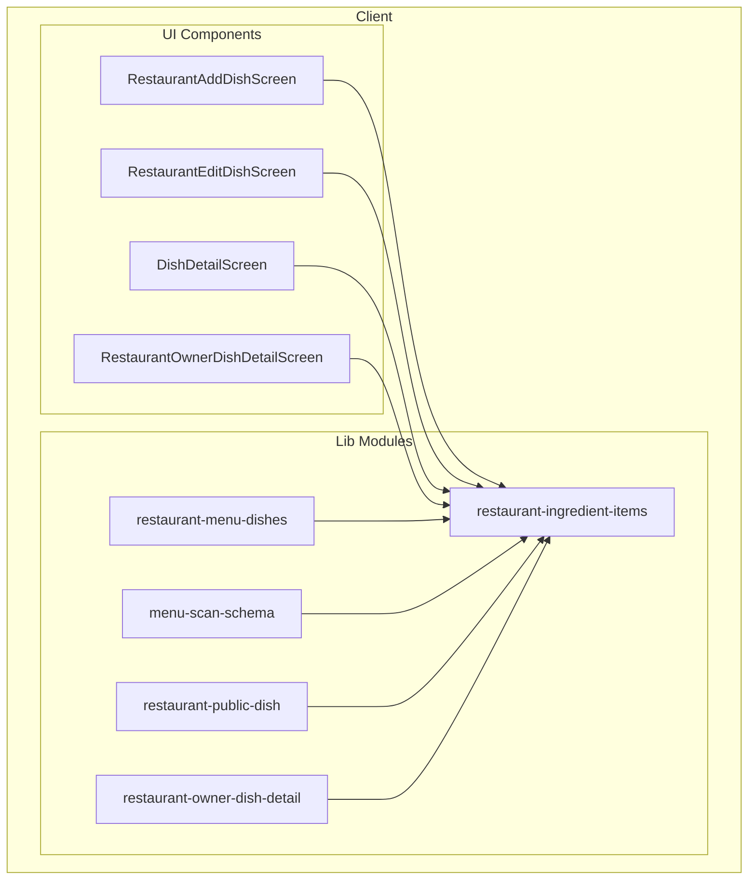
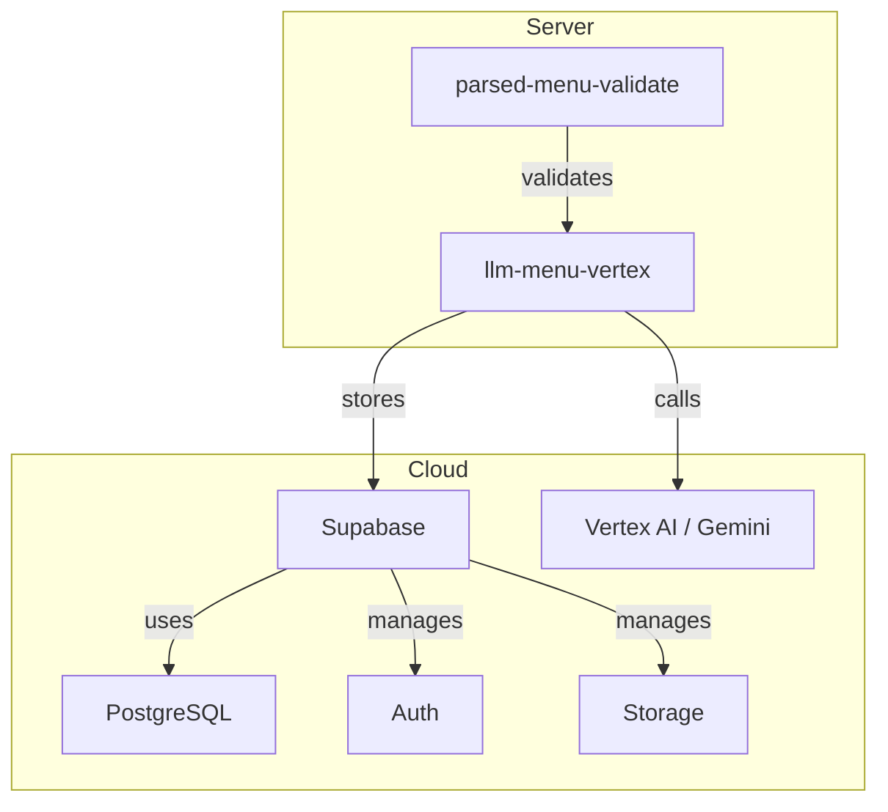
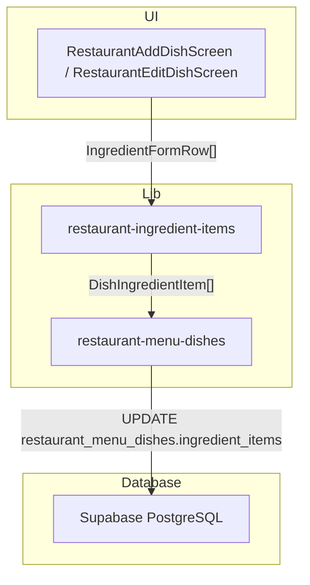
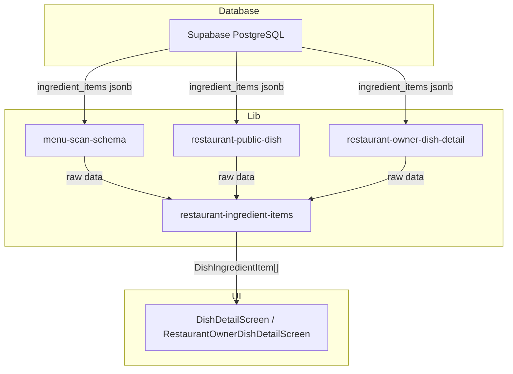
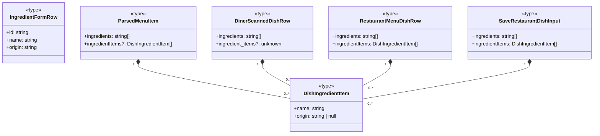

## 1. Primary and Secondary Owners

| Role | Name | Notes |
|------|------|-------|
| Primary owner | Cici Ge | Owns requirements and release sign-off |
| Secondary owner | Sofia Yu | Owns implementation review and test plan |

---

## 2. Date Merged into `main`

2026-04-16 (PR #84)

---

## 3. Architecture Diagram (Mermaid)

### 3a. Client-side architecture



### 3b. Backend and cloud architecture



---

## 4. Information Flow Diagram (Mermaid)

### 4a. Write path



### 4b. Read path



---

## 5. Class Diagram (Mermaid)

### 5a. Data types and schemas



### 5b. Components and modules

```mermaid
classDiagram
    class DishDetailScreen <<component>> {
        -detail: DishDetail
    }
    class RestaurantAddDishScreen <<component>> {
        -ingredientRows: IngredientFormRow[]
        +addIngredientRow()
        +removeIngredientRow(id: string)
        +patchIngredientRow(id: string, patch: object)
    }
    class RestaurantEditDishScreen <<component>> {
        -ingredientRows: IngredientFormRow[]
        +addIngredientRow()
        +removeIngredientRow(id: string)
        +patchIngredientRow(id: string, patch: object)
    }
    class RestaurantOwnerDishDetailScreen <<component>> {
        -detail: RestaurantOwnerDishDetail
    }
    class restaurant-ingredient-items <<module>> {
        +MAX_DISH_INGREDIENT_ORIGIN_LEN: number
        +DISH_INGREDIENT_ORIGIN_NOT_SPECIFIED: string
        +newIngredientFormRowId(): string
        +fallbackIngredientNamesFromDishName(name: string): string[]
        +dishDbToIngredientFormRows(data: object): IngredientFormRow[]
        +ingredientNamesForLegacy(items: DishIngredientItem[]): string[]
        +parseIngredientItemsFromDb(raw: unknown): DishIngredientItem[]
        +normalizeIngredientItemsForPersist(rows: object[]): object
    }

    DishDetailScreen -- uses --> restaurant-ingredient-items
    RestaurantAddDishScreen -- uses --> restaurant-ingredient-items
    RestaurantEditDishScreen -- uses --> restaurant-ingredient-items
    RestaurantOwnerDishDetailScreen -- uses --> restaurant-ingredient-items
```

---

## 6. Implementation Units

**File path:** `app/diner-menu.tsx`
**Purpose:** Displays the diner's menu, now includes logic to refresh partner-linked scans if stale.

*   **Private fields and methods**
    *   `loadMenu()`:
        *   **Purpose:** Asynchronously fetches diner preferences and the parsed menu.
        *   **Type signature:** `async () => void`
        *   **Notes:** Now calls `refreshPartnerLinkedDinerScanIfStale` to ensure the menu is up-to-date if it originated from a partner QR link. Updates `scanId` in router params if a refresh occurs.

**File path:** `app/dish/[dishId].tsx`
**Purpose:** Displays detailed information for a single dish, now includes structured ingredient items and their origins.

*   **Public fields and methods**
    *   `DishDetailScreen` (default export)
        *   **Purpose:** React component for displaying dish details.
        *   **Type signature:** `function DishDetailScreen(): JSX.Element`
*   **Private fields and methods**
    *   `DishDetail` (type)
        *   **Purpose:** Defines the structure of dish detail data.
        *   **Type signature:** `{ id: string; ..., ingredientItems: DishIngredientItem[]; summary: string; description: string | null; }`
        *   **Notes:** Added `ingredientItems` field.
    *   Supabase query
        *   **Purpose:** Fetches dish data from `diner_scanned_dishes`.
        *   **Notes:** Modified `select` statement to include `ingredient_items` column.
    *   `parseIngredientItemsFromDb(typedRow.ingredient_items)`
        *   **Purpose:** Parses the `ingredient_items` JSONB data from the database into `DishIngredientItem[]`.
        *   **Notes:** Used to populate the `ingredientItems` field of the `DishDetail` state.
    *   UI rendering for ingredients
        *   **Purpose:** Displays ingredients in the dish detail view.
        *   **Notes:** Prioritizes rendering `detail.ingredientItems`. If `ingredientItems` are present, it maps through them to display each `item.name` and `item.origin`. If `item.origin` is blank, it displays `DISH_INGREDIENT_ORIGIN_NOT_SPECIFIED`. Falls back to displaying `detail.ingredients` (legacy text array) if `ingredientItems` is empty.
    *   `styles.ingredientStructuredRow`
        *   **Purpose:** Styling for a structured ingredient row.
        *   **Type signature:** `object`
    *   `styles.ingredientTitleRow`
        *   **Purpose:** Styling for the ingredient name part of a structured row.
        *   **Type signature:** `object`
    *   `styles.ingredientOriginLine`
        *   **Purpose:** Styling for the ingredient origin text.
        *   **Type signature:** `object`
    *   `styles.ingredientOriginPlaceholder`
        *   **Purpose:** Styling for the "Origin not specified" placeholder text.
        *   **Type signature:** `object`

**File path:** `app/restaurant-add-dish.tsx`
**Purpose:** Allows restaurant owners to add new dishes, now with structured ingredient input.

*   **Public fields and methods**
    *   `RestaurantAddDishScreen` (default export)
        *   **Purpose:** React component for adding a new restaurant dish.
        *   **Type signature:** `function RestaurantAddDishScreen(): JSX.Element`
*   **Private fields and methods**
    *   `ingredientRows` (state)
        *   **Purpose:** Stores the current list of ingredient form rows for the UI.
        *   **Type signature:** `IngredientFormRow[]`
    *   `ingredientItemsForSave` (memoized value)
        *   **Purpose:** Derives the `DishIngredientItem[]` array suitable for saving to the database from `ingredientRows`.
        *   **Type signature:** `DishIngredientItem[]`
    *   `addIngredientRow()`
        *   **Purpose:** Adds a new, empty ingredient row to the `ingredientRows` state.
        *   **Type signature:** `() => void`
    *   `removeIngredientRow(id: string)`
        *   **Purpose:** Removes an ingredient row from the `ingredientRows` state based on its ID.
        *   **Type signature:** `(id: string) => void`
    *   `patchIngredientRow(id: string, patch: Partial<Pick<IngredientFormRow, 'name' | 'origin'>>)`
        *   **Purpose:** Updates specific fields (`name` or `origin`) of an ingredient row in the `ingredientRows` state.
        *   **Type signature:** `(id: string, patch: Partial<Pick<IngredientFormRow, 'name' | 'origin'>>) => void`
    *   `commitCurrentFields()`
        *   **Purpose:** Saves the current dish form data, including structured ingredients, to the database.
        *   **Type signature:** `async (opts?: { touchScan?: boolean; description?: string | null }) => Promise<{ ok: true } | { ok: false; error: string }>`
        *   **Notes:** Now passes `ingredientItemsForSave` to `saveRestaurantDish`.
    *   `onSaveDish()`
        *   **Purpose:** Handles the final save action for the dish.
        *   **Type signature:** `async () => void`
        *   **Notes:** Now passes `ingredientItemsForSave` to `saveRestaurantDish`.
    *   UI rendering for ingredients
        *   **Purpose:** Displays the ingredient input form.
        *   **Notes:** Replaced a single `TextInput` for comma-separated ingredients with a dynamic list of `View` components, each containing `TextInput` fields for `name` and `origin`, along with "Delete" buttons. An "Add ingredient" button allows adding new rows.
    *   `styles.ingredientsIntro`, `styles.ingredientRowCard`, `styles.ingredientRowHeader`, `styles.ingredientRowHeading`, `styles.subFieldLabel`, `styles.removeIngredient`, `styles.originCounter`, `styles.addIngredientBtn`, `styles.addIngredientBtnText`
        *   **Purpose:** New styles for the structured ingredient input UI.
        *   **Type signature:** `object`

**File path:** `app/restaurant-dish/[dishId].tsx`
**Purpose:** Displays a public preview of a restaurant dish, now showing structured ingredients.

*   **Public fields and methods**
    *   `RestaurantDishDetailScreen` (default export)
        *   **Purpose:** React component for displaying a public restaurant dish detail.
        *   **Type signature:** `function RestaurantDishDetailScreen(): JSX.Element`
*   **Private fields and methods**
    *   UI rendering for ingredients
        *   **Purpose:** Displays ingredients in the public dish detail view.
        *   **Notes:** Prioritizes rendering `detail.ingredientItems`. If `ingredientItems` are present, it maps through them to display each `item.name` and `item.origin`. If `item.origin` is blank, it displays `DISH_INGREDIENT_ORIGIN_NOT_SPECIFIED`. Falls back to displaying `detail.ingredients` (legacy text array) if `ingredientItems` is empty.
    *   `styles.ingredientList`, `styles.ingredientLine`, `styles.ingredientName`, `styles.ingredientOrigin`, `styles.ingredientOriginPlaceholder`
        *   **Purpose:** New styles for displaying structured ingredients.
        *   **Type signature:** `object`

**File path:** `app/restaurant-edit-dish/[dishId].tsx`
**Purpose:** Allows restaurant owners to edit existing dishes, now with structured ingredient input.

*   **Public fields and methods**
    *   `RestaurantEditDishScreen` (default export)
        *   **Purpose:** React component for editing an existing restaurant dish.
        *   **Type signature:** `function RestaurantEditDishScreen(): JSX.Element`
*   **Private fields and methods**
    *   `ingredientRows` (state)
        *   **Purpose:** Stores the current list of ingredient form rows for the UI.
        *   **Type signature:** `IngredientFormRow[]`
    *   `ingredientItemsForSave` (memoized value)
        *   **Purpose:** Derives the `DishIngredientItem[]` array suitable for saving to the database from `ingredientRows`.
        *   **Type signature:** `DishIngredientItem[]`
    *   `addIngredientRow()`
        *   **Purpose:** Adds a new, empty ingredient row to the `ingredientRows` state.
        *   **Type signature:** `() => void`
    *   `removeIngredientRow(id: string)`
        *   **Purpose:** Removes an ingredient row from the `ingredientRows` state based on its ID.
        *   **Type signature:** `(id: string) => void`
    *   `patchIngredientRow(id: string, patch: Partial<Pick<IngredientFormRow, 'name' | 'origin'>>)`
        *   **Purpose:** Updates specific fields (`name` or `origin`) of an ingredient row in the `ingredientRows` state.
        *   **Type signature:** `(id: string, patch: Partial<Pick<IngredientFormRow, 'name' | 'origin'>>) => void`
    *   `useEffect` (data fetching)
        *   **Purpose:** Fetches existing dish data for editing.
        *   **Notes:** Modified Supabase `select` statement to include `ingredient_items`. Uses `dishDbToIngredientFormRows` to initialize `ingredientRows` from fetched data.
    *   `commitCurrentFields()`
        *   **Purpose:** Saves the current dish form data, including structured ingredients, to the database.
        *   **Type signature:** `async (opts?: { touchScan?: boolean; description?: string | null }) => Promise<{ ok: true } | { ok: false; error: string }>`
        *   **Notes:** Now passes `ingredientItemsForSave` to `saveRestaurantDish`.
    *   `onSaveDish()`
        *   **Purpose:** Handles the final save action for the dish.
        *   **Type signature:** `async () => void`
        *   **Notes:** Now passes `ingredientItemsForSave` to `saveRestaurantDish`.
    *   UI rendering for ingredients
        *   **Purpose:** Displays the ingredient input form.
        *   **Notes:** Replaced a single `TextInput` for comma-separated ingredients with a dynamic list of `View` components, each containing `TextInput` fields for `name` and `origin`, along with "Delete" buttons. An "Add ingredient" button allows adding new rows.
    *   `styles.ingredientRowCard`, `styles.ingredientRowHeader`, `styles.ingredientRowHeading`, `styles.subFieldLabel`, `styles.removeIngredient`, `styles.originCounter`, `styles.addIngredientBtn`, `styles.addIngredientBtnText`
        *   **Purpose:** New styles for the structured ingredient input UI.
        *   **Type signature:** `object`

**File path:** `app/restaurant-owner-dish/[dishId].tsx`
**Purpose:** Displays a restaurant owner's view of a dish, now showing structured ingredients.

*   **Public fields and methods**
    *   `RestaurantOwnerDishDetailScreen` (default export)
        *   **Purpose:** React component for displaying a restaurant owner's dish detail.
        *   **Type signature:** `function RestaurantOwnerDishDetailScreen(): JSX.Element`
*   **Private fields and methods**
    *   UI rendering for ingredients
        *   **Purpose:** Displays ingredients in the owner's dish detail view.
        *   **Notes:** Prioritizes rendering `detail.ingredientItems`. If `ingredientItems` are present, it maps through them to display each `item.name` and `item.origin`. If `item.origin` is blank, it displays `DISH_INGREDIENT_ORIGIN_NOT_SPECIFIED`. Falls back to displaying `detail.ingredients` (legacy text array) if `ingredientItems` is empty.
    *   `styles.ingredientRowBlock`, `styles.ingredientTitleRow`, `styles.ingredientOriginText`, `styles.ingredientOriginPlaceholder`
        *   **Purpose:** New styles for displaying structured ingredients.
        *   **Type signature:** `object`

**File path:** `backend/llm_menu_vertex.py`
**Purpose:** Generates menu data using LLM.

*   **Private fields and methods**
    *   LLM prompt instruction `11. items[].ingredients`
        *   **Purpose:** Guides the LLM on how to generate ingredient lists.
        *   **Notes:** Clarified that for very simple snacks or single-component dishes, the obvious main component(s) should still be listed, rather than returning an empty array. This influences the content of the `ingredients` field, which can then be parsed into structured `ingredient_items`.

**File path:** `backend/parsed_menu_validate.py`
**Purpose:** Validates and normalizes parsed menu data from LLM.

*   **Private fields and methods**
    *   `_parse_ingredients(raw: Any) -> list[str] | None`
        *   **Purpose:** Parses raw ingredient data from the LLM output into a list of strings.
        *   **Type signature:** `def _parse_ingredients(raw: Any) -> list[str] | None`
        *   **Notes:** Modified to handle more flexible input shapes for ingredients. It now accepts `string[]`, or an array of objects (`dict`) that have a "name" or "ingredient" key, extracting only the name for the legacy `ingredients` field. Invalid entries are skipped.

**File path:** `lib/fetch-parsed-menu-for-scan.ts`
**Purpose:** Fetches parsed menu data for a diner scan.

*   **Public fields and methods**
    *   `fetchParsedMenuForScan(scanId: string): Promise<FetchParsedMenuForScanResult>`
        *   **Purpose:** Fetches a parsed menu for a given scan ID.
        *   **Type signature:** `async function fetchParsedMenuForScan(scanId: string): Promise<FetchParsedMenuForScanResult>`
*   **Private fields and methods**
    *   Supabase query
        *   **Purpose:** Selects dish data from `diner_scanned_dishes`.
        *   **Notes:** Modified `select` statement to include the new `ingredient_items` column.

**File path:** `lib/menu-scan-schema.ts`
**Purpose:** Defines schemas and parsing logic for scanned menu data.

*   **Public fields and methods**
    *   `ParsedMenuItem` (type)
        *   **Purpose:** Represents a single menu item after parsing.
        *   **Type signature:** `{ id: string; ..., ingredients: string[]; ingredientItems?: DishIngredientItem[]; image_url?: string | null; }`
        *   **Notes:** Added optional `ingredientItems` field to store structured ingredient data.
    *   `DinerScannedDishRow` (type)
        *   **Purpose:** Represents a row from the `diner_scanned_dishes` database table.
        *   **Type signature:** `{ id: string; ..., ingredients: string[]; ingredient_items?: unknown; image_url: string | null; }`
        *   **Notes:** Added optional `ingredient_items` field to store raw JSONB structured ingredient data.
    *   `parseMenuItemIngredients(raw: unknown): { names: string[]; items: DishIngredientItem[] }`
        *   **Purpose:** Normalizes various raw ingredient input formats (string, string array, object array) into a structured `DishIngredientItem[]` and a flat list of names.
        *   **Type signature:** `function parseMenuItemIngredients(raw: unknown): { names: string[]; items: DishIngredientItem[] }`
    *   `structuredIngredientsForPersist(it: ParsedMenuItem): DishIngredientItem[]`
        *   **Purpose:** Determines the `DishIngredientItem[]` to persist for a `ParsedMenuItem`, prioritizing `ingredientItems`, then `ingredients` (names only), then `fallbackIngredientNamesFromDishName`.
        *   **Type signature:** `function structuredIngredientsForPersist(it: ParsedMenuItem): DishIngredientItem[]`
    *   `dishRowToParsedItem(row: DinerScannedDishRow): ParsedMenuItem`
        *   **Purpose:** Maps a `DinerScannedDishRow` database row to a `ParsedMenuItem`.
        *   **Type signature:** `function dishRowToParsedItem(row: DinerScannedDishRow): ParsedMenuItem`
        *   **Notes:** Modified to parse `ingredient_items` from the `DinerScannedDishRow` using `parseIngredientItemsFromDb` and include it in the returned `ParsedMenuItem`.
*   **Private fields and methods**
    *   `parseItem(raw: unknown): ParsedMenuItem | null`
        *   **Purpose:** Parses a raw object into a `ParsedMenuItem`.
        *   **Type signature:** `function parseItem(raw: unknown): ParsedMenuItem | null`
        *   **Notes:** Modified to use `parseMenuItemIngredients` to populate both `ingredients` (names only) and `ingredientItems`. Includes fallback logic to derive ingredients from the dish name if no ingredient data is provided. Also checks for `ingredient_items` if `ingredients` is empty.

**File path:** `lib/partner-menu-access.ts`
**Purpose:** Handles partner QR code menu access and refreshing stale diner scans.

*   **Public fields and methods**
    *   `refreshPartnerLinkedDinerScanIfStale(dinerScanId: string): Promise<{ ok: true; scanId: string } | { ok: false }>`
        *   **Purpose:** Checks if a diner menu scan, linked via a partner QR, is stale (i.e., the restaurant's menu has been updated) and re-resolves the token to get a fresh copy if necessary.
        *   **Type signature:** `async function refreshPartnerLinkedDinerScanIfStale(dinerScanId: string): Promise<{ ok: true; scanId: string } | { ok: false }>`
*   **Private fields and methods**
    *   `resolvePartnerTokenToDinerScan(token: string): Promise<ResolvePartnerTokenToDinerScanResult>`
        *   **Purpose:** Resolves a partner token to a diner scan ID, creating a new diner scan if needed.
        *   **Type signature:** `async function resolvePartnerTokenToDinerScan(token: string): Promise<ResolvePartnerTokenToDinerScanResult>`
        *   **Notes:** Modified the dish mapping logic to include the `ingredient_items` from the `RestaurantMenuDishRow` when creating new `diner_scanned_dishes` entries.
    *   `reuseCachedDinerScan` (variable)
        *   **Purpose:** Determines if an existing diner scan can be reused.
        *   **Notes:** The condition for reusing a cached diner scan was enhanced to explicitly check that both `sourceLastActivityTs` and `cachedScanTs` are finite numbers before comparing them, preventing reuse if timestamps are missing or invalid.

**File path:** `lib/persist-parsed-menu.ts`
**Purpose:** Persists parsed menu data (from OCR/LLM) to `diner_scanned_dishes`.

*   **Public fields and methods**
    *   `persistParsedMenu(menu: ParsedMenu, profileId: string): Promise<PersistParsedMenuResult>`
        *   **Purpose:** Persists a parsed menu (from OCR or LLM) to the database.
        *   **Type signature:** `async function persistParsedMenu(menu: ParsedMenu, profileId: string): Promise<PersistParsedMenuResult>`
*   **Private fields and methods**
    *   Supabase insert
        *   **Purpose:** Inserts dish data into `diner_scanned_dishes`.
        *   **Notes:** Modified to include the `ingredient_items` column, populated by calling `structuredIngredientsForPersist(it)`.

**File path:** `lib/restaurant-fetch-menu-for-scan.ts`
**Purpose:** Fetches restaurant menu data for a scan.

*   **Public fields and methods**
    *   `RestaurantMenuDishRow` (type)
        *   **Purpose:** Represents a dish row fetched from `restaurant_menu_dishes`.
        *   **Type signature:** `{ id: string; ..., ingredients: string[]; ingredientItems: DishIngredientItem[]; image_url: string | null; ... }`
        *   **Notes:** Added `ingredientItems` field to store structured ingredient data.
    *   `fetchRestaurantMenuForScan(scanId: string): Promise<FetchRestaurantMenuForScanResult>`
        *   **Purpose:** Fetches a restaurant's menu for a given scan ID.
        *   **Type signature:** `async function fetchRestaurantMenuForScan(scanId: string): Promise<FetchRestaurantMenuForScanResult>`
*   **Private fields and methods**
    *   Supabase query
        *   **Purpose:** Selects dish data from `restaurant_menu_dishes`.
        *   **Notes:** Modified `select` statement to include the new `ingredient_items` column.
    *   Dish mapping logic
        *   **Purpose:** Maps raw database rows to `RestaurantMenuDishRow` objects.
        *   **Notes:** Added logic to parse `ingredient_items` using `parseIngredientItemsFromDb`. If `ingredient_items` is empty, it falls back to parsing the legacy `ingredients` text array. It then uses `ingredientNamesForLegacy` to ensure the `ingredients` field (legacy text array) is populated from the structured `ingredientItems`.

**File path:** `lib/restaurant-ingredient-items.ts` (NEW FILE)
**Purpose:** Provides types, constants, and utility functions for managing structured dish ingredients.

*   **Public fields and methods**
    *   `MAX_DISH_INGREDIENT_ORIGIN_LEN` (constant)
        *   **Purpose:** Defines the maximum allowed length for an ingredient origin string.
        *   **Type signature:** `100`
    *   `DISH_INGREDIENT_ORIGIN_NOT_SPECIFIED` (constant)
        *   **Purpose:** The default text displayed when an ingredient has no specified origin.
        *   **Type signature:** `'Origin not specified'`
    *   `DishIngredientItem` (type)
        *   **Purpose:** Defines the structure for a single ingredient item with a name and optional origin.
        *   **Type signature:** `{ name: string; origin: string | null; }`
    *   `IngredientFormRow` (type)
        *   **Purpose:** Defines the structure for an ingredient row in the UI form, including a temporary ID.
        *   **Type signature:** `{ id: string; name: string; origin: string; }`
    *   `newIngredientFormRowId(): string`
        *   **Purpose:** Generates a unique ID for new ingredient form rows.
        *   **Type signature:** `function newIngredientFormRowId(): string`
    *   `fallbackIngredientNamesFromDishName(name: string): string[]`
        *   **Purpose:** Extracts potential ingredient names from a dish title when no other ingredient data is available.
        *   **Type signature:** `function fallbackIngredientNamesFromDishName(name: string): string[]`
    *   `dishDbToIngredientFormRows(data: { ingredient_items?: unknown; ingredients?: unknown; name?: string | null; }): IngredientFormRow[]`
        *   **Purpose:** Converts database dish data (structured `ingredient_items` or legacy `ingredients` array) into `IngredientFormRow` objects for the UI form. Falls back to deriving from dish name if no ingredient data is present.
        *   **Type signature:** `function dishDbToIngredientFormRows(data: { ingredient_items?: unknown; ingredients?: unknown; name?: string | null; }): IngredientFormRow[]`
    *   `ingredientNamesForLegacy(items: DishIngredientItem[]): string[]`
        *   **Purpose:** Extracts only the names from a list of `DishIngredientItem` objects to populate the legacy `ingredients` (string array) field.
        *   **Type signature:** `function ingredientNamesForLegacy(items: DishIngredientItem[]): string[]`
    *   `parseIngredientItemsFromDb(raw: unknown): DishIngredientItem[]`
        *   **Purpose:** Parses various raw inputs (e.g., JSON string, object, array) from the database or API into a validated `DishIngredientItem[]`. Skips invalid entries.
        *   **Type signature:** `function parseIngredientItemsFromDb(raw: unknown): DishIngredientItem[]`
    *   `normalizeIngredientItemsForPersist(rows: { name: string; origin: string | null | undefined }[]): { ok: true; items: DishIngredientItem[] } | { ok: false; error: string }`
        *   **Purpose:** Validates and normalizes ingredient form data before persistence. Trims names and origins, checks for blank names with origins, and enforces `MAX_DISH_INGREDIENT_ORIGIN_LEN`.
        *   **Type signature:** `function normalizeIngredientItemsForPersist(rows: { name: string; origin: string | null | undefined }[]): { ok: true; items: DishIngredientItem[] } | { ok: false; error: string }`

**File path:** `lib/restaurant-menu-dishes.ts`
**Purpose:** Handles saving and managing restaurant menu dishes.

*   **Public fields and methods**
    *   `SaveRestaurantDishInput` (type)
        *   **Purpose:** Defines the input structure for saving a restaurant dish.
        *   **Type signature:** `{ dishId: string; ..., tags: string[]; ingredientItems: DishIngredientItem[]; touchScan: boolean; }`
        *   **Notes:** Updated to include `ingredientItems: DishIngredientItem[]` and removed the `ingredients` field (as it's now derived).
    *   `saveRestaurantDish(input: SaveRestaurantDishInput): Promise<{ ok: true } | { ok: false; error: string }>`
        *   **Purpose:** Saves or updates a restaurant dish in the database.
        *   **Type signature:** `async function saveRestaurantDish(input: SaveRestaurantDishInput): Promise<{ ok: true } | { ok: false; error: string }>`
*   **Private fields and methods**
    *   `saveRestaurantDish()`
        *   **Purpose:** Implements the dish saving logic.
        *   **Notes:** Now uses `normalizeIngredientItemsForPersist` to validate and process the `input.ingredientItems`. If validation fails, it returns an error. It then uses `ingredientNamesForLegacy` to populate the `ingredients` field for the database update.
    *   `restaurantMenuDishNeedsReview()`
        *   **Purpose:** Determines if a dish needs review based on its content.
        *   **Notes:** Updated to use the `legacyNames` (derived from `ingredientItems`) for its `ingredients` parameter.

**File path:** `lib/restaurant-owner-dish-detail.ts`
**Purpose:** Fetches detailed information for a restaurant owner's dish.

*   **Public fields and methods**
    *   `RestaurantOwnerDishDetail` (type)
        *   **Purpose:** Defines the structure for a restaurant owner's view of a dish.
        *   **Type signature:** `{ id: string; ..., ingredients: string[]; ingredientItems: DishIngredientItem[]; image_url: string | null; ... }`
        *   **Notes:** Added `ingredientItems` field to store structured ingredient data.
    *   `fetchRestaurantOwnerDishDetail(dishId: string): Promise<FetchRestaurantOwnerDishDetailResult>`
        *   **Purpose:** Fetches detailed information for a specific dish for a restaurant owner.
        *   **Type signature:** `async function fetchRestaurantOwnerDishDetail(dishId: string): Promise<FetchRestaurantOwnerDishDetailResult>`
*   **Private fields and methods**
    *   Supabase query
        *   **Purpose:** Selects dish data from `restaurant_menu_dishes`.
        *   **Notes:** Modified `select` statement to include the new `ingredient_items` column.
    *   Dish mapping logic
        *   **Purpose:** Maps raw database rows to `RestaurantOwnerDishDetail` objects.
        *   **Notes:** Added logic to parse `ingredient_items` using `parseIngredientItemsFromDb`. If `ingredient_items` is empty, it falls back to parsing the legacy `ingredients` text array. It then uses `ingredientNamesForLegacy` to ensure the `ingredients` field (legacy text array) is populated from the structured `ingredientItems`.

**File path:** `lib/restaurant-public-dish.ts`
**Purpose:** Fetches public details for a restaurant dish.

*   **Public fields and methods**
    *   `PublishedRestaurantDishDetail` (type)
        *   **Purpose:** Defines the structure for a publicly viewable dish detail.
        *   **Type signature:** `{ id: string; ..., ingredients: string[]; ingredientItems: DishIngredientItem[]; image_url: string | null; ... }`
        *   **Notes:** Added `ingredientItems` field to store structured ingredient data.
    *   `fetchPublishedRestaurantDishDetail(dishId: string): Promise<FetchPublishedRestaurantDishDetailResult>`
        *   **Purpose:** Fetches public details for a specific restaurant dish.
        *   **Type signature:** `async function fetchPublishedRestaurantDishDetail(dishId: string): Promise<FetchPublishedRestaurantDishDetailResult>`
*   **Private fields and methods**
    *   Supabase query
        *   **Purpose:** Selects dish data from `restaurant_menu_dishes`.
        *   **Notes:** Modified `select` statement to include the new `ingredient_items` column.
    *   Dish mapping logic
        *   **Purpose:** Maps raw database rows to `PublishedRestaurantDishDetail` objects.
        *   **Notes:** Added logic to parse `ingredient_items` using `parseIngredientItemsFromDb`. If `ingredient_items` is empty, it falls back to parsing the legacy `ingredients` text array. It then uses `ingredientNamesForLegacy` to ensure the `ingredients` field (legacy text array) is populated from the structured `ingredientItems`.

**File path:** `supabase/migrations/20260415120000_us9_restaurant_dish_ingredient_items.sql` (NEW FILE)
**Purpose:** Database migration to add `ingredient_items` column to `restaurant_menu_dishes` and backfill existing data.

*   **Private fields and methods**
    *   `ALTER TABLE public.restaurant_menu_dishes ADD COLUMN IF NOT EXISTS ingredient_items jsonb NOT NULL DEFAULT '[]'::jsonb;`
        *   **Purpose:** Adds a new `jsonb` column named `ingredient_items` to the `restaurant_menu_dishes` table, defaulting to an empty JSON array.
    *   `COMMENT ON COLUMN public.restaurant_menu_dishes.ingredient_items IS 'JSON array of { "name": string, "origin": string | null }. `ingredients` text[] remains name-only for legacy/search.';`
        *   **Purpose:** Adds a comment describing the purpose and structure of the new column.
    *   `UPDATE public.restaurant_menu_dishes d SET ingredient_items = coalesce((select jsonb_agg(jsonb_build_object('name', x, 'origin', null)) from unnest(d.ingredients) as x), '[]'::jsonb) where jsonb_array_length(d.ingredient_items) = 0 and cardinality(d.ingredients) > 0;`
        *   **Purpose:** Backfills the `ingredient_items` column for existing dishes that have data in the legacy `ingredients` text array but no data in `ingredient_items`. It converts each string in `ingredients` into a `{"name": "...", "origin": null}` object.

**File path:** `supabase/migrations/20260415133000_diner_scanned_dishes_ingredient_items.sql` (NEW FILE)
**Purpose:** Database migration to add `ingredient_items` column to `diner_scanned_dishes`.

*   **Private fields and methods**
    *   `ALTER TABLE public.diner_scanned_dishes ADD COLUMN IF NOT EXISTS ingredient_items jsonb NOT NULL DEFAULT '[]'::jsonb;`
        *   **Purpose:** Adds a new `jsonb` column named `ingredient_items` to the `diner_scanned_dishes` table, defaulting to an empty JSON array.
    *   `COMMENT ON COLUMN public.diner_scanned_dishes.ingredient_items IS 'Optional JSON array of { name, origin } for partner QR menu copies; OCR menus stay [].';`
        *   **Purpose:** Adds a comment describing the purpose and usage of the new column.

**File path:** `tests/menu-scan-schema.test.ts`
**Purpose:** Unit tests for `menu-scan-schema` module.

*   **Private fields and methods**
    *   `describe('parseMenuItemIngredients', ...)`
        *   **Purpose:** Tests the `parseMenuItemIngredients` function for various input formats (strings, string arrays, object arrays) and edge cases (blank entries, missing names).
    *   `describe('structuredIngredientsForPersist', ...)`
        *   **Purpose:** Tests the `structuredIngredientsForPersist` function to ensure it correctly prioritizes `ingredientItems`, falls back to `ingredients`, and derives from dish name when necessary.
    *   `it('includes ingredientItems when ingredient_items json is present', ...)`
        *   **Purpose:** Tests `dishRowToParsedItem` to confirm it correctly parses and includes `ingredient_items` from a `DinerScannedDishRow`.
    *   `it('accepts ingredients as a comma-separated string and exposes ingredientItems', ...)`
        *   **Purpose:** Tests `validateParsedMenu` to ensure it correctly handles comma-separated ingredient strings and populates `ingredientItems`.
    *   `it('accepts ingredients as objects with optional origin', ...)`
        *   **Purpose:** Tests `validateParsedMenu` to ensure it correctly handles ingredient objects with optional origins and populates `ingredientItems`.
    *   `it('fills ingredients from dish name when LLM returns empty list', ...)`
        *   **Purpose:** Tests `validateParsedMenu` to ensure it correctly derives ingredients from the dish name when the LLM returns an empty list.
    *   `it('uses ingredient_items when ingredients is empty', ...)`
        *   **Purpose:** Tests `validateParsedMenu` to ensure it correctly uses `ingredient_items` when the `ingredients` field is empty.

**File path:** `tests/partner-menu-access.test.ts`
**Purpose:** Unit tests for `partner-menu-access` module.

*   **Private fields and methods**
    *   `describe('refreshPartnerLinkedDinerScanIfStale', ...)`
        *   **Purpose:** Tests the `refreshPartnerLinkedDinerScanIfStale` function for scenarios like not being signed in or when no partner QR link exists for a given diner scan.

**File path:** `tests/restaurant-ingredient-items.test.ts` (NEW FILE)
**Purpose:** Unit tests for `restaurant-ingredient-items` module.

*   **Private fields and methods**
    *   `describe('parseIngredientItemsFromDb', ...)`
        *   **Purpose:** Tests the `parseIngredientItemsFromDb` function for various inputs (null, empty, valid objects, JSON strings, objects with `items` or `ingredients` keys) and ensures invalid entries are skipped.
    *   `describe('fallbackIngredientNamesFromDishName', ...)`
        *   **Purpose:** Tests the `fallbackIngredientNamesFromDishName` function for extracting ingredient names from dish titles, handling separators and common conjunctions.
    *   `describe('ingredientNamesForLegacy', ...)`
        *   **Purpose:** Tests the `ingredientNamesForLegacy` function to ensure it correctly extracts names from `DishIngredientItem` arrays.
    *   `describe('normalizeIngredientItemsForPersist', ...)`
        *   **Purpose:** Tests the `normalizeIngredientItemsForPersist` function for validation logic, including trimming, handling blank names, and enforcing `MAX_DISH_INGREDIENT_ORIGIN_LEN`.
    *   `describe('dishDbToIngredientFormRows', ...)`
        *   **Purpose:** Tests the `dishDbToIngredientFormRows` function for converting database data into form rows, prioritizing `ingredient_items`, then `ingredients`, then dish name.

---

## 7. Technologies, Libraries, and APIs

| Technology | Version | Used for | Why chosen over alternatives | Source / Docs URL |
|---|---|---|---|---|
| TypeScript | 5.x (implied) | Type-safe JavaScript development | Enhanced code quality, maintainability, and developer experience | [TypeScript Docs](https://www.typescriptlang.org/docs/) |
| React Native | 0.7x (implied by Expo) | Mobile UI development | Cross-platform mobile app development | [React Native Docs](https://reactnative.dev/docs/) |
| Expo SDK | 49 (implied by `expo-linking`, `expo-image`) | Mobile app development framework | Simplified development workflow, access to native device features | [Expo Docs](https://docs.expo.dev/) |
| Flask | 2.x (implied) | Backend API development | Lightweight Python web framework for REST APIs | [Flask Docs](https://flask.palletsprojects.com/) |
| Python | 3.x (implied) | Backend logic and scripting | General-purpose programming language for backend | [Python Docs](https://www.python.org/doc/) |
| Supabase | N/A (service) | Backend-as-a-Service (Auth, PostgreSQL, Storage) | Open-source Firebase alternative, real-time database, authentication, storage | [Supabase Docs](https://supabase.com/docs) |
| Supabase JS client | N/A (library) | Interact with Supabase services from frontend | Official client library for Supabase | [Supabase JS Docs](https://supabase.com/docs/reference/javascript) |
| PostgreSQL | N/A (database) | Relational database for structured data storage | Robust, open-source, ACID-compliant database | [PostgreSQL Docs](https://www.postgresql.org/docs/) |
| Vertex AI / Gemini | N/A (service) | Large Language Model (LLM) for menu parsing | AI-powered text generation and understanding | [Vertex AI Docs](https://cloud.google.com/vertex-ai/docs) |
| Mermaid | N/A (tool) | Diagramming in Markdown | Text-based diagramming for documentation | [Mermaid Docs](https://mermaid.js.org/) |
| `expo-linking` | N/A (Expo module) | Deep linking and URL handling | Handles app navigation from external links | [Expo Linking Docs](https://docs.expo.dev/versions/latest/sdk/linking/) |
| `expo-image` | N/A (Expo module) | Optimized image loading and display | Efficient image handling in Expo apps | [Expo Image Docs](https://docs.expo.dev/versions/latest/sdk/image/) |
| `react-navigation` | 6.x (implied by `useFocusEffect`) | Navigation for React Native apps | Manages screen transitions and navigation stack | [React Navigation Docs](https://reactnavigation.org/docs/getting-started/) |
| `expo-router` | 2.x (implied by `useLocalSearchParams`, `useRouter`) | File-system based routing for Expo | Simplified routing for Expo projects | [Expo Router Docs](https://expo.github.io/router/docs/) |
| `react-native-safe-area-context` | N/A (library) | Handle safe area insets | Adjusts UI to avoid notches and system bars | [React Native Safe Area Context Docs](https://th3rdwave.github.io/react-native-safe-area-context/) |

---

## 8. Database — Long-Term Storage

*   **Table name and purpose:** `public.restaurant_menu_dishes` - Stores details of dishes offered by restaurants.
    *   **Column:** `ingredient_items`
        *   **Type:** `jsonb`
        *   **Purpose:** Stores a JSON array of structured ingredient objects, each with a `name` (string) and an optional `origin` (string or null). This allows for detailed ingredient information beyond just names.
        *   **Estimated storage in bytes per row:** 200-500 bytes (e.g., 5 ingredients, each with a name and short origin).
*   **Table name and purpose:** `public.diner_scanned_dishes` - Stores copies of dishes scanned by diners, including those from partner QR links.
    *   **Column:** `ingredient_items`
        *   **Type:** `jsonb`
        *   **Purpose:** Stores a JSON array of structured ingredient objects, mirroring `restaurant_menu_dishes.ingredient_items`, specifically for partner QR menu copies. OCR-scanned menus typically leave this empty.
        *   **Estimated storage in bytes per row:** 200-500 bytes (same as `restaurant_menu_dishes.ingredient_items`).

*   **Estimated total storage per user:** If a user has 100 favorited dishes, and each dish has 500 bytes of `ingredient_items` data, the additional storage is approximately 50 KB. This is a negligible increase.

---

## 9. Failure Scenarios

1.  **Frontend process crash**
    *   **User-visible effect:** The app freezes or closes unexpectedly. Any unsaved ingredient changes in the add/edit dish screens are lost. A diner viewing a dish detail might experience a crash.
    *   **Internally-visible effect:** The React Native app process terminates. Crash logs are generated. All in-memory state, such as `ingredientRows` in `RestaurantAddDishScreen`, is lost.
2.  **Loss of all runtime state**
    *   **User-visible effect:** The app behaves as if freshly launched. The user loses unsaved ingredient changes. A diner might need to re-navigate to a dish to view its details.
    *   **Internally-visible effect:** The React Native app's state (React component state, local variables) is reset. Data previously fetched from Supabase would need to be re-fetched.
3.  **All stored data erased**
    *   **User-visible effect:** All restaurant dishes, including their ingredient details, are permanently lost. Diner's scanned menus and favorited dishes (with their ingredient details) are also gone. The app becomes largely unusable.
    *   **Internally-visible effect:** The `restaurant_menu_dishes` and `diner_scanned_dishes` tables, including the `ingredient_items` column, are empty in Supabase. This indicates a catastrophic data loss event.
4.  **Corrupt data detected in the database**
    *   **User-visible effect:**
        *   If `ingredient_items` for a restaurant dish is corrupt: A restaurant owner might encounter an error when attempting to edit the dish, or see incorrect/missing ingredient information. Diners viewing the dish detail might also see incorrect/missing ingredients or a UI error.
        *   If `ingredient_items` for a diner scanned dish is corrupt: A diner might see incorrect/missing ingredients or a UI error on the dish detail page.
    *   **Internally-visible effect:** Functions like `parseIngredientItemsFromDb` or `dishDbToIngredientFormRows` might return empty arrays or throw parsing errors if the `jsonb` structure is invalid. Error logs would indicate these parsing failures.
5.  **Remote procedure call (API call) failed**
    *   **User-visible effect:**
        *   Saving a dish with ingredients fails: The restaurant owner sees an error message (e.g., "Save failed").
        *   Fetching dish details: The diner or owner sees an error message (e.g., "Failed to load dish") or missing ingredient information.
        *   Refreshing a partner scan: A diner might see an older version of the menu or an error loading the menu.
    *   **Internally-visible effect:** Supabase client calls (e.g., `.from().select()`, `.update()`) return an `error` object. This could be due to network request failures, timeout errors, or backend validation errors.
6.  **Client overloaded**
    *   **User-visible effect:** The app becomes unresponsive, very slow, or crashes. Entering an extremely large number of ingredient rows in the add/edit dish screens could lead to performance degradation.
    *   **Internally-visible effect:** High CPU and/or memory usage on the client device. The UI thread might become blocked. A large number of `IngredientFormRow` objects in the component state could contribute to this.
7.  **Client out of RAM**
    *   **User-visible effect:** The app crashes or is terminated by the operating system. The user loses any unsaved ingredient changes.
    *   **Internally-visible effect:** An out-of-memory error is reported by the system.
8.  **Database out of storage space**
    *   **User-visible effect:** Any operation attempting to write data, such as saving a dish with ingredients or creating a new diner scan, will fail. Restaurant owners will be unable to add or edit dishes.
    *   **Internally-visible effect:** Supabase operations return storage-related errors. Database write operations will fail.
9.  **Network connectivity lost**
    *   **User-visible effect:**
        *   Saving a dish: The restaurant owner sees an error message (e.g., "Save failed") and cannot proceed.
        *   Fetching dish details: The diner or owner sees an error message (e.g., "Failed to load dish") or a loading spinner that never resolves.
        *   Refreshing a partner scan: The diner sees an error loading the menu.
    *   **Internally-visible effect:** Network requests fail with connection errors. Supabase client calls return network-related errors.
10. **Database access lost**
    *   **User-visible effect:** Similar to "Remote procedure call failed" or "Network connectivity lost," but specifically for database operations. The app cannot fetch or save any dish data, including ingredients.
    *   **Internally-visible effect:** Supabase client calls fail with authentication, authorization, or internal database errors.
11. **Bot signs up and spams users**
    *   **User-visible effect:** A bot could create numerous restaurant dishes with nonsensical or offensive ingredient names and origins. These could then be visible to diners viewing the menus.
    *   **Internally-visible effect:** A rapid increase in `restaurant_menu_dishes` rows. The `ingredient_items` column would be filled with spam data. While `MAX_DISH_INGREDIENT_ORIGIN_LEN` limits origin length, the `name` field for ingredients does not have a client-side length limit (though database schema might). The `normalizeIngredientItemsForPersist` function validates origin length and requires a name for an origin, but does not prevent spam content.

---

## 10. PII, Security, and Compliance

*   **PII stored in long-term storage for this user story:**
    *   **What it is and why it must be stored:** The `ingredient_items` column stores ingredient names (string) and their origins (string or null). These are typically not considered Personally Identifying Information (PII). The origin could potentially be a specific farm name, which might identify a small business, but it does not directly identify a person (e.g., name, email, address). The code does not indicate an intention to store PII in these fields. They are stored to provide detailed, structured information about dishes to diners, fulfilling the user story's requirements.
    *   **How it is stored:** Plaintext within a `jsonb` column in the PostgreSQL database (Supabase).
    *   **How it entered the system:**
        *   **User input path:** Restaurant owners enter ingredient names and origins into `TextInput` fields within the `RestaurantAddDishScreen` or `RestaurantEditDishScreen` UI components.
        *   **Modules:** The input flows from `RestaurantAddDishScreen`/`RestaurantEditDishScreen` -> `lib/restaurant-ingredient-items.ts` (specifically via `normalizeIngredientItemsForPersist` for validation and formatting) -> `lib/restaurant-menu-dishes.ts` (via `saveRestaurantDish`) -> Supabase client.
        *   **Fields:** `IngredientFormRow.name` and `IngredientFormRow.origin` are transformed into `DishIngredientItem.name` and `DishIngredientItem.origin`, which are then stored as a `jsonb` array in `restaurant_menu_dishes.ingredient_items`.
        *   **LLM-generated content:** Ingredient names (and potentially origins, though not explicitly structured by the LLM in this PR) can also originate from the LLM parsing workflow: `backend/llm_menu_vertex.py` -> `backend/parsed_menu_validate.py` -> `lib/persist-parsed-menu.ts` -> `diner_scanned_dishes.ingredient_items` (jsonb array).
    *   **How it exits the system:**
        *   **Output path:** The `ingredient_items` `jsonb` array from `restaurant_menu_dishes` or `diner_scanned_dishes` is fetched via the Supabase client -> `lib/restaurant-public-dish.ts`/`lib/restaurant-owner-dish-detail.ts`/`lib/menu-scan-schema.ts` (where `parseIngredientItemsFromDb` is used to parse the raw `jsonb` into `DishIngredientItem` objects) -> `DishIngredientItem.name` and `DishIngredientItem.origin` are then displayed in the `DishDetailScreen` (for diners) and `RestaurantOwnerDishDetailScreen` (for owners) UI components.
    *   **Who on the team is responsible for securing it:** Unknown — leave blank for human to fill in.
    *   **Procedures for auditing routine and non-routine access:** Unknown — leave blank for human to fill in.

*   **Minor users:**
    *   **Does this feature solicit or store PII of users under 18?** No. This feature is concerned with dish ingredients and their origins, not with collecting or storing personal information about users, regardless of age.
    *   **If yes: does the app solicit guardian permission?** N/A.
    *   **What is the team policy for ensuring minors' PII is not accessible by anyone convicted or suspected of child abuse?** N/A.